## Introducción
Docker es una plataforma de contenedores de software que permite crear, distribuir y ejecutar aplicaciones en entornos aislados. Esto significa que se pueden empaquetar las aplicaciones con todas sus dependencias y configuraciones en un contenedor que se puede mover fácilmente de una máquina a otra, independientemente de la configuración del sistema operativo o del hardware.
Para instalar **Docker** en Linux, se puede utilizar el comando “`apt install docker.io`“, que instalará el paquete Docker desde el repositorio de paquetes del sistema operativo. Es importante mencionar que, dependiendo de la distribución de Linux que se esté utilizando, el comando puede variar. Por ejemplo, en algunas distribuciones como CentOS o RHEL se utiliza “`yum install docker`” en lugar de “`apt install docker.io`".

Una vez que Docker ha sido instalado, es necesario iniciar el **demonio** de Docker para que los contenedores puedan ser creados y administrados. Para iniciar el demonio de Docker, se puede utilizar el comando “**service docker start**“. Este comando iniciará el servicio del demonio de Docker, que es responsable de gestionar los contenedores y asegurarse de que funcionen correctamente.

## Ejemplo básico de construcción de imagen

### Construcción de imagen

Primero se crea un directorio con un archivo llamado “Dockerfile”:

```bash
mkdir midocker
nano Dockerfile
```

En el contenido de el archivo, se ingresarán los siguientes parámetros:

```bash
FROM ubuntu:latest # nombre:etiqueta (por defecto, se pone "latest")

MAINTAINER Bryan "bryan@gmail.com" # se indica el nombre 
# del creador
```

Posterior a ello, se procede a construir la imagen:

```bash
docker build -t mi-first-image .
```

Esto mostrará un resultado como el siguiente:

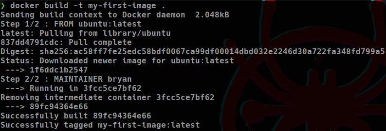

Lo que hace es leer cada línea del Dockerfile; primero instala la imagen de ubuntu y luego establece el nombre del creador.

Luego se verifican las imágenes actuales:

```bash
docker images
```

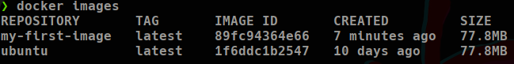

La imagen “my-first-image” es la que se usará para hacer los cambios posteriores. Los cambios, actualizaciones o lo que fuera se deben hacer en el archivo Dockerfile creado previamente y por cada actualización, se debe ejecutar el comando **`docker build -t my-first-image .`**. Una ventaja es que todo lo que se haya ejecutado antes, se mantendrá en caché y solo se ejecutará lo que no se haya hecho.

## Construcción del contenedor

Primero se empieza a correr el contenedor con el siguiente comando:

```bash
docker run -dit --name myContainer my-first-image

-d # Dejar en segundo plano el contenedor de forma independiente
-it # Ofrece una consola virtual interactiva
--name # Indicar un nombre para el contenedor (Puede contener mayus)
<nombre_de_imagen> # es la imagen que usará de base para crear el 
# contenedor, en este caso se usa la creada previamente
```

Verificar contenedores actuales:

```bash
docker ps
```

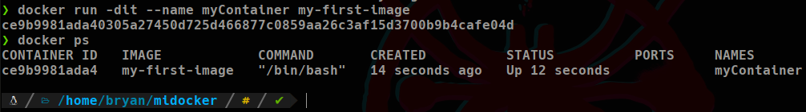

### Conexión al contenedor

Para conectarse al contenedor se utiliza el siguiente comando:

```bash
docker exec -it myConatainer bash
# Se debe especificar el nombre del contenedor al cual se establecerá
# la conexión y el comando que se quiere ejecutar, en este caso, 
# como se quiere crear una consola interactiva, se utiliza el 
# comando "bash"
```

Esto creará una consola interactiva como la siguiente:

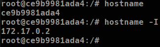

El hostname corresponde al identificador del contenedor.

También se puede hacer un ping desde la máquina host al contenedor:

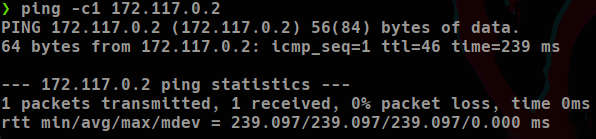

A la máquina host se le crea una interfaz de Docker con una IP:

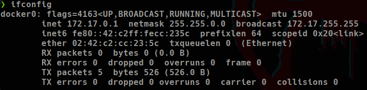

Esto, por otro lado, no se puede hacer desde el contenedor a la máquina host debido a que al crear un contenedor, este se crea “desnudo”, es decir, no tiene casi nada instalado por lo que todo esto se debe ser instalado por el creador

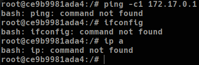

Para salir de la consola del contenedor, se utiliza el comando **`exit`.**

### Instalación de utilidades básicas

Una ventaja de Docker es que se pueden especificar una serie de instrucciones en el archivo Dockerfile para que instale todas estas herramientas faltantes.

```bash
# Herramientas básicas
apt update
apt install net-tools -y # Esto instala el ifconfig
apt install iputils-ping # Esto instala el ping
```

Para hacer esto, se debe utilizar RUN en el archivo Dockerfile e insertar los comandos de instalación para implementar todas las herramientas necesarias:

```bash
FROM ubuntu:latest

MAINTAINER Bryan "bryan@gmail.com"

RUN apt update && apt install -y net-tools \
	iputils-ping \
	curl \
	git \
	nano
```

Una vez ingresado todas las herramientas y comandos necesarios, se procede a construir una nueva versión de la imagen:

```bash
docker build -t my-first-image:v2 .
# En este caso, como es una nueva versión, se le asigna un nuevo 
# tag (v2)
```

Y una vez creada la nueva imagen, se corre un nuevo contenedor:

```bash
docker run -dit --name mySecondConatainer my-first-image:v2
# Como anteriormente se mencionó, se debe especificar un nombre 
# para el nuevo contenedor, en este caso se asignó el nombre 
# "mySecondContainer" y se indica la imagen que se usará 
# (my-first-image:v2) utilizando el nuevo tag
```

Se comprueba el estado del contenedor:

```bash
docker ps
```

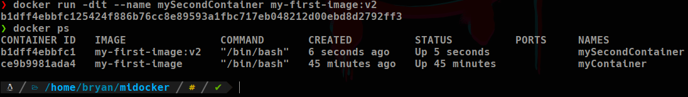

Ahora se establece la conexión con la consola del contenedor y se verifica la instalación correcta de todas las herramientas especificadas en el archivo Dockerfile:

```bash
docker exec -it mySecondContainer bash
```

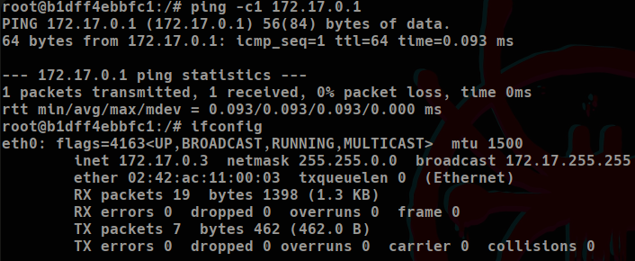


## Comandos para manejar contenedores e imágenes:
A continuación se muestran algunos comandos para la gestión de contenedores en docker

```bash
docker stop <ID> # apaga el contenedor
docker start <ID> # enciende el contenedor

# Eliminar contenedores
docker rm <ID> # eliminar un contenedor apagado
docker rm <ID> --force # eliminar un contenedor incluso si está 
# encendido
docker $(docker ps -a -q) --force # elimina todos los contenedores 
# de manera forzada

# Eliminar imágenes
docker rmi <ID> # eliminar una imagen (no se pueden eliminar 
# imágenes padres, es decir, imágenes base que se usaron para crear 
# otras imágenes, eje; la imagen usada "ubuntu" es la imágen padre 
# de my-first-image). Primero se debe eliminar la imagen hija.
docker rmi $(docker images -q) # eliminar todas las imágenes.
# No se pueden eliminar imágenes que están siendo usadas por 
# contenedores, en ese caso se deben eliminar primero los 
# contenedores o utilizar --force.

# Eliminar interfaces de red
docker network rm <id>
docker network prune # Eliminar todas las interfaces en desuso

# Crear una interfaz de red
docker network create --driver=bridge 
<NombreDeInterfaz> --subnet=<IPred/sufijo>

# Para asignar esta interfaz de red a un contenedor 
# existente
docker network connect <InterfazCreada> <NombreContenedor>
# Para asignar una interfaz de red a un contenedor antes 
# de crearlo
docker run -dit --name <NombreContenedor> 
--network=<InterfazCreada> <imagenDeSO>

# Inspeccionar las redes que se crearon para un contenedor
docker network inspect <ID>

# Hacer que se el contenedor se elimine completamente una vez se termine su proceso
docker run -dit --rm --name <NombreContenedor> <ImagenDeSo>

# Hacer que la máquina salga del estado "exited" automáticamente 
# para pasar al estado activo
docker run -dit --restart=always <NombreContenedor> <ImagenDeSo>

# Mostrar logs de Docker
docker logs <ID> # Muestra los logs actuales
docker logs <ID> -f # Muestra logs nuevos en tiempo real
```
*Más info de cómo eliminar interfaces de docker:* [https://yallalabs.com/devops/how-to-remove-all-unused-docker-networks/](https://yallalabs.com/devops/how-to-remove-all-unused-docker-networks/)

*Eliminar la interfaz docker0:* [https://stackoverflow.com/questions/40082608/how-to-delete-interface-docker0](https://stackoverflow.com/questions/40082608/how-to-delete-interface-docker0)

## Port Forwarding y Monturas en Docker
El port forwarding permite redirigir el tráfico de red desde un puerto específico en el host a un puerto específico en el contenedor. Esto permitirá acceder a los servicios que se ejecutan dentro del contenedor desde el exterior.


### Lab: Uso de Port Forwarding

En este lab, se instalará un apache2 en el contenedor de Docker para probar el funcionamiento del redireccionamiento de puertos.

Para esto, al archivo Dockerfile, se le añaden las herramientas necesarias en RUN, en este caso, **apache2** y **php** para interpretar código php:

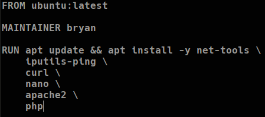

#### ENTRYPOINT

Ahora, se le añade una nueva instrucción llamada **ENTRYPOINT** en la que se le especificarán los comandos que se deben ejecutar una vez inicie el contenedor, esto es necesario ya que se quiere iniciar el servicio de apache2 una vez que la máquina inicie:


Es importante agregarle el “/bin/bash” para evitar que el servicio se apague.

#### EXPOSE

Ahora se debe abrir el puerto 80 (HTTP) del contenedor para que posteriormente permita hacer el port-fowarding del puerto 80 de la máquina host al contenedor, para esto se usa la instrucción **EXPOSE** esto servirá para exponer el puerto 80 del contenedor**:**

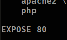

#### Imágenes `<none>` y ENV

Es posible que durante la instalación de alguna herramienta surja algún modo interactivo para ciertas partes de la instalación que requieren de alguna acción del usuario como lo siguiente (la instalación está pidiendo ingresar una zona geográfica):

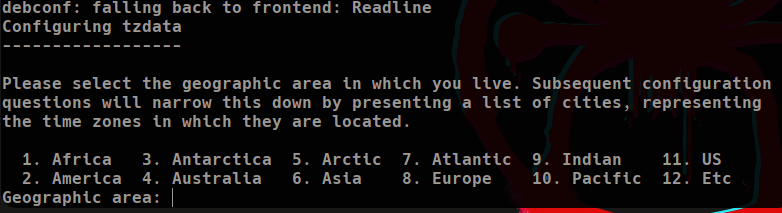

Esto no interesa que salga por lo que se usa “ctrl + c” para cancelar el proceso.

Al cancelar de forma forzada la instalación, se crea una imagen `<none>` la cual corresponde a una imagen corrupta o colgada:


Para filtrar este tipo de imágenes, se puede usar el siguiente comando:

```bash
docker images --filter "dangling=true" -q
--filter "dangling=true" # Filtrará por las imágenes con el nombre 
# <none>
-q # Listará los ID

# Eliminar imágenes <none>
docker rmi $(docker --filter "dangling=true" -q)
```

También se debería borrar la imagen del ubuntu creado.

Para quitar este tipo de modos interactivos durante la instalación, se ingresa la instrucción **ENV** en el archivo Dockerfile:

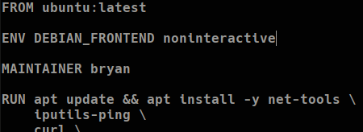

#### Port Forwarding (puerto 80)

Ahora se procede a encender el contenedor y es aquí en donde se jugará con el port-forwarding:

```bash
docker -dti -p 80:80 --name myWebserver webserver

-p 80:80 # Indica que el puerto 80 de la máquina host será el puerto 
# 80 del contenedor (80 -> 80).
```

Antes de hacer esto, se verifica que no haya ningún proceso utilizando el puerto 80 en la máquina host con lsof:

```bash
lsof -i:80
```

También se utiliza para verificar el proceso de Docker utilizando el puerto una vez encendida la máquina

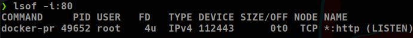

Otra forma de verificar este port-forwarding, es con el siguiente comando:

```bash
docker port myWebserver
```

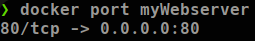

También se puede comprobar por medio de la página web apache desde el navegador de la máquina host:

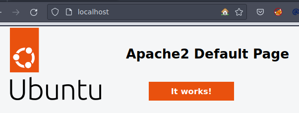

Esta página web no está corriendo en la máquina host, sino en el contenedor Docker, solo que la máquina host está haciendo port-forwarding de su puerto 80 hacia el puerto 80 del contenedor haciéndola visible a través de él.

Un atacante que haga reconocimiento al host, verá que el puerto 80 está abierto y si lo llega a comprometer, no ganará acceso al host, sino al contenedor de Docker añadiendo cierto nivel de seguridad

El archivo Dockerfile resultante es este:

```bash
FROM ubuntu:latest

ENV DEBIAN_FRONTEND noninteractive

MAINTAINER bryan

RUN apt update && apt install -y net-tools \
	iutils-ping \
	curl \
	nano \
	apache2 \
	php

EXPOSE 80

ENTRYPOINT service apache2 start && /bin/bash
```

#### Ejecución de comandos con código PHP

En este escenario consiste en que un atacante logró ingresar un archivo php llamado “shell.php” en el directorio de la página web (/var/www/html) con el siguiente contenido:

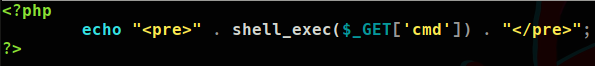

`<pre></pre>` : Las etiquetas pre-formateadas sirven para mostrar el stdout como si fuese una consola, sin esto, el resultado se mostraría en una sola lína y sería difícil de leer.

shell_exec($_GET[’cmd’]) : El shell_exec() es una instrucción que sirve para ejecutar comandos a nivel de sistema en el cual se le indica que por el método GET, se podrá controlar el comando que se quiera ejecutar, por lo que si en la URL, se ingresa “localhost/shell.php?cmd=whoami”, este “whoami” se pasará al shell_exec() y lo ejecutará a nivel de sistema.


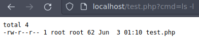

Si se ejecuta un **ifconfig**, se puede mostrar que la IP de la máquina corresponde a la del contenedor y no al del host:


### Lab: Uso de Monturas
Ahora se probarán las monturas las cuales sirven para sincronizar un archivo de la máquina host al contenedor Docker de forma que este será visible dentro del contenedor:

Para esto se crea un archivo de texto en la máquina host con el nombre test.txt, lo que se quiere es que este archivo esté disponible dentro del contenedor, esto se logra de la siguiente forma:

```bash
docker run -dti -p 80:80 -v /home/bryan/midocker/:/var/www/html/ 
--name myWebserver webserver
-v # Sirve para montar archivos, se le indica la ubicación del 
# archivo en la máquina host y la ubicación de destino en el 
# contenedor
```

Ahora se comprueba dentro del contenedor, la existencia de los archivos montados:

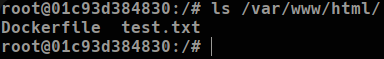

De esta forma, es posible modificar el archivo en ambos lados y los cambios se verán reflejados en ambos lados también.

### Uso de COPY

Otra forma de traer archivos de la máquina host al contendor, es con el uso de **COPY**:

```bash
FROM ubuntu:latest

ENV DEBIAN_FRONTEND noninteractive

MAINTAINER bryan

RUN apt update && apt install -y net-tools \
	iutils-ping \
	curl \
	nano \
	apache2 \
	php

COPY test.txt /var/www/html/

EXPOSE 80

ENTRYPOINT service apache2 start && /bin/bash
```

De esta forma, se le está indicando que cada vez que inicie la máquina, traerá el archivo test.txt de la máquina host y lo copiará al contenedor en la carpeta /var/ww/html/

