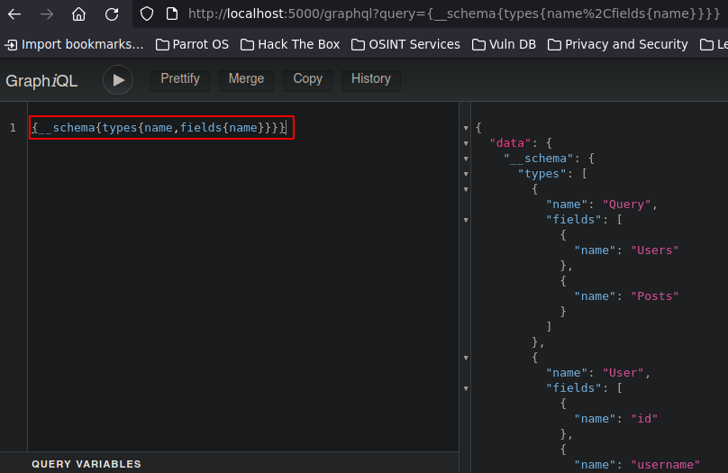

# GraphQL: Introspection, Mutations e IDORs


### Más info:

- Links
    
    github(graphql-voyager) - (”https://github.com/graphql-kit/graphql-voyager”)
    

## Instalación

```bash
git clone https://github.com/blabla1337/skf-labs

# Lab: GraphQL IDOR
cd skf-labs/nodeJs/Graphql-IDOR/
npm install --force
npm start

# Lab: GraphQL Introspection
cd skf-labs/nodeJs/Graphql-Introspection/
npm install --force
npm start

# Lab: GraphQL Mutation
cd skf-labs/nodeJs/Graphql-Mutations/
npm install --force
npm start
```

## GraphQL IDOR


Las credenciales para este lab, son usuario: johndoe y contraseña: password1

Al iniciar sesión se muestra un panel con varios comentarios y un link a los settings:


Al entrar en el apartado de settings, se puede ver información del usuario John:


Al interceptar esta petición con Burpsuite, de primeras se ve una petición a “/settings” pero al darle a “forward”, se ve que hace una petición a “/graphql” con una query que está solicitando información del usuario con el ID 1.

```bash
{"query":"{ UserInfo (id: 1) {\n          \t\t\t\tapi_key\n          \t\t\t\tname\n          \t\t\t\tsurname\n          \t\t\t\tdate_of_birth\n        \t\t\t\t}\n      \t\t\t}\n        \t\t\t\t"}
```


Al enviar esta petición el servidor responde con los datos solicitados


Viendo esto, un atacante podría probar cambiar el ID que se está solicitando en la query y en lugar de 1, solicitar información del usuario con el ID 2, 3, 4…


## GraphQL Introspection

La idea de este lab es conocer el esquema de GraphQL que se está utilizando en esta página web; los tipos de datos, los campos, etc.

En la página se ven varios comentarios de diferentes usuarios.


Al interceptar los datos que se envían al servidor al cargar esta página, se ve que se está haciendo una solicitud por POST a “/graphql” y se está enviando una query en la que se están solicitando datos específicos de los “Posts” y el servidor da una respuesta a la query.

```bash
{"query":"{Posts{title, body, users{ username }}}"}
```


Al ingresar a la aplicación “/graphql”, se puede ver una interfaz en la que se pueden hacer consultas.


Para enumerar el GraphQL se puede utilizar “introspection” para descubrir información sobre el esquema. En este caso se aplicará una query que mostrará todos los nombres de los tipos que se están usando actualmente:

```bash
query={__schema{types{name,fields{name}}}}
```



### GraphQL - Voyager

Esta es otra forma de representar las respuestas de la querys que se hacen al GraphQL, esta herramienta mostrará de forma gráfica la estructura del esquema.

Para este ejemplo, se utilizará otra query que permitirá mostrar el esquema de las **bases de datos** por medio de “introspection”:

--------??

Esta query se debe copiar y pegar en la URL. Al enviarla, es probable que se muestren algunos errores, esto se soluciona añadiendo doble barra baja en los campos que contengan errores, por ejemplo en “Type” se muestra un error, esto se soluciona cambiándolo a “__Type”, se debe hacer esto hasta que no hayan errores.


La siguiente query, soluciona estos errores:

```bash
/?query=fragment FullType on __Type {%0A%20 kind%0A%20 name%0A%20 description%0A%20 fields {%0A%20%20%20 name%0A%20%20%20 description%0A%20%20%20 args {%0A%20%20%20%20%20 ...InputValue%0A%20%20%20 }%0A%20%20%20 type {%0A%20%20%20%20%20 ...TypeRef%0A%20%20%20 }%0A%20 }%0A%20 inputFields {%0A%20%20%20 ...InputValue%0A%20 }%0A%20 interfaces {%0A%20%20%20 ...TypeRef%0A%20 }%0A%20 enumValues {%0A%20%20%20 name%0A%20%20%20 description%0A%20 }%0A%20 possibleTypes {%0A%20%20%20 ...TypeRef%0A%20 }%0A}%0A%0Afragment InputValue on __InputValue {%0A%20 name%0A%20 description%0A%20 type {%0A%20%20%20 ...TypeRef%0A%20 }%0A%20 defaultValue%0A}%0A%0Afragment TypeRef on __Type {%0A%20 kind%0A%20 name%0A%20 ofType {%0A%20%20%20 kind%0A%20%20%20 name%0A%20%20%20 ofType {%0A%20%20%20%20%20 kind%0A%20%20%20%20%20 name%0A%20%20%20%20%20 ofType {%0A%20%20%20%20%20%20%20 kind%0A%20%20%20%20%20%20%20 name%0A%20%20%20%20%20%20%20 ofType {%0A%20%20%20%20%20%20%20%20%20 kind%0A%20%20%20%20%20%20%20%20%20 name%0A%20%20%20%20%20%20%20%20%20 ofType {%0A%20%20%20%20%20%20%20%20%20%20%20 kind%0A%20%20%20%20%20%20%20%20%20%20%20 name%0A%20%20%20%20%20%20%20%20%20%20%20 ofType {%0A%20%20%20%20%20%20%20%20%20%20%20%20%20 kind%0A%20%20%20%20%20%20%20%20%20%20%20%20%20 name%0A%20%20%20%20%20%20%20%20%20%20%20%20%20 ofType {%0A%20%20%20%20%20%20%20%20%20%20%20%20%20%20%20 kind%0A%20%20%20%20%20%20%20%20%20%20%20%20%20%20%20 name%0A%20%20%20%20%20%20%20%20%20%20%20%20%20 }%0A%20%20%20%20%20%20%20%20%20%20%20 }%0A%20%20%20%20%20%20%20%20%20 }%0A%20%20%20%20%20%20%20 }%0A%20%20%20%20%20 }%0A%20%20%20 }%0A%20 }%0A}%0A%0Aquery IntrospectionQuery {%0A%20 __schema {%0A%20%20%20 queryType {%0A%20%20%20%20%20 name%0A%20%20%20 }%0A%20%20%20 mutationType {%0A%20%20%20%20%20 name%0A%20%20%20 }%0A%20%20%20 types {%0A%20%20%20%20%20 ...FullType%0A%20%20%20 }%0A%20%20%20 directives {%0A%20%20%20%20%20 name%0A%20%20%20%20%20 description%0A%20%20%20%20%20 locations%0A%20%20%20%20%20 args {%0A%20%20%20%20%20%20%20 ...InputValue%0A%20%20%20%20%20 }%0A%20%20%20 }%0A%20 }%0A}%0A
```

- Formato Prettyfy
    
    ```bash
    fragment FullType on __Type {
      kind
      name
      description
      fields {
        name
        description
        args {
          ...InputValue
        }
        type {
          ...TypeRef
        }
      }
      inputFields {
        ...InputValue
      }
      interfaces {
        ...TypeRef
      }
      enumValues {
        name
        description
      }
      possibleTypes {
        ...TypeRef
      }
    }
    
    fragment InputValue on __InputValue {
      name
      description
      type {
        ...TypeRef
      }
      defaultValue
    }
    
    fragment TypeRef on __Type {
      kind
      name
      ofType {
        kind
        name
        ofType {
          kind
          name
          ofType {
            kind
            name
            ofType {
              kind
              name
              ofType {
                kind
                name
                ofType {
                  kind
                  name
                  ofType {
                    kind
                    name
                  }
                }
              }
            }
          }
        }
      }
    }
    
    query IntrospectionQuery {
      __schema {
        queryType {
          name
        }
        mutationType {
          name
        }
        types {
          ...FullType
        }
        directives {
          name
          description
          locations
          args {
            ...InputValue
          }
        }
      }
    }
    ```
    

Ahora se hará uso de la herramienta en línea de GraphQL Voyager para mostrar toda la respuesta de esta query de forma gráfica. Para esto se copiará toda la respuesta de la query anterior y se pegará en el modo “Instrospection” de GraphQL Voyager:


Esta es una forma más fácil de ver los datos y sus relaciones.

Ahora al interceptar nuevamente la petición con Burpsuite, el atacante podría construir una query con la información que le interesa, por ejemplo en lugar de mostrar los “Posts”, puede ver el gráfico mostrado en “GraphQL Voyager” y hacer una query a los “Users” mostrando los campos “id” y “username”:

```bash
{"query":"{Users{id,username}}"}
```


Otro ejemplo:


## GraphQL Mutations

En los labs anteriores se vio cómo mostrar o filtrar información confidencial. La idea en este lab es mostrar cómo se podría llegar a modificar esta información.

Ahora se muestra la misma sección de comentarios pero esta vez con un botón para crear un nuevo Post.


Al interceptar la petición de esta petición se puede ver que está tramitando una petición por POST a “/graphql” y a nivel de datos, se está enviando información relacionada con el Post como el “title”, “body”, etc. además se ve la operación “**mutation**” la cual permite al cliente modificar, agregar, eliminar o actualizar datos.


Por ejemplo, se modificarán estos datos para crear un nuevo post personalizado:

```bash
{"query":"mutation { createPost(title: \"Esto es una prueba\", body: \"Esto es una prueba del operador mutation\", author_id: 1) { id, title, body, author_id }}"}
```


