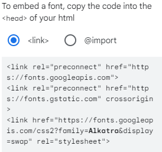
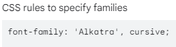
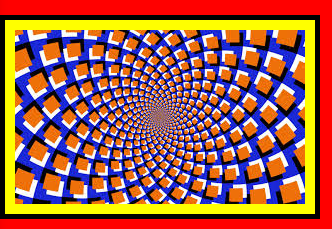

# HTML y CSS
Conceptos básicos útiles para HTML y CSS.


## HTML

Primero se hace una declaración al browser sobre qué versión de HTML se va a usar. Esto debe ser la primer línea que se cree: `<!DOCTYPE html>`

**Element**: Los elementos se usan para definir la estructura de una página web, son como los ladrillos.

**Tag**: nos permiten definir los elementos en un archivo HTML. Es decir, son la forma de escribir esos elementos en un archivo. Especifican el tipo de elemento que se creará.

eje: `<tipo_de_elemento>` → Los “<>” indican una etiqueta en html los cuales contienen elementos dentro. Es necesario especificar etiquetas de apertura y de cierre: `“<html> </html>`”

**Metacaracteres**:
`<meta charset=”UTF-8” />`: Permite usar caracteres especiales que se usan en el español.

`<meta http-equiv=”X-UA-Compatible” content=”IE=edge””>`: Es para indicar con qué versión de Internet Explorer debe de mostrar la página web. Esta etiqueta se usa si usan las versiones de Internet Explorer 10 para abajo, Edge es la versión más nueva.

`<meta name="viewport" content="width=device-width, initial-scale=1" />`: Sirve para que la página web se vea correctamente en celulares. Este no es el único elemento necesario para que se vea bien en celulares.

**Self-closing tags**: son etiquetas que no necesitan etiquetas de cierre. eje: ``

**Elemento raíz**: Todo el contenido de la estructura de la página web, debe estar contenido dentro de las etiquetas “`<html> Contenido </html>`”

La etiqueta “head” y “body” son otro par de etiquetas importantes  con diferentes funciones. En head se almacenan archivos externos, enlaces a archivos externos que necesita la página como css o js. Por otro lado, body almacenará toda la estructura de la página web. Ambos deben estar dentro del elemento “`<html></html>`”

**Head**: Este elemento utiliza las etiquetas “`<head>`” y “`</head>`” y se ingresan antes de “`<body>`”. Head contiene los metadatos, es decir, los elementos que actúan detrás de escenas, por ejemplo si se quiere incluir archivos css o javascript en la página, se deberían incluir los enlaces de esos archivos en head. También sirve para personalizar el título de la pestaña con las etiquetas “`<title>`” y “`</title>`”, estos títulos descriptivos y detallados son un factor importante para la optimización de motor de búsqueda SEO (Search Engine Optimization), es decir, ayudan a los motores de búsqueda a conseguir mi página web.

**Identación**: El estandar en html es usar 2 espacios. Para mover la identación del texto se usa “Ctrl+[” y “Ctrl+]” o “Tab” y “shift+Tab”.

**Especificar el idioma**: se modifica la etiqueta `<html>` y se le agrega el atributo “lang”: `<html lang=”es”>`

**fabico.ico**: El favicon es el icono o símbolo que acompañará a tu URL en los navegadores. Esta pequeña imagen tiene como función principal ayudarte a identificar más fácilmente una determinada URL.

**Encabezados**: Con las etiquetas “`<h1></h1>`” se crean encabezados o títulos en negrita. La importancia del texto lo define el número ingresado el cual puede ir de 1 a 6, es decir, entre más alto sea el número más pequeña será su fuente. eje: `<h6>Hola, Mundo</h6>`

**Párrafos**: para crear párrafos se utilizan las etiquetas `<p></p>`. Puede ser que el párrafo sea muy largo y haya que desplazarse para verlo, en ese caso se podría adaptar el texto a la página con “Alt+Z”.

**Comentarios**: Se añaden de la siguiente forma: **`<!-- Comentario -->`**. Para convertir una línea del código en un comentario se usa “Ctrl+/” o “Ctrl+]”.

**Contenido principal**: Las etiquetas “`<main></main>`” almacenan el contenido principal de body, este debe ser único y no se debe usar más de una vez.

**Imágenes y atributos**: Para añadir una imagen se usa la etiqueta “``”, la ruta de la imagen podría ser una URL o una ruta dentro de la carpeta de la página web. Además las imagenes deben tener un texto descriptivo en caso que esta no cargue, para esto se añade otro atributo a la etiqueta: “`<image src=”ruta_de_imagen” alt=”Texto descriptivo de la imagen.”>`”.

**Enlaces externos**: Se crean con las etiquetas “`<a></a>`”. Por ejemplo, se podría convertir una parte de un texto en un enlace de la siguiente forma: “`<a href=”URL”>texto_con_enlace</a>`”, de forma que el fragmento del texto podrá ser clickeado para ser redirigido a ese enlace en la misma pestaña. Si lo que se quiere es que en enlace abra una nueva pestaña al abrir el enlace, se añade el siguiente atributo: `<a href=”URL” target=”_blank”>texto_con_enlace</a>`.

Por motivos de seguridad también se debe agregar un atributo el cual evita el ataque “Tabnabbing”: `<a href=”URL” rel=”noopener noreferrer”>texto_con_enlace</a>`

**Enlaces a secciones internas**: Por ejemplo se quiere crear un índice que redirija a títulos específicos dentro de la página. Para ello, en cada título se establece un atributo “id”, ese id debe ser único en toda la página: “`<h3 id=”parrafo-1”>Texto1</h3>`”, luego en el índice se crea el vínculo que redirigirá hacia ese texto usando el id de referencia: `<a href=”#parrafo-1”>Texto1</a>`.

**Enlaces muertos**: Los enlaces muertos implemente son enlaces que no llevan a nada, es decir, el navegador interpreta el texto como enlaces pero realmente no llevan a nada. Esto puede ser útil durante el desarrollo de una página en la que no se está seguro de qué enlace poner. Estos enlaces se ingresan de esa forma: `<p>Esto es un <a href=”#”>enlace muerto</a></p>`

**Imágenes con enlaces**: Para ello se utilizan las etiquetas `<a></a>`, las cuales se usan para rodear las etiquetas que referencian la imagen: “`<a href=”URL” rel=”noopener referrer”></a>`”

**Listas no ordenadas**: Para crear listas no ordenadas, es decir, con viñetas, se utilizan las etiquetas: “`<ul></ul>” y “<li></li>`” para crear una estructura de esta forma:

```html
<p>Esto es una lista no ordenada:</p>
<ul>
	<li>List Item 1</li>
	<li>List Item 2</li>
<ul>
```

**Listas ordenadas**: Para crear listas ordenadas, es decir, con números se utilizan las etiquetas “`<ol></ol>`” y “`<li></li>`” para crear una estructura de esta forma:

```html
<p>Esto es una lista ordenada:</p>
<ol>
	<li>List item 1</li>
	<li>List item 2</li>
</ol>
```

**Modificar el texto**: 

- En negrita: `<strong></strong>`
- En cursiva: `<em></em>`
- Tachado: `<s></s>`

**Crear una línea horizontal**: Se usan la etiqueta “`<hr>`” para poner una línea horizontal, esto puede servir como separador de secciones en la página web. Esta no necesita una etiqueta de cierre.

**Crear un formulario**: Un formulario puede servir para permitir al usuario ingresar datos y enviarlos a un archivo para tratar esos datos. Para crear un formulario, se usa la siguiente estructura:

```html
<form action="/enviar-respuesta">
	<input type="text">
	<button type="submit">Enviar</button>
</form>
```

Se especifica un archivo en la etiqueta “form” con un atributo “action” el cual especifica el archivo que tratará los datos enviados, en este caso es “enviar-respuesta”.

**Placeholder o marcador de posición**: Un “placeholder” puede servir para indicarle al usuario qué dato tiene que ingresar en el campo del formulario. Para hacer esto, se utiliza la siguiente estructura: 

```html
<form action="/enviar-respuesta">
	<input type="text" placeholder="Ingrese Contraseña">
	<button type="submit">Enviar</button>
</form>
```

**Crear un campo obligatorio**: Si se quiere que un campo sea obligatorio, es decir, que el usuario deba ingresar un dato para poder enviar la solicitud, se debe agregar el atributo “required” en la etiqueta “input”: “`<input type=”text” required>`”

**Botones de radio**: Un botón de radio sirve para darle al usuario diferentes opciones a seleccionar. Para crear esto, se usa la siguiente estructura:

```html
<form action="/enviar-respuesta">
	<label for="opcion-1"><input id=opcion-1 type="radio">Opción 1</label>
	<label for="opcion-1"><input id=opcion-2 type="radio">Opción 2</label>
	<button type="submit">Enviar</button>
</form>
```

Si se le quiere permitir al usuario seleccionar la opción clickeando en el texto, se le agregan las etiquetas “`<label>`” y “`</label>`”

Para relacionar aún más las etiquetas “`<label>`” con la etiqueta “`<input>`”, a esta última se le asigna un id y este id se le indica al “`<label>`” con “for”.

**Grupo de botones de radio**: Es posible agrupar botones de radio para un mismo nombre de grupo, al hacer esto, solo uno de ellos puede ser seleccionado a diferencia de los ejemplos anterior en los cuales se podía seleccionar múltiples opciones. La estructura para hacer esto se presenta a continuación:

```html
<form action="/enviar-respuesta">
	<input type="radio" name="nombreDeGrupo">Opción 1
	<input type="radio" name="nombreDeGrupo">Opción 2
	<button type="submit">Enviar</button>
</form>
```

**Checkboxes**: Es otra forma de hacer formularios. Al agrupar los checkboxes en grupos, esto no los hace selección única como los botones tipo radio. Para usar esta función, se usa el atributo de esta manera: “`<input type=”checkbox”>`”

**Salto de línea**: Para hacer esto, se utiliza la etiqueta “`<br>`”.

**Atributo “checked”**: Permite marcar opciones de botones de radio o checkboxes por default, es decir, sin el usuario haberlas marcado. Para esto, se agrega de esta manera: “`<input type=”checkbox” checked>`”

**Atributo “value”**: Al agregar botones de radio checkboxes, es importante utilizar el atributo “value”, esto lo que hará es especificar un valor para cada opción y ese valor se enviará el servidor según la opción elegida. Para crear un valor para cada opción se utiliza de la siguiente manera:

```html
<form action="/enviar-respuesta">
	<input type="checkbox" value="opcion1" name="Grupo1">Opción 1
	<input type="checkbox" value="opcion2" name="Grupo1">Opción 2
	<button type="submit">Enviar</button>
</form>
```

Si las opciones están en un mismo grupo entonces se interpretaría que para ese grupo, los valores son los ingresados.

**Elemento div**: Es un contenedor el cual se puede usar para cualquier propósito, se puede personalizar y sirve para crear estructuras más complejas en la página web. Las etiquetas que se usan son: “`<div></div>`” y se estructura de la siguiente manera:

```html
<div>
	<p>Esto es un formulario</p>
	<form action="/enviar-respuesta">
		<label for="opcion-1"><input id=opcion-1 type="radio">Opción 1</label>
		<label for="opcion-1"><input id=opcion-2 type="radio">Opción 2</label>
		<button type="submit">Enviar</button>
	</form>
</div>
```

Dentro de las etiquetas “div” se almacena el contenido el cual se quiere almacenar en el contenedor, de esta forma todas las configuraciones, estilos, etc. que se hagan al “div”, serán aplicados a todo el contenido dentro de él.

Los div normalmente se agrupan uno debajo del otro, esto debido a que tienen una propiedad que se llama “display: block” o “display: flex”, por lo que si lo que se quiere es que estén uno al lado, esto se cambia a “display: inline-block”.

**Pie de página**: Esto es un elemento que va al final de la página, después de la etiqueta “`</main>`” ya que no es un elemento principal. Para esto se utilizan las siguientes etiquetas “`<footer>`” y “`</footer>`”

**Hacer un texto más pequeño**: Para hacer un texto más pequeño se utilizan las etiquetas “`<small>`” y “`</small>`”.

---
## Cascading Style Sheets (CSS)


**CSS**: Es un lenguaje basado en reglas y esas reglas determinará el estilo que se aplicará a un elemento o a un grupo de elementos.

**Ociones**: Hay tres opciones para definir el conjunto de reglas en css: “Estilos en línea”, “`<style></style>`” y “Archivo .css”.

```html
<!-- Estilos en línea: Se añade directamente a la etiqueta de apertura del elemento. -->
eje: <h2 style="color: blue">Texto</h2>

<!-- <style></style>: Se añade en "<head>" para describir el estilo. -->
eje:
<head>
	<style>
		h2 { <!-- El elemento "h2" es un selector css el cual indica que todos las etiquetas "h2" deberán tener el color azul -->
			color: blue;
		}
	</style>
</head>

<!-- Archivo .css: -->
	<!-- Se crear un archivo tipo .css para definir el estilo de la página. -->
	<!-- Como resultado se tendrá un archivo .html y .css el cual se vinculará al .html -->
	<!-- Esta es la opción recomendada -->
```

Vincular archivo “.ccs” al “.html”: Para hacer esto se ingresa la siguiente etiqueta en el archivo “.html”:

```html
<head>
	<link href="styles.css" rel="stylesheet">
</head>
```

El atributo “rel” indica una relación e indica con qué nombre se le conocerá al archivo “styles.css” dentro del “.html”, y debe ser “stylesheet”.

**Selectores “.css”**:

- Selector de tipo: Selecciona todos los elementos que coinciden con el nombre especificado.
    
    ```html
    h2 {
    	color: red;
    }
    ```
    
- Selector de clase: Selecciona todos los elementos que contienen el mismo atributo de “class” especificado. Se pueden usar varias clases para un mismo elemento.
    
    ```html
    .ejemplo1 {
    	color: green;
    }
    
    ---------
    <!-- .html -->
    
    <p class="ejemplo1">Texto</p>
    ```
    
- Selector de ID: Selecciona un elemento basándose en el valor de su atributo “id”. Solo puede haber un elemento con un determinado ID dentro un archivo.
    
    ```html
    #ejemplo2 {
    	color: yellow;
    }
    ```
    

- Selector universal: Selecciona todos los elementos. Opcionalmente, puede estar restringido a un espacio de un nombre específico o a todos los espacios de nombres.
    
    ```html
    * {
    	color gray;
    }
    ```
    

- Selector de atributo: Selecciona elementos basándose en el valor de un determinado atributo.
    
    ```html
    img[alt] { <!-- La estructura es: 
    etiqueta[atributo] -->
    	border-radius: 50%;
    }
    
    --
    [type="radio"] {
    	margin: 10px;
    }
    
    --
    input[type="radio"] { <!-- La estructura es: 
    etiqueta[atributo="valor"] -->
    	margin: 5px;
    }
    ```
    

**Prioridades de clase**: Se pueden asignar varias clases a un elemento de esta forma:

```html
.clase-1 {
	color: red;
}

.clase-2 { <!-- Tendrá prioridad de estilo. -->
	color: blue;
}

------
<!-- html -->
<a class="clase-1 clase-2" href="URL">link</a>

###########-o-o-o-o-o-############
.clase-1 { <!-- Tedrá prioridad de estilo -->
	color: red;
}

a {
	color: blue;
}

------
<!-- html -->
<a class="clase-1" href="URL">link</a>

###########-o-o-o-o-o-############
#id-prioridad { <!-- Tendrá la prioridad del color -->
  color: hotpink;
}

.clase-3 {
  color: blue;
  text-decoration: blue wavy underline;
}

------
<!-- html -->
<a id="id-prioridad" class="clase-2" href="URL">link</a>

###########-o-o-o-o-o-############
#id-1 {
  color: red;
}

.clase-4 {
  color: blue;
}

------
<!-- html -->
<a id="id-prioridad" style="color: magenta" class="clase-2" href="URL">link</a>
<!-- El color del estilo en línea "style", tomará 
la prioridad -->

###########-o-o-o-o-o-############
#id-1 {
  color: red;
}

.clase-4 {
  color: blue !important; <!-- Tomará la prioridad -->
}

------
<!-- html -->
<a id="id-prioridad" style="color: magenta" class="clase-2" href="URL">link</a>
```

En HTML, el orden en el que se ingresen las clases no afecta al orden de prioridad, es decir, el navegador no lo tomará en cuenta. Por otra parte, en CSS, el orden en el que se colocan las clases sí importa, si un elemento tiene dos clases con propiedades que entran en conflicto, se le aplicará el que esté más abajo en el código, en este ejemplo sería la “clase-2”.

Si un elemento tiene una clase y hay otro estilo genérico aplicado, CSS le dará prioridad a la clase como se muestra en el segundo ejemplo.

En el tercer ejemplo se muestra como el id y la clase le asignan un color a un mismo elemento, esto crea un conflicto de prioridades, por lo tanto, el id siempre tomará prioridad sobre la clase independientemente del orden. El resultado de estilo sería el color del id y como el “text-decoration” no entra en conflicto, también se asigna al estilo final.

Cuarto ejemplo: Cuando se le asigna un estilo en línea al elemento y entra en conflicto con otros atributos, este tomará siempre la prioridad sobre ellos.

Este orden de prioridad se puede alterar, de forma que si se quiere que un elemento tome algún estilo sin importar la prioridad, se le puede añadir “!important” como se muestra en el último ejemplo.

**Tamaño de la fuente**: Para esto se utiliza el siguiente atributo:

```html
h1 {
	font-size: 20px; <!-- "px" corresponde a pixeles -->
}
```

**Quitarle la decoración a un texto**:

```html
a[href] {
	text-decoration: none;
}
```

**Texto en negrita:**

```html
a[href] {
	font-weight: bold;
}
```

**Mismos estilos para varios elementos**:

```html
h1,
p,
s,
strong {
	color: purple;
	font-size: 25px;
}
```

**Familias tipográficas**: Define una lista de fuentes o familias de fuentes, con un orden de prioridad, para utilizar en un elemento seleccionado. Se usan comillas (””) si la fuente utiliza espacios pero si solo es una palabra, estas se pueden omitir y en caso de los nombres genéricos, no se deben poner entre comillas (serif, sans-serif, cursive, fantasy, monospace), además un nombre genérico debería ser siempre el último en una lista de prioridad. Los valores se separan con comas (”,”) para indicar que son valores alternativos.

```html
h1 {
	family-font: Lato, Verdana, "Times New Roman", serif
}
```

**Google Fonts**: Google contiene una colección de fuentes que se pueden importar en la página web. La página de fuentes es: “fonts.google.com”.

Para añadir una fuente de este este recurso se hacen los siguientes pasos: 

- En la página escoger la fuente deseada y darle click en “Select this style”.
- En este caso se hará uso de la opción `<link>`. Lo que se debe hacer es copiar los elementos mostrados y pegarlos dentro de “`<head>`”.
    
    
    
- Una vez pegados y acomodados correctamente, en el código CSS, se debe especificar el “family-font”, para esto se debe copiar el siguiente contenido de la página:
    
    
    

- Para seleccionar otro fondo más, se hace el mismo proceso con la única excepción de que al darle click a “Select this style”, no mostrará el panel como la primera vez, para mostrar el panel se deberá dar click al ícono “View Selected families”, esto mostrará los elementos más actualizados con el nuevo fondo seleccionado por lo que tendrá que ser copiado y pegarlo en el código reemplazando los elementos anteriores.

**Cambiar tamaño de las imágenes**: Para hacer esto se utiliza la siguiente estructura:

```html
img {
	width: 100px; <!-- ancho -->
	height: 200px; <!-- altura -->
}
```

**Añadir bordes**: Para hacer esto se sigue la siguiente estructura:

```html
img {
	border-width: 10px; <!-- Grueso del borde -->
	border-color: blue;
	border-style: <!-- Las opciones son: dotted,
	double, dashed, solid, none, groove, ridge,
	inset, outset --> <!-- Se pueden poner hasta 
	cuatro valores, el orden para cada posición 
	sería: arriba, derecha, abajo, izquierda. -->
}
```

**Redondear la imagen**:

```html
img {
	border-radius: 20px; <!-- Entre más alto sea el número,
	más bordeado se verá. -->
}

<!-- Otra opción es usar porcentajes -->
.img2 {
	border-radius: 50%; <!-- Entre más alto, 
	más redondeado se verá -->
}
```

**Cambiar estilo de un “`<div>`”**: Cuando se modifica un “`<div>`”, se modifica todo lo que esté contenido en él también.

```html
.div-1 {
	bakground-color: gray; <!-- Esto cambiará el color del fondo -->
}

-------
<!-- html -->

<div class="div-1">
	<p>Texto</p>
</div>
```

**Padding**: Es la distancia de la imagen y su borde. Ese padding se puede cambiar y esta estructura lo demuestra:

```html
.contenedor {
	background-color: red;
}

#imagen1 {
	padding: 5px;
	background-color: yellow;
	border-width: 5px;
	border-color: black;
	border-style: solid;
}

------
<!-- html -->

<div class="contenedor1">
	
</div>
```

La siguiente imagen muestra el padding de una imagen, esta se muestra de color amarillo y el borde en negro:



**Padding a cada lado**: Se puede cambiar el padding en cada lado de la siguiente forma

```html
<!-- Primera opción -->
#imagen1 {
	padding-top: 5px;
	padding-right: 10px;
	padding-buttom: 15px;
	padding-left: 20px;
	background-color: yellow;
	border-width: 5px;
	border-color: black;
	border-style: solid;
}

<!-- Segunda opción -->
#imagen1 {	
	padding: 5px 10px 15px 20px;
	background-color: yellow;
	border-width: 5px;
	border-color: black;
	border-style: solid;
}
```

**Margin**: Es la distancia entre el borde de un elemento y el borde de otro elemento. El margin se puede cambiar en cada lado de igual forma que el padding y se estructura de la siguiente forma:

```html
#imagen1 {	
	margin: 5px 10px;
	background-color: yellow;
	border-width: 5px;
	border-color: black;
	border-style: solid;
}
```

**Unidades absolutas y relativas**: 

Unidades absolutas: Todas las unidades siguientes son unidades de longitud absoluta, es decir, no son relativas a nada más y siempre tienen el mismo tamaño. La mayoría de estos valores son más útiles cuando se usan en una salida de formato impreso que en la salida de pantalla, el único valor que se usa más frecuente es el “px”:

cm, mm, Q, in, pc, pt, px.

Unidades de longitud relativa: Estas son relativas a algo más, por ejemplo, al tamaño de letra del elemento principal o el tamaño de la ventana gráfica. La ventaja de estos valores que con una planificación cuidadosa se puede hacer que los elementos escalen en relación con todo lo demás en la página.

em, ex, ch, rem, lh, vw, vh, vmin, vmax.

**Cambiar el estilo al body**:

```html
body {
	background-color: silver;
}
```

**Colores en hexadecimal**:

```html
<!-- Representación en hex -->
Hex:    00     00      00
Color: rojo   verde   azul

<!-- Abreviar hexadecimal -->
#000000 -> #000
#00ff00 -> #0f0
#ffffff -> #fff

<!-- Ejemplo -->
.ejemplo {
	color: #0fa;
}
```

**Colores con rgb**:

```html
<!-- Representación en RGB -->
RGB:    0      0       0
Color: rojo   verde   azul

<!-- Rango -->
0-255

<!-- Transparencia -->
RGBA:   0      0       0      0
Color: rojo   verde   azul   alpha

	<!-- El "alpha" representa la transparencia y 
	entre más cerca de 0.0, más transparente será.-->

<!-- Ejemplo -->
.ejemplo {
	color: rgba(255, 255, 0, 1.4);
}
```

**Crear variables en CSS**: Para crear una variable, esta debe empezar con “- -” y un nombre para luego establecer un valor:

```html
<!-- Establecer variable -->
.variables {
	--nombre-variable: blue;
}

<!-- Usar variable -->
.ejemplo {
	background-color: var(--nombre-variable);
}

----
<!-- html -->
<p class="variables ejemplo">Texto</p>

----
<!-- Usar variable con respaldo -->
.ejemplo2 {
	background-color: var(--nombre-variable, blue);
}
```

**Compatibilidad con distintos navegadores**: Es posible que haya navegadores que no interpreten las variables de CSS, para solucionar esto se deben crear respaldos de la variable de la siguiente forma:

```html
<!-- Establecer variable -->
.variables {
	--nombre-variable: blue;
}

<!-- Usar variable -->
.ejemplo {
	background-color: blue;
	background-color: var(--nombre-variable, blue);
}

----
<!-- html -->
<p class="variables ejemplo">Texto</p>
```

Se usan los respaldos “background-color: blue” antes de la variable y se establece un respaldo después del nombre de la variable seguido de una coma. Esto debe ser así debido a la incompatibilidad de los navegadores que no reconocen la variables como el internet explorer.

**Establecer variables globales**: Este tipo de variables podrán ser utilizadas en todo el archivo CSS. El elemento “root” utiliza la etiqueta “`<html>`”

```html
:root {
	--nombre-variable: blue;
}

body {
	background-color: var(--nombre-variable, blue);
}
```

**Establecer una variable en secciones específicas**: En el caso que se quiera volver a usar un mismo nombre de variable para una sección en específico pero con un valor diferente a la establecida globalmente, se puede especificar ese mismo nombre de variable pero en la sección específica:

```html
:root {
	--variable-1: blue;
}

body {
	background-color: var(--variable-1, blue);
}

div {
	--variable-1: red;
	color: var(--variable-1);
}
```

En este ejemplo se muestra una variable global con un valor “blue”, luego se establece esa misma variable en los contenedores div pero con un valor diferente, esto hará que solo los elementos contenidos en div, tendrán ese nuevo valor establecido.
