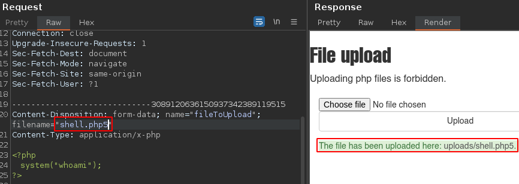
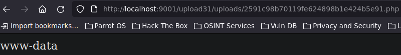

# Abuso de subidas de archivos


### Más info:

- Links
    
    Hacktricks - (”[https://book.hacktricks.xyz/pentesting-web/file-upload](https://book.hacktricks.xyz/pentesting-web/file-upload)”)
    
    Th1b4ud - (”[https://thibaud-robin.fr/articles/bypass-filter-upload/](https://thibaud-robin.fr/articles/bypass-filter-upload/)”)
    
    Wikipedia - (”[https://en.wikipedia.org/wiki/List_of_file_signatures](https://en.wikipedia.org/wiki/List_of_file_signatures)”)
    

## Instalación

```bash
git clone https://github.com/moeinfatehi/file_upload_vulnerability_scenarios
cd file_upload_vulnerability_scenarios
docker-compose up -d
```

# Explotación

## Upload #1 - Sin validación


Este primer ejercicio es simple ya que no hay ningún tipo de validación y se puede subir un archivo .php para ejecutar comandos.

```bash
<?php
	system("whoami");
?>
```

A la hora de subir el archivo, hay que darle a mostrar todos los archivos para ver el archivo “.php” y así con todos los demás ejercicios.


## Upload #3 - Validación del navegador


En este ejercicio se aplica una validación para ver si el archivo corresponde a una extensión válida, el problema es que esta validación se está haciendo del lado del navegador del usuario, es decir, el navegador valida la extensión del archivo.

Al ver el código fuente de esta web, se puede ver al hacer el “submit”, se está usando un código “.js” el cual es el que está haciendo la validación:


Es validación se puede evadir eliminando el campo de validación al inspeccionar el botón.


## Upload #10 - Variantes de extensiones .php


En este ejercicio se está aplicando una validación del lado del servidor para verificar si el archivo tiene la extensión “.php”, esto es un problema ya que además de “.php”, existen otras variantes como php4, php5, php6, pht, phtml, etc. las cuales se pueden utilizar para que la web interprete el código en él por lo que esta petición se podría interceptar con Burpsuite para intentar enviar diferentes extensiones php.




Es posible que aunque se puedan enviar otras extensiones, la web no interprete el código por lo que se debe intentar con todas las opciones posibles.

A nivel de código, este se vería de la siguiente forma en donde se está aplicando una expresión regular para validar si el archivo tiene una extensión que sea exactamente “.php”, sin validar si se le agrega un número o algo más.


## Upload #11 - Validación incompleta de variantes


En este ejercicio se está aplicando una validación que no permite ciertas variantes de extensiones php como php3, php4, php5, etc. pero no contempla todas las variantes.


## Upload #12 - Extensión personalizada


En este ejercicio se está aplicando una validación de extensión la cual contempla varias variantes de extensión “.php”.

Existe una forma utilizar una extensión “.php” que interprete código personalizada, es decir, en lugar de utilizar “.php”, utilizar, por ejemplo, “.loquesea”, esto se hace implementando una política que permita extensiones personalizadas para que interpreten código php

- ¿Qué es un archivo “.htaccess”?
    
    Un fichero .htaccess, también conocido como archivo de configuración distribuida, es un fichero especial, popularizado por el Servidor HTTP Apache que permite definir diferentes directivas de configuración para cada directorio sin necesidad de editar el archivo de configuración principal de Apache.
    

La política que se implementará en el archivo .htaccess es la siguiente:

```bash
AddType application/x-httpd-php .loquesea

# Esto hará que todos los archivos que tengan la extensión 
# ".loquesea", serán interpretados como códigos php
```

Al enviar esta petición, se envía el archivo “.htaccess” y su contenido será la nueva política a implementar.

# *Cabe recalcar que esta política se aplicará dentro del directorio en el que esté archivo se encuentre.*


Ahora se envía un archivo con la nueva extensión personalizada, en este caso “.loquesea”.


## Upload #16 y #17 - Tamaño del archivo


En este lab se está aplicando una validación para restringir archivos que superen un tamaño específico. Sin embargo, el código se puede reducir de tamaño y a continuación se muestran ejemplos de cómo reducir el tamaño del código.

```bash
# Tamaño original
<?php
	system($_GET['cmd']);
?>

# Eliminar saltos de línea
<?php	system($_GET['cmd']); ?>

# Reducir caracteres de parámetro
<?php	system($_GET['a']); ?>

# Cambiar parámetro a un número. A nivel de URL se vería 
# como: /0?=whoami
<?php	system($_GET[0]); ?>

# Cambiar el "system" a "exec" no será muy conveniente ya 
# que este último se le debe agregar un echo si no, no 
# mostrará output, su variante es "shell_exec"

# Cambiar php por "="
<?=	system($_GET[0]); ?>

# Usar comillas de escape "``"
<?php`$_GET[0]`?>
```


Captura: Ejercicio #16


Captura: Ejercicio #17


## Upload #21 - Tipo de archivo (Content-Type)


En este ejercicio se está aplicando una validación para verificar el tipo de archivo, esto a nivel de headers, se refiere al Content-Type. Por ejemplo, el siguiente Content-Type se usa para indicar un archivo de tipo php:

```bash
Content-Type: application/x-php
```


Sin embargo, esta cabecera se puede cambiar para hacer alusión a otro tipo de archivo, por ejemplo una imagen:

```bash
Content-Type: image/jpg
```


## Upload #23 - Magic Numbers


En este ejercicio se está aplicando una validación en la parte del navegador, esto se puede evadir nuevamente eliminando el campo de validación.


Además de esta validación, en este ejercicio se están validado el tipo de archivo y los primeros bits del archivo o los “magic numbers” los cuales definen qué tipo de archivo es.

Por ejemplo, si se usa el comando “file” para ver qué tipo de archivo es el archivo “shell.php”, indica que es un archivo PHP debido a que los “magic numbers” o los primeros bits del archivo, corresponden a los de un archivo PHP:


Estos “magic numbers” se basan en los primeros bits del archivo, es decir, de los primeros caracteres del contenido del archivo por lo que esto se podría alterar de forma que si, por ejemplo, al inicio del archivo se ingresa “GIF8;” y se vuelve a ejecutar el comando “file”, se puede ver cómo el tipo de archivo cambia.


De esta forma, al enviar el archivo nuevamente, modificando el tipo de archivo y el “Content-Type” se puede evadir esta restricción.


## Upload #31 - Nombre de archivo hasheado (MD5)


En este ejercicio se está aplicando una modificación al nombre del archivo subido de forma que cuando se guarde en el directorio, se guardará con este nuevo nombre.

En este caso se muestra un gif en pantalla pero se inspecciona, se puede ver que tiene un nombre con 32 caracteres por lo que se puede deducir que es un hash MD5 y esto puede ser una pista para descubrir con qué nombre se está almacenando el archivo subido.


Puede ser que este hash se haya hecho a partir del nombre del archivo, en este caso “shell” o también incluyendo la extensión “shell.php”, también podría ser el resultado de todo el contenido del archivo en sí, es decir, que se haya aplicado un md5sum al contenido del archivo, todos estas opciones se podrían probar para descubrir el nombre con el que se está almacenan el archivo.

Por ejemplo, se asumirá que este hash proviene del nombre del archivo por lo que se pasará a MD5 la cadena de caracteres “shell” con md5sum:


Ahora se copia este hash y se le añade la extensión “.php” para buscarlo en el directorio “uploads”.



## Upload #33 - Nombre de archivo hasheado (MD5)


Este ejercicio es parecido al anterior en el sentido que se está aplicando un tratamiento en la forma en la que se almacena el archivo, solo que esta vez el hash cambia.


Otra forma de ver cómo se hizo el hash es intentar crackearlo para ver su contenido en texto plano.


Como se puede ver el hash fue crackeado con éxito y su contenido en texto plano es “file.txt”, esto podría significar que el hash se hizo a partir del nombre del archivo subido junto con su extensión.

En este caso, el archivo subido se llama “shell.php” por lo que se pasará esta cadena de caracteres a MD5.


## Upload #35 - Nombre de archivo hasheado (SHA1)


En este ejercicio se está aplicando el mismo tratamiento que los dos anteriores solo que otra vez el hash cambió.


Además de MD5, es posible que los desarrolladores usen otros tipos de algoritmos para hashear el nombre del archivo por lo que el atacante deberá intuir qué tipo de hash se está utilizando, en este caso, la cadena de caracteres de este hash tiene 40 caracteres por lo que es posible que el hash empleado sea un SHA1 pero no se sabe si se aplicó un hasheo al nombre del archivo o a su contenido en sí por lo que se deberá intentar con todas las opciones.

En este caso, el hash se hizo a partir del contenido del archivo:


## Upload #41 - Fuzzing de directorios


En este ejercicio, se puede subir un archivo php pero no indica en qué ruta se almacenó ni con qué nombre, en estos casos, se podría aplicar un fuzzing para descubrir rutas válidas:

```bash
gobuter dir -u http://localhost:9001/upload41 
-w /usr/share/wordlists/SecLists/Discovery/
Web-Content/directory-list-2.3-medium.txt
```


Se encontró un directorio “images”, por lo que si se busca este directorio en la web para intentar hacer directory listing, devuelve este mensaje indicando que no se tienen permisos para acceder a este directorio, sin embargo, si se busca por el archivo “shell.php”, este se ejecuta correctamente:


## Upload #51 - Ataque de doble extensión


En este ejercicio, se está aplicando una validación para verificar que el archivo que se está subiendo tenga como extensión “.jpg”, específicamente, la regex está buscando una cadena que contenga “.jpg” pero no valida si le agregan más extensiones por lo que se puede hacer un ataque de doble extensión:


## Upload #56 - Uso de curl para cargar archivo


En este ejercicio, la página me deja ingresar el directorio en el cual puedo guardar el archivo, el problema es que cuando se intenta acceder a este directorio, en lugar de mostrar el contenido, lo intenta descargar, para evitar esto y cargar el archivo php, se podría usar “curl” para hacer una petición por GET a la dirección del archivo:


## Upload #58 - Combinación de varias técnicas


En este ejercicio, la página permite al usuario crear un nuevo directorio para almacenar el archivo pero esta vez valida la extensión del archivo contemplando variantes como php3, php4, php5, etc.

En este caso, la validación no contempla la extensión “.htaccess” por lo que se utiliza este archivo para crear una nueva política en la que se indica que los archivos con la extensión “.hacked”, se deben interpretar como código php:


El servidor también valida los primeros bits del archivo por lo que se ingresa “GIF8” al inicio del archivo.


## Metadatos

Otra forma en la que se podría aprovechar la subida de archivos para ejecutar comandos es utilizando los metadatos, es decir, se podrían modificar los metadatos de, por ejemplo, un GIF para incluir código php y por ejemplo, con LFI apuntar a ese archivo para cargarlo y ejecutar el código php, el resultado se verá representado en la web entre todo el contenido ilegible del archivo GIF.

De esta forma se podrían cambiar los metadatos para incluí código php:

```bash
# Verificar los metadatos de un archivo
exiftool file.gif

# Añadir un comentario en los metadatos de ese archivo
exiftool -Comment='<?php system("whoami"); ?>' file.gif
```


