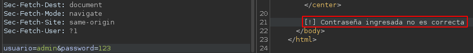
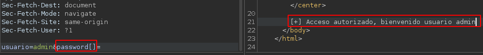
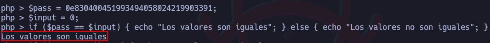
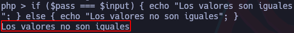
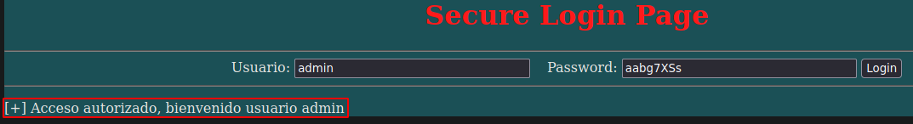

# Ataque Type Juggling


## Ejemplo #1: Cambiando el tipo de dato

Primero se creará un archivo “index.php” con el siguiente contenido:

```bash
<font color="red"><center><h1>Secure Login Page<h1></center></font>
	<hr>
	<body style="background-color:powderblue;">
	<center><form method="POST" name="<?php basename($_SERVER['PHP_SELF']); ?>">
	Usuario: <input type="text" name="usuario" id="usuario" size="30">
	&nbsp;
	Password: <input type="password" name="password" id="password" size="30">
	<input type="submit" value="Login">
    <input type="submit" value="Login">
    <hr>
    </form></center>

    <?php
        $USER = "admin";
        $PASSWORD = 'AdminStr0ngP4$$';

        if(isset($_POST['usuario']) && isset($_POST['password'])){
            if($_POST['usuario'] == $USER){
                if(strcmp($_POST['password'], $PASSWORD) == 0){
                    echo "[+] Acceso autorizado, bienvenido usuario admin";
                } else {
                    echo "[!] Contraseña ingresada no es correcta";
                }
            } else {
                echo "[!] Usuario introducido no es correcto";
            }
        }
    ?>
    </body>
</html>
```

### Explotación

En este caso para validar la contraseña, se está haciendo una comparación de cadenas con “strcmp()” y dependiendo de cómo se trate la validación, esto puede ser vulnerable a Type Juggling ya que como atacante, se puede cambiar el tipo de dato con el que se está tratando y debido a que el strcmp() está esperando un string, al cambiar el tipo de dato, se hace que la validación sea correcta.

Por ejemplo, se muestra el resultado de una petición con una contraseña incorrecta:



Ahora, en lugar de ingresar una contraseña, se cambiará el tipo de dato por un array añadiéndole corchetes al campo de la contraseña (”password[]=”):



De esta forma, da una respuesta válida y se logra iniciar sesión como el usuario admin.

## Ejemplo #2:

```bash
<html>
	<font color="red"><center><h1>Secure Login Page<h1></center></font>
	<hr>
	<body style="background-color:powderblue;">
	<center><form method="POST" name="<?php basename($_SERVER['PHP_SELF']); ?>">
	Usuario: <input type="text" name="usuario" id="usuario" size="30">
	&nbsp;
	Password: <input name="password" id="password" size="30">
	<input type="submit" value="Login">
	<hr>
	</form></center>

	<?php
		$USER = "admin";
		$PASSWORD = 0e830400451993494058024219903391; # Contraseña original: QNKCDZO

		if(!empty($_POST['usuario']) && !empty($_POST['password'])){
			$password_input = $_POST['password'];
			$password_input = md5($password_input);
			if($_POST['usuario'] == $USER){
				if($password_input == $PASSWORD){
					echo "[+] Acceso autorizado, bienvenido usuario admin";
				} else {
					echo "[!] Contraseña ingresada no es correcta";
				}
			} else {
				echo "[!] Usuario introducido no es correcto";
			}
		}
	?>
	</body>
</html>
```

### Explotación

Ahora al hacer la comparativa de la contraseña, se toma la contraseña ingresada por el usuario y se pasa a md5 para luego compararla con la contraseña en md5 correcta.

Cuando el hash que representa la contraseña empieza con “0e”, por ejemplo: “0e123456789” al compararlo con el valor 0, ambos valores resultarán iguales ya que un valor al empezar con “0e” es como si estuviese elevando 0 a algo (eje: 0 elevado a 12345678) lo que como resultado siempre será 0 y esto al compararlo con 0, el resultado será válido



Sin embargo, esto se puede evitar utilizando triple igual (”===”):



Hay otra forma en la que se podría obtener resultados válidos y es ingresando una contraseña la cual, cuando se pase a md5, el resultado empiece por “0e”. Por ejemplo, utilizando sistema de logueo mostrado anteriormente, este toma la contraseña ingresada por el usuario y la pasa a md5 para posteriormente compararla, pero debido a que la contraseña original empieza con “0e”, el usuario podría ingresar una contraseña la cual al ser hasheada, empiece con “0e”, por ejemplo, al utilizar como contraseña: “aabg7XSs”, esta al ser hasheada, da como resultado: “0e087386482136013740957780965295” lo cual al ser comparado con la contraseña original, a pesar ser una contraseña diferente, da un resultado válido:



Esto también podría ser sanitizado utilizando triples iguales (”===”).
