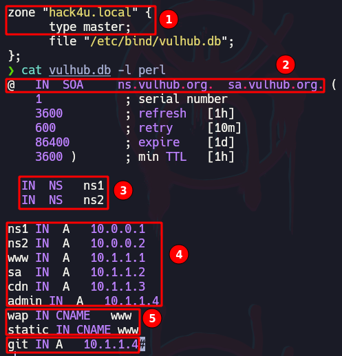
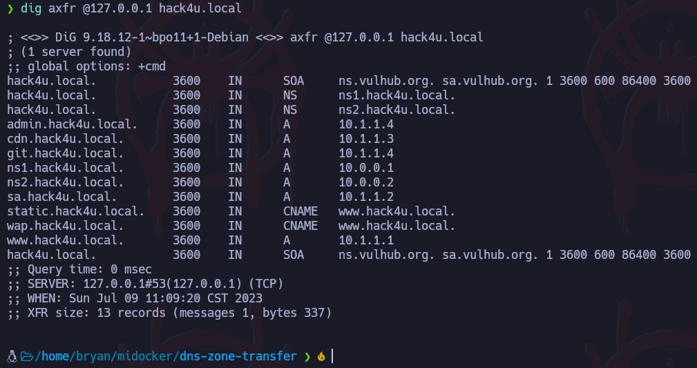

# Ataques de transferencia de zona (AXFR – Full Zone Transfer)

### Más info:

- Links
    
    Wikipedia - (”[https://es.wikipedia.org/wiki/Transferencia_de_zona_DNS](https://es.wikipedia.org/wiki/Transferencia_de_zona_DNS)”)
    
    Cloudflare - (”[https://www.cloudflare.com/es-es/learning/dns/what-is-dns/](https://www.cloudflare.com/es-es/learning/dns/what-is-dns/)”)
    
    Cloudflare - (”[https://www.cloudflare.com/es-es/learning/dns/dns-server-types/](https://www.cloudflare.com/es-es/learning/dns/dns-server-types/)”)
    
    Cloudflare - (”[https://www.cloudflare.com/es-es/learning/dns/dns-records/dns-cname-record/](https://www.cloudflare.com/es-es/learning/dns/dns-records/dns-cname-record/)”)
    
    Hacktricks - (”[https://book.hacktricks.xyz/network-services-pentesting/pentesting-dns](https://book.hacktricks.xyz/network-services-pentesting/pentesting-dns)”)
    

## Instalación

```bash
svn checkout https://github.com/vulhub/vulhub/trunk/dns/dns-zone-transfer
cd dns-zone-transfer
```

Bases de datos de registro DNS:



1. Se indica la zona para el dominio “hack4u.local”. Esto indica que el servidor DNS local será responsable de manejar las consultas DNS relacionadas con este dominio.

- type master: Se especifica que este servidor DNS es el servidor maestro para la zona "hack4u.local". Esto significa que el servidor contiene la fuente principal de información para esta zona y es autoritativo para ella.
- file “/etc/bin/vulnhub.db”: Indica la ubicación del archivo de zona que contiene los registros DNS para el dominio "hack4u.local". El archivo "vulnhub.db" se encuentra en el directorio "/etc/bind/".

2. Este registro es parte del archivo de zona DNS y define los parámetros del registro SOA (Start of Authority) para el dominio en cuestión.

- **`@`** : El símbolo "@" se utiliza para representar el nombre de dominio actual, en este caso, el dominio principal al que se aplica este registro SOA.
- **`IN SOA ns.vulhub.org. sa.vulhub.org. (`** : "IN" indica la clase de registro, que en este caso es "Internet". "SOA" especifica el tipo de registro como Start of Authority. Luego sigue el nombre del servidor primario de nombres (ns.vulhub.org) y el contacto del administrador (sa.vulhub.org) para esta zona.
- **`1`** : El número de serie. Se utiliza para identificar diferentes versiones de la zona. Cada vez que se realicen cambios en la zona, el número de serie debe incrementarse para que los servidores DNS secundarios puedan identificar y actualizar la información correctamente.
- **`3600`** : El valor de "refresh" indica la cantidad de tiempo (en segundos) que los servidores secundarios esperarán antes de intentar actualizar la zona desde el servidor primario. En este caso, se establece en 3600 segundos (1 hora).
- **`600`** : El valor de "retry" especifica el intervalo de tiempo (en segundos) que los servidores secundarios deben esperar antes de volver a intentar una consulta fallida al servidor primario. Aquí, se establece en 600 segundos (10 minutos).
- **`86400`** : El valor de "expire" indica el período de tiempo (en segundos) después del cual los servidores secundarios considerarán que la zona ha expirado si no pueden contactar al servidor primario. En este caso, se establece en 86400 segundos (1 día).
- **`3600`** : El valor de "min TTL" especifica el tiempo de vida mínimo (en segundos) que los otros servidores DNS y los clientes deben conservar en caché los registros antes de solicitar una nueva actualización al servidor primario. Aquí se establece en 3600 segundos (1 hora).

3. Estos registros indican los servidores de nombres (Name Servers) autoritativos para el dominio "hack4u.local". Aquí se establece que "ns1" y "ns2" son los servidores de nombres para este dominio.

4. Estos registros definen las direcciones IP de los diferentes hosts dentro del dominio "hack4u.local". Por ejemplo, "www" se asigna a la dirección IP 10.1.1.1 y "admin" se asigna a la dirección IP 10.1.1.4.

5. Estos registros son alias (CNAME) y apuntan a otro host en el dominio. "wap" y "static" se asignan como alias de "www". Esto significa que cualquier consulta DNS para "wap.hack4u.local" o "static.hack4u.local" se redirigirá a "www.hack4u.local".

Solicitud de Transferencia de Zona Completa

```bash
dig axfr @<IPDeDNS> <nombreDominio>
```



Otras solicitudes que se podrían hacer a los registro DNS:

```bash
dig ANY @<DNS_IP> <DOMAIN>     #Any information
dig A @<DNS_IP> <DOMAIN>       #Regular DNS request
dig AAAA @<DNS_IP> <DOMAIN>    #IPv6 DNS request
dig TXT @<DNS_IP> <DOMAIN>     #Information
dig MX @<DNS_IP> <DOMAIN>      #Emails related
dig NS @<DNS_IP> <DOMAIN>      #DNS that resolves that name
dig -x 192.168.0.2 @<DNS_IP>   #Reverse lookup
dig -x 2a00:1450:400c:c06::93 @<DNS_IP> #reverse IPv6 lookup

#Use [-p PORT]  or  -6 (to use ivp6 address of dns)
```

## DNSEnum

Aplicar fuerza bruta para descubrir información DNS.

```bash
dnsenum --dnsserver <dnsIP> --threads 20 -f /usr/share/wordlists/SecLists/Discovery/DNS/subdomains-top1million-5000.txt domain.local
```
