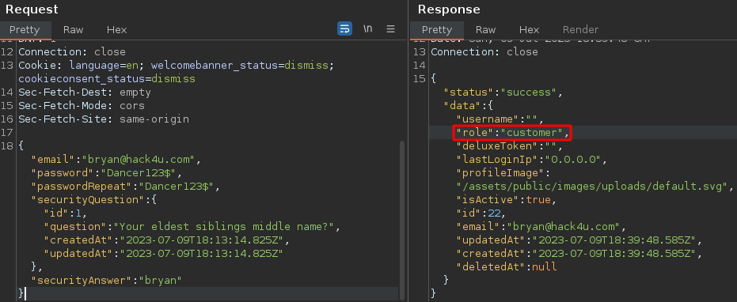
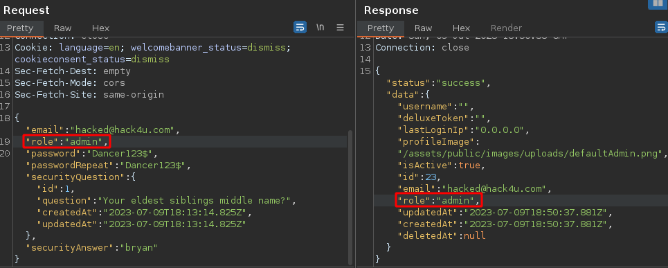
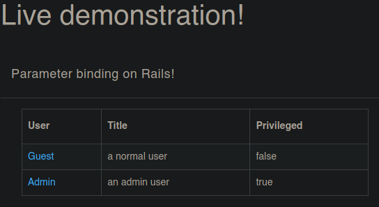
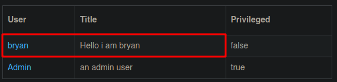
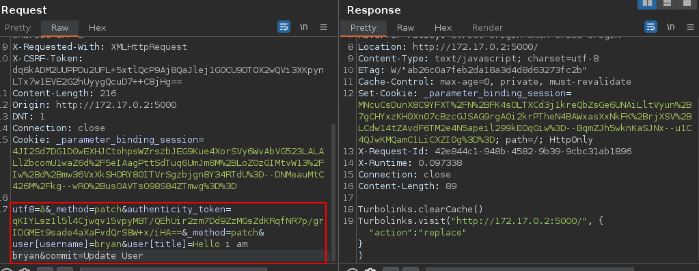
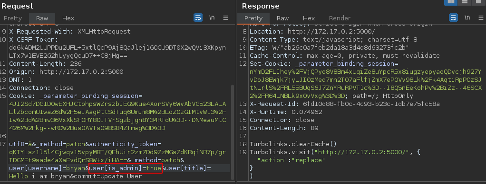
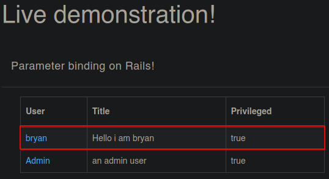
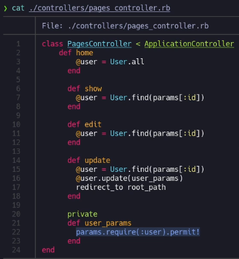

# Ataques de asignación masiva (Mass-Asignment Attack) / Parameter Binding


## Instalación - Lab#1

```bash
docker pull bkimminich/juice-shop
docker run -dit -p 3000:3000 --name JuiceShop bkimminich/juice-shop
```

## Explotación

En este lab se tiene una página web con una tiene con diferentes productos, en este caso se hará enfoque al panel de logueo y registro.

Al interceptar la petición con Burpsuite, se puede ver que en la respuesta del servidor, se asigna un campo “rol” en este caso con el valor “customer”, campo el cual no se veía en los datos enviados en la petición. Aquí es donde entra en juego el “Mass Asignment Attack”, la idea es incluir más parámetros a la petición de lo que se debería y ver si el servidor las acepta o no, en este caso el campo “rol” parece ser que asigna si al usuario como cliente pero se podría intentar poner otro valor para conseguir registrar el usuario como administrador.



De primeras, el atacante no sabe qué valor está asignado para los usuarios administradores pero podría intentar con diferentes valores hasta dar con alguno válido como “admin”, “Admin”, “isAdmin”, “IsAdmin”, administrator, Administrator, “is_Admin”, “is_admin”, etc.

Como se puede ver, el rol “admin” dio un resultado válido y se logró registrar un usuario con el rol de administrador.



## Instalación - Lab#2

```bash
docker pull blabla1337/owasp-skf-lab-parameter-binding
docker run -it -p 3000:3000 blabla1337/owasp-skf-lab:parameter-binding
```

Una vez instalado, se verifica la página web en la dirección: http://172.17.0.2:5000

La página se ve de la siguiente manera:



El objetivo en esta página web es conseguir que el usuario “Guest” tenga permisos de administrador o que el campo “Privileged” esté en “true”. La página web permite seleccionar el usuario y cambiarle el nombre y el título como se ve en la imagen:



Esta petición se ve de la siguiente manera en Burpsuite:



Como se puede ver, están viajando un par de propiedades (username y title) y en la respuesta no se ve nada significativo, por lo que, como atacante, se debe averiguar qué nombre tiene la propiedad que sirve para asignar los permisos de administrador a los usuarios, se podría conseguir alguna pista a partir de lo que se muestra en la página principal, en ese caso hay un campo “Priviledge” en false.

Nuevamente, se debe intentar, con fuerza bruta e intuición adivinar la propiedad para cambiar el privilegio a true, se podría intentar valores como: “Priviledged”, “admin”, “Admin”, “isAdmin”, “IsAdmin”, administrator, Administrator, “is_Admin”, “is_admin”, etc.





## Mitigación

El código que valida los parámetros ingresados es el siguiente:



En este caso, en la línea 22, se está declarando la función “user_params” en la que se le indica “**`params.require(:user).permit!`**”, este “**`permit!`**” hace alusión a que a nivel de propiedades ingresadas por el usuario, se está permitiendo cualquier tipo de propiedad para actualizar el perfil del usuario, para sanitizar esto se podría ingresar explícitamente las únicas propiedades permitidas a la hora de transmitir la petición, en este caso “username” y “title”: **`params.require(:user).permit(:username,:title)`**, de esta forma, permitirá actualizar solo las propiedades “username” y “title”.
