# Open Redirect

## Instalación

```bash
git clone https://github.com/blabla1337/skf-labs

# Primer stage
cd skf-labs/nodejs/Url-redirection
npm install
npm start

# Segundo stage
cd skf-labs/nodejs/Url-redirection
npm install
npm start

# Tercer stage
cd skf-labs/nodejs/Url-redirection
npm install
npm start
```

## Url-redirection

En este primer escenario se tiene una web la cual parece ser antigua y muestra un botón el cual redirige a la nueva versión de la página web.

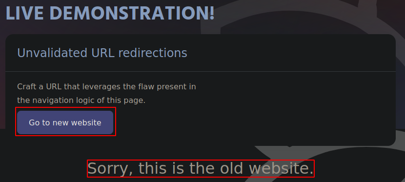

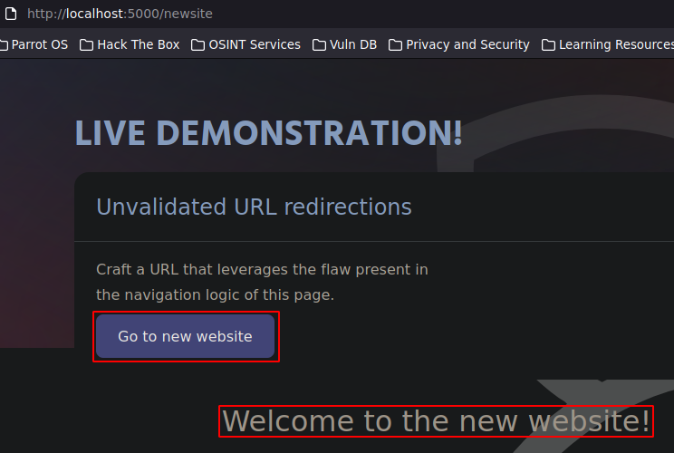

Como se puede ver, al interceptar la petición con Burpsuite, se puede ver que se tramita una petición por POST un redirect a “newsite” pero ¿qué pasa si se ingresa otro destino diferente? Aquí es donde entra en juego el Open Redirect, la idea es aprovecharse de la falta de sanitización del servidor para que, por medio del dominio de la propia web, crear un link el cual redirija al usuario a una página inesperada.

Por ejemplo, en este caso se tiene la url original: “http://localhost:5000/redirect?newurl=/newsite” pero esta se puede cambiar para que redirija, por ejemplo a hack4u.io: “http://localhost:5000/redirect?newurl=/newsite”.

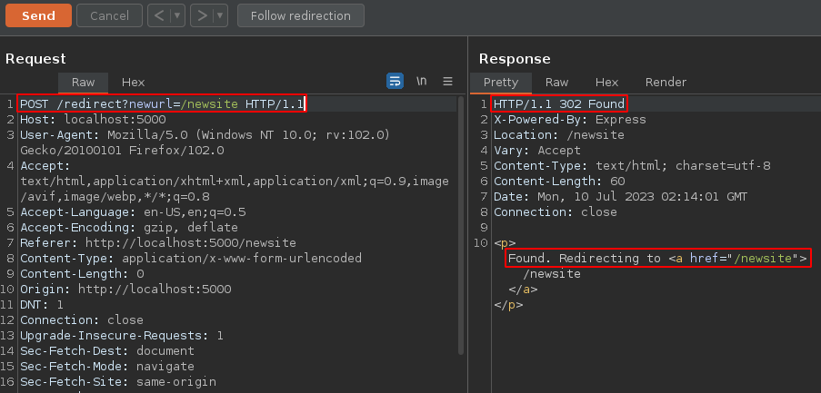

Captura: URL Original

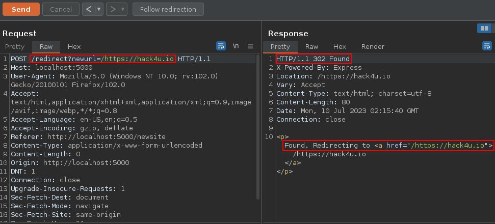

Captura: Open Redirect

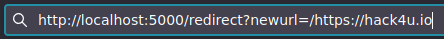

## Url-redirection-harder

Este ejercicio es parecido al anterior solo que esta vez está aplicando una pequeña sanitización la cual no permite URLS las cuales contengan puntos (”.”).

Como se puede ver en la imagen, al intentar hacer un redirect a la página web “hack4u”, el servidor responde con un 200 OK, es decir, no hace el redirect. Un mensaje informativo también se muestra gráficamente en la página web al intentar hacer el redirect.

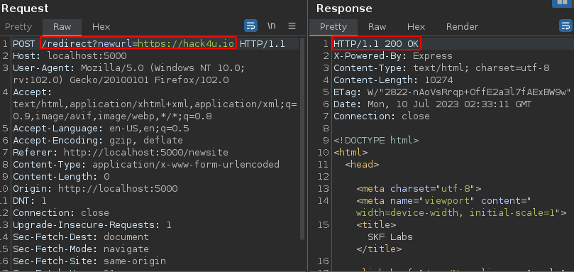

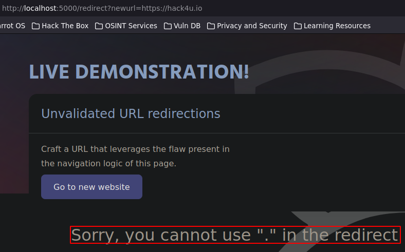

Esto, no evita que se pueda bypassear esta restricción, una forma de hacerlo es ulencodeado los caracteres prohibidos, por ejemplo, en lugar de “http://hack4.io”, se podría utilizar “https://hack4u%2eio” urlencodeando el punto. Esto aún así no servirá ya que el servidor al urldecodearlo, lo verá como un “.”, pero se podría mejorar este bypass esta vez urlencodeado también el porcentaje (”%”) del urlencodeado anterior, entonces la URL quedaría de esta forma: “https://hack4u%252eio”

Y como se puede ver, al enviar la petición se aplica el redirect y se logra bypassear esta restricción.

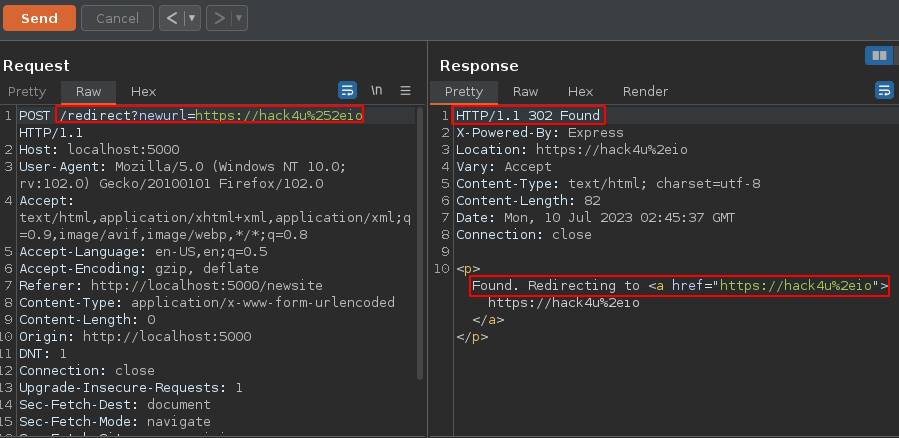

## Url-redirection-harder2

Este último lab es un poco más difícil que el anterior, ahora se está añadiendo otra pequeña sanitización en la que no se permite ni usar puntos (”.”) y/o barras inclinadas (”/”).

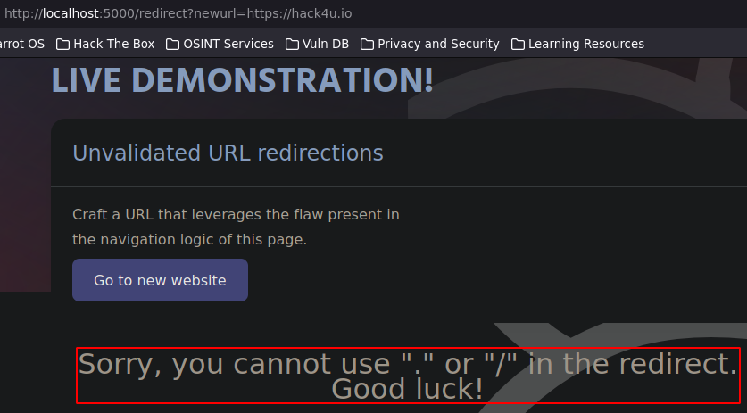

En estos casos, se aplica el mismo tratamiento con los puntos, es decir se urlencodean los puntos en sí y luego se urlencodean los porcentajes pero ahora el problema son las barras inclinadas (”//”) las cuales de primeras se podría pensar que se pueden urlencodear al igual que los puntos pero esto no funciona ya que da error al hacer el redirect.

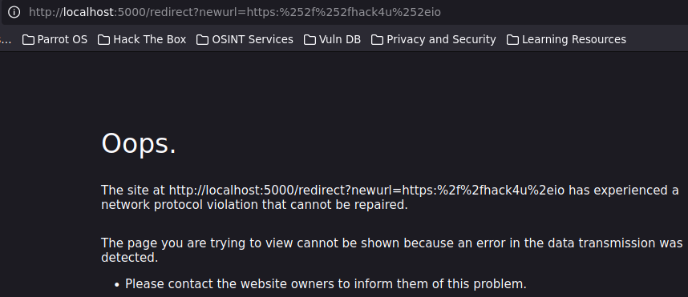

Lo que se puede hacer es simplemente quitar las barras inclinadas, el navegador podrá resolver de igual manera la página web aunque no estén presentes, es decir, la interpretará como si tuviese las barras inclinadas, aunque se debe de tomar en cuenta que esto solo sirve para direcciones http con certificado SSL, es decir “https”. La URL entonces quedará de la siguiente manera: “https:hack4u%252eio”.

Y como se puede ver, se aplica el redirect.

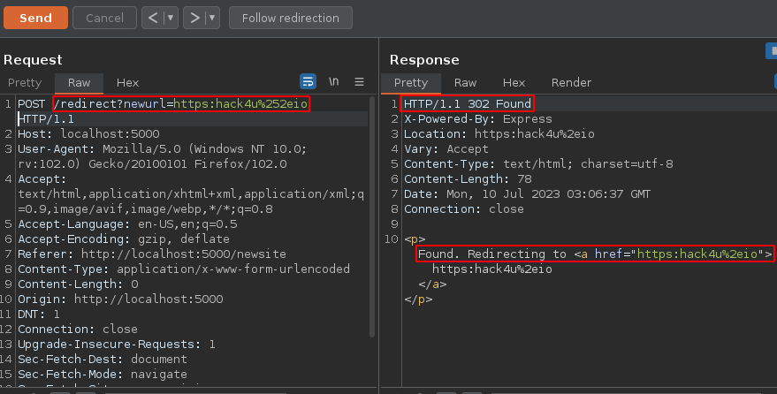

## Ufonet - Botnet con Open Redirect

Proyecto de github: https://github.com/epsylon/ufonet

Esto script lo que hace es aprovecharse de los Open Redirects para armar una botnet. Sin necesidad de infectar las máquinas para tomar el control de ellas, mediante Google Dorks, es capaz de detectar servidores vulnerables a open redirect para que todos ellos ejecuten una acción, como lo podría ser, redirigir a una víctima, todo el tráfico de la botnet para causar un DDoS.

## Más ideas de ataques con Open Redirect

Phishing: Por ejemplo, hay un servidor de la compañía el cual es vulnerable a Open Redirect y, además, se tienen muchos correos de empleados, con esto se podría crear una campaña de phishing para suplantar un cargo superior de la empresa y crear correos en los que se indique que se debe cambiar la contraseña ahora mismo ingresando a un link específico, este link se vería como parte del nombre de dominio de la empresa pero la diferencia es que al final se aplica un redirect a un sitio web malicioso muy similar al dominio original creado por el atacante, por ejemplo, si el dominio principal era “example.com”, el del atacante podría ser “example.es”.

XSS: Por ejemplo, un escenario en el que el atacante tiene el direccionamiento interno de la empresa, ve que hay un servidor vulnerable a XSS por GET, además el atacante conoce quién es el administrador, el atacante lo que podría hacer es aprovecharse de algún servidor de internet descubierto por medio de Google Dorks, que sea vulnerable a Open Redirect, entonces se crea un link para que al ser clickeado, este redirija al usuario administrador al servidor interno vulnerable a XSS para que este, con etiquetas <script> apunte a un servidor externo controlado por el atacante para que cargue un script que controle el flujo de peticiones del usuario víctima.
