# Ataque de oráculo de relleno (Padding Oracle)


### Más referencias:

- Links
    
    pentesterlabs - (”[https://pentesterlab.com/exercises/padding_oracle/course](https://pentesterlab.com/exercises/padding_oracle/course)”)
    
    Sam Bowne - (”[https://www.youtube.com/watch?v=FSOrT0yKIkE](https://www.youtube.com/watch?v=FSOrT0yKIkE)”)
    

## ¿Qué es CBC?

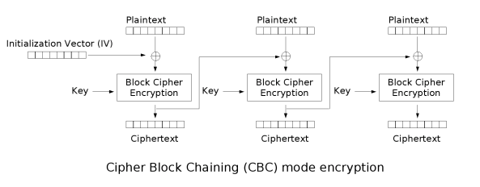

Es un modo de operación utilizado en los algoritmos de cifrado simétrico y opera dividiendo los datos en bloques con un tamaño fijo y los cifra uno por uno. Cada bloque de texto sin cifrar se combina con el bloque cifrado anterior antes de aplicar el cifrado. Esto se logra mediante una operación de XOR (bit a bit) entre el bloque de texto sin cifrar actual y el bloque cifrado anterior. Luego, el bloque resultante se cifra utilizando el algoritmo de cifrado de bloque.

La idea detrás de este proceso es que cada bloque de texto cifrado depende tanto de los bloques de texto sin cifrar anteriores como del algoritmo de cifrado. Esto introduce una propiedad llamada "encadenamiento" que hace que cualquier cambio en un bloque afecte a todos los bloques subsiguientes, proporcionando un nivel adicional de seguridad.

Además de la confidencialidad, CBC también proporciona integridad y autenticación de los datos cifrados. Para ello, se utiliza un algoritmo de autenticación de mensajes, como HMAC (Hash-based Message Authentication Code), que genera un código de autenticación para cada bloque de texto cifrado. Este código se adjunta a los datos cifrados y se utiliza para verificar su integridad durante la desencriptación.

Es importante destacar que el modo CBC no proporciona confidencialidad o autenticación por sí solo, sino que debe combinarse con otros mecanismos criptográficos, como un algoritmo de cifrado adecuado y un algoritmo de autenticación, para garantizar la seguridad de los datos.

### Ejemplo:

- Ejemplo con la cadena: “Hola, me llamo Bob”
    
    Supongamos que queremos cifrar la cadena "Hola, me llamo Bob" utilizando el modo CBC.
    
    1. Dividir la cadena en bloques de un tamaño fijo. En el caso de CBC, los bloques suelen ser de 64 bits (8 bytes) o 128 bits (16 bytes). En este ejemplo, utilizaré bloques de 8 bytes. Entonces, dividimos la cadena en los siguientes bloques:
        
        Bloque 1: "Hola, me"
        Bloque 2: " llamo B"
        Bloque 3: "ob"
        
    2. Antes de aplicar el cifrado, necesitamos inicializar un vector de inicialización (IV, por sus siglas en inglés). El IV es un bloque de datos aleatorio del mismo tamaño que los bloques de texto sin cifrar. En este caso, también será de 8 bytes. Supongamos que nuestro IV es "12345678".
    3. Ahora, tomamos el primer bloque de texto sin cifrar (Bloque 1: "Hola, me") y lo combinamos con el IV utilizando una operación llamada XOR (exclusivo OR) bit a bit. En términos sencillos, esto significa que cada bit del bloque de texto sin cifrar se compara con el bit correspondiente en el IV y se obtiene un resultado según la siguiente regla:
        - Si los bits son iguales, el resultado es 0.
        - Si los bits son diferentes, el resultado es 1.
        
        En nuestro ejemplo, el resultado de la operación XOR entre el bloque de texto sin cifrar "Hola, me" y el IV "12345678" sería "oqgbmqiu".
        
    4. A continuación, se aplica un algoritmo de cifrado de bloque (como AES o DES) al resultado de la operación XOR. El algoritmo de cifrado toma el bloque resultante "oqgbmqiu" y produce un bloque de texto cifrado. Supongamos que el resultado de cifrar este bloque es "u0n74e9s".
    5. El bloque de texto cifrado resultante se toma como entrada para el siguiente bloque de texto sin cifrar. En este caso, el siguiente bloque es " llamo B". Repetimos los pasos 3 y 4 utilizando el bloque de texto cifrado anterior como entrada y obtenemos un nuevo bloque de texto cifrado.
    6. Repetimos el proceso con el último bloque de texto sin cifrar "ob" y obtenemos el último bloque de texto cifrado.
    
    Finalmente, tendríamos una secuencia de bloques de texto cifrado resultantes. Para descifrar los datos, se realiza el proceso inverso utilizando la misma clave y el mismo vector de inicialización. Cada bloque cifrado se descifra y se combina con el bloque cifrado anterior para obtener los bloques de texto sin cifrar originales.
    

### Proceso de descifrado:

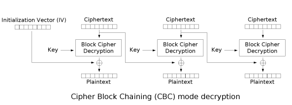

- Ejemplo con la cadena: “Hola, me llamo Bob”
    
    Supongamos que ya tenemos la cadena cifrada resultante de los pasos anteriores:
    
    Bloque 1 cifrado: "u0n74e9s"
    Bloque 2 cifrado: "p3s6t0r1"
    Bloque 3 cifrado: "2v8u5a4n"
    
    1. Al igual que en el proceso de cifrado, necesitamos tener el mismo vector de inicialización (IV) utilizado anteriormente. En este caso, el IV es "12345678".
    2. Tomamos el primer bloque cifrado (Bloque 1 cifrado: "u0n74e9s") y lo desencriptamos utilizando el algoritmo de cifrado de bloque correspondiente y se aplica el XOR con el mismo vector de inicialización (IV). Al aplicar el proceso inverso, obtenemos el bloque de texto sin cifrar resultante.
    3. Luego, tomamos el bloque de texto sin cifrar obtenido y lo combinamos con el siguiente bloque cifrado (Bloque 2 cifrado: "p3s6t0r1") utilizando la operación XOR. Esto nos da un resultado intermedio.
    4. Aplicamos el algoritmo de cifrado de bloque inverso al resultado intermedio y obtenemos el siguiente bloque de texto sin cifrar.
    5. Repetimos el paso 3 y 4 para el último bloque cifrado (Bloque 3 cifrado: "2v8u5a4n") y obtenemos el último bloque de texto sin cifrar.
    
    Al combinar los bloques de texto sin cifrar resultantes, obtenemos la cadena original "Hola, me llamo Bob".
    
    Es importante destacar que el proceso de descifrado es el inverso del proceso de cifrado. Se utiliza el mismo IV y la misma clave utilizados durante el cifrado. Cada bloque cifrado se desencripta y se combina con el bloque cifrado anterior para obtener los bloques de texto sin cifrar originales.
    

## Padding

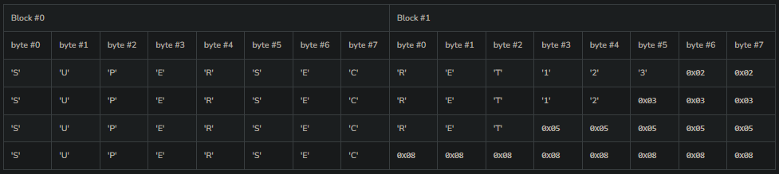

El padding (relleno) de bloques es un proceso utilizado en criptografía cuando se trabaja con algoritmos de cifrado de bloque y los datos a cifrar no tienen una longitud que sea un múltiplo exacto del tamaño del bloque.

En el modo CBC (Cipher Block Chaining), por ejemplo, se requiere que los bloques de texto sin cifrar tengan el mismo tamaño que el bloque de cifrado utilizado. Si los datos a cifrar no tienen una longitud que sea un múltiplo exacto del tamaño del bloque, es necesario aplicar un esquema de padding para ajustar su tamaño.

El padding se realiza agregando bits o bytes adicionales a los datos antes de cifrarlos, de manera que se complete el último bloque del tamaño requerido. El proceso de padding se realiza de diferentes maneras, siendo los esquemas de relleno más comunes el PKCS#7 (Public Key Cryptography Standards #7) y el ISO/IEC 7816-4.

En el esquema PKCS#7, se agrega un byte al final del bloque que indica el número de bytes que se han agregado para el relleno. Por ejemplo, si se requiere agregar 4 bytes de relleno, todos los bytes agregados tendrán el valor decimal 4. De esta manera, durante el proceso de descifrado, se puede determinar la cantidad de bytes que se deben eliminar para eliminar el padding correctamente.

Por ejemplo, supongamos que tenemos una cadena de texto "Hola" y queremos cifrarla utilizando el modo CBC con bloques de 8 bytes. En este caso, necesitaríamos aplicar padding porque la cadena tiene solo 4 bytes. Aplicando PKCS#7, agregamos 4 bytes con el valor decimal 4: "Hola\x04\x04\x04\x04".

Es importante tener en cuenta que el proceso de padding y el de descifrado deben ser compatibles. Es decir, al descifrar los datos, se debe eliminar el padding de manera adecuada para obtener los datos originales sin incluir el relleno.

El padding es necesario para garantizar que los datos se puedan cifrar y descifrar correctamente cuando su longitud no coincide con el tamaño del bloque requerido por el algoritmo de cifrado de bloque utilizado.

### Orden de proceso:

En el proceso de cifrado utilizando el modo CBC, el padding se agrega antes de realizar la operación XOR. Después de aplicar el padding al último bloque de datos, se realiza el XOR con el bloque de texto cifrado anterior antes de cifrar el bloque resultante.

En el proceso de descifrado, se realiza el proceso inverso. Primero, se descifra el bloque de texto cifrado y luego se realiza la operación XOR con el bloque cifrado anterior. Después de eso, se puede eliminar el padding antes de obtener el bloque de texto sin cifrar original.

En resumen:

- Cifrado:
    1. Agregar padding al último bloque de datos antes de hacer el XOR.
    2. Hacer el XOR con el bloque de texto cifrado anterior.
    3. Cifrar el bloque resultante.
- Descifrado:
    1. Descifrar el bloque de texto cifrado.
    2. Hacer el XOR con el bloque cifrado anterior.
    3. Eliminar el padding para obtener el bloque de texto sin cifrar original.

Si durante la limpieza del relleno, se tiene un relleno inválido que desencadena un comportamiento detectable, se dice que se tiene un oráculo de relleno, el comportamiento detectable puede ser un error, una falta de resultados, un tiempo de respuesta diferente, etc. y si el atacante es capaz de detectar este comportamiento, será capaz de descifrar los datos.

Aquí se puede ver que el byte C15 del texto descifrado, es un XOR entre el Byte E7 del bloque anterior y el Byte I15 del bloque intermediario que se obtiene al aplicar un descifrado.

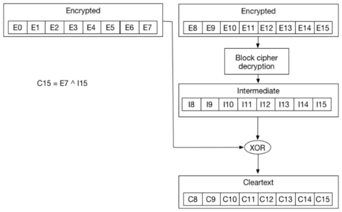

Y así sucesivamente con los otros bytes:

- **C14 = I14 ^ E6**
- **C13 = I13 ^ E5**
- **C12 = I12 ^ E4**
- ...

Si se aplica un XOR entre I15 y “E7’”, es decir, un valor el cual se puede hacer brute force, se puede obtener \0x1. Por lo tanto también se puede despejar I15 (valor desconocido) el cual será resultado de un XOR entre \0x1 y el valor brutforceable E7’

- \0x1 = E7’ ^ I15
- I15 = \0x1 ^ E7’

Y dado que C15 es el resultado de un XOR entre E7 y I15, resulta que esto es igual a un XOR entre tres valores: E7 (valor cifrado conocido), \0x1 (valor conocido) y E7’ en el cual se puede aplicar fuerza bruta para que a la hora de hacer una limpieza de padding, ver si el servidor devuelve una respuesta correcta o no. Cuando se detecte un valor para E7’ que devuelva una respuesta correcta, ese valor será C15 y así sucesivamente con los demás bytes.

- C15 = E7 ^ I15 = E7 ^ \0x1 ^ E7’

## Herramientas automatizadas

Para este laboratorio, se creó una máquina virtual de vulnhub para probar el funcionamiento de la vulnerabilidad Padding Oracle. El link para descargar la máquina es el siguiente: [https://www.vulnhub.com/?q=padding+oracle](https://www.vulnhub.com/?q=padding+oracle)

Primero se hará un reconocimiento para conocer los puertos abiertos.

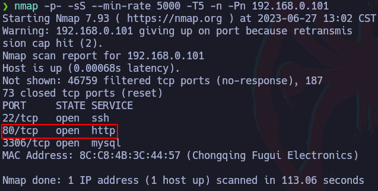

Ahora hay que registrarse como un nuevo usuario.

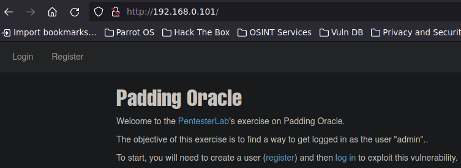

### Herramienta: PadBuster

Al iniciar sesión en la web, se puede verificar la cookie de sesión del usuario actual:

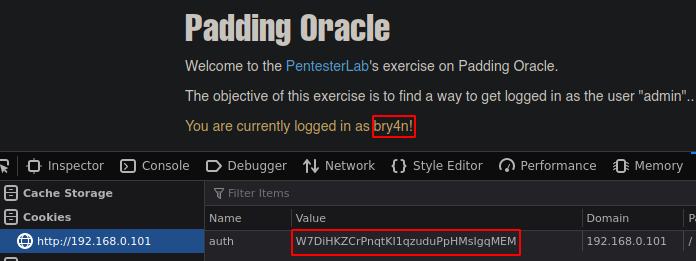

La información en texto plano de esta cookie es la que se divide en bloques utilizando CBC para ir cifrando bloque por bloque con la key interna que usa el servidor para dar como resultado lo que se muestra en “Value”. Esta información se cifra para que no se sepa qué información se está enviando y si, por ejemplo, la información en texto plano de la cookie dice “auth=bry4n”, estando esta información cifrada, el usuario en un principio no podría cambiar este valor para que diga otra cosa como: “auth=admin”. Aunque si la web es vulnerable a un Padding Oracle, esta cookie cifrada podría llegar a descifrarse para obtener su contendido en texto plano.

Para descifrarla, se harpa uso de la herramienta PadBuster:

```bash
padbuster http://192.168.0.101/index.php 
W7DiHKZCrPnqtKI1qzuduPpHMsIgqMEM 8 -cookies 
'auth=W7DiHKZCrPnqtKI1qzuduPpHMsIgqMEM'

-cookie # Se indica una cookie con su nombre y valor 
# (esto se verifica en la misma web)

#----#
padbuster <URL> <DatoCifrado> <BlockSize> [options]

<BlockSize> # En el esquema CBC, el tamaño del bloque debe 
# ser un múltiplo de 8 bits, o 1 byte
```

Al ejecutar el comando, se muestra la siguiente pantalla de diálogo, aquí lo recomendable es seleccionar el ID con doble asterisco (**):

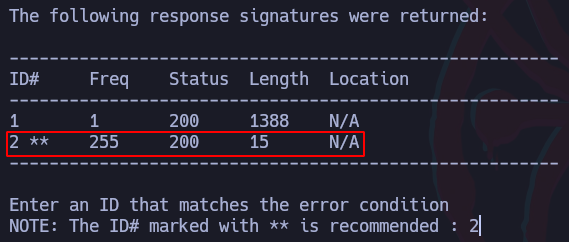

Una vez finalizado el programa se ve cómo desencriptó con éxito la cookie:

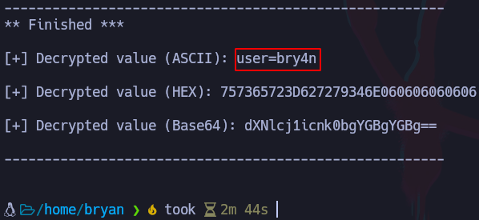

Esto significa que la representación de la cookie “W7DiHKZCrPnqtKI1qzuduPpHMsIgqMEM” en texto plano es: “user=bry4n” con lo cual ahora se podría pensar que el valor de user corresponde al nombre de usuario logueado.

Sabiendo esto, ahora se podría modificar la cookie sesión para que en lugar de decir: user=bry4n, diga un nombre de usuario válido de administrador, en este caso el objetivo es loguearse como el usuario “admin” por lo que ahora se creará una nueva cookie de sesión cifrada con el texto “user=admin” de la siguiente forma:

```bash
padbuster http://192.168.0.101/index.php 
W7DiHKZCrPnqtKI1qzuduPpHMsIgqMEM 8 -cookies 
'auth=W7DiHKZCrPnqtKI1qzuduPpHMsIgqMEM' -plaintext 
'auth=admin'

-plaintext # Servirá para crear una nueva cookie de sesión 
# con el texto especificado
```

El resultado será una nueva cookie de sesión la cual se usará para loguearse como el usuario admin cambiando la cookie de la sesión actual por la nueva.

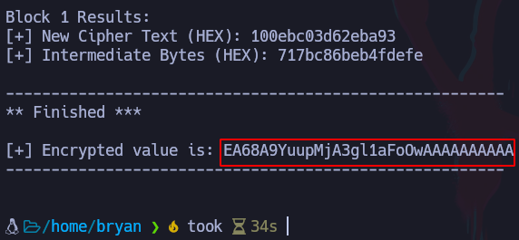

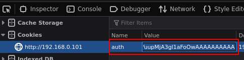


## Burpsuite: Ataque BitFlipper

Dado que la información se divide en diferentes bloques, habrá algunos bytes que aunque se cambien, habrá otras partes que se mantendrán igual, por ejemplo, si se tiene la siguiente cookie cifrada: “EA68A9YuupMjA3gl1aFoOwAAAAAAAAAA” la cual en texto plano corresponde a “user=admin”, si esto se cambia ligeramente a “user=cdmin”, la diferencia entre estos dos textos será de unos pocos bits por lo que el texto cifrado cambiará pero no completamente.

Por esto, se podría aplicar fuerza bruta con Burpsuite para aplicar un ataque BitFlipper que lo que hará es cambiar unos bits del texto cifrado para ver si consigue dar con el usuario “admin” y conseguir una cookie válida.

Primero, se creará una cuenta similar a “admin”, por ejemplo, “cdmin” para obtener una cookie parecida a la del usuario “admin“:

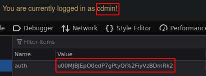

Ahora se interceptará la petición con Burpsuite recargando la página y se mandará la repeater:

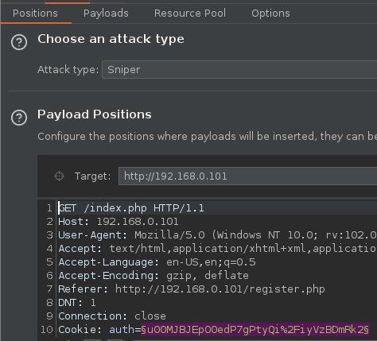

Luego en la sección de Payloads, seleccionar lo siguiente:

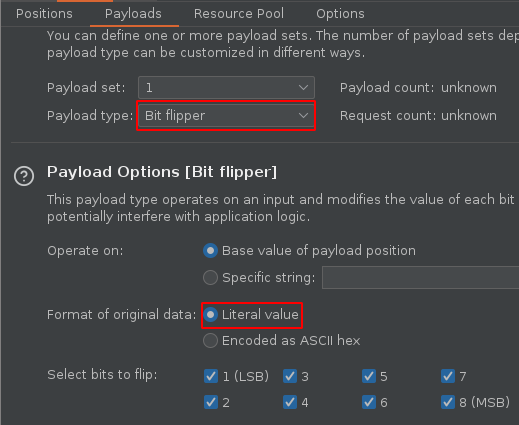

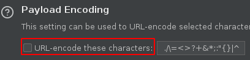

Una vez hecho esto, se empieza el ataque, lo que pasará es que los bits del texto cifrado se irán cambiando en cada petición por lo que el objetivo es encontrar la respuesta que de como resultado un logueo exitoso como “admin”, en este caso la respuesta tendrá una longitud diferente a las demás:

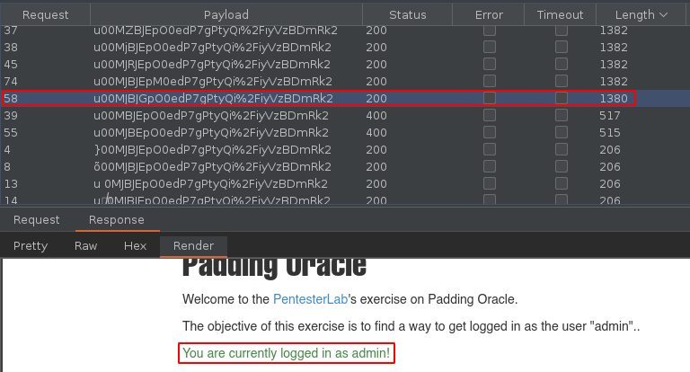

Una vez encontrada la respuesta correcta, ahora es posible copiar la cookie y cambiar la cookie actual para iniciar sesión como usuario “admin”.

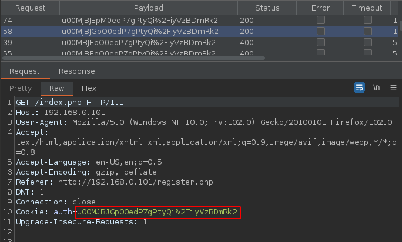

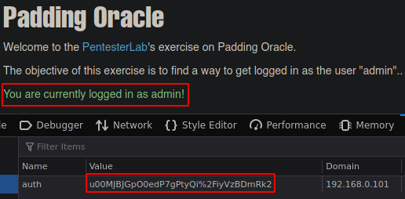

