# Ataque de Truncado SQL (SQL Truncation)


## Instalación de lab en VMWare

Primero se descarga el archivo “.ova” de la máquina:  [https://www.vulnhub.com/entry/ia-tornado,639/](https://www.vulnhub.com/entry/ia-tornado,639/)

Con una herramienta de descomprimido como 7z abrir el archivo “.ova” y dentro de ella habrá tres archivos.

Estos tres archivos hay que arrastrarlos a una nueva carpeta.

Ahora con la utilidad de VMWare “vmware-vdiskmanager.exe” hay que ejecutar el siguiente comando. En el cmd ejecutar el siguiente comando:

```bash
# La ubicación podría variar por lo que hay que buscar la
# carpeta de VMWare y dentro de ella buscar el archivo
C:\Program Files (x86)\VMware\VMware Workstation\vmware-vdiskmanager.exe -r "C:\Users\Bryan\Desktop\Lab\tornado-disk001.vmdk" -t 0 "C:\Users\Bryan\Desktop\Lab\nuevonombre.vmdk"

-r # Indica la ubicación del archivo a tratar, en
# este caso "tornado-disk001.vmdk"
-t # Indica el tipo de disco para el nuevo archivo 
# Y al final se Indica la ubicación para el nuevo archivo 
# creado con un nuevo nombre
```

Ahora se creará una nueva máquina virtual en VMWare con la configuración correspondiente y poner la interfaz en modo “bridged” y replicar la interfaz física y darle a finish.

Ahora ir a la configuración de la máquina virtual y remover el disco duro creado y crear uno nuevo tipo SCSI, usar un disco duro existente, seleccionar el nuevo disco creado anteriormente y añadirlo manteniendo el formato existente.

Después de eso, arrancar la máquina y durante el proceso de iniciado, presionar la tecla “e” para entrar en el modo edición.

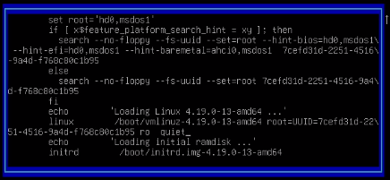

Cambiar el campo “ro quiet” a “rw init=/bin/bash” y luego hacer un “Ctrl + x”.

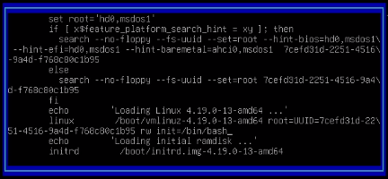

Luego en la shell proporcionada como root, configurar los siguientes archivos:

```bash
# Verificar interfaz
ip a

# Configurar las interfaces de red para que coincidan con 
# la interfaz de red de la máquina
cd /etc/network
cat interfaces
```

Después de terminar, se reinicia la máquina y la configuración debería estar completa.

## Reconocimiento

La máquina tiene el servicio web corriendo por el puerto 80 y la web se ve así:

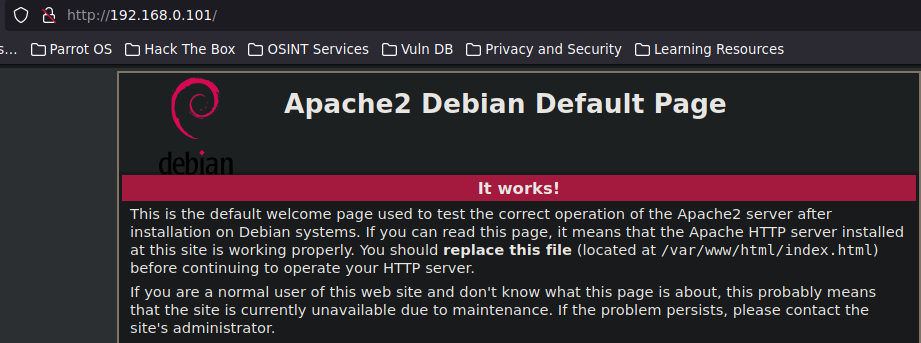

Por lo que aplicará un fuzzing rápido para descubrir directorios:

```bash
gobuster dir -t 10 -u http://192.168.0.101/ 
-w /usr/share/wordlists/SecLists/Discovery/
Web-Content/directory-list-2.3-medium.txt
```

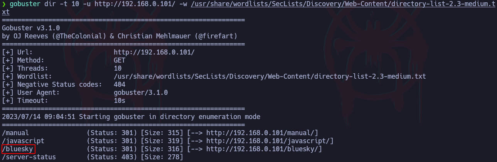

El directorio que interesa es el “bluesky” y se aplicará otro fuzzing a este directorio:

```bash
gobuster dir -t 5 -u http://192.168.0.101 
-w /usr/share/wordlists/SecLists/Discovery/Web-Content/
directory-list-2.3-medium.txt
```

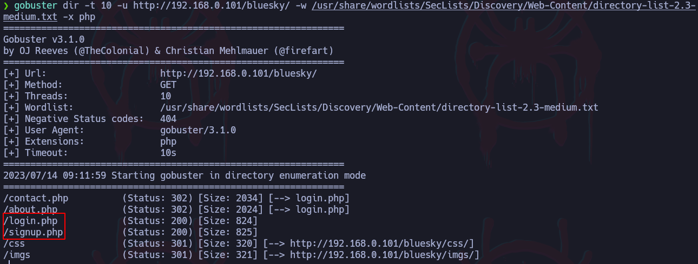

Por un lado está el “login,php” y por el otro el “signup.php”:

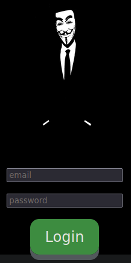

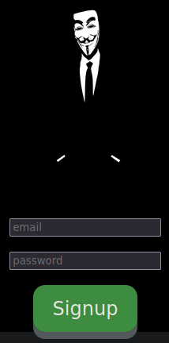

Para conocer más a fondo la página, se creará un nuevo usuario.

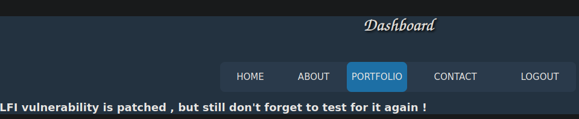

Al ver el código fuente de esta página con curl, se muestra el directorio “/home/tornado/imp.txt”:

```bash
curl -s -X GET "http://192.168.0.101/bluesky/port.php"
```

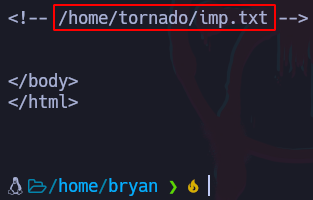

De primeras no se podrá acceder a este recurso con un LFI.

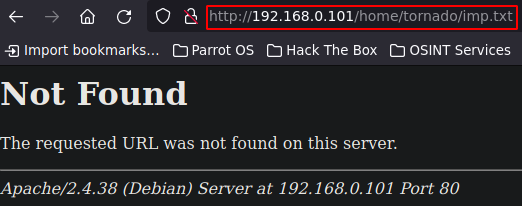

Aunque debido a que es el directorio del usuario, puede ser que haya un alias que apunte al directorio del usuario, es decir, utilizando la virgulilla “~”:

- Ejemplo del alias
    
    Muestra del archivo de configuración de apache2: “/etc/apache2/apache2.conf”
    
    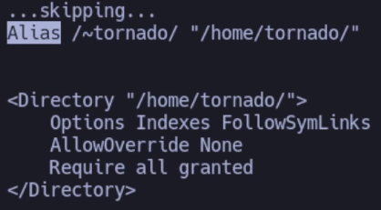
    
    Cuando se haga alusión a “/~tornado/” este apuntará al directorio del usuario “/home/tornado”.
    

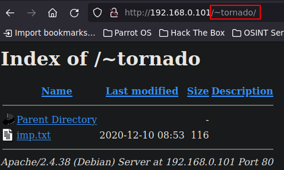

En el directorio de encuentra el archivo “imp.txt” el cual contiene diferentes correos electrónicos:

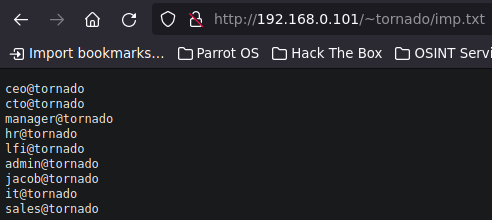

Estos correos podrían ser usuarios válidos para el sitio web pero aún así no se tiene la contraseña.

## SQL Truncation

Analizando un poco el “register.php”, al intentar crear una nueva cuenta, se ve que hay un límite de caracteres permitidos, es decir, se establece un “maxlength” igual a 13, esto no permite ingresar un correo con más de 13 caracteres.

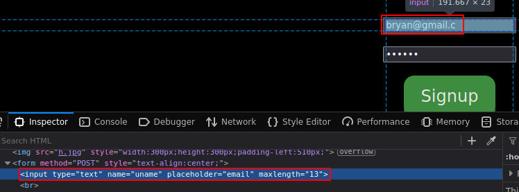

Al ver esto, se puede pensar en efectuar un SQL Truncation.

Este ataque consiste en ingresar más caracteres de los que se debe en el campo donde se ingresa el email, esto con el fin de que la query por detrás se corte o se trunque, esto servirá para sobrescribir la contraseña de un usuario válido. En este caso se tienen diferentes correos, entre ellos está por ejemplo, el usuario “admin@tornado”.

Al intentar registrar este mismo usuario, con una contraseña diferente, se verá el siguiente mensaje:

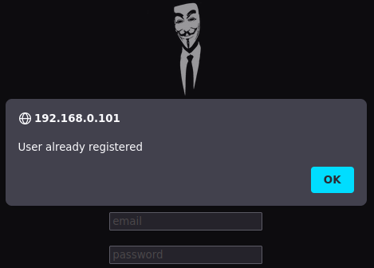

Indica que el usuario ya está registrado pero se podría aplicar un SQL Truncation para registrar este mismo usuario con una contraseña diferente, para esto, se hace lo siguiente:

```bash
1. Primero se verificar la cantidad de caracteres que 
tiene el nombre del usuario, en este caso el usuario 
"admin@tornado" tiene 13 caracteres.

2. Ahora la idea es, a ese nombre de usuario, añadirle 
múltiples espacios para superar el límite de caracteres 
permitidos y al final añadir algunos caracteres, 
ejemplo: "admin@tornado    asd"

3. Debido a que la web hace una validación del lado 
del cliente de la cantidad de caracteres, se puede 
modificar esta longitud a un número más grande para 
bypassear esta restrincción.

4. Al enviar esta solicitud, la query por detrás verá 
que se está tratando de registrar un nuevo usuario pero 
este supera la cantidad de caracteres y lo que hará es 
truncar o cortar la cadena a 13 caracteres de forma que 
quedará de esta forma: "admin@tornado" y como es un 
usuario que ya existe, en lugar de mostrar un error, 
lo sobreescribirá con la nueva contraseña
```

Se modifica el límite de caracteres permitidos

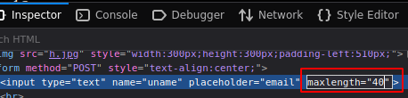

Se aplica el SQL Truncation y el usuario se crea correctamente sobrescribiendo la contraseña.

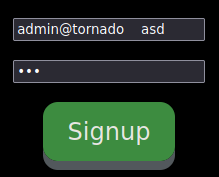

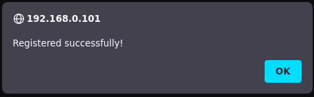

Ahora es posible ingresar con el usuario admin@tornado con la nueva contraseña.


### Más ejemplos con otros usuarios

```bash
[+] Hay que recordar que la idea es rellenar con espacios 
los caracteres restantes para que el nombre del usuario 
supere el límite y al final añadirle cualquier caracter.
A continuación se muestran los nombres de los usuarios y 
su versión aplicando un SQL Truncation:

~~~~~
ceo@tornado
# Tiene 11 caracteres, por lo que hay que rellenar 2 con 
# espacios: "ceo@tornado  asd"

cto@tornado
# Tiene 11 caracteres, por lo que hay que rellenar 2 con 
# espacios: "cto@tornado  asd"

hr@tornado
# Tiene 10 caracteres, por lo que hay que rellenar 3 con 
# espacios: "hr@tornado   asd"

lfi@tornado
# Tiene 11 caracteres, por lo que hay que rellenar 2 con 
# espacios: "lfi@tornado   asd"

jacob@tornado
# Tiene 13 caracteres, por lo que no es necesario 
# rellenar con espacios: "jacob@tornadoasd"

it@tornado
# Tiene 10 caracteres, por lo que hay que rellenar 3 con 
# espacios: "it@tornado   asd"

sales@tornado
# Tiene 13 caracteres, por lo que no es necesario 
# rellenar con espacios: "sales@tornadoasd"
```

