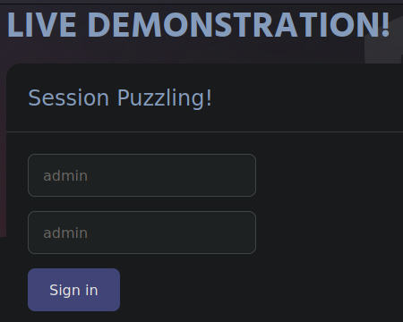
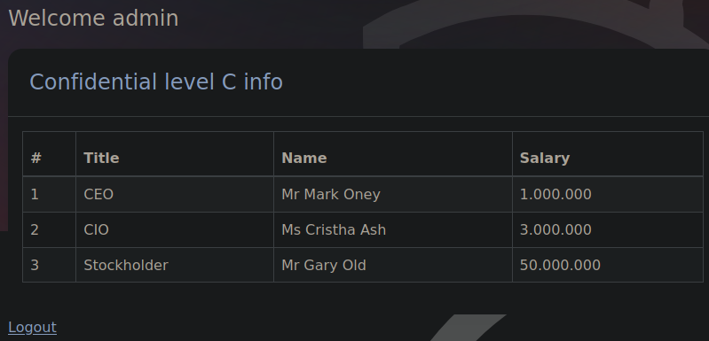
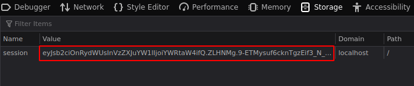
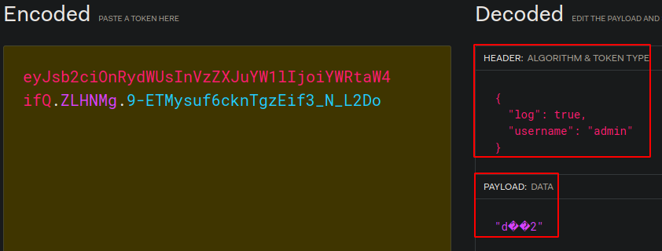
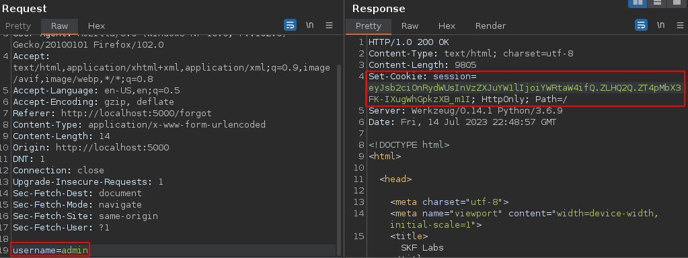
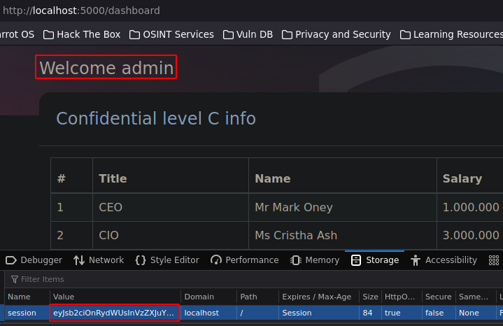
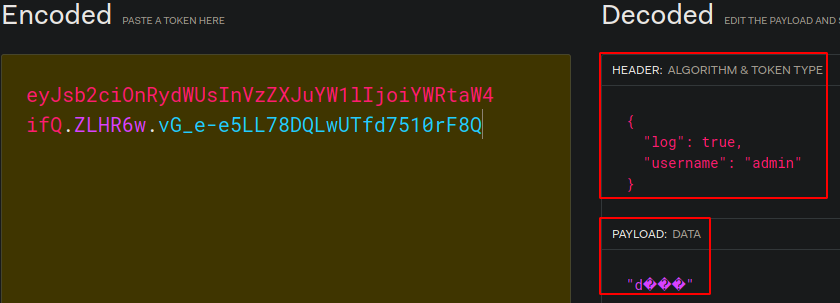

# Session Puzzling, Fixation y Variable Overloading


## Instalación

```bash
docker pull blabla1337/owasp-skf-lab:sessionpuzzle
docker run -dit -p 127.0.0.1:5000:5000 blabla1337/owasp-skf-lab:sessionpuzzle
```

Así se ve la página web, esta cuenta con un portal de logueo:



El usuario al loguearse como “admin”, es redireccionado al portal del usuario admin y se le asigna una cookie de sesión la cual, por su estructura podría decirse que es un JWT (Json Web Token):





Al decodear el JWT en “jwt.io”, se puede ver la siguiente estructura:



## Session Puzzling

En la página de logueo se puede ver un “forgot password”, esta opción es interesante ya que si se ingresa un usuario válido, en este caso el usuario “admin”, y se intercepta esta petición con Burpsuite se puede ver lo siguiente.




El servidor al recibir la petición del reseteo de contraseña para el usuario admin, este en la respuesta incluye una cookie de sesión válida para el usuario admin.

Ahora si se intenta cambiar la cookie de sesión por esta nueva generada, se podrá iniciar sesión como el usuario "admin”.



Y al ver la estructura de este JWT en “jwt.io”, se puede ver el mismo header del JTW anterior:



## Información Extra

Aunque este lab se trata de un ataque de Sessión Puzzling, no muestra exactamente cómo funciona este ataque, en realidad es necesaria la interacción entre el atacante y el usuario víctima, por ejemplo, el atacante genera una cookie de sesión válida: {”session_id”: 1234} entonces el atacante persuade al usuario víctima para que ingrese a la web vulnerable con un link en el cual se está pre-estableciendo una cookie de sesión (https://example.com/login.php?session_id=1234), de forma que la víctima al hacer click en el enlace y loguearse en la web, se le establecerá la misma cookie de sesión “1234” y ahora el atacante tiene el control de la cuenta del usuario ya que tiene la misma cookie de sesión que el usuario.
