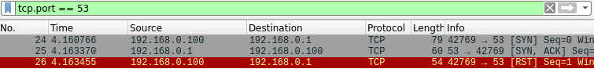

# Técnicas de evasión de Firewalls
    

## Fragmentación de paquetes [`-f`]

Hay veces que podría servir la fragmentación de paquetes ya que hay firewalls que esperan ciertos paquetes en específico entonces el hecho de fragmentarlos, puede llegar a evadir esta detección.

Con la herramienta tcpdump, se capturan los paquetes enviados por nmap

```bash
# Máquina en escucha
tcpdump -w capture.cap -v
```

```bash
# Ejecución de nmap con el parámetro -f para la 
# fragmentación de paquetes
nmap -p53 -f 192.168.0.1
```

Ahora se abre la captura con Wireshark y se filtra los paquetes fragmentados con **ip.flags.mf == 1**

*1 corresponde a paquetes fragmentados y 0 por paquetes normales.*

```bash
wireshark capture.cap &> /dev/null & disown
```


Captura Wireshark: Paquetes fragmentados

Como se puede ver, los paquetes salen fragmentados y son reensamblados en “#13” el cual corresponde a un número del paquete en la captura de Wireshark:


Si se verifica el puerto destino de este paquete, se puede verificar que se envió una petición al puerto 53:


## Modificar el MTU (Maximum Transmission Unit) [`--mtu`]

Permite modificar el tamaño de los paquetes para que sean lo suficientemente pequeños para evadir la detección del firewall.

```bash
nmap -p53 --mtu 8 192.168.0.1
```

*Se deben colocar múltiplos de 8.*

## Decoy (IP Address Spoofing) [`-D`]

Esto permite al atacante enviar paquetes a través de muchas IPs falsas y así eludir u ocultarse de la detección del firewall.

Primero se pone la máquina en modo escucha con la herramienta **tcpdump** y posteriormente, se ejecuta el nmap

```bash
# Máquina en modo escucha
tcpdump -w capture.cap -v
```

```bash
# Se ejecuta nmap con el parámetro -D seguido de la(s) IPs
# a suplantar
nmap -p53 192.168.0.1 -D 192.168.0.102,192.168.0.103
```

Después de abrir el Wireshark con la captura tomada, se puede verificar la transmisión de los paquetes SYN por parte de ambas IPs:

```bash
wireshark capture.cap &> /dev/null & disown
```


Wireshark Capture: IP falsa (192.168.0.102)


Wireshark Capture: IPs falsas (192.168.0.102, 192.168.0.103)

## Cambiar el puerto de origen (Source Port) [`--source-port`]

Cambiar el puerto de origen puede ser conveniente ya que el firewall podría tener alguna lista blanca en la que figuren puertos confiables a los que serán los únicos a los que se les proporcionará conexión. Debido a esto, cambiar el puerto de origen a uno de estos confiables, podría eludir el firewall para proporcionar más información.

En este caso, se muestra una captura normal de un paquete enviado a 192.168.0.1, además se puede ver, en el apartado **info**, el puerto de origen que corresponde a un puerto aleatorio (48237) que utilizó el origen para comunicarse con el puerto de destino (53):


Ahora se procede a utilizar la herramienta tcpdump para capturar los paquetes que se envían al ejecutar nmap

```bash
# Máquina en escucha
tcpdump -w capture.cap -v
```

```bash
# Se ejcuta nmap con el parámetro --source-port seguido de un puerto 
# que se utilizará como origen en la comunicación
nmap -p53 192.168.0.1 --source-port 22
```

Ahora se muestra la captura de Wireshark y se puede ver la diferencia en el puerto de origen:


## Data Length [`--data-length`]

Hay firewalls que conocen ciertos tamaños para ciertos tipos de paquetes (como paquetes de reconocimiento) entonces manejan una “lista negra” en contra de estos paquetes, es por eso que manipular el tamaño de los datos podría ser conveniente para eludir esta detección.

Por ejemplo, se muestra un paquete con un tamaño de paquete normal (58) el cual podría ser detectado por un firewall:


Entonces se decide cambiar el tamaño.

Primero se utiliza la herramienta tcpdump para capturar los paquetes que envía nmap

```bash
# Máquina en escucha
tcpdump -w capture.cap -v
```

```bash
# Se ejecuta nmap con el parámetro --data-length seguido de un número
# que sumará al tamaño normal (58), en este caso, 21 el cual da un 
# total de 79
nmap -p53 192.168.0.1 --data-length 21
```

Luego, se abre la captura en Wireshark y mostrará el tamaño del paquete modificado:

```bash
wireshark capture.cap &> /dev/null & disown
```



## Spoof-MAC [`--spoof-mac`]

Podría servir para suplantar alguna máquina con algún tipo de acceso a la red destino

```bash
# Ejemplos
nmap -p53 192.168.0.1 --spoof-mac HP -Pn
nmap -p53 192.168.0.1 --spoof-mac Dell -Pn
```

*Es necesario agregar al final el parámetro -Pn.*

## Stealth Scan [`-sS`]

Normalmente, en el proceso de handshake, el origen tramita un SYN, el destino responde con un SYN/ACK (puerto abierto) o RST (puerto cerrado) y el origen responde finalmente con un ACK. El **stealth-scan** es rápido y sigiloso y hace que el origen en vez de enviar un ACK, envíe un RST al final de la conexión de forma que no la deja abierta sino que la cierra forzadamente, esto hace que en algunos firewalls no deje logs ya que registran el log solo de conexiones que se establecieron completamente, es decir, aquellas de las cuales se haya recibido el ACK

## Min-rate [`--min-rate`]

Permite controlar la velocidad mínima de paquetes enviados por segundo, en caso contrario, se utilizaría **`--max-rate`**

```bash
nmap -p- --min-rate 5000 192.168.0.1
```


