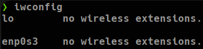
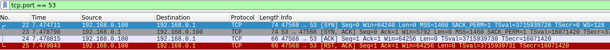

## Comandos de Nmap

```bash
# Especificar un rango de puertos
nmap -p1-500 12.12.12.5

# Especificar todos los puertos
nmap -p- 12.12.12.5

# Especificar puertos más comunes
nmap --top-ports 500 12.12.12.5

# Mostrar solo puertos abiertos
nmap --open 12.12.12.5

# Mostrar más información durante la ejecución del escaneo
nmap -v 12.12.5

# Omitir resolución DNS
nmap -n 12.12.12.5

# Incorporar plantilla de temporizado 
# (0:Paranoid|1:Sneaky|2:Polite|3:Normal|4:Agressive|5:Insane)
nmap -T5 12.12.12.5

# Centrar el escaneo a puertos TCP
# El usuario enviará un SYN a la máquina destino y esta 
# responderá con un RST si el puertos está cerrado 
# y con SYN/ACK si el puerto está abierto y el usuario responderá
# de vuelta con un ACK
nmap -sT 12.12.12.5

# Omitir descubrimiento por ARP
nmap -Pn 12.12.12.5

# Hacer un escaneo UDP
nmap -sU 12.12.12.5

# Hacer un escaneo SCTP
nmap -sY 12.12.12.5

# Hacer barrido de pings a todos los destinos para saber si están
# activos o no
nmap -sn 12.12.12.0/24
nmap -sn 12.12.12.0/24 | grep -oP '\d{1,3}\.\d{1,3}\.\d{1,3}\.\d{1,3}'
nmap -sn 12.12.12.0/24 | awk '{print $5}' | grep '[09]'

# Identificar el sistema operativo de la máquina destino
nmap -O 12.12.12.5

# Identificar versión de los servicios
nmap -p22,53 -sV 12.12.12.5

# Utilizar scripts básicos de reconocimiento
nmap -p80 -sC 12.12.12.5

# Scripts NSE
	# Pequeño fuzzer de directorios
	nmap --script=http-enum 12.12.12.5

	# Analizador de vulnerabilidades
	nmap --script vulners [--script-args mincvss=<arg_val>] 12.12.12.5
	mincvss= # restringe la salida solo a aquellos CVE que tienen una 
					 # puntuación CVSS más alta que la especificada (eje: 4).

# Escanear varios hosts
nmap 12.12.12.*
nmap 12.12.12.20-30
nmap 12.12.12.20,21,25,60
nmap 12.12.10-20.*
nmap -iL hosts.txt

# Métodos de exportación
nmap 12.12.12.5 -oN # Formato normal
nmap 12.12.12.5 -oG # Formato Grepeable
nmap 12.12.12.5 -oX # Formato xml
# Con "xsltproc captura.xml > index.html" se puede visualizar la 
# captura en el navegador
```

*Que un puerto esté filtrado, no significa que no se pueda conectar a él. En caso que no haya o ya se hayan probado todos los puertos abiertos, como última instancia se puede ir probando con los filtrados.*

## Ejemplo de paquetes SYN/ACK y RST en Wireshark

Primero se verifica la interfaz de red que se usará con **iwconfig**, en este caso será la “enp0s3”**:**



Se hará uso de la herramienta **tcpdump** para capturar los paquetes de esa interfaz e ingresarlo en un archivo:

```bash
tcpdump -I enp0s3 -w capture.cap -v

# Si la tarjeta de red no soporta el modo monitor, ejecutar el
# comando sin especificarla
tcpdump -w capture.cap -v
```

Mientras este está en escucha, se ejecutará nmap para enviar paquetes TCP utilizando el parámetro -sT el cual hará el proceso de handshake con el destino, el cual mostrará SYN/ACK si el puerto está abierto y RST si el puerto está cerrado:

```bash
# Prueba con puerto abierto
nmap -p53 -sT 192.168.0.1 -v -n

# Prueba con puerto cerrado
nmap -p123 -sT 192.168.0.1 -v -n
```

Una vez terminado el escaneo de nmap, se termina el proceso de tcpdump y se verifica el archivo creado. Ahora se procede a abrir el Wireshark utilizando este nuevo archivo de captura:

```bash
wireshark capture.cap &> /dev/null & disown
```

Una vez abierto el archivo en Wireshark, se filtra por el puerto TCP usado y se verifican los paquetes enviados y recibidos:

**Si el puerto está abierto**:



**Si el puerto está cerrado**:


# Scripts y categorías de Nmap

Una de las características más poderosas de **Nmap** es su capacidad para automatizar tareas utilizando **scripts personalizados**. Los scripts de Nmap permiten a los profesionales de seguridad automatizar las tareas de reconocimiento y descubrimiento en la red, además de obtener información valiosa sobre los sistemas y servicios que se están ejecutando en ellos. El parámetro **–script** de Nmap permite al usuario seleccionar un conjunto de scripts para ejecutar en un objetivo de escaneo específico.

Existen diferentes categorías de scripts disponibles en Nmap, cada una diseñada para realizar una tarea específica. Algunas de las categorías más comunes incluyen:

-   **default**: Esta es la categoría predeterminada en Nmap, que incluye una gran cantidad de scripts de reconocimiento básicos y útiles para la mayoría de los escaneos.
-   **discovery**: Esta categoría se enfoca en descubrir información sobre la red, como la detección de hosts y dispositivos activos, y la resolución de nombres de dominio.
-   **safe**: Esta categoría incluye scripts que son considerados seguros y que no realizan actividades invasivas que puedan desencadenar una alerta de seguridad en la red.
-   **intrusive**: Esta categoría incluye scripts más invasivos que pueden ser detectados fácilmente por un sistema de detección de intrusos o un Firewall, pero que pueden proporcionar información valiosa sobre vulnerabilidades y debilidades en la red.
-   **vuln**: Esta categoría se enfoca específicamente en la detección de vulnerabilidades y debilidades en los sistemas y servicios que se están ejecutando en la red.

## Listar scripts de nmap
Nmap contiene varios scripts los cuales se pueden utilizar para reconocimiento.

```bash
# Mostrar todos los archivos con extensión ".nse"
locate .nse
```


## Utilizar scripts para reconocimiento

El parámetro **-sC** sirve para lanzar un conjunto de scripts.

```bash
# Lanza un conjunto de scripts populares de nmap
nmap -sCV 192.168.0.1

# Especificar uno o varios scripts en específico
nmap -sV 192.168.0.1 --script="fuzzer and safe"
```

### ftp-anon.nse y http-robots.txt

Hay veces en las que un servidor FTP el usuario Anonymous está configurado por defecto, esto permite ingresar al servidor como este usuario sin proporcionar contraseña entonces lo que hace este script es identificar si esto está configurado en el servidor target.

El script http-robots.txt verifica si el archivo /robots.txt ya que este puede contener rutas hacia diferentes archivos entonces lo que hace es reportar estas rutas por consola.

### Categorías de los scripts

Verificar categorías de los scripts

```bash
# Mostrar los scipts junto con sus categorías
locate .nse | xargs grep "categories"

# Mostrar las categorías existentes
locate -nse | xargs grep "categories" | grep -oP '".*?"' | sort -u
```

### Fuzzing a un servidor web local con http-enum

Para este ejemplo, se crea una carpeta en el directorio actual con el nombre de “admin” y se comparte un servidor web local con python3 en el puerto **80**:

```bash
mkdir admin
python3 -m http.server 80
```

Se puede verificar que no haya otro servicio corriendo en el puerto 80 con **lsof**:

```bash
lsof -i:80
```

Y verificar en qué carpeta se está ejecutando el proceso tomando su PID:

```bash
pwdx 26135
```

Una vez hecho esto, se procede a abrir el navegador para verificar la página web (localhost) con sus directorios


Por último, se ejecuta nmap apuntando al servidor local para fuzzear ls directorios con el script **http-enum**.

```bash
nmap -p80 192.168.0.100 --scrip http-enum
```

### Analizando **paquetes con tshark**

tshark es una herramienta como Wireshark pero utilizando la consola para mostrar los paquetes.

Ahora se capturarán todos los paquetes con la herramienta **tcpdump** y **tshark.**

Con el servidor activo, se procede a poner la máquina en escucha por la interfaz de loopback (lo):

```bash
tcpdump -i lo -w capture.cap -v
```

Y ahora se vuelve a ejecutar el mismo comando con nmap

```bash
nmap -p80 192.168.0.100 --script http-enum
```
Nmap utiliza un User-Agent como el siguiente: "User-Agent: Mozilla/5.0 (compatible; Nmap Scripting Engine; https://nmap.org/book/nse.html)", esto puede modificarse utilizando la flag "`--script-args http.useragent=""`"


Ahora tcpdump debería capturar miles de solicitudes y almacenarlas en el archivo especificado y con tshark se podrán analizar todas estas solicitudes de la siguiente manera:

```bash
tshark -r capture.cap 2>/dev/null
```

### Métodos de filtrado en tshark

```bash
# Mostrar las peticiones HTTP
tshark -r capture.cap -Y "http" 2>/dev/null

# Mostrar las peticiones GET
tshark -r capture.cap -Y "http" 2>/dev/null | grep "GET"

# Mostrar los datos en formato json
# Esto permite ver atributos de los paquetes
tshark -r capture.cap -Y "http" -Tjson 2>/dev/null

# Filtrar por un campo en específico
tshark -r capture.cap -Y "http" -Tfields -e tcp.payload 2>/dev/null

# Pasar datos hexadecimales a texto
tshark -r capture.cap -Y "http" -Tfields -e tcp.payload 2>/dev/null 
| xxd -ps -r
```

# Descubrimiento de equipos en la red local (ARP e ICMP)

## Ping sweep

```bash
# Por medio de solicitudes ICMP
nmap -sn 192.168.0.0/24

# Por medio de solicitudes ARP
arp-scan -I enp0s3 --localnet
	# Evitar duplicados
	arp-scan -I enp0s3 --localnet --ignoredups

# Utilizando masscan.
# A diferencia de nmap que detecta aprox 1000 hosts por minuto, 
# esta herramienta detecta millones de hosts por minuto.
# Entre más alto el rate, menos preciso será.
masscan -p22,21,139,445,8080,443,80 -Pn 192.168.0.0/16 --rate=5000

# Herramientas alternativas (No Recomendadas)
netdiscover -i enp0s3
```

En una auditoría aunque se proporcione una máscara /24, es posible que la red esté segmentada en subredes por lo que hacer un barrido a, por ejemplo, una máscara /16, puede detectar más hosts activos que utilizando una /24.

## Métodos manuales

Se podría utilizar un pequeño script utilizando **ping** para determinar si un host está activo o no de la siguiente manera:

```bash
timeout 1 bash -c ping -c1 192.168.0.1 &>/dev/null && 
echo "Está activo" || echo "No está activo"
```

Basándose en el script anterior, se podría crear un script de la siguiente manera:

Opción #1: Descubrimiento de hosts activos sin verificación de puerto

```bash
#!/bin/bash

function ctrl_c(){
	echo -e "\n[!] Exiting..."
	tput cnorm; exit 1
}

tput civis

# Ctrl + c
trap ctrl_c SIGINT

for i in $(seq 1 254); do
	timeout 1 bash -c "ping -c1 192.168.0.$i" &>/dev/null && echo "[+] Host 192.168.0.$i - ACTIVE" &
done

wait

tput cnorm
```

Opción #2: Descubrimiento de hosts activos con verificación de puerto:

```bash
#!/bin/bash

function ctrl_c(){
	echo -e "\n[!] Exiting..."
	tput cnorm; exit 1
}

tput civis

# Ctrl + c
trap ctrl_c SIGINT

for i in $(seq 1 254); do
	for port in 21 22 23 25 80 139 443 445 8080; do
		timeout 1 bash -c "echo '' > /dev/tcp/192.168.0.$1/$port" 2>/dev/null && echo "[+] Host 192.168.0.$i - Port $port (OPEN)" &
	done
done

wait

tput cnorm
```

