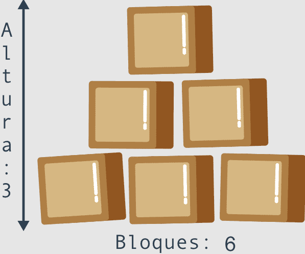

# Python Básico(2/2): Laboratorios prácticos

# Laboratorios:

### **LAB: Dando formato de salida**:

- **Explicación del lab**
    
    Te recomendamos encarecidamente que **juegues con el código** que hemos escrito para y realiza algunos (quizás incluso destructivos) cambios. Siéntete libre de modificar cualquier parte del código, pero hay una condición - aprende de tus errores y saca tus propias conclusiones.
    
    Intenta:
    
    - minimizar el número de invocaciones de la función **`print()`** insertando **`\n`** en las cadenas;
    - hacer que la flecha sea el doble de grande (pero mantener las proporciones)
    - duplica la flecha, colocando ambas flechas una al lado de la otra; nota: una cadena se puede multiplicar usando el siguiente truco: **`"string" * 2`** producirá **`"stringstring"`** (pronto contaremos más al respecto)
    - elimina cualquiera de las comillas y observe detenidamente la respuesta de Python; presta atención a dónde Python ve un error - ¿es este el lugar donde realmente existe el error?
    - haz lo mismo con algunos de los paréntesis;
    - cambia cualquiera de las palabras **`print`** por otra cosa, que difiera solo en mayúsculas y minúsculas (por ejemplo, **`Print`**) - qué sucede ahora?
    - reemplaza algunas de las comillas con apóstrofes; observa lo que sucede con cuidado.
- **Solución**
    
    ```python
    # Sample Solution
    
    ###################
    print("original version:")
    ###################
    print("    *")
    print("   * *")
    print("  *   *")
    print(" *     *")
    print("***   ***")
    print("  *   *")
    print("  *   *")
    print("  *****")
    ###################
    print("with fewer 'print()' invocations:")
    ###################
    print("    *\n   * *\n  *   *\n *     *\n***   ***")
    print("  *   *\n  *   *\n  *****")
    ###################
    print("higher:")
    ###################
    print("        *")
    print("       * *")
    print("      *   *")
    print("     *     *")
    print("    *       *")
    print("   *         *")
    print("  *           *")
    print(" *             *")
    print("******     ******")
    print("     *     *")
    print("     *     *")
    print("     *     *")
    print("     *     *")
    print("     *     *")
    print("     *     *")
    print("     *******")
    ###################
    print("doubled:")
    ###################
    print("        *        "*2)
    print("       * *       "*2)
    print("      *   *      "*2)
    print("     *     *     "*2)
    print("    *       *    "*2)
    print("   *         *   "*2)
    print("  *           *  "*2)
    print(" *             * "*2)
    print("******     ******"*2)
    print("     *     *     "*2)
    print("     *     *     "*2)
    print("     *     *     "*2)
    print("     *     *     "*2)
    print("     *     *     "*2)
    print("     *     *     "*2)
    print("     *******     "*2)
    ```
    

### **LAB: Convertidor simple**: 

- **Explicación del lab**
    
    Millas y kilómetros son unidades de longitud o distancia.
    
    Teniendo en mente que **`1`** milla equivale aproximadamente a **`1.61`** kilómetros, complementa el programa en el editor para que convierta de:
    
    - Millas a kilómetros;
    - Kilómetros a millas.
    
    No se debe cambiar el código existente. Escribe tu código en los lugares indicados con **`###`**. Prueba tu programa con los datos que han sido provistos en el código fuente.
    
    Pon mucha atención a lo que esta ocurriendo dentro de la función **`print()`**. Analiza como es que se proveen múltiples argumentos para la función, y como es que se muestra el resultado.
    
    Nota que algunos de los argumentos dentro de la función **`print()`** son cadenas (por ejemplo, **`"millas son"`**, y otros son variables (por ejemplo, **`miles`**).
    
    **Consejo**
    
    Hay una cosa interesante más que esta ocurriendo. ¿Puedes ver otra función dentro de la función **`print()`**? Es la función **`round()`**. Su trabajo es redondear la salida del resultado al número de decimales especificados en el paréntesis, y regresar un valor flotante (dentro de la función **`round()`** se puede encontrar el nombre de la variable, el nombre, una coma, y el número de decimales que se desean mostrar). Se hablará más de esta función muy pronto, no te preocupes si no todo queda muy claro. Solo se quiere impulsar tu curiosidad.
    

Solución:

```python
kilometers = 12.25
miles = 7.38

miles_to_kilometers = miles * 1.61
kilometers_to_miles = kilometers / 1.61

print(miles, "millas son", round(miles_to_kilometers, 2), "kilómetros")
print(kilometers, "kilómetros son", round(kilometers_to_miles, 2), "millas")
```

### **LAB: Operadores y expresiones**:

- **Explicación del lab**
    
    Observa el código en el editor: lee un valor **`float`**, lo coloca en una variable llamada **`x`**, e imprime el valor de la variable llamada **`y`**. Tu tarea es completar el código para evaluar la siguiente expresión:
    
    3x3 - 2x2 + 3x - 1
    
    El resultado debe ser asignado a **`y`**.
    
    Recuerda que la notación algebraica clásica muy seguido omite el operador de multiplicación, aquí se debe de incluir de manera explicita. Nota como se cambia el tipo de dato para asegurarnos de que **`x`** es del tipo **`float`**.
    
    Mantén tu código limpio y legible, y pruébalo utilizando los datos que han sido proporcionados. No te desanimes por no lograrlo en el primer intento. Se persistente y curioso.
    

Datos de prueba:

| Salida de muestra | Salida de muestra |
| --- | --- |
| x = 0 | y = -1.0
| x = 1 | y = 3.0
x = -1 | y = -9.0 


Solución:

```python
x =  0
x = float(x)
# Escribe tu código aquí.
y = 3 * (x ** 3) - 2 * (x ** 2) + 3 * x - 1

print("y =", y)
```

**Formulario básico con input()**:  

```python
# Opción 1
print("Ingresar nombre de usuario: ", end="")
name = input()
print("El usuario {} se ingresó correctamente.".format(name))

# Opción 2
name = input("ingresar nombre de usuario: ")
print("El usuario", name, "se ingresó correctamente.")
```

- **TIP (Terminar la sesión con ENTER)**
    
    Tip: la característica mencionada anteriormente de la función input() puede ser utilizada para pedirle al usuario que termine o finalice el programa. Observa el siguiente código:
    
    ```python
    name = input("Ingresa tu nombre: ")
    print("Hola, " + name + ". '¡Gusto en conocerte'!")
     
    print("\nPresiona Enter para terminar el programa.")
    input()
    print("FIN.")
    ```
    

**Calcular la hipotenusa**:

```python
cA = float(input("Ingrese la longitud del cateto A: "))
cb = float(input("Ingrese la longitud del cateto B: "))
h = (cA ** 2 + cB ** 2) ** .5

print("La longitud de la hipotenusa es: {:.2f}".format(round(h, 2)))
```

*En este caso, **`round(h, 2)`** redondea el valor de **`h`** a dos decimales, y la especificación **`:.2f`** dentro de las llaves de **`format()`** indica que el resultado se mostrará con dos decimales después del punto decimal.*

*Una forma común de calcular la raíz cuadrada de un número es elevando ese número a la potencia de 0.5. Por ejemplo, la raíz cuadrada de 9 se puede expresar como 9 ** 0.5, lo que da como resultado 3.*

**Dibujo de triángulo utilizando PRINT y bucle FOR**: 

Triángulo inverso:

```python
length = int(input("Ingrese la longitud deseada del triángulo(impar): ")) # Longitud de triángulo

print("+" + "-" * length + "+") # Base del triángulo

for i in range(length, 0, -2):
    spaces = (length - i) // 2 # Espacios para darle forma al triángulo
    print(" " * spaces + "|" + " " * i + "|" + " " * spaces) # Lados del triángulo
print(" " * spaces + " " + "|") # Top del triángulo
```

Triángulo normal:

```python
import math
length = int(input("Ingrese la longitud deseada del triángulo(impar): "))

top = math.ceil(length / 2)
print(" " * top + "|")

for i in range(1, length, 2):
    spaces = (length - i) // 2
    print(" " * spaces + "|" + " " * i + "|" + " " * spaces)

print("+" + "-" * length + "+")
```

Se usó la función ceil de la librería math para redondear un número al entero mayor más cercano.

### **LAB: Operadores y expresiones 2 (Calculadora de horas)**: 

- **Escenario**
    
    La tarea es preparar un código simple para evaluar o encontrar el **tiempo final** de un periodo de tiempo dado, expresándolo en horas y minutos. La hora de inicio se da como un par de horas (0..23) y minutos (0..59). El resultado debe ser mostrado en la consola.
    
    Por ejemplo, si el evento comienza a las **12:17** y dura **59 minutos**, terminará a las **13:16**.
    
    No te preocupes si tu código no es perfecto - está bien si acepta una hora invalida - lo más importante es que el código produzca una salida correcta acorde a la entrada dada.
    
    Prueba el código cuidadosamente. Pista: utilizar el operador % puede ser clave para el éxito.
    

Datos de prueba:

| Entrada de muestra | Salida esperada |
| --- | --- |
| 12, 17. 59 | 13:16 |
| 23, 58, 642 | 10:40 |
| 0, 1, 2939 | 1:0 |

Solución

```python
hour = int(input("Hora de inicio (horas): "))
mins = int(input("Minuto de inicio (minutos): "))
dura = int(input("Duración del evento (minutos) "))

# pasa de horas a minutos y suma sus minutos y duración del evento
total_min = hour * 60 + mins + dura

#pasa los minutos totales a horas
min_to_hrs = total_min // 60

# corrige los minutos para que estén en un rango de (0..59)
dura_min = total_min % 60

# corrige las horas para que estén en un rango de (0..23)
dura_hrs = min_to_hrs % 24

print("Hora de finalización: {}:{}".format(dura_hrs, dura_min))
```

**Encontrar el número más grande (con condicional: if)**: 

Suponemos que el primer valor es el más grande. Luego verificamos esta hipótesis con los dos valores restantes.

Observa el siguiente código:

```python
# Se leen tres números
number1 = int(input("Ingresa el primer número: "))
number2 = int(input("Ingresa el segundo número: "))
number3 = int(input("Ingresa el tercer número: "))
 
# Asumimos temporalmente que el primer número
# es el más grande.
# Lo verificaremos pronto.
largest_number = number1
 
# Comprobamos si el segundo número es más grande que el mayor número actual
# y actualiza el número más grande si es necesario.
if number2 > largest_number:
    largest_number = number2
 
# Comprobamos si el tercer número es más grande que el mayor número actual
# y actualiza el número más grande si es necesario.
if number3 > largest_number:
    largest_number = number3
 
# Imprime el resultado.
print("El número más grande es:", largest_number)
```

Este método es significativamente más simple que tratar de encontrar el número más grande comparando todos los pares de números posibles (es decir, el primero con el segundo, el segundo con el tercero y el tercero con el primero). Intenta reconstruir el código por ti mismo.

### **LAB: Operadores de comparación y ejecución condicional (Planta Espatifilo)**:

- **Escenario**
    
    [Espatifilo](https://upload.wikimedia.org/wikipedia/commons/b/bd/Spathiphyllum_cochlearispathum_RTBG.jpg), más comúnmente conocida como la planta de Cuna de Moisés o flor de la paz, es una de las plantas para interiores más populares que filtra las toxinas dañinas del aire. Algunas de las toxinas que neutraliza incluyen benceno, formaldehído y amoníaco.
    
    Imagina que tu programa de computadora ama estas plantas. Cada vez que recibe una entrada en forma de la palabra Espatifilo, grite involuntariamente a la consola la siguiente cadena: "¡Espatifilo es la mejor planta de todas!"
    
    Escribe un programa que utilice el concepto de ejecución condicional, tome una cadena como entrada y que:
    
    - imprima el enunciado "Si - ¡El Espatifilo! es la mejor planta de todos los tiempos!" en la pantalla si la cadena ingresada es "ESPATIFILIO" (mayúsculas)
    - imprima "No, ¡quiero un gran Espatifilo!" si la cadena ingresada es "espatifilo" (minúsculas)
    - imprima "¡Espatifilo!, ¡No [entrada]!" de lo contrario. Nota: [entrada] es la cadena que se toma como entrada.
    
    Prueba tu código con los datos que te proporcionamos. ¡Y hazte de un Espatifilo también!
    

Datos de prueba:

| Entrada de muestra | Salida esperada |
| --- | --- |
| espatifilo | No, ¡quiero un gran Espatifilo! |
| pelargonio | ¡Espatifilo!, ¡No pelargonio! |
| Espatifilo | Si, ¡El Espatifilo! es la mejor planta de todos los tiempos! |

Solución:

```python
plant = input("¿Cuál es la mejor planta? Respuesta: ")

if plant == "Espatifilo":
    print("Si, ¡El Espatifilo! es la mejor planta de todos los tiempos!")
elif plant == "espatifilo":
    print("No, ¡quiero un gran Espatifilo!")
else:
    print("¡Espatifilo!, ¡No {}!".format(plant))
```

### **LAB: Fundamentos de la sentencia if-else (Impuestos)**:

- **Escenario**
    
    Érase una vez una tierra de leche y miel - habitada por gente feliz y próspera. La gente pagaba impuestos, por supuesto - su felicidad tenía límites. El impuesto más importante, denominado *Impuesto Personal de Ingresos* (*IPI*, para abreviar) tenía que pagarse una vez al año y se evaluó utilizando la siguiente regla:
    
    - si el ingreso del ciudadano no era superior a 85,528 pesos, el impuesto era igual al 18% del ingreso menos 556 pesos y 2 centavos (esta fue la llamada *exención fiscal*).
    - si el ingreso era superior a esta cantidad, el impuesto era igual a 14,839 pesos y 2 centavos, más el 32% del excedente sobre 85,528 pesos.
    
    Tu tarea es escribir una **calculadora de impuestos**.
    
    - Debe aceptar un valor de punto flotante: el ingreso.
    - A continuación, debe imprimir el impuesto calculado, redondeado a pesos totales. Hay una función llamada round() que hará el redondeo por ti - la encontrarás en el código de esqueleto del editor.
    
    Nota: este país feliz nunca devuelve dinero a sus ciudadanos. Si el impuesto calculado es menor que cero, solo significa que no hay impuesto (el impuesto es igual a cero). Ten esto en cuenta durante tus cálculos.
    
    Observa el código en el editor - solo lee un valor de entrada y genera un resultado, por lo que debes completarlo con algunos cálculos inteligentes.
    
    Prueba tu código con los datos que hemos proporcionado.
    

Datos de prueba:

| Entrada de muestra | Salida esperada |
| --- | --- |
| 10000 | El impuesto es: 1244.0 pesos |
| 100000 | El impuesto es: 19470.0 pesos |
| 1000 | El impuesto es: 0.0 pesos |
| -100 | El impuesto es: 0.0 pesos |

Solución:

```python
income = float(input("Introduce el ingreso anual: "))

if income < 85528:
	tax = income * 0.18 - 556.02 # Impuesto para ingresos menores a 85528
else:
    tax = (income - 85528) * 0.32 + 14839.02 # Impuesto para el exedente de 85528

if tax < 0.0:
    tax = 0.0

tax = round(tax, 0)
print("El impuesto es:", tax, "pesos")
```

### **LAB: Fundamentos de la sentencia if-elif-else 2 (Tipo de año)**:

- **Escenario**
    
    Como seguramente sabrás, debido a algunas razones astronómicas, el año puede ser *bisiesto* o *común*. Los primeros tienen una duración de 366 días, mientras que los últimos tienen una duración de 365 días.
    
    Desde la introducción del calendario Gregoriano (en 1582), se utiliza la siguiente regla para determinar el tipo de año:
    
    - si el número del año no es divisible entre cuatro, es un *año común*.
    - de lo contrario, si el número del año no es divisible entre 100, es un *año bisiesto*.
    - de lo contrario, si el número del año no es divisible entre 400, es un *año común*.
    - de lo contrario, es un *año bisiesto*.
    
    Observa el código en el editor - solo lee un número de año y debe completarse con las instrucciones que implementan la prueba que acabamos de describir.
    
    El código debe mostrar uno de los dos mensajes posibles, que son Año Bisiesto o Año Común, según el valor ingresado.
    
    Sería bueno verificar si el año ingresado cae en la era Gregoriana y emitir una advertencia de lo contrario: No dentro del período del calendario Gregoriano. Consejo: utiliza los operadores != y %.
    
    Prueba tu código con los datos que hemos proporcionado.
    

Datos de prueba:

| Entrada de muestra | Salida esperada |
| --- | --- |
| 2000 | Año bisiesto |
| 2015 | Año comun |
| 1999 | Año comun |
| 1996 | Año bisiesto |
| 1580 | No dentro del período del calendario gregoriano |

Solución:

```python
year = int(input("Introduce un año: "))

if year < 1582:
	print("No esta dentro del período del calendario Gregoriano")
else:
    if year % 4 != 0:
        print("Año común")
    elif year % 100 != 0:
        print("Año bisiesto")
    elif year % 400 != 0:
        print("Año común")
    else:
        print("Año bisiesto")
```

**Encontrar el número más grande (con condicional if)**:

```python
var1 = int(input("Ingrese un número: "))
var2 = int(input("Ingrese un número: "))
var3 = int(input("Ingrese un número: "))

# Comprobar el número más grande
print("El número más grande es: " + str(max(var1, var2, var3)), end=" ")

if 0 < max(var1, var2, var3) < 75: # Comprobar valores de 0 a 75
    if 50 > max(var1, var2, var3) > 25: # Comprobar valores de 25 a 50
        print("y es mayor que 25 y menor que 50")
    elif 50 <= max(var1, var2, var3) < 75: # Comprobar valores de 50 a 75
        print("y es mayor o igual a 50 y menor que 75")
    else:
        print("y es menor que 25")

else:
    print("\nERROR: número debe ser mayor que 0 y menor que 75")
```

**EJEMPLO: Bucle infinito (Número más grande)**:

```python
# Almacena el actual número más grande aquí.
largest_number = -999999999
 
# Ingresa el primer valor.
number = int(input("Introduce un número o escribe -1 para detener: "))
 
# Si el número no es igual a -1, continuaremos
while number != -1:
    # ¿Es el número más grande que el valor de largest_number?
    if number > largest_number:
        # Sí si, se actualiza largest_number.
        largest_number = number
    # Ingresa el siguiente número.
    number = int(input("Introduce un número o escribe -1 para detener: "))
 
# Imprime el número más grande.
print("El número más grande es:", largest_number)
```

**EJEMPLO: Bucle infinito (Números pares e impares)**:

```python
# Un programa que lee una secuencia de números
# y cuenta cuántos números son pares y cuántos son impares.
# El programa termina cuando se ingresa un cero.
 
odd_numbers = 0
even_numbers = 0
 
# Lee el primer número.
number = int(input("Introduce un número o escribe 0 para detener: "))
 
# 0 termina la ejecución.
while number != 0:
    # Verificar si el número es impar.
    if number % 2 == 1:
        # Incrementar el contador de números impares odd_numbers.
        odd_numbers += 1
    else:
        # Incrementar el contador de números pares even_numbers.
        even_numbers += 1
    # Leer el siguiente número.
    number = int(input("Introduce un número o escribe 0 para detener: "))
 
# Imprimir resultados.
print("Conteo de números impares:", odd_numbers)
print("Conteo de números pares:", even_numbers)
```

Ciertas expresiones se pueden simplificar sin cambiar el comportamiento del programa.

Intenta recordar cómo Python interpreta la verdad de una condición y ten en cuenta que estas dos formas son equivalentes:

`**while number != 0:**` y **`while number:`**.

La condición que verifica si un número es impar también puede codificarse en estas formas equivalentes:

`**if number % 2 == 1:**` y **`if number % 2:`**.

**EJEMPLO: Empleando una variable counter para salir del bucle**: 

Observa el fragmento de código a continuación:

```python
counter = 5
while counter != 0:
    print("Dentro del bucle.", counter)
    counter -= 1
print("Fuera del bucle.", counter)
```

Este código está destinado a imprimir la cadena "Dentro del bucle." y el valor almacenado en la variable counter durante un bucle dado exactamente cinco veces. Una vez que la condición se haya cumplido (la variable counter ha alcanzado 0), se sale del bucle y aparece el mensaje "Fuera del bucle." así como tambien el valor almacenado en counter se imprime.

Pero hay una cosa que se puede escribir de forma más compacta - la condición del bucle while.

¿Puedes ver la diferencia?

```python
counter = 5
while counter:
    print("Dentro del bucle.", counter)
    counter -= 1
print("Fuera del bucle.", counter)
```

¿Es más compacto que antes? Un poco. ¿Es más legible? Eso es discutible.

*No te sientas obligado a codificar tus programas de una manera que siempre sea la más corta y la más compacta. La legibilidad puede ser un factor más importante. Manten tu código listo para un nuevo programador.*

### **LAB: Adivina el número secreto**:

- **Escenario**
    
    Un mago junior ha elegido un número secreto. Lo ha escondido en una variable llamada secret_number. Quiere que todos los que ejecutan su programa jueguen el juego *Adivina el número secreto*, y adivina qué número ha elegido para ellos. ¡Quiénes no adivinen el número quedarán atrapados en un bucle sin fin para siempre! Desafortunadamente, él no sabe cómo completar el código.
    
    Tu tarea es ayudar al mago a completar el código en el editor de tal manera que el código:
    
    - pedirá al usuario que ingrese un número entero;
    - utilizará un bucle while;
    - comprobará si el número ingresado por el usuario es el mismo que el número escogido por el mago. Si el número elegido por el usuario es diferente al número secreto del mago, el usuario debería ver el mensaje "¡Ja, ja! ¡Estás atrapado en mi bucle!" y se le solicitará que ingrese un número nuevamente. Si el número ingresado por el usuario coincide con el número escogido por el mago, el número debe imprimirse en la pantalla, y el mago debe decir las siguientes palabras: "¡Bien hecho, muggle! Eres libre ahora."
    
    ¡El mago está contando contigo! No lo decepciones.
    
    **INFO EXTRA**
    
    Por cierto, observa la función print(). La forma en que lo hemos utilizado aquí se llama *impresión multilínea*. Puedes utilizar **comillas triples** para imprimir cadenas en varias líneas para facilitar la lectura del texto o crear un diseño especial basado en texto. Experimenta con ello.
    

Solución:

```python
secret_number = 777

print(
"""
+================================+
| ¡Bienvenido a mi juego, muggle!|
| Introduce un número entero     |
| y adivina qué número he        |
| elegido para ti.               |
|¿Cuál es el número secreto?     |
+================================+
""")

def lose():
    print("\n¡Ja, ja! ¡Te has quedado sin vidas!")

hearts = 5

print("Vidas: " + "❤ " * hearts) # Mostrar barra de vida

number = int(input("- El número es: "))

# Si el usuario falla el número quedará atrapado en el bucle y perderá una vida por
# cada respuesta incorrecta, en total tiene 5 vidas.
while number != 777:
    hearts -= 1
    print("Vidas: " + "❤ " * hearts)
    if hearts:
       if number != 777:
           print("\n¡Ja, ja! ¡Estás atrapado en mi bucle!")
           number = int(input("- El número es: "))
       else:
           print("¡Bien hecho, muggle! Eres libre ahora.")
           break
    else:
        lose()
        break

if number == 777:
    print("\n¡Bien hecho, muggle! Eres libre ahora.")
```

**EJEMPLO: Código para mostrar las primeras potencias de 2**:

```python
power = 1
for expo in range(16):
    print("2 a la potencia de", expo, "es", power)
    power *= 2
```

La variable expo se utiliza como una variable de control para el bucle e indica el valor actual del *exponente*. La propia exponenciación se sustituye multiplicando por dos. Dado que 2 0 es igual a 1, después 2 × 1 es igual a 21, 2 × 21 es igual a 22, y así sucesivamente.

**EJEMPLO: Bucle “for” contando lentamente (mississippily)**:

- **Escenario**
    
    ¿Sabes lo que es Mississippi? Bueno, es el nombre de uno de los estados y ríos en los Estados Unidos. El río Mississippi tiene aproximadamente 2,340 millas de largo, lo que lo convierte en el segundo río más largo de los Estados Unidos (el más largo es el río Missouri). ¡Es tan largo que una sola gota de agua necesita 90 días para recorrer toda su longitud!
    
    La palabra *Mississippi* también se usa para un propósito ligeramente diferente: para *contar mississippily (mississippimente)*.
    
    Si no estás familiarizado con la frase, estamos aquí para explicarte lo que significa: se utiliza para contar segundos.
    
    La idea detrás de esto es que agregar la palabra *Mississippi* a un número al contar los segundos en voz alta hace que suene más cercano al reloj, y por lo tanto "un Mississippi, dos Mississippi, tres Mississippi" tomará aproximadamente unos tres segundos reales de tiempo. A menudo lo usan los niños que juegan al escondite para asegurarse de que el buscador haga un conteo honesto.
    
    Tu tarea es muy simple aquí: escribe un programa que use un bucle for para "contar de forma mississippi" hasta cinco. Habiendo contado hasta cinco, el programa debería imprimir en la pantalla el mensaje final "¡Listos o no, ahí voy!"
    

| Salida esperada |
| --- |
| 1 Mississippi
| 2 Mississippi
| 3 Mississippi
| 4 Mississippi
| 5 Mississippi |

Solución:

```python
import time

# Escribe un bucle for que cuente hasta cinco.
for i in range(5):
    print(str(i) + " Mississippi")
    time.sleep(1)

# Escribe una función print con el mensaje final.
print("¡Listos o no, ahí voy!")
```

### **LAB: La sentencia continue – el Feo Devorador de Vocales**:

- **Escenario**
    
    La sentencia continue se usa para omitir el bloque actual y avanzar a la siguiente iteración, sin ejecutar las sentencias dentro del bucle.
    
    Se puede usar tanto con bucles while y for.
    
    Tu tarea aquí es muy especial: ¡Debes diseñar un devorador de vocales! Escribe un programa que use:
    
    - un bucle for;
    - el concepto de ejecución condicional (*if-elif-else*).
    - la sentencia continue.
    
    Tu programa debe:
    
    - pedir al usuario que ingrese una palabra.
    - utiliza  para convertir la palabra ingresada por el usuario a mayúsculas; hablaremos sobre los llamados **métodos de cadena** y el método upper() muy pronto, no te preocupes
        
        user_word = user_word.upper()
        
    - utiliza la ejecución condicional y la instrucción continue para "devorar" las siguientes vocales *A*, *E*, *I*, *O*, *U* de la palabra ingresada.
    - imprime las letras no consumidas en la pantalla, cada una de ellas en una línea separada

Datos de prueba:

| Entrada de muestra | Salida esperada |
| --- | --- |
| Gregory | G
||R
||G
||R
||Y |
|
| abstemious | B
||S
||T
||M
||S |
|
| IOUEA |  |

Solución:

```python
# Indicar al usuario que ingrese una palabra
# y asignarlo a la variable user_word.
user_word = input("Ingrese una palabra: ")
user_word = user_word.upper()

for letter in user_word:
    if letter == "A":
        continue
    elif letter == "E":
        continue
    elif letter == "I":
        continue
    elif letter == "O":
        continue
    elif letter == "U":
        continue
    else:
        print(letter)
```

### **LAB: La sentencia continue – el Lindo Devorador de Vocales**:

- **Escenario**
    
    Tu tarea aquí es aún más especial que antes: ¡Debes rediseñar el devorador de vocales (feo) del laboratorio anterior y crear un mejor devorador de vocales (lindo) mejorado! Escribe un programa que use:
    
    - un bucle for.
    - el concepto de ejecución condicional (*if-elif-else*).
    - la instrucción continue.
    
    Tu programa debe:
    
    - pedir al usuario que ingrese una palabra.
    - utilizar  para convertir la palabra ingresada por el usuario a mayúsculas; hablaremos sobre los llamados **métodos de cadena** y el upper() muy pronto, no te preocupes.
        
        user_word = user_word.upper()
        
    - emplea la ejecución condicional y la instrucción continue para "devorar" las siguientes vocales *A* , *E* , *I* , *O* , *U* de la palabra ingresada.
    - asigna las letras no consumidas a la variable word_without_vowels e imprime la variable en la pantalla.
    
    Analiza el código en el editor. Hemos creado word_without_vowels y le hemos asignado una cadena vacía. Utiliza la operación de concatenación para pedirle a Python que combine las letras seleccionadas en una cadena más larga durante los siguientes giros de bucle, y asignarlo a la variable word_without_vowels.
    

Datos de prueba:

| Entrada de muestra | Salida esperada |
| --- | --- |
| Gregory | GRGRY |
| abstemious | BSTMS |
| IOUEA |  |

Solución:

```python
word_without_vowels = ""

# Indicar al usuario que ingrese una palabra
# y asignarla a la variable user_word.
user_word = input("Ingrese una palabra: ")
user_word = user_word.upper()

for letter in user_word:
    if letter == "A":
        continue
    elif letter == "E":
        continue
    elif letter == "I":
        continue
    elif letter == "O":
        continue
    elif letter == "U":
        continue
    else:
        word_without_vowels += letter

# Imprimir la palabra asignada a word_without_vowels.
print(word_without_vowels)
```

### **LAB: Fundamentos del bucle while**: 

- **Escenario**
    
    Escucha esta historia: Un niño y su padre, un programador de computadoras, juegan con bloques de madera. Están construyendo una pirámide.
    
    Su pirámide es un poco rara, ya que en realidad es una pared en forma de pirámide - es plana. La pirámide se apila de acuerdo con un principio simple: cada capa inferior contiene un bloque más que la capa superior.
    
    La figura ilustra la regla utilizada por los constructores:
    
    
    
    Tu tarea es escribir un programa que lea la cantidad de bloques que tienen los constructores, y generar la altura de la pirámide que se puede construir utilizando estos bloques.
    
    Nota: La altura se mide por el número de **capas completas** - si los constructores no tienen la cantidad suficiente de bloques y no pueden completar la siguiente capa, terminan su trabajo inmediatamente.
    

Datos de prueba:

| Datos de entrada | Salida esperada |
| --- | --- |
| 6 | La altura de la pirámide: 3 |
| 20 | La altura de la pirámide: 5 |
| 1000 | La altura de la pirámide: 44 |
| 2 | La altura de la pirámide: 1 |

Solución:

```python
height = int()
placed_blocks = int()
block = int()
blocks = int(input("Ingresa el número de bloques: "))

# Se irán contando y sumando los bloques empezando desde uno, es decir, 
# de arriba hacia abajo de la pirámide hasta que la cantidad de bloques
# sea igual o menor a la cantidad de bloques especificada por el usuario.
while block < 9999:
    block += 1 # Conteo de bloques (1, 2, 3, ...)

		# Comprobar la cantidad de bloques actuales con los restantes
    if (placed_blocks + block) > blocks:
        surplus_blocks = blocks - placed_blocks # Calcular los bloques resultantes
        break
    else:
        placed_blocks += block # Se añaden los bloques disponibles a la pirámide
        height += 1 # Cada iteración será igual a 1+ de altura para la pirámide.

print("La altura de la pirámide:", height)
print("Bloques usados:", placed_blocks)
print("Bloques sobrantes:", surplus_blocks)
```

- **Solución con función “for”**
    
    Solución con función “for”:
    
    ```python
    height = int()
    placed_blocks = int()
    blocks = int(input("Ingresa el número de bloques: "))
    
    for block in range(1, 9999):
        if (placed_blocks + block) > blocks:
            surplus_blocks = blocks - placed_blocks
            break
        else:
            placed_blocks += block
            height += 1
    
    print("La altura de la pirámide:", height)
    print("Bloques usados:", placed_blocks)
    print("Bloques sobrantes:", surplus_blocks)
    ```
    

### **LAB: La hipótesis de Collatz**:

- **Escenario**
    
    En 1937, un matemático alemán llamado Lothar Collatz formuló una hipótesis intrigante (aún no se ha comprobado) que se puede describir de la siguiente manera:
    
    1. toma cualquier número entero que no sea negativo y que no sea cero y asígnale el nombre c0;
    2. si es par, evalúa un nuevo c0 como c0 ÷ 2;
    3. de lo contrario, si es impar, evalúe un nuevo c0 como 3 × c0 + 1;
    4. si c0 ≠ 1, salta al punto 2.
    
    La hipótesis dice que, independientemente del valor inicial de c0, el valor siempre tiende a 1.
    
    Por supuesto, es una tarea extremadamente compleja usar una computadora para probar la hipótesis de cualquier número natural (incluso puede requerir inteligencia artificial), pero puede usar Python para verificar algunos números individuales. Tal vez incluso encuentres el que refutaría la hipótesis.
    
    Escribe un programa que lea un número natural y ejecute los pasos anteriores siempre que c0 sea diferente de 1. También queremos que cuente los pasos necesarios para lograr el objetivo. Tu código también debe mostrar todos los valores intermedios de c0.
    
    Sugerencia: la parte más importante del problema es como transformar la idea de Collatz en un bucle while- esta es la clave del éxito.
    
- **Datos de prueba**
    
    Datos de prueba:
    
    | Datos de entrada | Salida esperada |
    | --- | --- |
    | 15 | 46
    ||46
    ||70
    ||35
    ||106
    ||53
    ||160
    ||80
    ||40
    ||20
    ||10
    ||5
    ||16
    ||8
    ||4
    ||2
    ||1
    ||pasos = 17 |
    |
    | 16 | 8
    ||4
    ||2
    ||1
    ||pasos = 4 |
    |
    | 1023 | 3070
    ||1535
    ||4606
    ||2303
    ||6910
    ||3455
    ||10366
    ||5183
    ||15550
    ||7775
    ||23326
    ||11663
    ||34990
    ||17495
    ||52486
    ||26243
    ||78730
    ||39365
    ||118096
    ||59048
    ||29524
    ||14762
    ||7381
    ||22144
    ||11072
    ||5536
    ||2768
    ||1384
    ||692
    ||346
    ||173
    ||173
    ||260
    ||130
    ||65
    ||196
    ||98
    ||49
    ||148
    ||74
    ||37
    ||37
    ||56
    ||28
    ||14
    ||7
    ||22
    ||11
    ||34
    ||17
    ||52
    ||26
    ||13
    ||40
    ||20
    ||10
    ||5
    ||16
    ||8
    ||4
    ||2
    ||pasos = 62 |
    

Solución:

```python
c0 = int(input("Ingrese un número [ingrese -1 para salir]: "))
steps = int()

while c0 != -1:
    if c0 > 0:
        while c0 != 1:
            if c0 % 2 == 0: # Verificar si es número par
                c0 //= 2
                steps += 1
                print(c0)
            else: # De lo contrario, es inpar
                c0 = 3 * c0 + 1
                steps += 1
                print(c0)
        else:
            print("pasos =", steps)
            steps = int(0)
            c0 = int(input("\nIngrese un número [ingrese -1 para salir]: "))
```

**EJEMPLO: Sustituir cadenas con continue**: 

Crea un programa con un bucle for y una sentenciacontinue. El programa debe iterar sobre una cadena de dígitos, reemplazar cada 0 con x, e imprimir la cadena modificada en la pantalla:

```python
for digit in "0165031806510":
    if digit == "0":
        print("x", end="")
        continue
    print(digit, end="")
```

### **LAB: Fundamentos de las listas**:

- **Escenario**
    
    Había una vez un sombrero. El sombrero no contenía conejo, sino una lista de cinco números: 1, 2, 3, 4, y 5.
    
    Tu tarea es:
    
    - escribir una línea de código que solicite al usuario que reemplace el número central en la lista con un número entero ingresado por el usuario (Paso 1)
    - escribir una línea de código que elimine el último elemento de la lista (Paso 2)
    - escribir una línea de código que imprima la longitud de la lista existente (Paso 3).
    
    ¿Listo para este desafío?
    
- **Solución**
    
    ```python
    import math, time
    
    hat_list = [1, 2, 3, 4, 5]  # Esta es una lista existente de números ocultos en el sombrero.
    
    # Paso 1: escribe una línea de código que solicite al usuario
    # reemplazar el número de en medio con un número entero ingresado por el usuario.
    #replace = input("Reemplazar el número central de la lista con el siguiente valor: ")
    print("Lista actual:", hat_list)
    central = len(hat_list) / 2 # Obtener el valor central de la lista
    central = math.ceil(central) - 1 # Luego se redondea al número superior
    hat_list[central] = int(input("Reemplazar elemento central ({}) con el siguiente número: ".format(central)))
    print("Elemento reemplazado exitosamente.")
    print("Lista actual:", hat_list)
    
    # Paso 2: escribe aquí una línea de código que elimine el último elemento de la lista.
    time.sleep(2)
    print("Se procede a eliminar el último elemento de la lista...")
    time.sleep(2)
    del hat_list[-1]
    print("Elemento eliminado exitosamente")
    print("Lista actual:", hat_list)
    
    # Paso 3: escribe aquí una línea de código que imprima la longitud de la lista existente.
    
    print("Longitud de la lista:", len(hat_list))
    ```
    

### **LAB: Los fundamentos de las listas: los Beatles**:

- **Escenario**
    
    Los Beatles fueron uno de los grupos de música más populares de la década de 1960 y la banda más vendida en la historia. Algunas personas los consideran el acto más influyente de la era del rock. De hecho, se incluyeron en la compilación de la revista *Time* de las 100 personas más influyentes del siglo XX.
    
    La banda sufrió muchos cambios de formación, que culminaron en 1962 con la formación de John Lennon, Paul McCartney, George Harrison y Richard Starkey (mejor conocido como Ringo Starr).
    
    Escribe un programa que refleje estos cambios y le permita practicar con el concepto de listas. Tu tarea es:
    
    - paso 1: crea una lista vacía llamada beatles;
    - paso 2: emplea el método append() para agregar los siguientes miembros de la banda a la lista: John Lennon, Paul McCartney y George Harrison;
    - paso 3: emplea el buclefor y el append() para pedirle al usuario que agregue los siguientes miembros de la banda a la lista: Stu Sutcliffe, y Pete Best;
    - paso 4: usa la instrucción del para eliminar a Stu Sutcliffe y Pete Best de la lista;
    - paso 5: usa el método insert() para agregar a Ringo Starr al principio de la lista.
    
    Por cierto, ¿eres fan de los Beatles? (Los Beatles son una de las bandas favoritas de Greg. Pero espera...¿Quién es Greg?)
    

Solución:

```python
import time

# paso 1
beatles = []
print("Paso 1:", beatles)

# paso 2
print("Añadiendo a John Lennon, Paul McCartney y George Harrison...")
beatles.append('John Lennon')
beatles.append('Paul McCartney')
beatles.append('George Harrison')
time.sleep(3)
print("Paso 2:", beatles)

# paso 3
time.sleep(1)
for singer in beatles:
    if "John Lennon" and "Paul McCartney" and "George Harrison":
        quest = input("¿Agregar a Stu Sutcliffe a la banda? [Sí]: ")
        if quest == "Sí":
            beatles.append('Stu Sutcliffe')

        quest = input("¿Agregar a Pete Best a la banda? [Sí]: ")
        if quest == "Sí":
            beatles.append('Pete Best')
            print("Agregados exitosamente")
            break
print("Paso 3:", beatles)

# paso 4
time.sleep(3)
delete = input("¿Quieres eliminar a Stu Sutcliffe y Pete Best? [Sí]: ")
if delete == "Sí":
    del beatles[4]
    del beatles[3]
print("Eliminados exitosamente")
print("Paso 4:", beatles)

# paso 5
print("Añadiendo a Ringo Starr...")
beatles.insert(0, 'Ringo Starr')
time.sleep(3)
print("Paso 5:", beatles)

# probando la longitud de la lista
print("Los Fav", len(beatles))
print("FIN")
```

### **LAB: Operaciones con listas: conceptos básicos**:

- **Escenario**
    
    Imagina una lista - no muy larga ni muy complicada, solo una lista simple que contiene algunos números enteros. Algunos de estos números pueden estar repetidos, y esta es la clave. No queremos ninguna repetición. Queremos que sean eliminados.
    
    Tu tarea es escribir un programa que elimine todas las repeticiones de números de la lista. El objetivo es tener una lista en la que todos los números aparezcan no más de una vez.
    
    Nota: Asume que la lista original está ya dentro del código - no tienes que ingresarla desde el teclado. Por supuesto, puedes mejorar el código y agregar una parte que pueda llevar a cabo una conversación con el usuario y obtener todos los datos.
    
    Sugerencia: Te recomendamos que crees una nueva lista como área de trabajo temporal - no necesitas actualizar la lista actual.
    
    No hemos proporcionado datos de prueba, ya que sería demasiado fácil. Puedes usar nuestro esqueleto en su lugar.
    

Solución:

```python
my_list = [1, 3, 2, 4, 4, 1, 4, 2, 6, 2, 9]

repeated = []
unique = []

for number in my_list:
    if number in unique:
        repeated.append(number)
    else:
        unique.append(number)
    
    
print("La lista completa", my_list)
print("\n\tLa lista con elementos únicos:", unique)
print("\tLa lista con elementos repetidos:", repeated)
```

### **LAB: Un año bisiesto: escribiendo tus propias funciones**:

- **Escenario**
    
    Tu tarea es escribir y probar una función que toma un argumento (un año) y devuelve True si el año es un *año bisiesto*, o False si no lo es.
    
    Parte del esqueleto de la función ya está en el editor.
    
    Nota: también hemos preparado un breve código de prueba, que puedes utilizar para probar tu función.
    
    El código utiliza dos listas - una con los datos de prueba y la otra con los resultados esperados. El código te dirá si alguno de tus resultados no es válido.
    

Solución:

```python
def is_year_leap(year):
    if year < 1582:
        print("No está dentro del periodo del calendario Gregoriano.")
        return False
    else:
        if year % 4 != 0:
            #Año común
            return False
        elif year % 100 != 0:
            #Año bisiesto
            return True
        elif year % 400 != 0:
            #Año común
            return False
        else:
            #Año bisiesto
            return True

test_data = [1900, 2000, 2016, 1987]
test_results = [False, True, True, False]
for i in range(len(test_data)):
    yr = test_data[i]
    print(yr,"->",end="")
    result = is_year_leap(yr)
    if result == test_results[i]:
        print("OK")
    else:
        print("Fallido")
```

### **LAB: Cuántos días: escribiendo y usando tus propias funciones**:

- **Escenario**
    
    Tu tarea es escribir y probar una función que toma dos argumentos (un año y un mes) y devuelve el número de días del mes/año dado (mientras que solo febrero es sensible al valor year, tu función debería ser universal).
    
    La parte inicial de la función está lista. Ahora, haz que la función devuelva None si los argumentos no tienen sentido.
    
    Por supuesto, puedes (y debes) utilizar la función previamente escrita y probada (LAB 4.3.1.6). Puede ser muy útil. Te recomendamos que utilices una lista con los meses. Puedes crearla dentro de la función - este truco acortará significativamente el código.
    

Solución:

```python
def is_year_leap(year):
    if year % 4 != 0:
        return False
    elif year % 100 != 0:
        return True
    elif year % 400 != 0:
        return False
    else:
        return True

def days_in_month(year,month):
    if year < 1582 or month < 1 or month > 12:
        return None
    days = [31, 28, 31, 30, 31, 30, 31, 31, 30, 31, 30, 31]
    res  = days[month - 1]
    if month == 2 and is_year_leap(year):
        res = 29
    return res

test_years = [1900, 2000, 2016, 1987, 1459]
test_months = [ 2, 2, 1, 11, 23]
test_results = [28, 29, 31, 30, -2]
for i in range(len(test_years)):
    yr = test_years[i]
    mo = test_months[i]
    print(yr,mo,"-> ",end="")
    result = days_in_month(yr, mo)
    if result == test_results[i]:
        print("OK")
    else:
        print("Fallido")
```

### **LAB: Día del año: escribiendo y usando tus propias funciones**:

- **Escenario**
    
    Tu tarea es escribir y probar una función que toma tres argumentos (un año, un mes y un día del mes) y devuelve el día correspondiente del año, o devuelve None si cualquiera de los argumentos no es válido.
    
    Debes utilizar las funciones previamente escritas y probadas. Agrega algunos casos de prueba al código. Esta prueba es solo el comienzo.
    

Solución:

```python
def is_year_leap(year):
    if year % 4 != 0:
        return False
    elif year % 100 != 0:
        return True
    elif year % 400 != 0:
        return False
    else:
        return True

def days_in_month(year, month):
    if year < 1582 or month < 1 or month > 12:
        return None
    days = [31, 28, 31, 30, 31, 30, 31, 31, 30, 31, 30, 31]
    res  = days[month - 1]
    if month == 2 and is_year_leap(year):
        res = 29
    return res

def day_of_year(year, month, day):
    days = 0
    for m in range(1, month):
        md = days_in_month(year, m)
        if md == None:
            return None
        days += md
    md = days_in_month(year, month)
    if day >= 1 and day <= md:
        return days + day
    else:
        return None

print(day_of_year(2023, 5, 31))
```

### **LAB: Números primos - cómo encontrarlos**:

- **Escenario**
    
    *Un número natural es **primo** si es mayor que 1 y no tiene divisores más que 1 y si mismo.*
    
    ¿Complicado? De ningúna manera. Por ejemplo, 8 no es un número primo, ya que puedes dividirlo entre 2 y 4 (no podemos usar divisores iguales a 1 y 8, ya que la definición lo prohíbe).
    
    Por otra parte, 7 es un número primo, ya que no podemos encontrar ningún divisor para el.
    
    Tu tarea es escribir una función que verifique si un número es primo o no.
    
    La función:
    
    - se llama is_prime;
    - toma un argumento (el valor a verificar)
    - devuelve True si el argumento es un número primo, y False de lo contrario.
    
    Sugerencia: intenta dividir el argumento por todos los valores posteriores (comenzando desde 2) y verifica el resto - si es cero, tu número no puede ser un número primo; analiza cuidadosamente cuándo deberías detener el proceso.
    
    Si necesitas conocer la raíz cuadrada de cualquier valor, puedes utilizar el operador **. Recuerda: la raíz cuadrada de x es lo mismo que x0.5.
    
    Complementa el código en el editor.
    
    Ejecuta tu código y verifica si tu salida es la misma que la nuestra.
    

Salida esperada: 2 3 5 7 11 13 17 19

Solución:

```python
def is_prime(num):
    for i in range(2, int(1 + num ** 0.5)):
        if num % i == 0:
            return False
    return True

for i in range(1, 20):
    if is_prime(i + 1):
        print(i + 1, end=" ")
print()
```

### **LAB: Conversión del consumo de combustible**:

- **Escenario**
    
    El consumo de combustible de un automóvil se puede expresar de muchas maneras diferentes. Por ejemplo, en Europa, se muestra como la cantidad de combustible consumido por cada 100 kilómetros.
    
    En los EE. UU., se muestra como la cantidad de millas recorridas por un automóvil con un galón de combustible.
    
    Tu tarea es escribir un par de funciones que conviertan l/100km a mpg (milas por galón), y viceversa.
    
    Las funciones:
    
    - se llaman liters_100km_to_miles_gallon y miles_gallon_to_liters_100km respectivamente;
    - toman un argumento (el valor correspondiente a sus nombres)
    
    Complementa el código en el editor y ejecuta tu código y verifica si tu salida es la misma que la nuestra.
    
    Aquí hay información para ayudarte:
    
    - 1 milla = 1609.344 metros.
    - 1 galón = 3.785411784 litros.

Salida esperada:

```python
60.31143162393162
31.36194444444444
23.52145833333333
3.9007393587617467
7.490910297239916
10.009131205673757
```

Solución:

```python
# 1 milla = 1609.344 metros.
# 1 galón = 3.785411784 litros.

def liters_100km_to_miles_gallon(liters):
    gallons = liters / 3.785411784
    miles = 100 * 1000 / 1609.344
    return miles / gallons

def miles_gallon_to_liters_100km(miles):
    km100 = miles * 1609.344 / 1000 / 100
    liters = 3.785411784
    return liters / km100

print(liters_100km_to_miles_gallon(3.9))
print(liters_100km_to_miles_gallon(7.5))
print(liters_100km_to_miles_gallon(10.))
print(miles_gallon_to_liters_100km(60.3))
print(miles_gallon_to_liters_100km(31.4))
print(miles_gallon_to_liters_100km(23.5))
```

**EJEMPLO: Las tuplas y los diccionarios pueden trabajar juntos (Promedio de estudiantes)**:

- **Escenario**
    
    Se ha preparado un ejemplo sencillo, mostrando como las tuplas y los diccionarios pueden trabajar juntos.
    
    Imaginemos el siguiente problema:
    
    - necesitas un programa para calcular los promedios de tus alumnos;
    - el programa pide el nombre del alumno seguido de su calificación;
    - los nombres son ingresados en cualquier orden;
    - el ingresar un nombre vacío finaliza el ingreso de los datos (Nota 1: ingresar una puntuación vacía generará la excepción ValueError, pero no te preocupes por eso ahora, verás cómo manejar tales casos cuando hablemos de excepciones en el segundo parte de la serie del curso Fundamentos de Python)
    - una lista con todos los nombre y el promedio de cada alumno debe ser mostrada al final.
    
    Observa el código en el editor, se muestra la solución.
    
- **Datos de prueba**
    ```python
    Ingresa el nombre del estudiante: Bob
    
    Ingresa la calificación del estudiante (0-10): 7
    
    Ingresa el nombre del estudiante: Andy
    
    Ingresa la calificación del estudiante (0-10): 3
    
    Ingresa el nombre del estudiante: Bob
    
    Ingresa la calificación del estudiante (0-10): 2
    
    Ingresa el nombre del estudiante: Andy
    
    Ingresa la calificación del estudiante (0-10): 10
    
    Ingresa el nombre del estudiante: Andy
    
    Ingresa la calificación del estudiante (0-10): 3
    
    Ingresa el nombre del estudiante: Bob
    
    Ingresa la calificación del estudiante (0-10): 9
    
    Ingresa el nombre del estudiante:
    
    Andy : 5.333333333333333
    
    Bob : 6.0
    ```
    
- **Explicación de la solución del código**
    
    Ahora se analizará línea por línea:
    
    - **línea 1**: crea un diccionario vacío para ingresar los datos; el nombre del alumno es empleado como clave, mientras que todas las calificaciones asociadas son almacenadas en una tupla (la tupla puede ser el valor de un diccionario, esto no es un problema)
    - **línea 3**: se ingresa a un bucle "infinito" (no te preocupes, saldrémos de el en el momento indicado)
    - **línea 4**: se lee el nombre del alumno aquí;
    - **línea 5-6**: si el nombre es una cadena vacía (), salimos del bucle;
    - **línea 8**: se pide la calificación del estudiante (un valor entero en el rango del 0-10)
    - **línea 9-10**: si la puntuación ingresada no está dentro del rango de 0 a 10, se abandona el bucle;
    - **línea 12-13**: si el nombre del estudiante ya se encuentra en el diccionario, se alarga la tupla asociada con la nueva calificación (observa el operador +=)
    - **línea 14-15**: si el estudiante es nuevo (desconocido para el diccionario), se crea una entrada nueva, su valor es una tupla de un solo elemento la cual contiene la calificación ingresada;
    - **línea 17**: se itera a través de los nombres ordenados de los estudiantes;
    - **línea 18-19**: inicializa los datos necesarios para calcular el promedio (sum y counter).
    - **línea 20-22**: se itera a través de la tupla, tomado todas las calificaciones subsecuentes y actualizando la suma junto con el contador.
    - **línea 23**: se calcula e imprime el promedio del alumno junto con su nombre.
    
    Este es un ejemplo del programa:
    

Solución:

```python
school_class = {}

while True:
    name = input("Ingresa el nombre del estudiante: ")
    if name == '':
        break
    
    score = int(input("Ingresa la calificación del estudiante (0-10): "))
    if score not in range(0, 11):
	    break
    
    if name in school_class:
        school_class[name] += (score,)
    else:
        school_class[name] = (score,)
        
for name in sorted(school_class.keys()):
    adding = 0
    counter = 0
    for score in school_class[name]:
        adding += score
        counter += 1
    print(name, ":", adding / counter)
```

**PROYECTO: TIC TAC TOE**:

- **Escenario**
    
    Tu tarea es escribir **un simple programa que simule jugar a *tic-tac-toe* (nombre en inglés) con el usuario**. Para hacerlo más fácil, hemos decidido simplificar el juego. Aquí están nuestras reglas:
    
    - la maquina (por ejemplo, el programa) jugará utilizando las 'X's;
    - el usuario (por ejemplo, tu) jugarás utilizando las 'O's;
    - el primer movimiento es de la maquina - siempre coloca una 'X' en el centro del tablero;
    - todos los cuadros están numerados comenzando con el 1 (observa el ejemplo para que tengas una referencia)
    - el usuario ingresa su movimiento introduciendo el número de cuadro elegido - el número debe de ser valido, por ejemplo un valor entero mayor que 0 y menor que 10, y no puede ser un cuadro que ya esté ocupado;
    - el programa verifica si el juego ha terminado - existen cuatro posibles veredictos: el juego continua, el juego termina en empate, tu ganas, o la maquina gana;
    - la maquina responde con su movimiento y se verifica el estado del juego;
    - no se debe implementar algún tipo de inteligencia artificial - la maquina elegirá un cuadro de manera aleatoria, eso es suficiente para este juego.
    
- **Ejemplo del programa**
    
    El ejemplo del programa es el siguiente:
    
    ```python
    +-------+-------+-------+
    |       |       |       |
    |   1   |   2   |   3   |
    |       |       |       |
    +-------+-------+-------+
    |       |       |       |
    |   4   |   X   |   6   |
    |       |       |       |
    +-------+-------+-------+
    |       |       |       |
    |   7   |   8   |   9   |
    |       |       |       |
    +-------+-------+-------+
    Ingresa tu movimiento: 1
    +-------+-------+-------+
    |       |       |       |
    |   O   |   2   |   3   |
    |       |       |       |
    +-------+-------+-------+
    |       |       |       |
    |   4   |   X   |   6   |
    |       |       |       |
    +-------+-------+-------+
    |       |       |       |
    |   7   |   8   |   9   |
    |       |       |       |
    +-------+-------+-------+
    +-------+-------+-------+
    |       |       |       |
    |   O   |   X   |   3   |
    |       |       |       |
    +-------+-------+-------+
    |       |       |       |
    |   4   |   X   |   6   |
    |       |       |       |
    +-------+-------+-------+
    |       |       |       |
    |   7   |   8   |   9   |
    |       |       |       |
    +-------+-------+-------+
    Ingresa tu movimiento: 8
    +-------+-------+-------+
    |       |       |       |
    |   O   |   X   |   3   |
    |       |       |       |
    +-------+-------+-------+
    |       |       |       |
    |   4   |   X   |   6   |
    |       |       |       |
    +-------+-------+-------+
    |       |       |       |
    |   7   |   O   |   9   |
    |       |       |       |
    +-------+-------+-------+
    +-------+-------+-------+
    |       |       |       |
    |   O   |   X   |   3   |
    |       |       |       |
    +-------+-------+-------+
    |       |       |       |
    |   4   |   X   |   X   |
    |       |       |       |
    +-------+-------+-------+
    |       |       |       |
    |   7   |   O   |   9   |
    |       |       |       |
    +-------+-------+-------+
    Ingresa tu movimiento: 4
    +-------+-------+-------+
    |       |       |       |
    |   O   |   X   |   3   |
    |       |       |       |
    +-------+-------+-------+
    |       |       |       |
    |   O   |   X   |   X   |
    |       |       |       |
    +-------+-------+-------+
    |       |       |       |
    |   7   |   O   |   9   |
    |       |       |       |
    +-------+-------+-------+
    +-------+-------+-------+
    |       |       |       |
    |   O   |   X   |   X   |
    |       |       |       |
    +-------+-------+-------+
    |       |       |       |
    |   O   |   X   |   X   |
    |       |       |       |
    +-------+-------+-------+
    |       |       |       |
    |   7   |   O   |   9   |
    |       |       |       |
    +-------+-------+-------+
    Ingresa tu movimiento: 7
    +-------+-------+-------+
    |       |       |       |
    |   O   |   X   |   X   |
    |       |       |       |
    +-------+-------+-------+
    |       |       |       |
    |   O   |   X   |   X   |
    |       |       |       |
    +-------+-------+-------+
    |       |       |       |
    |   O   |   O   |   9   |
    |       |       |       |
    +-------+-------+-------+
    ¡Has Ganado!
    ```
    
- **Requerimientos**
    
    Implementa las siguientes características:
    
    - el tablero debe ser almacenado como una lista de tres elementos, mientras que cada elemento es otra lista de tres elementos (la lista interna representa las filas) de manera que todos los cuadros puedas ser accedidos empleado la siguiente sintaxis:
    
    ```python
    board[row][column]
    ```
    
    - cada uno de los elementos internos de la lista puede contener 'O', 'X', o un digito representando el número del cuadro (dicho cuadro se considera como libre)
    - la apariencia de tablero debe de ser igual a la presentada en el ejemplo.
    - implementa las funciones definidas para ti en el editor.
    
    Para obtener un valor numérico aleatorio se puede emplear una función integrada de Python denominada randrange(). El siguiente ejemplo muestra como utilizarla (El programa imprime 10 números aleatorios del 1 al 8).
    
    Nota: la instrucción from-import provee acceso a la función randrange definida en un módulo externo de Python denominado random.
    
    ```python
    from random import randrange
     
    for i in range(10):
        print(randrange(8))
    ```
    
- **Esqueleto de programa**
    
    El esqueleto es el siguiente:
    
    ```python
    def display_board(board):
        # La función acepta un parámetro el cual contiene el estado actual del tablero
        # y lo muestra en la consola.
    
    def enter_move(board):
        # La función acepta el estado actual del tablero y pregunta al usuario acerca de su movimiento,  
        # verifica la entrada y actualiza el tablero acorde a la decisión del usuario.
    
    def make_list_of_free_fields(board):
        # La función examina el tablero y construye una lista de todos los cuadros vacíos. 
        # La lista esta compuesta por tuplas, cada tupla es un par de números que indican la fila y columna.
    
    def victory_for(board, sign):
        # La función analiza el estatus del tablero para verificar si 
        # el jugador que utiliza las 'O's o las 'X's ha ganado el juego.
    
    def draw_move(board):
        # La función dibuja el movimiento de la máquina y actualiza el tablero.
    ```
    
- **Solución de muestra (SPOILER)**
    
    La solución de muestra es la siguiente:
    
    ```python
    from random import randrange
    
    def display_board(board):
    	print("+-------" * 3,"+", sep="")
    	for row in range(3):
    		print("|       " * 3,"|", sep="")
    		for col in range(3):
    			print("|   " + str(board[row][col]) + "   ", end="")
    		print("|")
    		print("|       " * 3,"|",sep="")
    		print("+-------" * 3,"+",sep="")
    
    def enter_move(board):
    	ok = False	# suposición falsa - la necesitamos para entrar en el bucle
    	while not ok:
    		move = input("Ingresa tu movimiento: ") 
    		ok = len(move) == 1 and move >= '1' and move <= '9' # ¿es valido lo que ingreso el usuario?
    		if not ok:
    			print("Movimiento erróneo, ingrésalo nuevamente") # no, no lo es. ingrésalo nuevamente
    			continue
    		move = int(move) - 1 	# numero de la celda, del 0 al 8
    		row = move // 3 	# fila de la celda
    		col = move % 3		# columna de la celda
    		sign = board[row][col]	# marca el cuadro elegido
    		ok = sign not in ['O','X'] 
    		if not ok:	# esta ocupado, ingresa una posición nuevamente
    			print("¡Cuadro ocupado, ingresa nuevamente!")
    			continue
    	board[row][col] = 'O' 	# colocar '0' al cuadro seleccionado
    
    def make_list_of_free_fields(board):
    	free = []	# la lista esta vacía inicialmente
    	for row in range(3): # itera a través de las filas
    		for col in range(3): # iitera a través de las columnas
    			if board[row][col] not in ['O','X']: # ¿Está la celda libre?
    				free.append((row,col)) # si, agrega una nueva tupla a la lista
    	return free
    
    def victory_for(board,sgn):
    	if sgn == "X":	# ¿Estamos buscando X?
    		who = 'me'	# Si, es la maquina
    	elif sgn == "O": # ... ¿o estamos buscando O?
    		who = 'you'	# Si, es el usuario
    	else:
    		who = None	# ¡No debemos de caer aquí!
    	cross1 = cross2 = True  # para las diagonales
    	for rc in range(3):
    		if board[rc][0] == sgn and board[rc][1] == sgn and board[rc][2] == sgn:	# check row rc
    			return who
    		if board[0][rc] == sgn and board[1][rc] == sgn and board[2][rc] == sgn: # check column rc
    			return who
    		if board[rc][rc] != sgn: # revisar la primer diagonal
    			cross1 = False
    		if board[2 - rc][2 - rc] != sgn: # revisar la segunda diagonal
    			cross2 = False
    	if cross1 or cross2:
    		return who
    	return None
    
    def draw_move(board):
    	free = make_list_of_free_fields(board) # crea una lista de los cuadros vacios o libres
    	cnt = len(free)
    	if cnt > 0:	# si la lista no esta vacía, elegir un lugar para 'X' y colocarla
    		this = randrange(cnt)
    		row, col = free[this]
    		board[row][col] = 'X'
    
    board = [ [3 * j + i + 1 for i in range(3)] for j in range(3) ] # crear un tablero vacío
    board[1][1] = 'X' # colocar la primer 'X' en el centro
    free = make_list_of_free_fields(board)
    human_turn = True # ¿De quien es turno ahora?
    while len(free):
    	display_board(board)
    	if human_turn:
    		enter_move(board)
    		victor = victory_for(board,'O')
    	else:	
    		draw_move(board)
    		victor = victory_for(board,'X')
    	if victor != None:
    		break
    	human_turn = not human_turn		
    	free = make_list_of_free_fields(board)
    
    display_board(board)
    if victor == 'you':
    	print("¡Has ganado!")
    elif victor == 'me':
    	print("¡He ganado!")
    else:
    	print("¡Empate!")
    ```
    
- **Solución COMPLETA (SPOILER)**
    
    ```python
    import time
    from random import randrange
    
    def display_board(board):
        # La función acepta un parámetro el cual contiene el estado actual del tablero
        # y lo muestra en la consola.
        print(board.format(one, two, three, four, five, six, seven, eight, nine))
    
    def enter_move(board):
        # La función acepta el estado actual del tablero y pregunta al usuario acerca de su movimiento,  
        # verifica la entrada y actualiza el tablero acorde a la decisión del usuario.
        global one, two, three, four, five, six, seven, eight, nine
        if board:
            movement = int(input("Ingrese su movimiento [1-9]: "))
            if movement < 10 and movement > 0:
                if movement not in totalMovements:
                    if movement == 1:
                        totalMovements.append(1)
                        one = "X"
                    elif movement == 2:
                        totalMovements.append(2)
                        two = "X"
                    elif movement == 3:
                        totalMovements.append(3)
                        three = "X"
                    elif movement == 4:
                        totalMovements.append(4)
                        four = "X"
                    elif movement == 5:
                        totalMovements.append(5)
                        five = "X"
                    elif movement == 6:
                        totalMovements.append(6)
                        six = "X"
                    elif movement == 7:
                        totalMovements.append(7)
                        seven = "X"
                    elif movement == 8:
                        totalMovements.append(8)
                        eight = "X"
                    elif movement == 9:
                        totalMovements.append(9)
                        nine = "X"
                    else:
                        print("Ha ocurrido un error.")
                    display_board(board)
                    victory_for(board)
                    if not victory_for(board):
                        ask_for_rematch(board)
                    else:
                        print("Turno de la máquina...")
                        time.sleep(2)
                        draw_move(board)
                    
                else:
                    print("ERROR: Debes utilizar una casilla vacía, inténtalo de nuevo.")
                    enter_move(board)
            else:
                print("Número incorrecto, por favor, inténtelo de nuevo.")
                enter_move(board)
    
    #def make_list_of_free_fields(board):
        # La función examina el tablero y construye una lista de todos los cuadros vacíos. 
        # La lista esta compuesta por tuplas, cada tupla es un par de números que indican la fila y columna.
    
    def victory_for(board, sign=0):
        # La función analiza el estatus del tablero para verificar si 
        # el jugador que utiliza las 'O's o las 'X's ha ganado el juego.
        if board:
            if one == two == three and one in ("X", "O"):
                print("Las {} han ganado".format(one))
                return False
            elif one == four == seven and one in ("X", "O"):
                print("Las {} han ganado".format(one))
                return False
            elif one == five == nine and one in ("X", "O"):
                print("Las {} han ganado".format(one))
                return False
            elif two == five == eight and two in ("X", "O"):
                print("Las {} han ganado".format(two))
                return False
            elif three == six == nine and three in ("X", "O"):
                print("Las {} han ganado".format(three))
                return False
            elif three == five == seven and three in ("X", "O"):
                print("Las {} han ganado".format(three))
                return False
            elif four == five == six and four in ("X", "O"):
                print("Las {} han ganado".format(four))
                return False
            elif seven == eight == nine and seven in ("X", "O"):
                print("Las {} han ganado".format(seven))
                return False
            elif len(totalMovements) == 9:
                print("Empate.")
                return False
            else:
                return True
    
    def draw_move(board):
        # La función dibuja el movimiento de la máquina y actualiza el tablero.
        global one, two, three, four, five, six, seven, eight, nine
        if board:
            mturn = int()
            mturn += randrange(1, 10)
            if mturn < 10 and mturn > 0:
                if mturn not in totalMovements:
                    if mturn == 1:
                        totalMovements.append(1)
                        one = "O"
                    elif mturn == 2:
                        totalMovements.append(2)
                        two = "O"
                    elif mturn == 3:
                        totalMovements.append(3)
                        three = "O"
                    elif mturn == 4:
                        totalMovements.append(4)
                        four = "O"
                    elif mturn == 5:
                        totalMovements.append(5)
                        five = "O"
                    elif mturn == 6:
                        totalMovements.append(6)
                        six = "O"
                    elif mturn == 7:
                        totalMovements.append(7)
                        seven = "O"
                    elif mturn == 8:
                        totalMovements.append(8)
                        eight = "O"
                    elif mturn == 9:
                        totalMovements.append(9)
                        nine = "O"
                    display_board(board)
                    victory_for(board)
                    if not victory_for(board):
                        ask_for_rematch(board)
                    else:
                        enter_move(board)
                        
                else:
                    draw_move(board)
            else:
                print("Ha ocurrido un error, {} no es un valor válido.".format(mturn))
                draw_move(board)
                
    def ask_for_rematch(board):
        ask_rematch = input("¿Quieres volver a jugar? [s][n]:")
        if ask_rematch == "s":
            rematch()
            display_board(board)
            enter_move(board)
        else:
            print("Juego acabado.")
    
    # Restablecer tablero
    def rematch():
        print("Iniciando nueva partida...")
        global one, two, three, four, five, six, seven, eight, nine
        one = "1"
        two = "2"
        three = "3"
        four = "4"
        five = "5"
        six = "6"
        seven = "7"
        eight = "8"
        nine = "9"
        totalMovements.clear()
        time.sleep(2)
    
    # ESTADO ACTUAL DEL TABLERO
    one = "1"
    two = "2"
    three = "3"
    four = "4"
    five = "5"
    six = "6"
    seven = "7"
    eight = "8"
    nine = "9"
    totalMovements = []
    
    board = """
        +-------+-------+-------+
        |       |       |       |
        |   {}   |   {}   |   {}   |
        |       |       |       |
        +-------+-------+-------+
        |       |       |       |
        |   {}   |   {}   |   {}   |
        |       |       |       |
        +-------+-------+-------+
        |       |       |       |
        |   {}   |   {}   |   {}   |
        |       |       |       |
        +-------+-------+-------+
    
        """
    
    display_board(board)
    enter_move(board)
    ```
 
