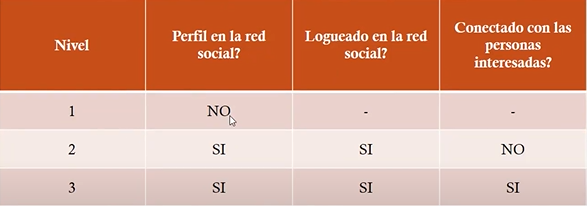
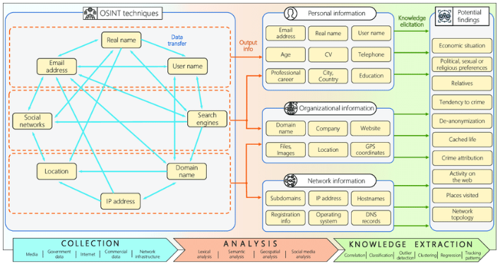
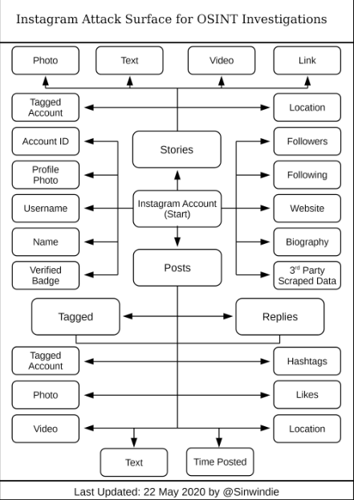
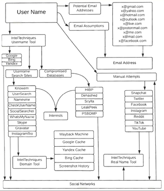

# OSINT

Conceptos y herramientas para OSINT

1. **Tipos de OSINT**:
    
    OSD: Datos genéricos que provienen de una fuente primaria, eje: imágenes satélites, datos de llamadas telefónicas, metadatos, fotografías, audio o videos.
    
    OSINF: Datos genéricos que primero pasan por un filtro para ser publicados, eje: artículos, obras de arte, revistas, libros.
    
    OSINT: Es toda la información descubierta.
    
    OSINT-V: Información pública más confiable y con mayor certeza, eje: una transmisión en vivo.
    
    OSINT PELÍCULAS: searching, ultraviolet, the great hack
    
2. **Capas de internet**:
    
    Surface Web: Información fácil de acceder y a primera vista. Es la información a la cual se puede acceder a través de diferentes navegadores como Google. Bing.
    
    Deep Web: Información que no está a simple vista o no está indexada por los principales motores de búsqueda.
    
    Dark Web: Es la más misteriosa, es difícil de acceder, solo se puede acceder por medio de herramientas especializadas para anonimato como The Onion Router (TOR). Es información oculta para todos, excepto para los usuarios más informados, con conocimientos técnicos.
    
3. **Addons**:
    
    Flagfox: Muestra la bandera del país correspondiente a la ubicación del servidor de la página web y ofrece numerosas herramientas como controles de seguridad, Whois, traducciones, sitios similares, validaciones, contracción de URLs, y mucho más.
    
    Whois: Displays country flag of website's server location, Whois and Geo info on a browser addressbar icon.
    
    Email extrator: Automated Email Extraction Tool which extracts email addresses from web pages and AutoSaves them to use anytime.
    
    Google Traductor: Haga clic derecho en un texto previamente seleccionado y luego en el icono Al Traductor de Google para traducirlo o escucharlo en su idioma.
    
    Wappalyzer: Identify technologies on websites.
    
    Tineye Reverse image: A powerful reverse image search tool, with support for various search engines, such as Google, Bing, Yandex, Baidu and TinEye.
    
    Wayback Machine: Go back in time to see how a website has changed through the history of the Web. Save websites, view missing 404 Not Found pages, or read archived books & papers.
    
    Image Data Extractor: Extracts all the images in the current tab and shows you them
    
    Website Technology: Shows which web technologies the current site is using.
    
    Sputnik: Open Source Intelligence (OSINT) web extension for IPs, Domains, File Hashes, and URLs
    
    User-Agent Switcher and Manager: Spoof websites trying to gather information about your web navigation—like your browser type and operating system—to deliver distinct content you may not want.
    
    Nimbus Screenshot and Screen Video Recorder:
    
    1. Screen capture web pages
    2. Selected regions
    3. Whole browser window
    4. Slack upload
    Edit screenshots. Save images as local files or Google Drive. Tools for Annotation. Upload and share
    
    Mitaka: A browser extension for OSINT search
    
4. **Metabuscadores:** Componen o unen varios buscadores para mostrar una sola información, es decir, en lugar de hacer una búsqueda individual con Google, Bing, Yahoo!, etc, automatiza una búsqueda uniendo la información de todos estos buscadores y mostrándolos en un mismo resultado, además ayudan en gran parte el navegar de forma anónima.
    
    Algunos son:
    
    soovle
    
    DuckDuckGo
    
    Dogpile
    
    Startpage
    
    EntireWeb
    

1. **Google Hacking**: Permite extraer información de manera más sencilla o específica en una búsqueda.
    
    Se podría usar de ejemplo el sitio web “Pastebin” el cual sirve para publicar archivos de texto.
    
    “ ” (comillas): buscar frase exacta.
    
    “and” or “nor”: operadores lógicos “y” o “no”.
    
    “+” y “-”: Incluír y excluír.
    
    “*” (asterisco): comodín, cualquier palabra pero una sola palabra.
    
    “.” (punto): comodín, cualquier palabra, una o muchas.
    
    “intitle” o “allintitle”: la expresión buscada está en el título. # Se refiere al título en azul que normalmente aparece en los resultados.
    
    “inurl” o “allinurl”: la expresión buscada está en la URL.
    
    “site”: solo busca resultados dentro de la web que va detrás de “site:”.
    
    “filetype”: solo busca archivos de un tipo (doc, xls, txt …)
    
    “link”: solo busca en páginas que tienen un link a una determinada web
    
    “inanchor”: solo busca en páginas que tienen en el texto del enlace la expresión buscada.
    
    “cache”: muestra el resultado en la cache de Google de una página web.
    
    “related”: busca webs relacionadas con una determinada.
    
    “location”: buscar la localización de un lugar en específico, eje: location:”New York, United States”,50km → esto lo que harpa es buscar información del lugar especificado, además a partir del punto que tenga, buscará datos dentro de los 50km desde el centro.
    
    “intext”: la expresión buscada está en el texto debajo del título
    
2. **Metadatos**: Son datos que describen otros tipos de datos. Por ejemplo, la extensión de un archivo .docx le dice al sistema operativo que el archivo es un documento de Word y debe abrirse dentro del programa de Microsoft Office. Aunque cada archivo individual contiene muchos cientos e incluso miles de puntos de metadatos, ciertos campos son más útiles para el investigador que otros.
    
    Otro ejemplo es tomar una foto con el celular con la ubicación activada, lo que pasará es que al tomar la foto, se “almacenará” o “implementará” la ubicación a los metadatos de la imagen.
    
    Es de tomar en cuenta que al enviar la foto, por ejemplo, por WhatsApp o Facebook, estos utilizarán un algoritmo para “sanitizar”, “limpia” o “reemplaza” los metadatos. Esto no pasa al mandar la imagen por correo.
    
    Metadatos principales para el OSINT:
    
    - Sistema Operativo.
    - Cuándo se creó.
    - Qué permisos tiene.
    - Qué aplicación utiliza.
    - Si hay aliases o sobrenombres.
    - Quién creó el archivo.
    - Alguna ubicación.

1. **Puntos a tomar en cuenta al hacer OSINT**:
    
    Comprender los patrones de comportamiento de la víctima.
    
    Qué es lo que publica, sus gustos, que palabras usa, cuáles son las interacciones en las páginas
    
    Interpretar los datos colectivos.
    
    Apuntar al eslabón débil: Siempre habrá un individuo que no puede evitar publicar información reveladora sobre sí mismo.
    
    Moverse lateralmente a través de la red: Moverse por una red para encontrar todas las conexiones don determinadas personas clave de interés.
    
2. **Niveles de asociación con el OSINT**:
    
    
    
    Nivel 1: Es el menos riesgoso de los tres niveles, ya que no requiere la creación de un perfil en una plataforma de redes sociales que pueda alertar a la persona de interés sobre las actividades del investigador. Este es una escenario típico cuando un investigador encuentra un perfil de redes sociales de una persona de interés a través de un motor de búsqueda Surface Web y hace click en el enlace.
    
    Nivel 2: Tiene una buena combinación de acceso a los datos versus el riesgo operativo de exposición. Como tal, el Nivel 2 tiende a ser la configuración más común para la mayoría de los investigadores, ya que este nivel alcanza el punto óptimo que equilibra un buen acceso a los datos y un nivel administrativo de riesgo operativo sin niveles indebidos de esfuerzo para mantener una relación.
    
    Nivel 3: Obtiene la mayor cantidad de datos, pero incurre en la mayor cantidad de esfuerzo del investigador para el mantenimiento del perfil además de exponer al investigador al nivel más alto de riesgo operativo. Por lo general, este nivel de operación lo lleva a cabo personal especialmente  capacitado que tiene un mandato específico para conectarse con perfiles identificados de personas de interés dentro del contexto de una investigación mucho más amplia.
    
3. **Herramientas de recolección**:
    
    Social-Searcher (www.social-searcher.com) (Usar las tolos)
    
    TweetDeck (https://tweetdeck.twitter.com)
    
    SocialMention (www.socialmention.com)
    
    IFTTT (www.ifttt.com)
    
    Quickhashtags and keywords search (https://cipher387.github.io/hashtags_and_keywords_social_media_quick_search/)
    
    Onemilliontweetmap (www.onemilliontweetmap.com)
    
    Social Blade (www.socialblade.com)
    
    TiktokD (https://tiktokd.com/)
    
    Twitter Find list (https://www.scoutzen.com/twitter-lists/search)
    
    Free People Search tool (https://freepeoplesearchtool.com/)
    
    Reddit Investigator (https://www.redditinvestigator.com/)
    
    Instagram Analyzer and viewer (https://gramho.com/)
    
    Tiktok Analytics (https://exolyt.com/)
    
    IG Profile analyzer (https://inflact.com/tools/profile-analyzer/)
    
    OSINT Framework (https://osintframework.com/)
    
    https://github.com/Ekultek/WhatBreach/security
    
    Páginas para verificar datos leakeados:
    
    https://breachdirectory.org/
    
    dehashed.com [PAGA]
    
    leak-lookup.com
    
    rslookup.com/lookup
    
    leakpeek.com [PAGA]
    
    leakcheck.io [PAGA]
    
    nuclearleaks.com
    
    https://intelx.io/ [PAGA]
    
    https://breached.to
    
    https://cracked.io
    
    https://doxbin.org
    
    Stalkface.
    
    Tinfoleak
    
    Twimemachine.
    
    Generador de caras falsas: https://sketchfab.com/
    
    https://github.com/i3visio/osrframework
    
    Page Gallery OSINT: https://start.me/pages/int/osint
    
    https://start.me/p/p1Ba7e/basic-osint-tools
    
    https://start.me/p/wM70RY/people-investgation
    
    WerArchive IS: https://archive.is
    
    Herramientas OSINT: https://inteltechniques.com/tools/index.html
    
    Metodologías OSINT: https://github.com/sinwindie/OSINT
    
    Búsqueda por placa de vehículo en Mexico: repuve.gob.mx
    
    Búsqueda por datos personales: www.gob.mx/curp/
    
    Búsqueda por número de seguridad social: www.imss.gob.mx/tramites/imss02008
    
    A través de transferencia bancaria: banxico.mx.org/cep/
    
    Romper hash: crackstation.com
    
    analyzeid.com
    
    namecheckr.com
    
    vidnice.com
    
    tikbuddy.com
    
4. **Herramientas para generar una cuenta falsa**:
    
    Crear un correo de manera más segura: protonmail.com
    
    ID Generator: https://fauxid.com/fake-name-generator/
    
    Generador de correos temporales: https://correotemporal.org/
    
    Proceso de creación de las cuentas:
    
    Generar datos fake.
    
    Crear un correo en protonmail con base en los datos fake generados.
    
    Crear un correo de gmail con base en los datos fake generados, en el correo de backup o de recuperación, es recomendado utilizar el correo creado en protonmail.
    
    Usar el correo de gmail para crear una cuenta en facebook.
    
    Se puede utilizar un correo temporal para la creación de una cuenta, el problema es que aplicaciones como Facebook pueden llegar a detectar estos correos en poco tiempo y los clasifica como bots por lo que denegará el acceso a la cuenta o será requerido algún tipo de verificación por eso se perfiere crear una cuenta de correo manualmente.
    
5. **Dark Web:** Es la más secreta y potencialmente peligrosa de las tres capas del ciberespacio. Solo accesible con software de navegación especializado.
    - Más info:
        
        ¿Cómo funciona la comunicación entre nodos en la Dark Web?
        
        La Dark Web es una red descentralizada y encriptada que utiliza protocolos como TOR (The Onion Router) o I2P para ocultar la identidad y la ubicación de los usuarios y sitios web. Los nodos en la Dark Web se conectan entre sí para formar una red anónima, donde la información es enrutada a través de múltiples capas de encriptación antes de llegar a su destino. Esto hace que sea difícil para los actores malintencionados rastrear la fuente de la información y protege la privacidad de los usuarios.
        
        ¿Qué es TOR?
        
        TOR es un acrónimo de The Onion Router, un software gratuito y de código abierto que permite a los usuarios navegar en la web de manera anónima. Funciona como un sistema de encaminamiento en capas, en el que la información se envuelve en varias capas de encriptación antes de ser transmitida a través de una red de nodos voluntarios en todo el mundo. Esto hace que sea difícil para los actores malintencionados rastrear la fuente o destino de la información, lo que aumenta la privacidad y seguridad en línea.
        
        ¿Cómo funciona el empaquetado por varias capas en TOR?
        
        El empaquetado por varias capas en TOR funciona mediante la encapsulación de la información en múltiples capas de encriptación antes de ser transmitida a través de la red. Cada capa de encriptación se desencripta en un nodo TOR antes de ser transmitida a la siguiente capa.
        
        Aquí está un resumen del proceso:
        
        1. El usuario envía una solicitud a través de su software cliente TOR.
        2. La solicitud se envuelve en la primera capa de encriptación.
        3. La solicitud encriptada se envía a un nodo de entrada TOR seleccionado al azar.
        4. El nodo de entrada desencripta la primera capa y envía la solicitud encriptada con la segunda capa a otro nodo intermediario seleccionado al azar.
        5. Este proceso se repite hasta que la solicitud alcance el último nodo intermediario antes de llegar a su destino.
        6. El último nodo intermediario desencripta la última capa y envía la solicitud original al destino.
        
        Este proceso de empaquetado por varias capas hace que sea difícil para los actores malintencionados rastrear la fuente o destino de la información, lo que aumenta la privacidad y seguridad en línea.
        
        Una vez que el destino recibe el paquete, el proceso de reenvío funciona de la misma manera que el proceso de envío original. La información se vuelve a empaquetar en varias capas de encriptación y se reenvía a través de la red TOR hasta llegar a su destino final.
        
        El proceso de reenvío es el mismo que el proceso de envío original, con la diferencia de que la información fluye en la dirección opuesta. Cada nodo TOR desencripta y reencapsula la información en cada capa antes de enviarla al siguiente nodo.
        
        El proceso de reenvío mantiene la privacidad y seguridad de la información al asegurarse de que los actores malintencionados no puedan rastrear la fuente o destino de la información.
        
        ¿Qué tipo de encriptación se usa en cada capa del empaquetado?
        
        En TOR, se utiliza un tipo diferente de encriptación en cada capa de la información.
        
        La información se encripta con diferentes claves en cada capa, lo que hace que sea más difícil para los actores malintencionados descifrar la información original. Además, la selección al azar de los nodos TOR que participan en el proceso de encriptación y desencriptación también aumenta la seguridad de la red.
        
        Este proceso de encriptación múltiple garantiza que la información sea segura y privada mientras viaja a través de la red TOR.
        
        En TOR, se utilizan varios tipos de encriptación, incluyendo:
        
        1. AES: un algoritmo de encriptación simétrico de 128 bits que se utiliza para encriptar la información en una sola capa.
        2. RSA: un algoritmo de encriptación asimétrico que se utiliza para encriptar y desencriptar las claves simétricas utilizadas en el proceso de encriptación.
        3. ElGamal: un algoritmo de encriptación asimétrico que se utiliza para encriptar y desencriptar las claves simétricas utilizadas en el proceso de encriptación.
        4. Diffie-Hellman: un algoritmo de intercambio de claves que permite a dos partes establecer una clave secreta compartida sin que ninguna parte tenga que compartir su clave privada.
        
        Estos son algunos de los algoritmos de encriptación que se utilizan en TOR. La combinación de estos algoritmos y la selección al azar de los nodos que participan en el proceso de encriptación y desencriptación brindan una capa adicional de seguridad y privacidad para la información que viaja a través de la red.
        
        ¿Qué es un nodo de entrada y salida?
        
        En la red TOR, los nodos de entrada y salida son componentes importantes que proporcionan privacidad y anonimato a los usuarios.
        
        Los nodos de entrada son los primeros nodos que reciben un paquete en la red. Son responsables de recibir y encriptar el tráfico antes de reenviarlo a los nodos siguientes en la red.
        
        Por otro lado, los nodos de salida son los últimos nodos en el camino antes de que el tráfico alcance su destino final. Son responsables de descifrar y reenviar el tráfico a su destino final fuera de la red TOR.
        
        Es importante destacar que los nodos de entrada y salida son administrados por usuarios y organizaciones de confianza que han demostrado un compromiso con la privacidad y la seguridad de la red. Esto ayuda a garantizar que el tráfico sea procesado de forma segura y confidencial a través de la red.
        
        TOR depende de un número limitado de nodos administrados por usuarios de confianza y organizaciones para proporcionar privacidad y anonimato en la red. Estos nodos, conocidos como nodos de salida, son responsables de reenviar el tráfico de la red a destinos fuera de la red TOR.
        
        Estos nodos de salida se seleccionan y administran por usuarios y organizaciones de confianza que han demostrado tener un compromiso con la privacidad y la seguridad de la red. Al hacerlo, se espera que estos nodos actúen de forma ética y no hagan nada que pueda comprometer la privacidad de los usuarios de la red.
        
        Sin embargo, es importante señalar que ninguna red o tecnología es completamente segura y que siempre existe un riesgo de que los datos sean interceptados o expuestos. Por lo tanto, es importante tomar medidas adicionales para proteger la privacidad y la seguridad de la información al utilizar TOR u otras redes similares.
        
        ¿Qué es I2P?
        
        I2P es un acrónimo de "Invisible Internet Project", es una red de comunicación anónima y segura basada en la web que permite a los usuarios enviar y recibir información de manera confidencial. Al igual que TOR, I2P utiliza un sistema de encaminamiento en capas y encriptación para proteger la identidad y la ubicación de los usuarios y sitios web. La red está formada por nodos voluntarios y la información es enrutada a través de una serie de nodos antes de llegar a su destino, lo que hace difícil para los actores malintencionados rastrear la fuente o destino de la información.
        
        El método de empaquetado en varias capas se utiliza en I2P, pero de manera diferente a como se utiliza en TOR.
        
        En I2P, la información se empaqueta en varias capas de encriptación para garantizar la privacidad y seguridad de la información mientras viaja a través de la red. Además, I2P utiliza una técnica de encaminamiento en la red llamada "embalaje de bultos", que utiliza varios saltos de nodo para ocultar la ubicación de la fuente y el destino de la información.
        
        Sin embargo, la forma en que se lleva a cabo el empaquetado en varias capas y el proceso de encriptación en I2P es diferente a como se lleva a cabo en TOR. Por lo tanto, aunque el objetivo es el mismo, la implementación es diferente.
        
        ¿Cuál es la  diferencia de I2P y TOR?
        
        I2P y TOR son ambos sistemas de encaminamiento en capas que proporcionan privacidad y seguridad en línea, pero hay algunas diferencias clave entre ellos:
        
        1. Enfoque: TOR se enfoca en proporcionar privacidad y anonimato para la navegación web, mientras que I2P se enfoca en proporcionar privacidad y seguridad para una amplia gama de aplicaciones en línea, incluyendo correo electrónico, mensajería y compartición de archivos.
        2. Nodo: I2P es una red completamente descentralizada, mientras que TOR depende de un número limitado de nodos administrados por organizaciones y individuos de confianza.
        3. Velocidad: I2P es más rápido que TOR debido a la manera en que maneja la encriptación y la enrutación de la información.
        4. Uso: TOR es más ampliamente utilizado y conocido, mientras que I2P es utilizado por una comunidad más pequeña de usuarios avanzados.
        
        Ambos sistemas tienen sus fortalezas y debilidades y la elección depende de las necesidades y preferencias individuales de privacidad y seguridad en línea.
        
        ¿Cómo un atacante puede intentar interceptar para "descifrar" o descubrir quién es el origen de la comunicación?
        
        Hay varias técnicas que un atacante puede utilizar para intentar interceptar y descifrar la comunicación en la Dark Web. Algunas de estas técnicas incluyen:
        
        1. Ataques de interceptación: El atacante puede tratar de interceptar la información antes de que llegue a su destino final, lo que le permitiría acceder a la información en claro antes de que sea desencriptada.
        2. Ataques de malware: El atacante puede instalar malware en el sistema del usuario, lo que le permitiría acceder a la información antes de que sea encriptada o después de que sea desencriptada.
        3. Ataques de nodo intermedio: El atacante puede tratar de controlar uno o varios nodos intermedios en la red, lo que le permitiría acceder a la información en tránsito.
        4. Ataques de fuerza bruta: El atacante puede tratar de descifrar la información mediante la prueba de todas las posibles claves hasta encontrar la correcta.
        5. Ataques de correlación: El atacante puede tratar de correlacionar la información encriptada con información externa, lo que le permitiría descifrar la información original.
        
        Estas son solo algunas de las técnicas que un atacante puede utilizar para intentar interceptar y descifrar la comunicación en la Dark Web. Sin embargo, es importante destacar que la seguridad y privacidad en la Dark Web no están garantizadas, y existe siempre un riesgo de que la información sea interceptada o descifrada. Por lo tanto, es importante utilizar la Dark Web de manera responsable y estar atento a los posibles riesgos.
        
        Interceptar un paquete que viaje por la Dark Web puede ser un desafío, pero no es imposible. La complejidad y dificultad dependen de varios factores, como el nivel de seguridad de la red, la capacidad técnica del atacante, la cantidad de recursos que esté dispuesto a invertir, entre otros.
        
        En general, las redes de la Dark Web, como TOR y I2P, utilizan técnicas de encriptación y empaquetamiento en varias capas para proteger la privacidad y seguridad de la información. Sin embargo, estos sistemas no son perfectos y existe siempre un riesgo de que la información sea interceptada o descifrada.
        
        Además, a medida que la tecnología avanza, los atacantes también desarrollan nuevas técnicas para interceptar y descifrar la información. Por lo tanto, es importante estar atento a los posibles riesgos y utilizar la Dark Web de manera responsable.
        
        En resumen, interceptar un paquete que viaje por la Dark Web puede ser difícil, pero no es imposible. Por lo tanto, es importante estar atento a los posibles riesgos y utilizar la Dark Web de manera responsable.
        
        Medidas que se deben tomar para proteger la privacidad al navegar por la Dark Web:
        
        1. Utilizar un navegador de la Dark Web seguro: Utilizar un navegador de la Dark Web específico, como TOR, es importante para proteger la privacidad y seguridad de la información que se comparte en la red.
        2. No compartir información personal: Es importante evitar compartir información personal, como el nombre real, la dirección de correo electrónico, el número de teléfono, etc.
        3. Mantener la computadora actualizada: Mantener la computadora y el software al día con las últimas actualizaciones de seguridad es importante para protegerse de posibles vulnerabilidades.
        4. Utilizar una VPN: Utilizar una VPN puede agregar una capa adicional de seguridad y protección a la información que se comparte en la Dark Web.
        5. Ser cauteloso con los sitios web y servicios: Al igual que en cualquier otra parte de internet, es importante ser cauteloso con los sitios web y servicios a los que se accede en la Dark Web. No se debe confiar en ellos por completo y se debe investigar la reputación y la seguridad antes de proporcionar información o realizar transacciones.
        
        En resumen, para proteger la privacidad al navegar por la Dark Web es importante utilizar un navegador de la Dark Web seguro, evitar compartir información personal, mantener la computadora actualizada, utilizar una VPN, y ser cauteloso con los sitios web y servicios a los que se accede.
        
        Qué se debe hacer si se está usando una máquina virtual para navegar por la Dark Web y se infecta la máquina virtual?
        
        Si su máquina virtual se infecta mientras navega por la Dark Web, le recomiendo tomar las siguientes medidas:
        
        1. Apague inmediatamente la máquina virtual: Apague la máquina virtual para detener la propagación del malware.
        2. Copie cualquier información importante: Si tiene información importante almacenada en la máquina virtual, copie esa información antes de proceder.
        3. Desinstale la máquina virtual: Desinstale la máquina virtual para asegurarse de que se haya eliminado por completo el malware.
        4. Cree una nueva máquina virtual: Cree una nueva máquina virtual y copie la información importante en ella.
        5. Manténgase actualizado: Asegúrese de mantener la máquina virtual y los programas que utiliza actualizados para protegerse contra futuras infecciones.
        
        Es importante tener en cuenta que navegar por la Dark Web conlleva ciertos riesgos para la privacidad y la seguridad, por lo que es fundamental tomar medidas para protegerse. Algunas recomendaciones incluyen usar una máquina virtual, mantener actualizado el software, y ser cauteloso con la información que se comparte en línea.
        
        ¿Puede llegar a afectar la máquina física?
        
        Es posible que el malware de la máquina virtual afecte su máquina física, dependiendo de la configuración de la máquina virtual y de la forma en que está conectada a su máquina física. En general, una máquina virtual se ejecuta en un entorno aislado y limitado en recursos de la máquina física, lo que puede ayudar a proteger su máquina física de los ataques. Sin embargo, si la máquina virtual comparte recursos con su máquina física, como archivos, dispositivos de entrada/salida, o conexiones a Internet, es posible que el malware se propague a su máquina física.
        
        Por esta razón, es importante asegurarse de que la configuración de la máquina virtual se ajuste a sus necesidades de seguridad, y de que se tomen medidas para proteger la máquina virtual y la máquina física, como mantener actualizado el software, utilizar software de seguridad y tener copias de seguridad regulares.
        
        Las causas más comunes de infección de malware en la Dark Web son descargas de software malicioso, navegación a sitios web comprometidos, errores de usuario al configurar la privacidad y seguridad, y uso de contraseñas débiles o reutilizadas. Es importante tomar medidas de seguridad adecuadas y estar al tanto de los riesgos al navegar por la Dark Web.
        
    
    Sistemas Operativos Recomendados:
    
    - whonix
    - Tails
    
    Navegador recomendado:
    
    - TOR: fue desarrollado originalmente por el laboratorio de investigación a nivel Naval de los Estados Unidos a mediados de la década de 1990, con la intención de proporcionar comunicaciones seguras por internet, Después de su implementación inicial para el público en 2004, la tecnología TOR sigue siendo desarrollada por grupos como Electronic Frontiers Foundation y otros grupos de libertad de expresión.
        
        Funcionamiento:
        
        TOR es una red que implementa una técnica llamada Onion Routing.
        
        El enrutamiento tradicional que usamos para conectarnos a servidores en internet es directo, (tu ordenador al router, de ahí a los enrutadores del ISP y después directo a los servidores destino).
        
        (Hablar sobre las capas “Onion” en una red TOR, cómo es la comunicación entre nodos, etc.)
        
        Dominios “.onion”: Los sitios web configurados para permitir el acceso solo a los usuarios que utilizan el navegador TOR suelen tener el sufijo “.onion” delante de la dirección del sitio web, de la misma manera que se configuran los sitios web de Surface, como las URL “.com”, “.org”, “.net”, etc. La diferencia importante entre un sitio web “.onion” y otros nombres de dominio de nivel superior (”.com”, etc) es que los sitios “.onion” no son verdaderos TLD (Top-Level-Domain) debido al hecho de que los sitios “.onion” no están incluidos en el directorio raíz de internet.
        
        Los navegadores normales como Chrome o Firefox, no son capaces de acceder a los dominios “.onion”, en cambio hay otros como “DuckDuckGo” el cual permite acceder a estos en primera instancia.
        
        Fuentes para OSINT en la Dark Web:
        
        - Hidden Wiki: es el índice más más conocido de sitios Onion. Un buen lugar para empezar a conocer el internet profundo, aunque dentro de su lista se pueden encontrar varios sitios ilegales que es mejor evitar.
        - Onion list: otro listado de sitios Onion.
        - Duck Duck Go: es un buscador de sitios indexados en el internet superficial que, a diferencia de otros buscadores, no guarda ningún tipo de información de las búsquedas o los usuarios.
        - Torch: uno de los pocos buscadores de sitios Onion que tiene un millón de sitios indexados.
        - Not Evil: otro buscador de sitios Onion que promete devolver solo resultados benignos y legales
        - Metrics: este sitio proporciona información acerca de la red de TOR, su uso, nodos de entrada, salida, tráfico y otras métricas interesantes.
        - Proton Mail: servicio de correo anónimo en la red TOR, Es uno de los servicios de correo anónimo más utilizados.
        - TorBox: otro servicio de correo anónimo.
        - Facebook: enlace de acceso anónimo a la red social Facebook a través de TOR.
        - Deep Web Radio: listado de radios online y streaming de música.
        - Cebolla Chan: uno de los foros en español más utilizados en la Deep Web con todo tipo de conversaciones e información.
        - Hidden Answers: otro foro en español donde se encuentran sitios web relacionados a todo tipo de temas en general.
        
        Algunos enlaces para Dark Web:
        
        The Hidden Wiki (https://thehiddenwiki(.)org/)
        
        Tor Links (http://torlinksd6pdnihy(.)onion/)
        
        Pwndb (http://pwndb2am4tzkvold(.)onion/)
        
        Facebook leak: https://www.4wbwa6vcpvcr3vvf4qkhppgy56urmjcj2vagu2iqgp3z656xcmfdbiqd(.)onion
        
        onionlandsearchengine(.)com
        
        Usando el sistema operativo Tails:
        
        Recomendaciones:
        
        - NO usar carpetas compartidas y copiado de papelera totalmente INHABILITADA.
        - No maximizar la pantalla del navegador por si ocurre alguna inyección la cual estorbe o distraiga y no podamos ver la pantalla.
        - En este caso se usa el modo “Connect to TOR automatically (easier)” y “Configura un puente de TOR”.
        - Tails ya viene con addons pre-configurados para navegar de forma segura.
        - Hay sitios en los que es posible loguearse, para esto se pueden usar correos temporales.
        - La conexión por los sitios va a ser más lenta, y en el caso que un sitio web no cargue, se puede crear una nueva sesión dándole al ícono rojo (addon).
        - Apagar la máquina directamente con la opción “Apagar la máquina”.
        
6. **¿Cómo protegerme de OSINT?**
    - Buscar toda la información posible sobre ti mismo para poder recopilar datos y fuentes de información (Auto-OSINT).  (https://www.searchpeopledirectory.com/)
    - Evaluar los datos que están publicados en las distintas fuentes de información, además de interactuar con la aplicación para validar la misma información.
    - Ingresar a las distintas fuentes de información en la que se publican los datos y comenzar a realizar modificaciones en los datos publicados (cambios en la publicidad).
    - Evitar dejar de manera pública tus datos, evita mostrar información, correos, dirección, DNI y datos personales.
    
    ¿OSINT para proteger mi empresa?
    
    - Llevar a cabo un plan de concientización para prevención de pérdida de datos.
    - Formar un equipo de seguridad encargado del monitoreo de seguridad informática de la empresa.
    - Comenzar a llevar a cabo un protocolo de recolección de datos y fuentes de información.
    - Automatizar el proceso de recolección de datos y fuentes de información.
    
7. **Ciclo de trabajo de OSINT**:
    
    El ciclo de recopilación de inteligencia comienza por identificar la necesidad, seguido de la planificación de actividad y las posibles fuentes de información.
    
    - Requisitos: ¿Para qué se quiere hacer el OSINT? es decir, el objetivo de la investigación.
    - Fuentes de información: Qué fuentes de información se van a utilizar.
    - Adquisición: Es la recolecta de toda la información.
    - Procesamiento.
    - Análisis.
    - Inteligencia: Recomendaciones finales.
    
    OSINT Techniques
    
    
    
    
    
    
    
    Ventajas:
    
    - Gran cantidad de información.
    - Alta capacidad de computo.
    - Big Data y machine learning.
    - Tipos de datos complementarios.
    - Propósito flexible y amplio alcance.
    
    Desventajas:
    
    - Desinformación.
    - Información no estructurada.
    - Complejidad en la gestión de datos.
    
8. **Trucos para OSINT**:
    
    El “leak” del login: Es una forma para verificar si un correo fue registrado en un servicio. Consiste en intentar crear un correo en el servicio y es aquí donde se puede obtener información ya que puede salir que el correo ya está registrado o no. También se puede intentar validad un número de teléfono o intentado recuperar la contraseña.
    
    El “leak” del corrector: Es una forma no 100% segura en la cual, por medio de WhatsApp, se podría dar una idea si alguien está chateando con un celular o un PC, esto se hace viendo los mensajes que envía el usuario, si los mensajes empiezan con la la mayúscula, es posible que esté chateando desde un celular debido a que el corrector asigna la primer letra en mayúscula automáticamente, en cambio en el PC esto no es así.
