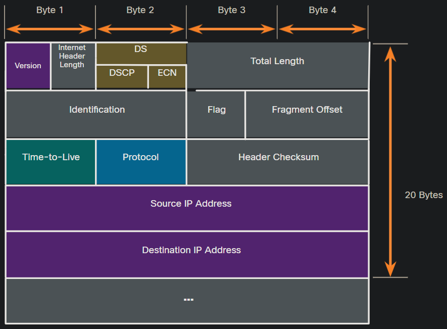
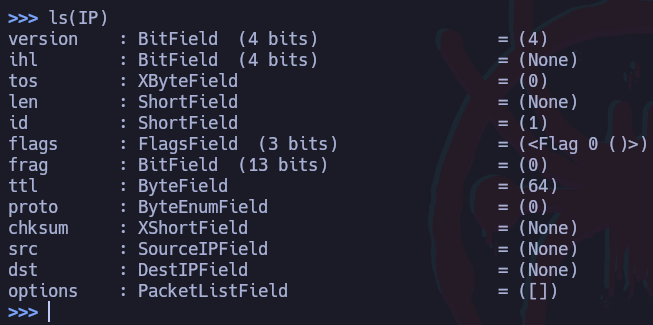
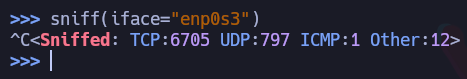
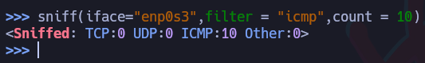
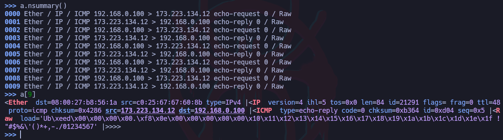
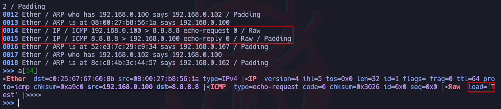

# Scapy - Creación de paquetes

## Estructura de Paquetes

Estructura de paquete IPv4




# Funciones

Iniciar scapy: **scapy**

Sintaxis de función: **function_name(arguments)**

### Almacenar temporalmente el output de la última función ejecutada con “_”:

```bash
variable1=_
```


### Listar todos los protocolos disponibles:

```bash
ls()
lsc()

# Listar un protocolo en específico
ls("TFTP")

# Ver los detalles y opciones de cada encabezado
ls(IP)
```



### Capturar tráfico de paquetes:

```bash
# Esto se pondrá a escuchar paquetes entrantes y 
# salientes de la interfaz por default de la máquina.
sniff()
var1 = sniff()

# Capturar paquetes de una interfaz en específico
sniff(iface="enp0s3")

# Filtrar por paquetes ICMP y capturar solo 10 paquetes 
# en la interfaz "enp0s3"
sniff(iface="enp0s3",filter = "icmp",count = 10)

# Filtros
filter = "<str>" # Filtrar por un protocolo en específico
count = <int> # Cantidad de paquetes a capturar

```

Ahora en otra ventana ejecutar un ping a “www.cisco.com”.

Y hecho eso, hacer un Ctrl + C en scapy para cancelar el proceso:

Nota: El proceso se detendrá automáticamente si se le especifica una cantidad específica de paquetes a capturar.

```bash
^C<Sniffed: TCP:75 UDP:42 ICMP:32 Other:2>
```





Ver el tráfico capturado:

```bash
# Almacenar el output de la última función en la variable
a=_

# Mostrar los paquetes de la captura
a.summary()
# Mostrar los paquetes de la captura con número de línea
a.nsummary()

# Ver información más detallada de una línea de la 
# captura
# NOTA: no hay que incluir los 0s
a[2]
```



Guardar la captura en un archivo “.pcap” para que pueda ser abierto en Wireshark u otros programas.

Nota: Se debe especificar la variable en la que se almacenó la captura.

Nota: La captura se almacenará en el directorio actual de trabajo.

```bash
wrpcap("<filename.pcap>", <variable>)
```

### Enviar paquetes ICMP a un destino

```bash
send(IP(dst="8.8.8.8")/ICMP()/"Test")
```



### Enviar un paquete SYN TCP a un destino

```bash
send(IP(dst="192.168.0.100")/TCP(dport=80,flags="S"))
```

### Recibir un paquete de respuesta de una petición

sr1 significa “send and receive one answer”.

```bash
resp1 = sr1(IP(dst="8.8.8.8")/ICMP()/"Recibiré solo un paquete")
```

# Ataques

### LAN Attack

```bash
send(IP(src="7.7.7.7",dst="192.168.0.80",count=2000)/ICMP()/"Enviaré 2000 paquetes")
```
